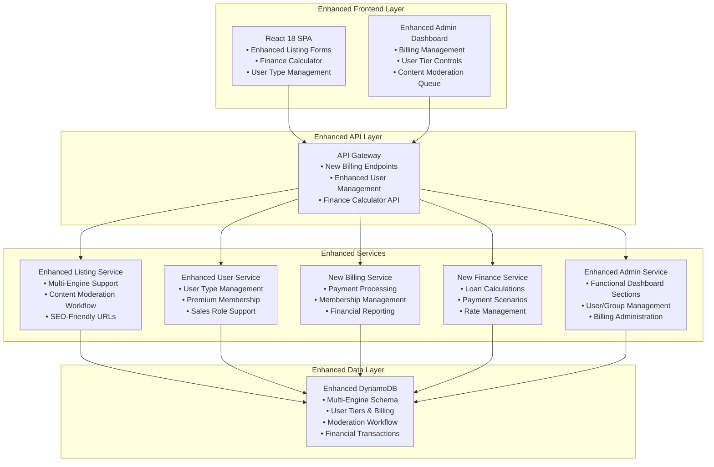
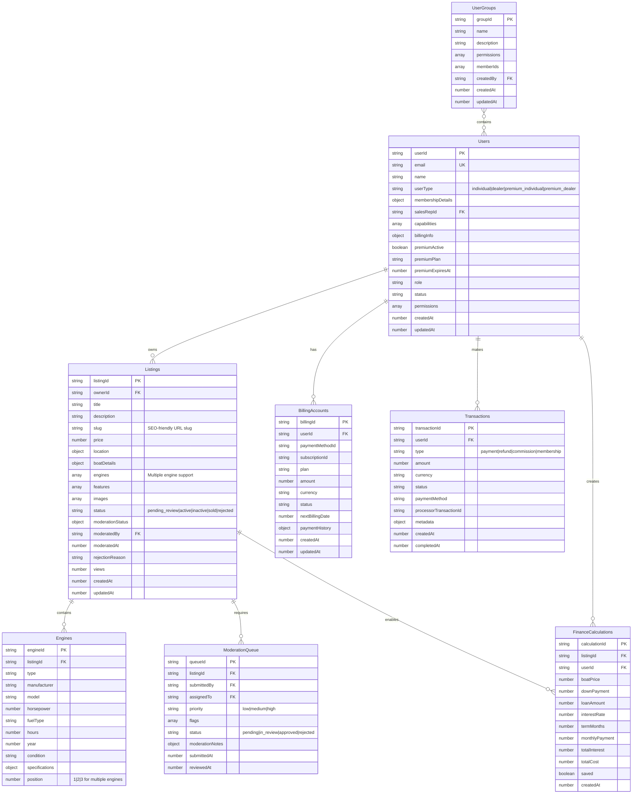

# Design Document

## Overview

This design document outlines the comprehensive enhancements to the HarborList boat marketplace platform, focusing on multi-engine boat specifications, robust content moderation workflows, user tier management, financial calculations, and comprehensive billing management. The design leverages the existing serverless AWS architecture while extending functionality to support multiple user types and enhanced administrative capabilities.

## Architecture

### System Architecture Overview

The enhancements will integrate seamlessly with the existing HarborList architecture:



### Enhanced Database Schema



## Components and Interfaces

### 1. Enhanced Boat Specifications Component

#### Multi-Engine Support Interface
```typescript
interface Engine {
  engineId: string;
  type: 'outboard' | 'inboard' | 'sterndrive' | 'jet' | 'electric';
  manufacturer?: string;
  model?: string;
  horsepower: number;
  fuelType: 'gasoline' | 'diesel' | 'electric' | 'hybrid';
  hours?: number;
  year?: number;
  condition: 'excellent' | 'good' | 'fair' | 'needs_work';
  specifications?: Record<string, any>;
  position: number; // 1, 2, 3 for multiple engines
}

interface EnhancedBoatDetails extends BoatDetails {
  engines: Engine[];
  totalHorsepower: number;
  engineConfiguration: 'single' | 'twin' | 'triple' | 'quad';
}
```

#### Enhanced Listing Form Component
```typescript
interface EnhancedListingFormProps {
  listing?: Listing;
  onSubmit: (listing: EnhancedListing) => Promise<void>;
  onSaveDraft: (listing: Partial<EnhancedListing>) => Promise<void>;
}

const EnhancedListingForm: React.FC<EnhancedListingFormProps> = ({
  listing,
  onSubmit,
  onSaveDraft
}) => {
  // Multi-engine management
  // SEO slug generation
  // Enhanced validation
  // Draft saving capability
};
```

### 2. Content Moderation System

#### Moderation Workflow Interface
```typescript
interface ModerationWorkflow {
  queueId: string;
  listingId: string;
  submittedBy: string;
  assignedTo?: string;
  priority: 'low' | 'medium' | 'high';
  flags: ContentFlag[];
  status: 'pending' | 'in_review' | 'approved' | 'rejected';
  moderationNotes?: ModerationNotes;
  submittedAt: number;
  reviewedAt?: number;
}

interface ModerationNotes {
  reviewerId: string;
  decision: 'approve' | 'reject' | 'request_changes';
  reason: string;
  publicNotes?: string;
  internalNotes?: string;
  requiredChanges?: string[];
}
```

#### Moderation Queue Component
```typescript
const ModerationQueue: React.FC = () => {
  // Real-time queue updates
  // Bulk moderation actions
  // Priority-based sorting
  // Assignment management
  // Notification system
};
```

### 3. User Tier Management System

#### User Type Interface
```typescript
interface EnhancedUser extends User {
  userType: 'individual' | 'dealer' | 'premium_individual' | 'premium_dealer';
  membershipDetails: {
    plan?: string;
    features: string[];
    limits: UserLimits;
    expiresAt?: number;
    autoRenew: boolean;
  };
  salesRepId?: string;
  capabilities: UserCapability[];
  billingInfo?: BillingInfo;
}

interface UserLimits {
  maxListings: number;
  maxImages: number;
  priorityPlacement: boolean;
  featuredListings: number;
  analyticsAccess: boolean;
  bulkOperations: boolean;
}

interface UserCapability {
  feature: string;
  enabled: boolean;
  expiresAt?: number;
  grantedBy: string;
  grantedAt: number;
}
```

#### User Management Component
```typescript
const EnhancedUserManagement: React.FC = () => {
  // User type management
  // Capability assignment
  // Bulk operations
  // Sales rep assignment
  // Premium membership controls
};
```

### 4. Finance Calculator System

#### Finance Calculator Interface
```typescript
interface FinanceCalculation {
  calculationId: string;
  listingId: string;
  userId?: string;
  boatPrice: number;
  downPayment: number;
  loanAmount: number;
  interestRate: number;
  termMonths: number;
  monthlyPayment: number;
  totalInterest: number;
  totalCost: number;
  saved: boolean;
  createdAt: number;
}

interface FinanceCalculatorProps {
  boatPrice: number;
  onCalculationSave?: (calculation: FinanceCalculation) => void;
  onCalculationShare?: (calculation: FinanceCalculation) => void;
}
```

#### Finance Calculator Component
```typescript
const FinanceCalculator: React.FC<FinanceCalculatorProps> = ({
  boatPrice,
  onCalculationSave,
  onCalculationShare
}) => {
  // Real-time calculations
  // Multiple scenario comparison
  // Save/share functionality
  // Interest rate suggestions
  // Payment schedule display
};
```

### 5. Billing Management System

#### Billing Interface
```typescript
interface BillingAccount {
  billingId: string;
  userId: string;
  paymentMethodId?: string;
  subscriptionId?: string;
  plan: string;
  amount: number;
  currency: string;
  status: 'active' | 'past_due' | 'canceled' | 'suspended';
  nextBillingDate: number;
  paymentHistory: Transaction[];
  createdAt: number;
  updatedAt: number;
}

interface Transaction {
  transactionId: string;
  userId: string;
  type: 'payment' | 'refund' | 'commission' | 'membership';
  amount: number;
  currency: string;
  status: 'pending' | 'completed' | 'failed' | 'disputed';
  paymentMethod: string;
  processorTransactionId: string;
  metadata: Record<string, any>;
  createdAt: number;
  completedAt?: number;
}
```

#### Billing Management Component
```typescript
const BillingManagement: React.FC = () => {
  // Customer billing overview
  // Payment history
  // Subscription management
  // Refund processing
  // Financial reporting
  // Dispute resolution
};
```

## Data Models

### Enhanced Listing Model
```typescript
interface EnhancedListing extends Listing {
  slug: string; // SEO-friendly URL
  engines: Engine[];
  totalHorsepower: number;
  engineConfiguration: string;
  moderationStatus: {
    status: 'pending_review' | 'approved' | 'rejected' | 'changes_requested';
    reviewedBy?: string;
    reviewedAt?: number;
    rejectionReason?: string;
    moderatorNotes?: string;
    requiredChanges?: string[];
  };
  financeCalculations?: FinanceCalculation[];
}
```

### User Tier Model
```typescript
interface UserTier {
  tierId: string;
  name: string;
  type: 'individual' | 'dealer';
  isPremium: boolean;
  features: TierFeature[];
  limits: UserLimits;
  pricing: {
    monthly?: number;
    yearly?: number;
    currency: string;
  };
  active: boolean;
}

interface TierFeature {
  featureId: string;
  name: string;
  description: string;
  enabled: boolean;
  limits?: Record<string, number>;
}
```

### Sales Role Model
```typescript
interface SalesUser extends User {
  role: UserRole.SALES;
  permissions: [
    AdminPermission.USER_MANAGEMENT,
    AdminPermission.TIER_MANAGEMENT,
    AdminPermission.CAPABILITY_ASSIGNMENT
  ];
  assignedCustomers: string[];
  salesTargets?: SalesTargets;
  commissionRate?: number;
}

interface SalesTargets {
  monthly: number;
  quarterly: number;
  yearly: number;
  achieved: {
    monthly: number;
    quarterly: number;
    yearly: number;
  };
}
```

## Error Handling

### Enhanced Error Types
```typescript
enum EnhancedErrorCodes {
  // Engine-related errors
  INVALID_ENGINE_CONFIGURATION = 'INVALID_ENGINE_CONFIGURATION',
  MISSING_ENGINE_SPECIFICATIONS = 'MISSING_ENGINE_SPECIFICATIONS',
  
  // Moderation errors
  MODERATION_QUEUE_FULL = 'MODERATION_QUEUE_FULL',
  INSUFFICIENT_MODERATION_PERMISSIONS = 'INSUFFICIENT_MODERATION_PERMISSIONS',
  
  // User tier errors
  TIER_LIMIT_EXCEEDED = 'TIER_LIMIT_EXCEEDED',
  PREMIUM_MEMBERSHIP_EXPIRED = 'PREMIUM_MEMBERSHIP_EXPIRED',
  INVALID_USER_TYPE_TRANSITION = 'INVALID_USER_TYPE_TRANSITION',
  
  // Finance calculator errors
  INVALID_LOAN_PARAMETERS = 'INVALID_LOAN_PARAMETERS',
  CALCULATION_SAVE_FAILED = 'CALCULATION_SAVE_FAILED',
  
  // Billing errors
  PAYMENT_PROCESSING_FAILED = 'PAYMENT_PROCESSING_FAILED',
  SUBSCRIPTION_NOT_FOUND = 'SUBSCRIPTION_NOT_FOUND',
  BILLING_ACCOUNT_SUSPENDED = 'BILLING_ACCOUNT_SUSPENDED'
}
```

### Error Handling Strategy
- Graceful degradation for non-critical features
- User-friendly error messages with actionable guidance
- Comprehensive error logging for debugging
- Automatic retry mechanisms for transient failures
- Fallback options for payment processing failures

## Testing Strategy

### Unit Testing
- Engine specification validation
- Finance calculation accuracy
- User tier permission logic
- Billing calculation correctness
- Moderation workflow state transitions

### Integration Testing
- Multi-engine listing creation flow
- Content moderation approval process
- User tier upgrade/downgrade scenarios
- Payment processing integration
- Admin dashboard functionality

### End-to-End Testing
- Complete listing creation with multiple engines
- Moderation queue workflow from submission to approval
- User registration and tier assignment
- Finance calculator usage and saving
- Billing management operations

### Performance Testing
- Large-scale moderation queue processing
- Complex finance calculations
- Bulk user management operations
- High-volume billing transactions
- Admin dashboard load times

## Security Considerations

### Data Protection
- Sensitive financial data encryption
- PCI compliance for payment processing
- User tier information access control
- Moderation decision audit trails

### Access Control
- Role-based permissions for sales staff
- Granular admin permissions
- User tier-based feature access
- Moderation queue assignment security

### API Security
- Enhanced rate limiting for billing endpoints
- Input validation for financial calculations
- Secure payment processor integration
- Protected admin-only endpoints

## Performance Optimization

### Database Optimization
- Efficient indexing for multi-engine queries
- Optimized moderation queue retrieval
- User tier lookup performance
- Billing transaction history pagination

### Caching Strategy
- Finance calculation result caching
- User tier information caching
- Moderation queue status caching
- Billing summary data caching

### Frontend Optimization
- Lazy loading for admin dashboard sections
- Optimized finance calculator rendering
- Efficient user management table virtualization
- Progressive loading for billing history

## Monitoring and Analytics

### Key Metrics
- Moderation queue processing times
- User tier conversion rates
- Finance calculator usage patterns
- Billing success/failure rates
- Admin dashboard performance

### Alerting
- Moderation queue backlog alerts
- Payment processing failure notifications
- User tier limit breach warnings
- System performance degradation alerts

### Reporting
- Moderation efficiency reports
- User tier analytics
- Financial performance dashboards
- Admin activity summaries