# HarborList Marketplace - Complete Application Flows

**Last Updated:** October 24, 2025  
**Version:** 2.0.0  
**Author:** System Documentation Review

---

## Table of Contents

1. [System Architecture Overview](#system-architecture-overview)
2. [Authentication Flows](#authentication-flows)
3. [User Management Flows](#user-management-flows)
4. [Listing Management Flows](#listing-management-flows)
5. [Admin Dashboard Flows](#admin-dashboard-flows)
6. [Content Moderation Flows](#content-moderation-flows)
7. [Billing & Payment Flows](#billing--payment-flows)
8. [Analytics & Tracking Flows](#analytics--tracking-flows)
9. [Notification System Flows](#notification-system-flows)
10. [Team Management Flows](#team-management-flows)
11. [Search & Discovery Flows](#search--discovery-flows)
12. [Finance Calculator Flows](#finance-calculator-flows)

---

## System Architecture Overview

### Technology Stack

**Backend:**
- **Runtime:** AWS Lambda (Node.js/TypeScript)
- **Database:** DynamoDB (NoSQL)
- **Authentication:** AWS Cognito (Dual User Pools)
- **API Gateway:** AWS API Gateway (REST API)
- **Storage:** S3 (media files)
- **Payment Processing:** Stripe & PayPal integration

**Frontend:**
- **Framework:** React 18 with TypeScript
- **Routing:** React Router v6
- **State Management:** React Query (TanStack Query)
- **Styling:** Tailwind CSS
- **Build Tool:** Vite

### Service Architecture

```
├── auth-service/          # Dual-pool authentication (Customer & Staff)
├── user-service/          # User profile and tier management
├── listing-service/       # Boat listing CRUD operations
├── admin-service/         # Admin dashboard and management
├── billing-service/       # Payment processing and subscriptions
├── analytics-service/     # Event tracking and metrics
├── notification-service/  # User notifications
├── stats-service/         # Platform statistics
├── search-service/        # Search and filtering
├── media-service/         # Image upload and processing
├── tier-service/          # User tier management
├── finance-service/       # Loan calculations
└── email-service/         # Email notifications
```

### Database Tables

1. **harborlist-listings** - Boat listings with GSIs for slug, owner, status
2. **harborlist-users** - User accounts with tier information
3. **harborlist-engines** - Engine specifications for boats
4. **billing-accounts** - Payment methods and subscriptions
5. **transactions** - Financial transaction records
6. **moderation-queue** - Content moderation workflow
7. **finance-calculations** - Saved loan calculations
8. **user-tiers** - Membership tier configurations
9. **analytics-events** - User behavior tracking
10. **harborlist-notifications** - User notifications
11. **boat-audit-logs** - Security and compliance audit trail

---

## Authentication Flows

### 1. Customer Registration Flow

**Endpoint:** `POST /auth/customer/register`  
**Service:** `auth-service/index.ts`

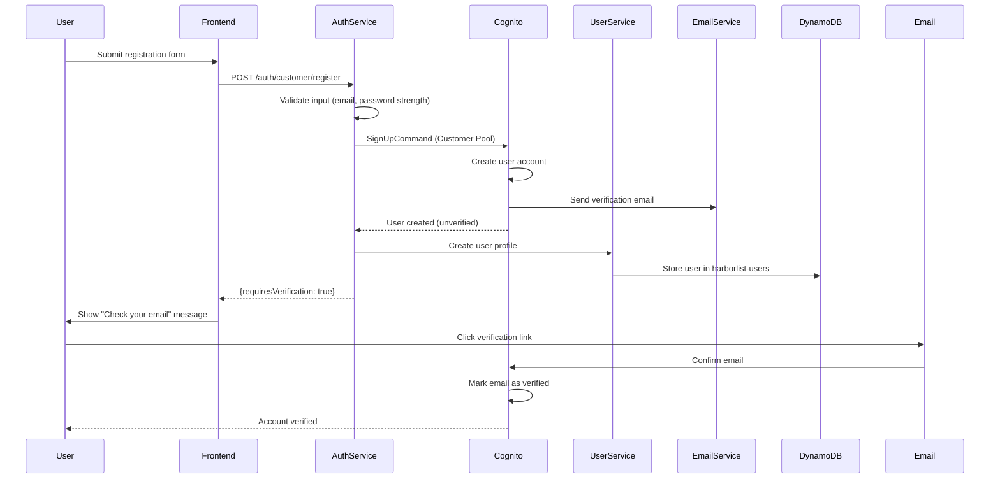
```mermaid
sequenceDiagram
    participant User
    participant Frontend
    participant AuthService
    participant Cognito
    participant UserService
    participant EmailService

    User->>Frontend: Submit registration form
    Frontend->>AuthService: POST /auth/customer/register
    AuthService->>AuthService: Validate input (email, password strength)
    AuthService->>Cognito: SignUpCommand (Customer Pool)
    Cognito->>Cognito: Create user account
    Cognito->>EmailService: Send verification email
    Cognito-->>AuthService: User created (unverified)
    AuthService->>UserService: Create user profile
    UserService->>DynamoDB: Store user in harborlist-users
    AuthService-->>Frontend: {requiresVerification: true}
    Frontend->>User: Show "Check your email" message
    
    User->>Email: Click verification link
    Email->>Cognito: Confirm email
    Cognito->>Cognito: Mark email as verified
    Cognito-->>User: Account verified
```

**Key Code Files:**
- `backend/src/auth-service/index.ts` - Lines 480-640 (customerRegister method)
- `frontend/src/pages/EnhancedRegister.tsx` - Registration form
- `frontend/src/hooks/useAuth.ts` - Registration state management

**Flow Steps:**

1. **Input Validation**
   - Email format validation
   - Password complexity requirements (min 8 chars, uppercase, lowercase, number)
   - Required fields check (name, email, password, customerType)

2. **Cognito User Creation**
   - Uses Customer User Pool
   - Sets customer tier (individual/dealer/premium)
   - Auto-confirmation disabled (requires email verification)
   - Sends verification email via Cognito

3. **User Profile Creation**
   - Creates entry in `harborlist-users` table
   - Sets initial tier (FREE for individual, DEALER for dealer)
   - Initializes user capabilities based on tier
   - Records creation timestamp

4. **Email Verification**
   - User receives verification email with code
   - Code valid for 24 hours
   - Verifies via confirmation endpoint
   - Account activated after verification

**Error Handling:**
- `UsernameExistsException` - Email already registered
- `InvalidPasswordException` - Password doesn't meet requirements
- `InvalidParameterException` - Invalid email format
- Rate limiting on registration attempts

---

### 2. Customer Login Flow

**Endpoint:** `POST /auth/customer/login`  
**Service:** `auth-service/index.ts`

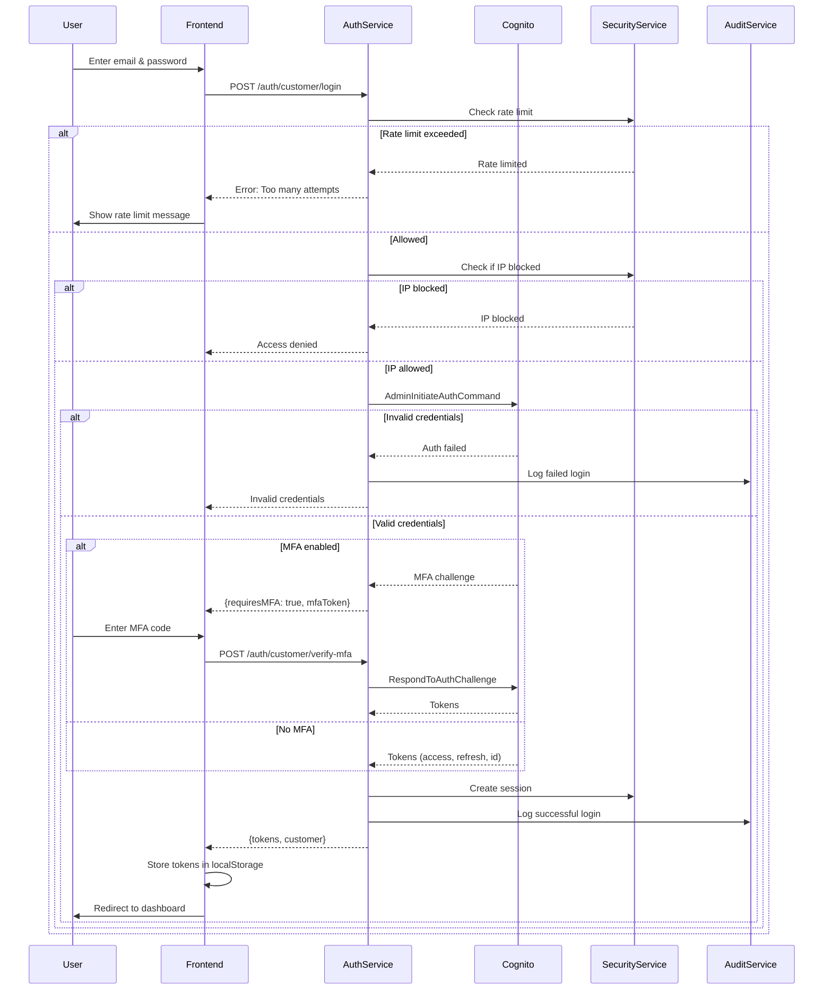
```mermaid
sequenceDiagram
    participant User
    participant Frontend
    participant AuthService
    participant Cognito
    participant SecurityService
    participant AuditService

    User->>Frontend: Enter email & password
    Frontend->>AuthService: POST /auth/customer/login
    AuthService->>SecurityService: Check rate limit
    alt Rate limit exceeded
        SecurityService-->>AuthService: Rate limited
        AuthService-->>Frontend: Error: Too many attempts
        Frontend->>User: Show rate limit message
    else Allowed
        AuthService->>SecurityService: Check if IP blocked
        alt IP blocked
            SecurityService-->>AuthService: IP blocked
            AuthService-->>Frontend: Access denied
        else IP allowed
            AuthService->>Cognito: AdminInitiateAuthCommand
            alt Invalid credentials
                Cognito-->>AuthService: Auth failed
                AuthService->>AuditService: Log failed login
                AuthService-->>Frontend: Invalid credentials
            else Valid credentials
                alt MFA enabled
                    Cognito-->>AuthService: MFA challenge
                    AuthService-->>Frontend: {requiresMFA: true, mfaToken}
                    User->>Frontend: Enter MFA code
                    Frontend->>AuthService: POST /auth/customer/verify-mfa
                    AuthService->>Cognito: RespondToAuthChallenge
                    Cognito-->>AuthService: Tokens
                else No MFA
                    Cognito-->>AuthService: Tokens (access, refresh, id)
                end
                AuthService->>SecurityService: Create session
                AuthService->>AuditService: Log successful login
                AuthService-->>Frontend: {tokens, customer}
                Frontend->>Frontend: Store tokens in localStorage
                Frontend->>User: Redirect to dashboard
            end
        end
    end
```

**Key Code Files:**
- `backend/src/auth-service/index.ts` - Lines 131-290 (customerLogin method)
- `backend/src/auth-service/security-service.ts` - Rate limiting and IP blocking
- `backend/src/auth-service/audit-service.ts` - Login event logging
- `frontend/src/pages/Login.tsx` - Login form
- `frontend/src/hooks/useAuth.ts` - Login state management

**Flow Steps:**

1. **Security Checks**
   - Rate limit check: Max 5 attempts per 15 minutes per IP
   - IP blocklist check: Blocked IPs cannot access
   - Device fingerprinting for tracking
   - User agent validation

2. **Cognito Authentication**
   - Uses `ADMIN_NO_SRP_AUTH` flow
   - Validates against Customer User Pool
   - Returns JWT tokens (access, refresh, ID)
   - Session duration: 1 hour (access token)

3. **MFA Handling (if enabled)**
   - SMS or TOTP challenge issued
   - User must provide MFA code
   - Separate verification endpoint
   - Session created after MFA verification

4. **Session Creation**
   - Generate unique session ID
   - Store session in DynamoDB
   - Track IP address, user agent, device ID
   - Set session expiration (1 hour)

5. **Token Storage**
   - Access token stored in localStorage
   - Refresh token stored in localStorage
   - User object stored in localStorage
   - Automatic refresh on token expiration

**Security Features:**
- Adaptive rate limiting based on failed attempts
- IP blocking after multiple failures
- Session tracking with device fingerprinting
- Comprehensive audit logging
- JWT token validation on every request
- Protection against brute force attacks

---

### 3. Staff Authentication Flow

**Endpoint:** `POST /auth/staff/login`  
**Service:** `auth-service/index.ts`

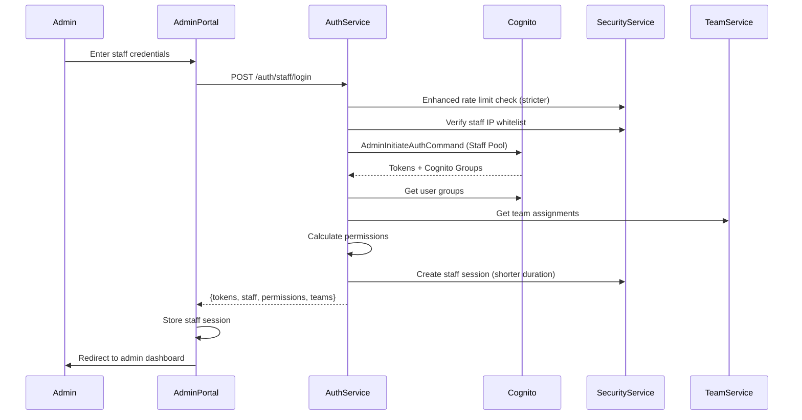
```mermaid
sequenceDiagram
    participant Admin
    participant AdminPortal
    participant AuthService
    participant Cognito
    participant SecurityService
    participant TeamService

    Admin->>AdminPortal: Enter staff credentials
    AdminPortal->>AuthService: POST /auth/staff/login
    AuthService->>SecurityService: Enhanced rate limit check (stricter)
    AuthService->>SecurityService: Verify staff IP whitelist
    AuthService->>Cognito: AdminInitiateAuthCommand (Staff Pool)
    Cognito-->>AuthService: Tokens + Cognito Groups
    AuthService->>Cognito: Get user groups
    AuthService->>TeamService: Get team assignments
    AuthService->>AuthService: Calculate permissions
    AuthService->>SecurityService: Create staff session (shorter duration)
    AuthService-->>AdminPortal: {tokens, staff, permissions, teams}
    AdminPortal->>AdminPortal: Store staff session
    AdminPortal->>Admin: Redirect to admin dashboard
```

**Key Differences from Customer Auth:**

1. **Separate User Pool**
   - Staff User Pool for admin accounts
   - Different security policies
   - Shorter session duration (30 min vs 1 hour)
   - Enhanced monitoring

2. **Role-Based Access Control**
   - User groups: SuperAdmin, Admin, Moderator, Support
   - Permission calculation based on roles
   - Team-based permissions
   - Hierarchical permission system

3. **Enhanced Security**
   - Stricter rate limiting
   - IP whitelist for staff access
   - Mandatory MFA for admin roles
   - Enhanced audit logging
   - Real-time security alerts

4. **Team Integration**
   - Staff assigned to teams
   - Teams have specific focuses (content, support, sales)
   - Permissions aggregated from teams
   - Workload balancing across teams

**Key Code Files:**
- `backend/src/auth-service/index.ts` - Lines 780-950 (staffLogin method)
- `backend/src/admin-service/teams.ts` - Team management
- `frontend/src/pages/admin/AdminLogin.tsx` - Admin login
- `frontend/src/components/admin/AdminAuthProvider.tsx` - Admin auth context

---

## User Management Flows

### 1. User Profile Management Flow

**Endpoints:**
- `GET /users/profile` - Get current user profile
- `PUT /users/profile` - Update user profile
- `POST /users/upgrade` - Upgrade to premium tier

**Service:** `user-service/index.ts`

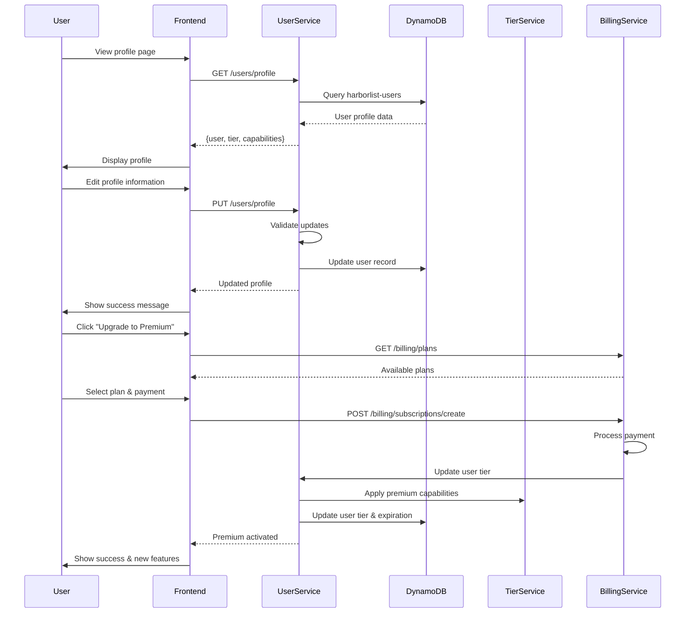
```mermaid
sequenceDiagram
    participant User
    participant Frontend
    participant UserService
    participant DynamoDB
    participant TierService
    participant BillingService

    User->>Frontend: View profile page
    Frontend->>UserService: GET /users/profile
    UserService->>DynamoDB: Query harborlist-users
    DynamoDB-->>UserService: User profile data
    UserService-->>Frontend: {user, tier, capabilities}
    Frontend->>User: Display profile

    User->>Frontend: Edit profile information
    Frontend->>UserService: PUT /users/profile
    UserService->>UserService: Validate updates
    UserService->>DynamoDB: Update user record
    UserService-->>Frontend: Updated profile
    Frontend->>User: Show success message

    User->>Frontend: Click "Upgrade to Premium"
    Frontend->>BillingService: GET /billing/plans
    BillingService-->>Frontend: Available plans
    User->>Frontend: Select plan & payment
    Frontend->>BillingService: POST /billing/subscriptions/create
    BillingService->>BillingService: Process payment
    BillingService->>UserService: Update user tier
    UserService->>TierService: Apply premium capabilities
    UserService->>DynamoDB: Update user tier & expiration
    UserService-->>Frontend: Premium activated
    Frontend->>User: Show success & new features
```

**User Tier System:**

1. **FREE Tier** (Individual customers)
   - 3 active listings max
   - Basic search filters
   - Standard support
   - Basic analytics

2. **DEALER Tier** (Dealer accounts)
   - 50 active listings
   - Advanced filters
   - Priority support
   - Enhanced analytics
   - Bulk operations

3. **PREMIUM Tier** (Premium subscribers)
   - Unlimited listings
   - Featured placement
   - VIP support
   - Advanced analytics
   - Marketing tools
   - Price: $29.99/month or $299/year

**Key Code Files:**
- `backend/src/user-service/index.ts` - User profile operations
- `backend/src/tier/index.ts` - Tier management
- `frontend/src/pages/Profile.tsx` - Profile page
- `frontend/src/pages/PremiumUpgrade.tsx` - Upgrade flow

---

### 2. User Type Transition Flow

**Endpoint:** `POST /users/transition-type`  
**Service:** `user-service/index.ts`

**Allowed Transitions:**
- Individual → Dealer (requires verification)
- Individual → Premium (requires payment)
- Dealer → Premium (upgrade, keeps dealer status)
- Premium → Dealer (downgrade)

**Restrictions:**
- Cannot downgrade from Dealer to Individual if > 3 listings
- Cannot downgrade from Premium while subscription active
- Requires business verification for Dealer upgrade

---

## Listing Management Flows

### 1. Create Listing Flow

**Endpoint:** `POST /listings`  
**Service:** `listing/index.ts`

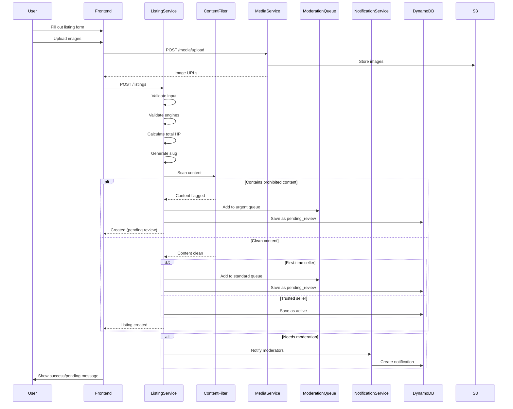
```mermaid
sequenceDiagram
    participant User
    participant Frontend
    participant ListingService
    participant ContentFilter
    participant MediaService
    participant ModerationQueue
    participant NotificationService
    participant DynamoDB

    User->>Frontend: Fill out listing form
    User->>Frontend: Upload images
    Frontend->>MediaService: POST /media/upload
    MediaService->>S3: Store images
    MediaService-->>Frontend: Image URLs

    Frontend->>ListingService: POST /listings
    ListingService->>ListingService: Validate input
    ListingService->>ListingService: Validate engines
    ListingService->>ListingService: Calculate total HP
    ListingService->>ListingService: Generate slug
    ListingService->>ContentFilter: Scan content
    
    alt Contains prohibited content
        ContentFilter-->>ListingService: Content flagged
        ListingService->>ModerationQueue: Add to urgent queue
        ListingService->>DynamoDB: Save as pending_review
        ListingService-->>Frontend: Created (pending review)
    else Clean content
        ContentFilter-->>ListingService: Content clean
        
        alt First-time seller
            ListingService->>ModerationQueue: Add to standard queue
            ListingService->>DynamoDB: Save as pending_review
        else Trusted seller
            ListingService->>DynamoDB: Save as active
        end
        
        ListingService-->>Frontend: Listing created
    end

    alt Needs moderation
        ListingService->>NotificationService: Notify moderators
        NotificationService->>DynamoDB: Create notification
    end

    Frontend->>User: Show success/pending message
```

**Key Code Files:**
- `backend/src/listing/index.ts` - Lines 605-900 (createListing function)
- `backend/src/shared/content-filter.ts` - Content moderation
- `frontend/src/pages/CreateListing.tsx` - Listing form
- `frontend/src/components/listing/ListingForm.tsx` - Form components

**Validation Rules:**

1. **Required Fields:**
   - Title (10-100 characters)
   - Description (50-5000 characters)
   - Price ($1 - $10,000,000)
   - Year (1900 - current year + 1)
   - Make & Model
   - Boat type
   - Length (1-500 feet)
   - Location (city, state, zip)
   - At least 1 image

2. **Engine Validation:**
   - At least 1 engine required
   - Valid engine types: outboard, inboard, sterndrive, jet, electric, hybrid
   - Horsepower: 1-2000 HP per engine
   - Valid fuel types: gasoline, diesel, electric, hybrid
   - Unique positions (1, 2, 3, 4)
   - Auto-calculate total horsepower
   - Auto-determine configuration (single/twin/triple/quad)

3. **Content Moderation:**
   - Profanity filter
   - Prohibited content detection (weapons, illegal items)
   - Contact info extraction from description
   - Spam pattern detection
   - Price manipulation detection

4. **SEO Slug Generation:**
   - Format: `{make}-{model}-{year}-{city}-{random}`
   - Example: `sea-ray-sundancer-2020-miami-abc123`
   - Unique slug validation
   - URL-friendly formatting
   - Old slug redirect for title changes

**Flow Outcomes:**

1. **Auto-Approved:**
   - Clean content
   - Trusted seller (>5 approved listings)
   - Status: `active`
   - Immediately visible

2. **Pending Review:**
   - New seller (<5 listings)
   - Flagged content
   - Status: `pending_review`
   - Assigned to moderation queue

3. **Urgent Review:**
   - Prohibited content detected
   - High-risk patterns
   - Priority moderation
   - Admin notification

---

### 2. Edit Listing Flow

**Endpoint:** `PUT /listings/{id}`  
**Service:** `listing/index.ts`

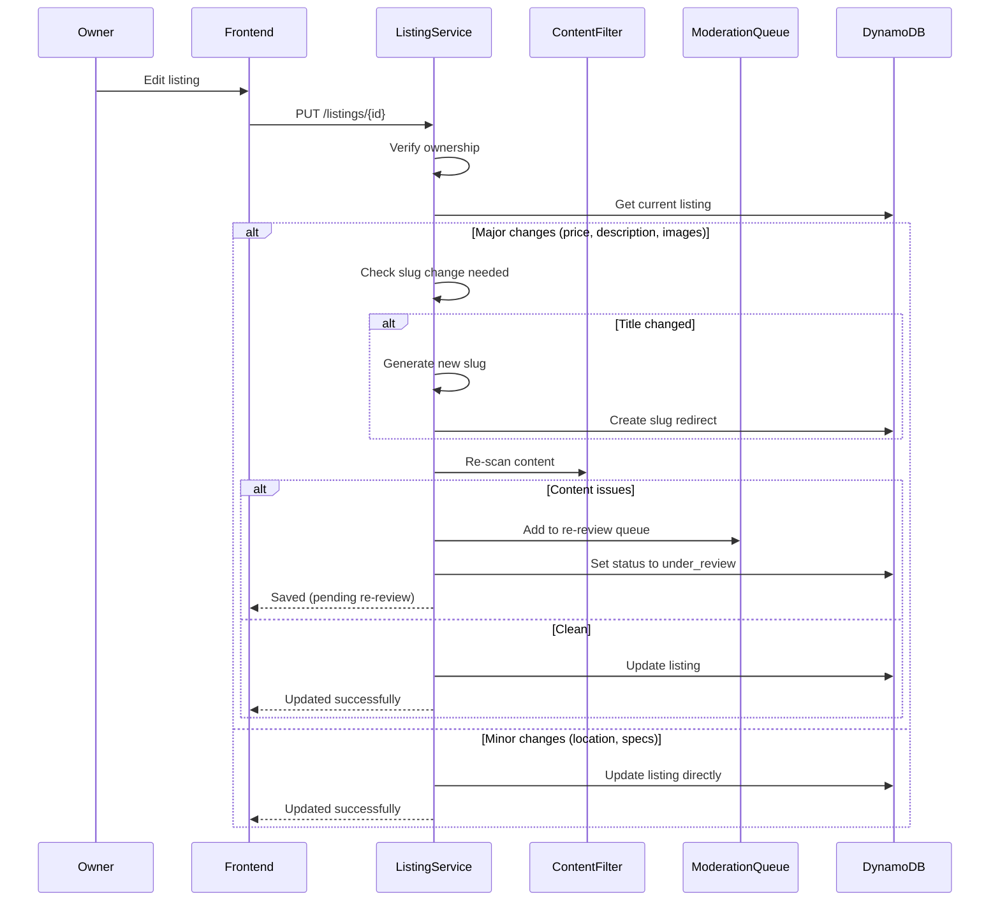
```mermaid
sequenceDiagram
    participant Owner
    participant Frontend
    participant ListingService
    participant ContentFilter
    participant ModerationQueue
    participant DynamoDB

    Owner->>Frontend: Edit listing
    Frontend->>ListingService: PUT /listings/{id}
    ListingService->>ListingService: Verify ownership
    ListingService->>DynamoDB: Get current listing
    
    alt Major changes (price, description, images)
        ListingService->>ListingService: Check slug change needed
        alt Title changed
            ListingService->>ListingService: Generate new slug
            ListingService->>DynamoDB: Create slug redirect
        end
        
        ListingService->>ContentFilter: Re-scan content
        alt Content issues
            ListingService->>ModerationQueue: Add to re-review queue
            ListingService->>DynamoDB: Set status to under_review
            ListingService-->>Frontend: Saved (pending re-review)
        else Clean
            ListingService->>DynamoDB: Update listing
            ListingService-->>Frontend: Updated successfully
        end
    else Minor changes (location, specs)
        ListingService->>DynamoDB: Update listing directly
        ListingService-->>Frontend: Updated successfully
    end
```

**Major vs Minor Changes:**

**Major Changes** (trigger re-moderation):
- Price change > 10%
- Description changes
- Image additions/removals
- Title changes
- Boat type changes

**Minor Changes** (no re-moderation):
- Location updates
- Specification updates
- Contact preference changes
- Feature toggles

**Key Code Files:**
- `backend/src/listing/index.ts` - Lines 1005-1200 (updateListing function)
- `frontend/src/pages/EditListing.tsx` - Edit form

---

### 3. Multi-Engine Boat Management

**Endpoints:**
- `POST /listings/{id}/engines` - Add engine
- `PUT /listings/{id}/engines/{engineId}` - Update engine
- `DELETE /listings/{id}/engines/{engineId}` - Remove engine

**Service:** `listing/index.ts`

**Engine Configuration Types:**
- **Single:** 1 engine
- **Twin:** 2 engines
- **Triple:** 3 engines
- **Quad:** 4 engines

**Auto-Calculations:**
- Total horsepower = sum of all engine HP
- Engine configuration determined by count
- Position validation (no gaps, no duplicates)

**Key Code Files:**
- `backend/src/listing/index.ts` - Lines 1305-1509 (engine management)
- `frontend/src/components/listing/EngineManager.tsx` - Engine UI

---

## Admin Dashboard Flows

### 1. Dashboard Overview Flow

**Endpoint:** `GET /admin/dashboard/metrics`  
**Service:** `admin-service/index.ts`

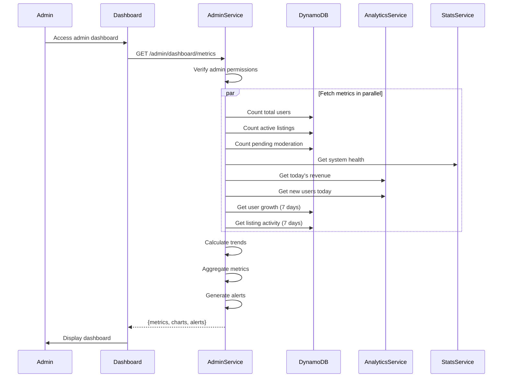
```mermaid
sequenceDiagram
    participant Admin
    participant Dashboard
    participant AdminService
    participant DynamoDB
    participant AnalyticsService
    participant StatsService

    Admin->>Dashboard: Access admin dashboard
    Dashboard->>AdminService: GET /admin/dashboard/metrics
    AdminService->>AdminService: Verify admin permissions
    
    par Fetch metrics in parallel
        AdminService->>DynamoDB: Count total users
        AdminService->>DynamoDB: Count active listings
        AdminService->>DynamoDB: Count pending moderation
        AdminService->>StatsService: Get system health
        AdminService->>AnalyticsService: Get today's revenue
        AdminService->>AnalyticsService: Get new users today
        AdminService->>DynamoDB: Get user growth (7 days)
        AdminService->>DynamoDB: Get listing activity (7 days)
    end

    AdminService->>AdminService: Calculate trends
    AdminService->>AdminService: Aggregate metrics
    AdminService->>AdminService: Generate alerts
    AdminService-->>Dashboard: {metrics, charts, alerts}
    Dashboard->>Admin: Display dashboard
```

**Key Metrics:**

1. **User Metrics:**
   - Total users (all time)
   - New users today
   - Active users (30 days)
   - User growth trend (7/30 days)
   - User type breakdown (individual/dealer/premium)

2. **Listing Metrics:**
   - Total listings
   - Active listings
   - Pending moderation
   - Listing growth trend
   - Average listing price
   - Most expensive listing

3. **Moderation Metrics:**
   - Pending review count
   - Under review count
   - Average review time
   - Approval rate
   - Rejection rate
   - Changes requested

4. **System Health:**
   - Uptime hours
   - Health status (healthy/warning/critical)
   - Active sessions
   - API response times
   - Error rates

5. **Financial Metrics:**
   - Revenue today
   - Revenue this month
   - Active subscriptions
   - Transaction count
   - Average transaction value

**Alert Types:**

- **Critical:** System down, payment processor offline
- **Warning:** High pending moderation queue, slow API responses
- **Info:** New feature deployed, scheduled maintenance

**Key Code Files:**
- `backend/src/admin-service/index.ts` - Lines 600-900 (handleGetDashboardMetrics)
- `frontend/src/pages/admin/AdminDashboard.tsx` - Dashboard UI
- `frontend/src/hooks/useDashboardMetrics.ts` - Metrics fetching

---

### 2. User Management Flow

**Endpoints:**
- `GET /admin/users` - List all users
- `GET /admin/users/customers` - List customers
- `GET /admin/users/staff` - List staff
- `POST /admin/users/staff` - Create staff account
- `POST /admin/users/{id}/verify-email` - Manually verify email

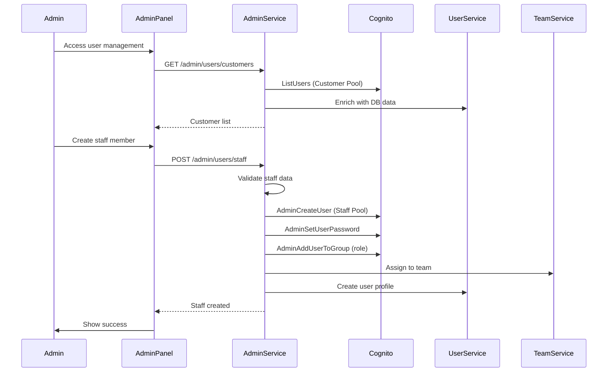
```mermaid
sequenceDiagram
    participant Admin
    participant AdminPanel
    participant AdminService
    participant Cognito
    participant UserService
    participant TeamService

    Admin->>AdminPanel: Access user management
    AdminPanel->>AdminService: GET /admin/users/customers
    AdminService->>Cognito: ListUsers (Customer Pool)
    AdminService->>UserService: Enrich with DB data
    AdminService-->>AdminPanel: Customer list
    
    Admin->>AdminPanel: Create staff member
    AdminPanel->>AdminService: POST /admin/users/staff
    AdminService->>AdminService: Validate staff data
    AdminService->>Cognito: AdminCreateUser (Staff Pool)
    AdminService->>Cognito: AdminSetUserPassword
    AdminService->>Cognito: AdminAddUserToGroup (role)
    AdminService->>TeamService: Assign to team
    AdminService->>UserService: Create user profile
    AdminService-->>AdminPanel: Staff created
    AdminPanel->>Admin: Show success
```

**Staff Roles:**
- **SuperAdmin:** Full system access, all permissions
- **Admin:** Most permissions, cannot manage super admins
- **Moderator:** Content moderation, user support
- **Support:** Customer support, limited admin access

**Bulk Operations:**
- Export user data (CSV/JSON)
- Bulk email verification
- Bulk user suspension
- Bulk tier upgrades

**Key Code Files:**
- `backend/src/admin-service/index.ts` - Lines 1700-2200 (user management)
- `frontend/src/pages/admin/UserManagement.tsx` - User management UI

---

## Content Moderation Flows

### 1. Moderation Queue Flow

**Endpoint:** `GET /admin/moderation/queue`  
**Service:** `admin-service/index.ts`

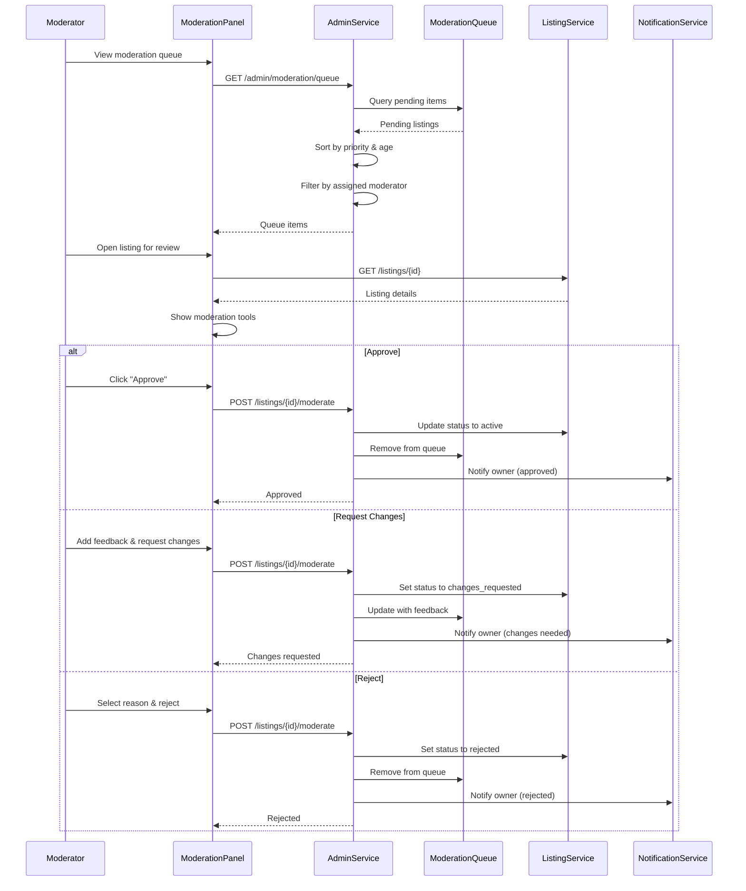
```mermaid
sequenceDiagram
    participant Moderator
    participant ModerationPanel
    participant AdminService
    participant ModerationQueue
    participant ListingService
    participant NotificationService

    Moderator->>ModerationPanel: View moderation queue
    ModerationPanel->>AdminService: GET /admin/moderation/queue
    AdminService->>ModerationQueue: Query pending items
    ModerationQueue-->>AdminService: Pending listings
    AdminService->>AdminService: Sort by priority & age
    AdminService->>AdminService: Filter by assigned moderator
    AdminService-->>ModerationPanel: Queue items

    Moderator->>ModerationPanel: Open listing for review
    ModerationPanel->>ListingService: GET /listings/{id}
    ListingService-->>ModerationPanel: Listing details
    ModerationPanel->>ModerationPanel: Show moderation tools

    alt Approve
        Moderator->>ModerationPanel: Click "Approve"
        ModerationPanel->>AdminService: POST /listings/{id}/moderate
        AdminService->>ListingService: Update status to active
        AdminService->>ModerationQueue: Remove from queue
        AdminService->>NotificationService: Notify owner (approved)
        AdminService-->>ModerationPanel: Approved
    else Request Changes
        Moderator->>ModerationPanel: Add feedback & request changes
        ModerationPanel->>AdminService: POST /listings/{id}/moderate
        AdminService->>ListingService: Set status to changes_requested
        AdminService->>ModerationQueue: Update with feedback
        AdminService->>NotificationService: Notify owner (changes needed)
        AdminService-->>ModerationPanel: Changes requested
    else Reject
        Moderator->>ModerationPanel: Select reason & reject
        ModerationPanel->>AdminService: POST /listings/{id}/moderate
        AdminService->>ListingService: Set status to rejected
        AdminService->>ModerationQueue: Remove from queue
        AdminService->>NotificationService: Notify owner (rejected)
        AdminService-->>ModerationPanel: Rejected
    end
```

**Moderation Priorities:**

1. **Urgent** (flagged content)
   - Prohibited content detected
   - Multiple user reports
   - High-value listings ($1M+)

2. **High** (first-time sellers)
   - New user's first listing
   - Users with < 5 approved listings

3. **Standard** (routine review)
   - Established sellers
   - Minor updates
   - Re-submissions

4. **Low** (dealer updates)
   - Trusted dealers
   - Minor specification changes

**Moderation Actions:**

1. **Approve:**
   - Listing becomes active
   - Visible in search
   - Owner notified
   - Adds to seller's approval count

2. **Request Changes:**
   - Specific feedback provided
   - Listing stays in owner's draft
   - Owner can resubmit after edits
   - Tracks number of revision rounds

3. **Reject:**
   - Listing removed from system
   - Reason provided to owner
   - Cannot be resubmitted (new listing required)
   - Impacts seller reputation

**Moderation Metrics:**
- Average review time
- Approval rate by moderator
- Rejection reasons breakdown
- Queue backlog size
- Items per moderator per day

**Key Code Files:**
- `backend/src/admin-service/index.ts` - Lines 2400-2800 (moderation handlers)
- `frontend/src/pages/admin/ListingModeration.tsx` - Moderation UI
- `frontend/src/components/admin/ListingModerationQueue.tsx` - Queue display

---

### 2. Workload Balancing Flow

**Service:** Team-based assignment

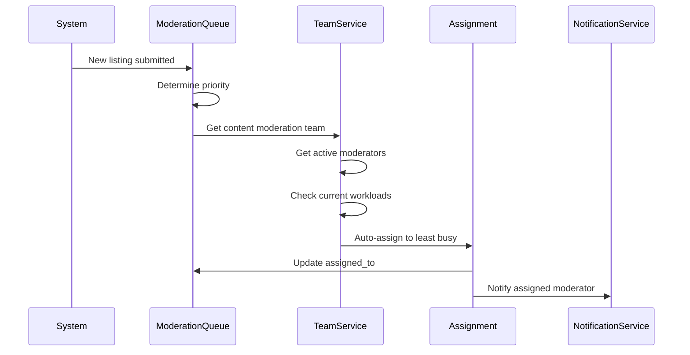
```mermaid
sequenceDiagram
    participant System
    participant ModerationQueue
    participant TeamService
    participant Assignment

    System->>ModerationQueue: New listing submitted
    ModerationQueue->>ModerationQueue: Determine priority
    ModerationQueue->>TeamService: Get content moderation team
    TeamService->>TeamService: Get active moderators
    TeamService->>TeamService: Check current workloads
    TeamService->>Assignment: Auto-assign to least busy
    Assignment->>ModerationQueue: Update assigned_to
    Assignment->>NotificationService: Notify assigned moderator
```

**Auto-Assignment Rules:**
- Priority items to senior moderators
- Balance workload across team
- Respect moderator specializations
- Round-robin for standard items

---

## Billing & Payment Flows

### 1. Subscription Creation Flow

**Endpoint:** `POST /billing/subscriptions/create`  
**Service:** `billing-service/index.ts`

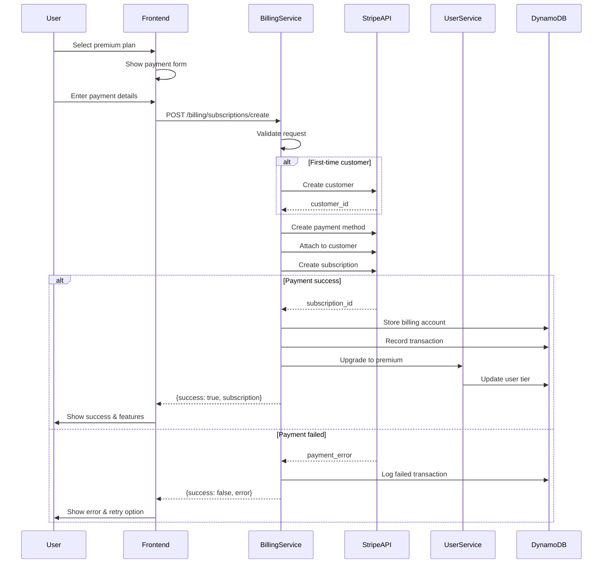
```mermaid
sequenceDiagram
    participant User
    participant Frontend
    participant BillingService
    participant StripeAPI
    participant UserService
    participant DynamoDB

    User->>Frontend: Select premium plan
    Frontend->>Frontend: Show payment form
    User->>Frontend: Enter payment details
    Frontend->>BillingService: POST /billing/subscriptions/create
    BillingService->>BillingService: Validate request
    
    alt First-time customer
        BillingService->>StripeAPI: Create customer
        StripeAPI-->>BillingService: customer_id
    end

    BillingService->>StripeAPI: Create payment method
    BillingService->>StripeAPI: Attach to customer
    BillingService->>StripeAPI: Create subscription
    
    alt Payment success
        StripeAPI-->>BillingService: subscription_id
        BillingService->>DynamoDB: Store billing account
        BillingService->>DynamoDB: Record transaction
        BillingService->>UserService: Upgrade to premium
        UserService->>DynamoDB: Update user tier
        BillingService-->>Frontend: {success: true, subscription}
        Frontend->>User: Show success & features
    else Payment failed
        StripeAPI-->>BillingService: payment_error
        BillingService->>DynamoDB: Log failed transaction
        BillingService-->>Frontend: {success: false, error}
        Frontend->>User: Show error & retry option
    end
```

**Subscription Plans:**

1. **Monthly Premium:** $29.99/month
   - Unlimited listings
   - Featured placement
   - Priority support
   - Cancel anytime

2. **Annual Premium:** $299/year (save $60)
   - All monthly features
   - 2 months free
   - Priority onboarding

**Payment Processors:**

1. **Stripe** (Primary)
   - Credit/debit cards
   - ACH bank transfers
   - Apple Pay, Google Pay
   - International payments

2. **PayPal** (Alternative)
   - PayPal balance
   - PayPal Credit
   - International support

**Key Code Files:**
- `backend/src/billing-service/index.ts` - Lines 420-680 (subscription creation)
- `backend/src/billing-service/payment-processors/stripe.ts` - Stripe integration
- `backend/src/billing-service/subscription-manager.ts` - Subscription logic
- `frontend/src/pages/BillingDashboard.tsx` - Billing UI

---

### 2. Payment Failure Handling Flow

**Service:** `payment-failure-handler.ts`

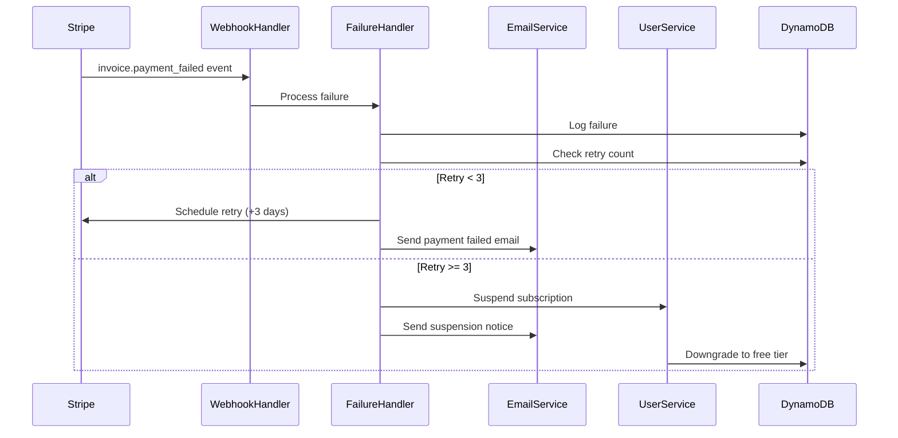
```mermaid
sequenceDiagram
    participant Stripe
    participant WebhookHandler
    participant FailureHandler
    participant EmailService
    participant UserService

    Stripe->>WebhookHandler: invoice.payment_failed event
    WebhookHandler->>FailureHandler: Process failure
    FailureHandler->>DynamoDB: Log failure
    FailureHandler->>DynamoDB: Check retry count
    
    alt Retry < 3
        FailureHandler->>Stripe: Schedule retry (+3 days)
        FailureHandler->>EmailService: Send payment failed email
    else Retry >= 3
        FailureHandler->>UserService: Suspend subscription
        FailureHandler->>EmailService: Send suspension notice
        UserService->>DynamoDB: Downgrade to free tier
    end
```

**Retry Strategy:**
- Attempt 1: Immediate retry
- Attempt 2: +3 days
- Attempt 3: +7 days
- After 3 failures: Subscription suspended

**Key Code Files:**
- `backend/src/billing-service/payment-failure-handler.ts` - Failure logic
- `backend/src/billing-service/webhook-handler.ts` - Webhook processing

---

## Analytics & Tracking Flows

### 1. Event Tracking Flow

**Endpoint:** `POST /analytics/track`  
**Service:** `analytics-service/index.ts`

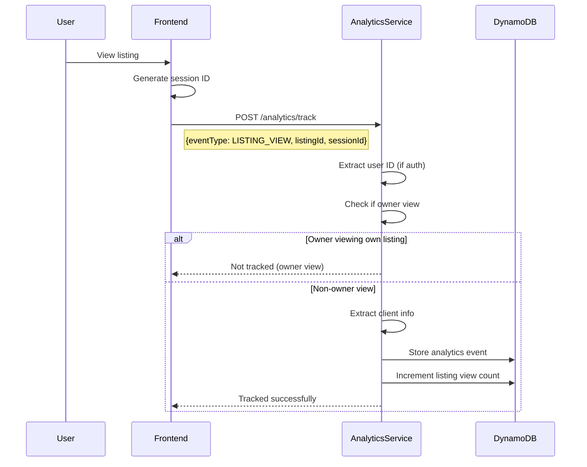
```mermaid
sequenceDiagram
    participant User
    participant Frontend
    participant AnalyticsService
    participant DynamoDB

    User->>Frontend: View listing
    Frontend->>Frontend: Generate session ID
    Frontend->>AnalyticsService: POST /analytics/track
    Note right of Frontend: {eventType: LISTING_VIEW, listingId, sessionId}
    
    AnalyticsService->>AnalyticsService: Extract user ID (if auth)
    AnalyticsService->>AnalyticsService: Check if owner view
    
    alt Owner viewing own listing
        AnalyticsService-->>Frontend: Not tracked (owner view)
    else Non-owner view
        AnalyticsService->>AnalyticsService: Extract client info
        AnalyticsService->>DynamoDB: Store analytics event
        AnalyticsService->>DynamoDB: Increment listing view count
        AnalyticsService-->>Frontend: Tracked successfully
    end
```

**Tracked Events:**

**Listing Events:**
- `LISTING_VIEW` - User views listing detail
- `LISTING_CARD_CLICK` - User clicks listing card
- `LISTING_IMAGE_VIEW` - User views image in gallery
- `LISTING_CONTACT_CLICK` - User clicks contact seller
- `LISTING_PHONE_REVEAL` - User reveals phone number
- `LISTING_SHARE` - User shares listing
- `LISTING_FAVORITE` - User favorites listing

**Search Events:**
- `SEARCH_QUERY` - User performs search
- `SEARCH_FILTER_APPLY` - User applies filters
- `SEARCH_RESULT_CLICK` - User clicks search result

**User Events:**
- `USER_REGISTER` - New user registration
- `USER_LOGIN` - User login
- `PAGE_VIEW` - Page view tracking

**Engagement Events:**
- `TIME_ON_PAGE` - Time spent on page
- `SCROLL_DEPTH` - Scroll percentage

**Event Properties:**
- `eventId` - Unique event identifier
- `timestamp` - ISO timestamp
- `userId` - User ID (if authenticated)
- `sessionId` - Session identifier
- `listingId` - Related listing (if applicable)
- `metadata` - Additional context (page, referrer, device, etc.)

**Key Code Files:**
- `backend/src/analytics-service/index.ts` - Event tracking
- `frontend/src/hooks/useTracking.ts` - Frontend tracking hooks

---

### 2. Platform Statistics Flow

**Endpoint:** `GET /stats/platform`  
**Service:** `stats-service/index.ts`

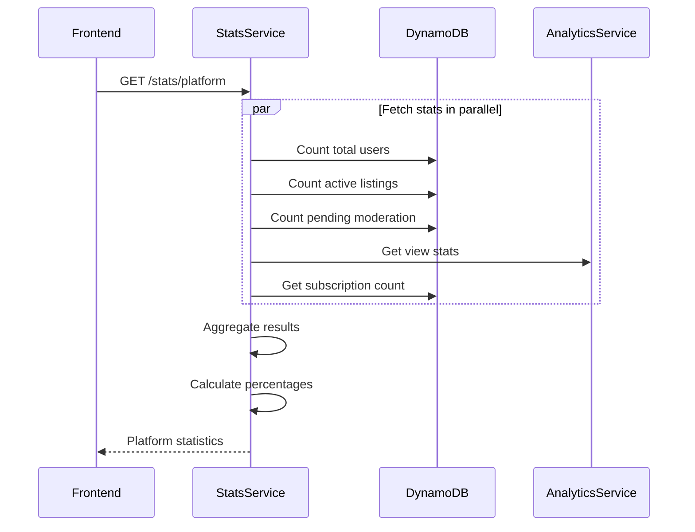
```mermaid
sequenceDiagram
    participant Frontend
    participant StatsService
    participant DynamoDB
    participant AnalyticsService

    Frontend->>StatsService: GET /stats/platform
    
    par Fetch stats in parallel
        StatsService->>DynamoDB: Count total users
        StatsService->>DynamoDB: Count active listings
        StatsService->>DynamoDB: Count pending moderation
        StatsService->>AnalyticsService: Get view stats
        StatsService->>DynamoDB: Get subscription count
    end

    StatsService->>StatsService: Aggregate results
    StatsService->>StatsService: Calculate percentages
    StatsService-->>Frontend: Platform statistics
```

**Available Statistics:**
- Total users (all time)
- Active users (30 days)
- Total listings
- Active listings
- Pending moderation
- Total views
- Active subscriptions
- Revenue metrics

**Key Code Files:**
- `backend/src/stats-service/index.ts` - Statistics calculation
- `frontend/src/hooks/usePlatformStats.ts` - Stats fetching

---

## Notification System Flows

### 1. Create Notification Flow

**Service:** `notification-service/index.ts`

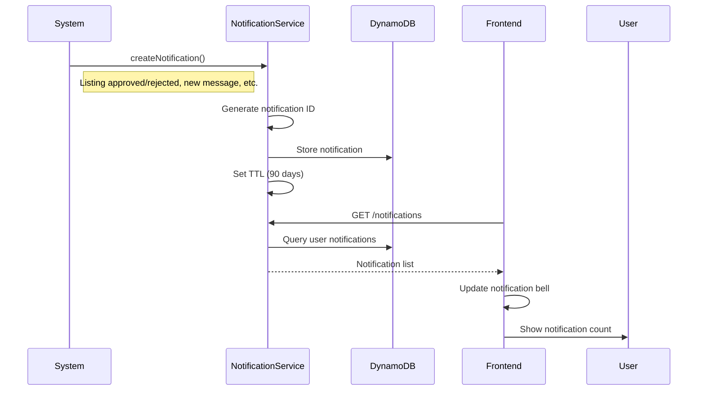
```mermaid
sequenceDiagram
    participant System
    participant NotificationService
    participant DynamoDB
    participant Frontend
    participant User

    System->>NotificationService: createNotification()
    Note right of System: Listing approved/rejected, new message, etc.
    NotificationService->>NotificationService: Generate notification ID
    NotificationService->>DynamoDB: Store notification
    NotificationService->>NotificationService: Set TTL (90 days)
    
    Frontend->>NotificationService: GET /notifications
    NotificationService->>DynamoDB: Query user notifications
    NotificationService-->>Frontend: Notification list
    Frontend->>Frontend: Update notification bell
    Frontend->>User: Show notification count
```

**Notification Types:**
- `listing_approved` - Listing approved by moderators
- `listing_rejected` - Listing rejected
- `listing_changes_requested` - Changes needed
- `listing_inquiry` - Someone contacted about listing
- `system_announcement` - Platform announcements
- `account_update` - Account changes
- `transaction_update` - Payment/subscription updates

**Notification Properties:**
- `notificationId` - Unique identifier
- `userId` - Recipient user ID
- `type` - Notification type
- `title` - Short title
- `message` - Notification message
- `status` - unread/read/archived
- `actionUrl` - Optional URL to navigate
- `ttl` - Auto-delete after 90 days

**Key Code Files:**
- `backend/src/notification-service/index.ts` - Notification management
- `frontend/src/components/notifications/NotificationBell.tsx` - Notification UI
- `frontend/src/hooks/useNotifications.ts` - Notification hooks

---

### 2. Mark as Read Flow

**Endpoint:** `PUT /notifications/{id}/read`

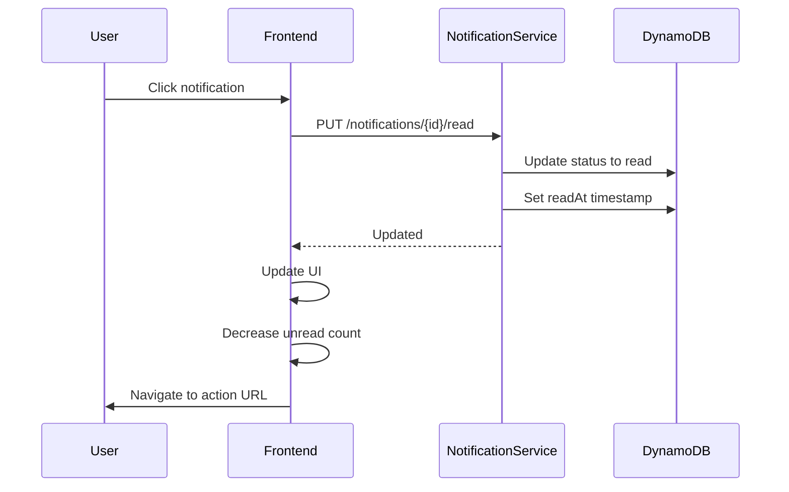
```mermaid
sequenceDiagram
    participant User
    participant Frontend
    participant NotificationService
    participant DynamoDB

    User->>Frontend: Click notification
    Frontend->>NotificationService: PUT /notifications/{id}/read
    NotificationService->>DynamoDB: Update status to read
    NotificationService->>DynamoDB: Set readAt timestamp
    NotificationService-->>Frontend: Updated
    Frontend->>Frontend: Update UI
    Frontend->>Frontend: Decrease unread count
    Frontend->>User: Navigate to action URL
```

---

## Team Management Flows

### 1. Create Team Flow

**Service:** `admin-service/teams.ts`

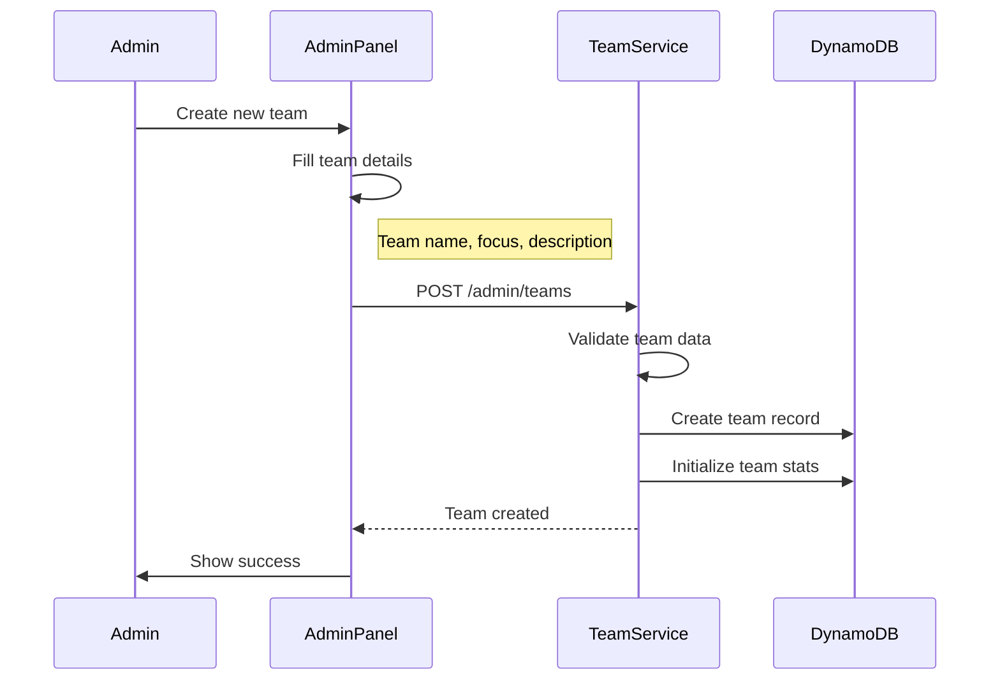
```mermaid
sequenceDiagram
    participant Admin
    participant AdminPanel
    participant TeamService
    participant DynamoDB

    Admin->>AdminPanel: Create new team
    AdminPanel->>AdminPanel: Fill team details
    Note right of AdminPanel: Team name, focus, description
    AdminPanel->>TeamService: POST /admin/teams
    TeamService->>TeamService: Validate team data
    TeamService->>DynamoDB: Create team record
    TeamService->>DynamoDB: Initialize team stats
    TeamService-->>AdminPanel: Team created
    AdminPanel->>Admin: Show success
```

**Team Types:**
- **Content Team:** Listing moderation, content review
- **Support Team:** Customer support, tickets
- **Sales Team:** Sales inquiries, dealer onboarding
- **Operations Team:** Platform operations, analytics

**Team Roles:**
- **Team Lead:** Full team management
- **Senior Member:** Advanced permissions
- **Member:** Standard team permissions
- **Junior:** Limited permissions, training

**Key Code Files:**
- `backend/src/admin-service/teams.ts` - Team management logic
- `backend/src/admin-service/teams-handler.ts` - Team API handlers
- `frontend/src/pages/admin/TeamManagement.tsx` - Team management UI

---

### 2. Assign User to Team Flow

**Endpoint:** `POST /admin/teams/assign`

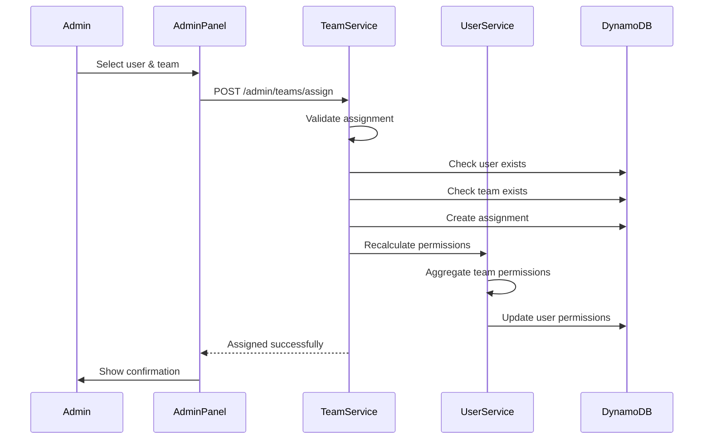
```mermaid
sequenceDiagram
    participant Admin
    participant AdminPanel
    participant TeamService
    participant UserService
    participant DynamoDB

    Admin->>AdminPanel: Select user & team
    AdminPanel->>TeamService: POST /admin/teams/assign
    TeamService->>TeamService: Validate assignment
    TeamService->>DynamoDB: Check user exists
    TeamService->>DynamoDB: Check team exists
    TeamService->>DynamoDB: Create assignment
    TeamService->>UserService: Recalculate permissions
    UserService->>UserService: Aggregate team permissions
    UserService->>DynamoDB: Update user permissions
    TeamService-->>AdminPanel: Assigned successfully
    AdminPanel->>Admin: Show confirmation
```

**Permission Aggregation:**
- User inherits all permissions from assigned teams
- Role-based permissions (SuperAdmin > Admin > Moderator > Support)
- Team-based permissions (focus-specific access)
- Final permissions = Role permissions + Team permissions

---

## Search & Discovery Flows

### 1. Search Listings Flow

**Endpoint:** `GET /search`  
**Service:** `search/index.ts`

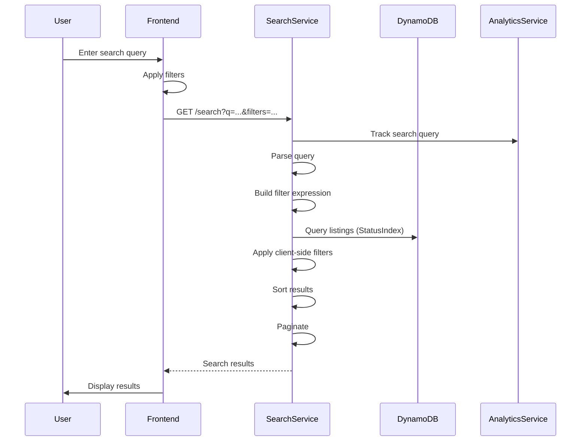
```mermaid
sequenceDiagram
    participant User
    participant Frontend
    participant SearchService
    participant DynamoDB
    participant AnalyticsService

    User->>Frontend: Enter search query
    Frontend->>Frontend: Apply filters
    Frontend->>SearchService: GET /search?q=...&filters=...
    SearchService->>AnalyticsService: Track search query
    SearchService->>SearchService: Parse query
    SearchService->>SearchService: Build filter expression
    SearchService->>DynamoDB: Query listings (StatusIndex)
    SearchService->>SearchService: Apply client-side filters
    SearchService->>SearchService: Sort results
    SearchService->>SearchService: Paginate
    SearchService-->>Frontend: Search results
    Frontend->>User: Display results
```

**Search Filters:**
- **Price Range:** Min/max price
- **Year Range:** Min/max year
- **Boat Type:** Sailboat, powerboat, fishing, etc.
- **Length Range:** Min/max feet
- **Location:** State, city, zip radius
- **Make/Model:** Specific brands
- **Engine Type:** Outboard, inboard, etc.
- **Condition:** New, used, excellent, good
- **Features:** GPS, radar, generator, etc.

**Sorting Options:**
- Relevance (default)
- Price: Low to High
- Price: High to Low
- Year: Newest First
- Year: Oldest First
- Recently Listed

**Key Code Files:**
- `backend/src/search/index.ts` - Search logic
- `frontend/src/pages/Search.tsx` - Search page
- `frontend/src/components/search/SearchFilters.tsx` - Filter UI

---

### 2. Browse by Category Flow

**Endpoint:** `GET /listings?type={boatType}`

Categories:
- Sailboats
- Powerboats
- Fishing Boats
- Yachts
- Personal Watercraft
- Commercial Vessels

---

## Finance Calculator Flows

### 1. Calculate Loan Payment Flow

**Endpoint:** `POST /finance/calculate`  
**Service:** `finance-service/index.ts`

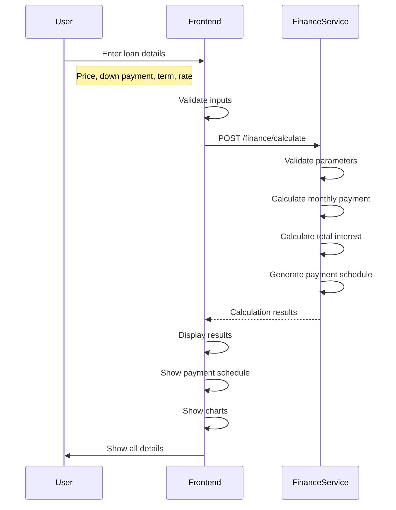
```mermaid
sequenceDiagram
    participant User
    participant Frontend
    participant FinanceService

    User->>Frontend: Enter loan details
    Note right of User: Price, down payment, term, rate
    Frontend->>Frontend: Validate inputs
    Frontend->>FinanceService: POST /finance/calculate
    FinanceService->>FinanceService: Validate parameters
    FinanceService->>FinanceService: Calculate monthly payment
    FinanceService->>FinanceService: Calculate total interest
    FinanceService->>FinanceService: Generate payment schedule
    FinanceService-->>Frontend: Calculation results
    Frontend->>Frontend: Display results
    Frontend->>Frontend: Show payment schedule
    Frontend->>Frontend: Show charts
    Frontend->>User: Show all details
```

**Calculation Formula:**
```
Monthly Payment = P * (r * (1 + r)^n) / ((1 + r)^n - 1)

Where:
P = Principal (loan amount after down payment)
r = Monthly interest rate (annual rate / 12)
n = Number of payments (term in months)
```

**Calculation Inputs:**
- **Boat Price:** $1 - $10,000,000
- **Down Payment:** $0 - 50% of price
- **Loan Term:** 12-240 months (1-20 years)
- **Interest Rate:** 0.1% - 25%
- **Sales Tax:** 0% - 15%
- **Documentation Fee:** $0 - $5,000
- **Registration Fee:** $0 - $2,000

**Calculation Outputs:**
- Monthly payment amount
- Total loan amount
- Total interest paid
- Total cost
- Payment schedule (monthly breakdown)
- Amortization chart

**Key Code Files:**
- `backend/src/finance-service/index.ts` - Calculation logic
- `frontend/src/components/listing/FinanceCalculator.tsx` - Calculator UI
- `frontend/src/pages/FinanceCalculator.tsx` - Standalone calculator

---

### 2. Save Calculation Flow

**Endpoint:** `POST /finance/calculations`

```mermaid
sequenceDiagram
    participant User
    participant Frontend
    participant FinanceService
    participant DynamoDB

    User->>Frontend: Click "Save Calculation"
    Frontend->>Frontend: Prompt for name
    User->>Frontend: Enter calculation name
    Frontend->>FinanceService: POST /finance/calculations
    FinanceService->>FinanceService: Generate calculation ID
    FinanceService->>FinanceService: Create share link
    FinanceService->>DynamoDB: Store calculation
    FinanceService-->>Frontend: {calculationId, shareUrl}
    Frontend->>Frontend: Add to saved list
    Frontend->>User: Show success & share URL
```

**Saved Calculation Features:**
- Personal calculation library
- Share calculations via URL
- Compare multiple scenarios
- Export to PDF
- Email calculations

**Key Code Files:**
- `backend/src/finance-service/index.ts` - Lines 200-400
- `frontend/src/components/listing/SavedCalculations.tsx` - Saved calc UI

---

## Security & Audit Flows

### 1. Audit Logging Flow

**Service:** `auth-service/audit-service.ts`

```mermaid
sequenceDiagram
    participant System
    participant AuditService
    participant DynamoDB

    System->>AuditService: Log event
    Note right of System: Login, data access, modifications
    AuditService->>AuditService: Enrich with context
    AuditService->>AuditService: Generate audit ID
    AuditService->>DynamoDB: Store audit log
    Note right of DynamoDB: Retention: 7 years (compliance)
```

**Logged Events:**
- All authentication attempts (success/failure)
- Admin actions (user management, moderation decisions)
- Data modifications (listing updates, user changes)
- Permission changes (role assignments, team changes)
- Security events (MFA enrollment, password changes)
- Financial transactions (payments, refunds)
- System configuration changes

**Audit Log Properties:**
- `auditId` - Unique identifier
- `timestamp` - Event time
- `eventType` - Type of action
- `userId` - Actor user ID
- `resourceType` - Affected resource
- `resourceId` - Resource identifier
- `action` - Specific action taken
- `oldValue` - Previous state (if applicable)
- `newValue` - New state (if applicable)
- `ipAddress` - Source IP
- `userAgent` - Browser/client info
- `success` - Success/failure status
- `errorMessage` - Error details (if failed)

**Compliance:**
- 7-year retention for financial records
- 3-year retention for user data
- 1-year retention for system logs
- Immutable audit trail
- Tamper-evident logging

**Key Code Files:**
- `backend/src/auth-service/audit-service.ts` - Audit logging
- `frontend/src/pages/admin/AuditLogs.tsx` - Audit log viewer

---

## Error Handling & Recovery

### Global Error Handling

**Frontend:**
```typescript
// ErrorBoundary component catches React errors
<ErrorBoundary>
  <App />
</ErrorBoundary>

// API error handling
try {
  await api.call()
} catch (error) {
  if (error.status === 401) {
    // Redirect to login
  } else if (error.status === 403) {
    // Show permission error
  } else {
    // Show generic error
  }
}
```

**Backend:**
```typescript
// Lambda error wrapper
try {
  // Business logic
} catch (error) {
  console.error('Error:', error);
  return createErrorResponse(
    500,
    'INTERNAL_ERROR',
    'An error occurred',
    requestId
  );
}
```

**Error Response Format:**
```json
{
  "error": {
    "code": "ERROR_CODE",
    "message": "User-friendly error message",
    "details": ["Additional error details"],
    "requestId": "unique-request-id"
  }
}
```

**Key Code Files:**
- `backend/src/shared/errors.ts` - Error definitions
- `backend/src/shared/error-handler.ts` - Error handling middleware
- `frontend/src/components/ErrorBoundary.tsx` - React error boundary

---

## Performance Optimization

### Caching Strategy

1. **Frontend Caching:**
   - React Query caching (5 min default)
   - localStorage for user session
   - Service worker for static assets

2. **Backend Caching:**
   - DynamoDB DAX (if enabled)
   - CloudFront CDN for static content
   - API Gateway caching (responses)

3. **Database Optimization:**
   - GSI for efficient queries
   - Batch operations for bulk actions
   - Pagination for large datasets
   - Conditional expressions to prevent unnecessary writes

**Key Code Files:**
- `frontend/src/App.tsx` - React Query configuration
- `backend/src/shared/database.ts` - Database optimization

---

## Deployment Architecture

### Environment Configuration

**Local Development:**
- LocalStack for AWS services
- Local DynamoDB
- Local S3
- Environment: `development`

**Staging:**
- AWS resources with `-staging` suffix
- Test Cognito pools
- Test Stripe account
- Environment: `staging`

**Production:**
- Full AWS infrastructure
- Production Cognito pools
- Live payment processors
- Environment: `production`

**Key Files:**
- `backend/src/auth-service/config.ts` - Environment detection
- `frontend/src/config/env.ts` - Frontend config
- `infrastructure/` - CDK infrastructure

---

## Summary

This document provides a comprehensive overview of all major application flows in the HarborList Marketplace platform. Each flow is designed with security, scalability, and user experience in mind.

**Key Architectural Decisions:**
1. **Dual User Pool Architecture:** Separates customer and staff authentication
2. **Event-Driven Analytics:** Tracks user behavior without blocking main flows
3. **Queue-Based Moderation:** Scales content review across teams
4. **Service-Oriented Design:** Each Lambda handles specific domain
5. **Comprehensive Audit Trail:** Full compliance and security logging

**For detailed implementation:**
- Backend services: `/backend/src/`
- Frontend components: `/frontend/src/`
- Shared types: `/packages/shared-types/`
- Infrastructure: `/infrastructure/`
