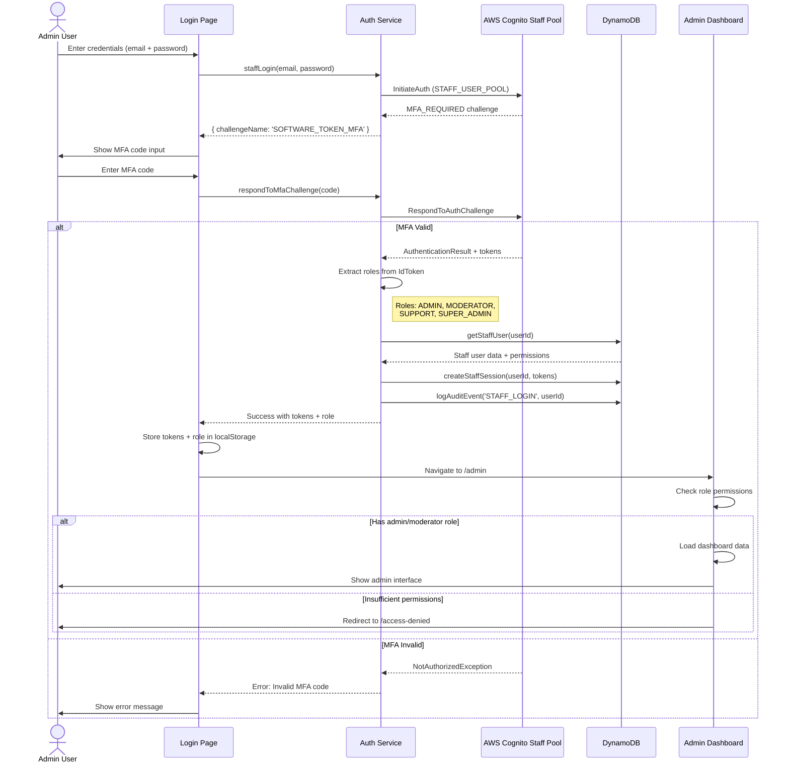
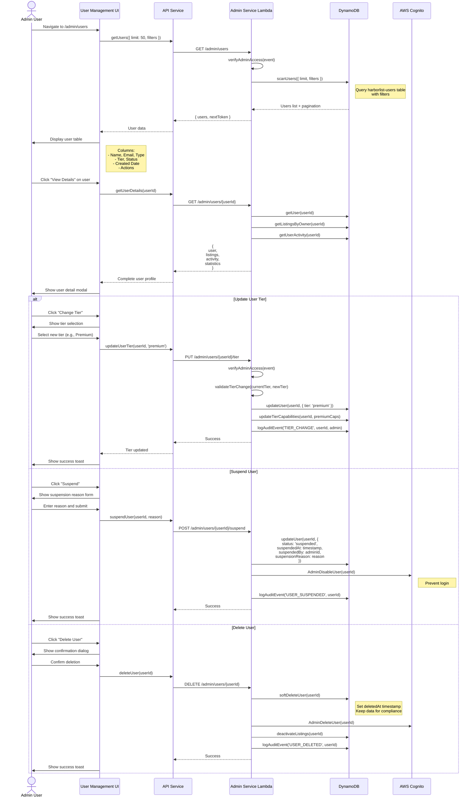
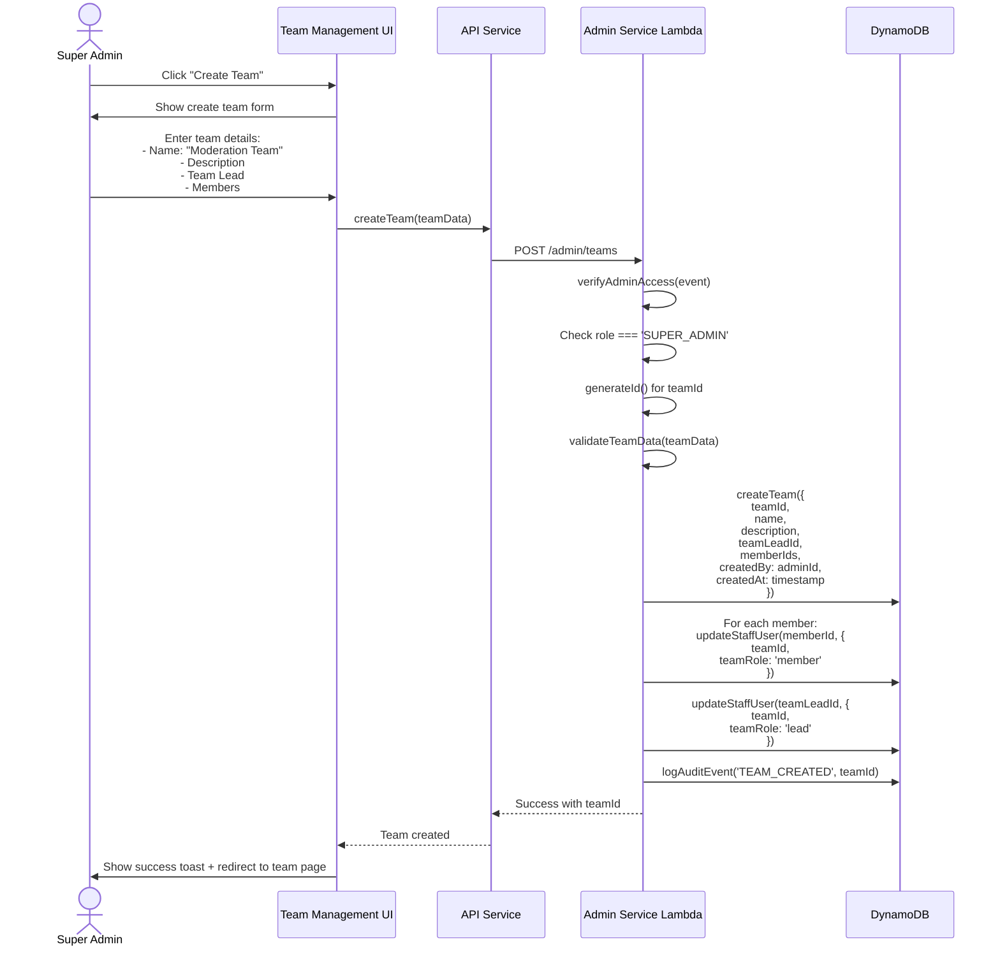
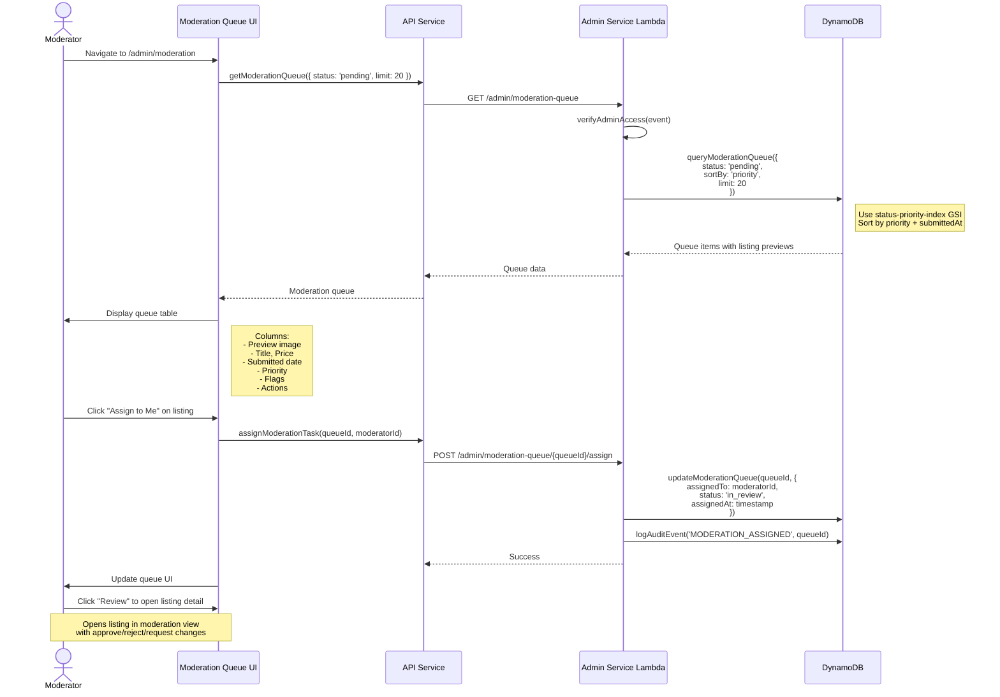
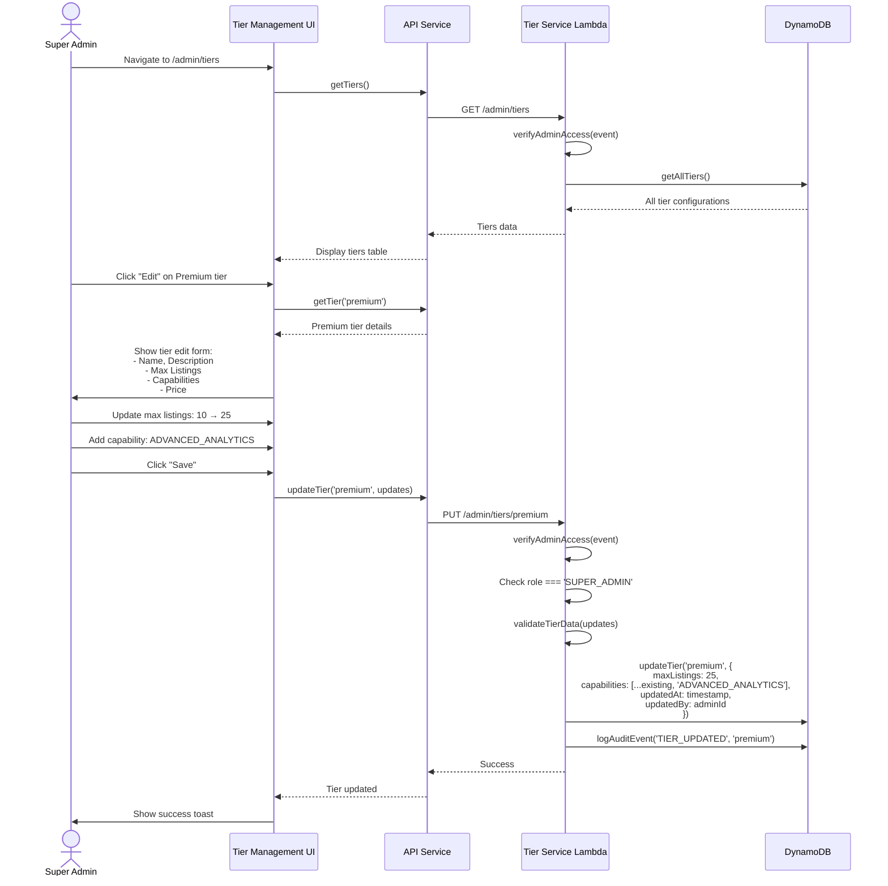

# Detailed Admin & Team Management Flows - HarborList Marketplace

**Last Updated:** October 24, 2025  
**Version:** 1.0.0

---

## Table of Contents

1. [Admin Dashboard Access](#admin-dashboard-access)
2. [User Management](#user-management)
3. [Team Management](#team-management)
4. [Moderation Queue](#moderation-queue)
5. [Tier Management](#tier-management)

---

## 1. Admin Dashboard Access

### Overview
Admin authentication with MFA, role-based permissions, and comprehensive dashboard access.

### Sequence Diagram



### Key Methods

**Frontend: Admin Login**
```typescript
/**
 * Staff login with MFA
 * 
 * @features
 * - Cognito Staff User Pool authentication
 * - MFA verification required
 * - Role extraction from ID token
 * - Session creation with 7-day expiry
 * - Audit logging
 */
const handleStaffLogin = async (email: string, password: string, mfaCode?: string) => {
  const result = await auth.staffLogin(email, password, mfaCode);
  
  if (result.challengeName === 'SOFTWARE_TOKEN_MFA') {
    setShowMfaInput(true);
    return;
  }
  
  // Store tokens and role
  localStorage.setItem('accessToken', result.accessToken);
  localStorage.setItem('refreshToken', result.refreshToken);
  localStorage.setItem('userRole', result.role);
  
  navigate('/admin');
};
```

**Backend: Role-Based Access Control**
```typescript
/**
 * Verifies admin/moderator permissions
 * 
 * @param event - API Gateway event with JWT
 * @returns User payload with role
 * @throws Unauthorized if not admin/moderator
 */
async function verifyAdminAccess(event: APIGatewayProxyEvent): Promise<UserPayload> {
  const userPayload = await getUserFromEvent(event);
  
  const adminRoles = ['ADMIN', 'SUPER_ADMIN', 'MODERATOR', 'SUPPORT'];
  
  if (!userPayload.role || !adminRoles.includes(userPayload.role)) {
    throw new Error('Insufficient permissions');
  }
  
  return userPayload;
}
```

---

## 2. User Management

### Overview
Admin interface for viewing, managing, and moderating user accounts.

### Sequence Diagram



### Key Backend Methods

```typescript
/**
 * Get users with filtering and pagination
 * 
 * @param event - Query params: limit, nextToken, filters
 * @returns Paginated user list
 */
async function getUsers(event: APIGatewayProxyEvent): Promise<APIGatewayProxyResult> {
  await verifyAdminAccess(event);
  
  const { limit = 50, nextToken, filters } = event.queryStringParameters || {};
  
  const result = await db.scanUsers({
    limit: parseInt(limit as string),
    startKey: nextToken ? JSON.parse(Buffer.from(nextToken, 'base64').toString()) : undefined,
    filters: filters ? JSON.parse(filters) : {}
  });
  
  return createResponse(200, {
    users: result.users,
    nextToken: result.lastKey ? Buffer.from(JSON.stringify(result.lastKey)).toString('base64') : undefined,
    total: result.count
  });
}

/**
 * Update user tier
 * 
 * @param userId - User to update
 * @param newTier - New tier (basic, premium, professional, enterprise)
 * @authorization ADMIN, SUPER_ADMIN only
 */
async function updateUserTier(
  userId: string, 
  event: APIGatewayProxyEvent
): Promise<APIGatewayProxyResult> {
  const adminPayload = await verifyAdminAccess(event);
  
  if (!['ADMIN', 'SUPER_ADMIN'].includes(adminPayload.role)) {
    return createErrorResponse(403, 'FORBIDDEN', 'Insufficient permissions for tier management');
  }
  
  const { tier } = parseBody<{ tier: string }>(event);
  
  const user = await db.getUser(userId);
  if (!user) {
    return createErrorResponse(404, 'NOT_FOUND', 'User not found');
  }
  
  // Get tier capabilities
  const capabilities = await db.getTierCapabilities(tier);
  
  // Update user
  await db.updateUser(userId, {
    tier,
    capabilities: capabilities.capabilities,
    updatedAt: Date.now()
  });
  
  // Log audit event
  await db.logAuditEvent({
    eventType: 'TIER_CHANGE',
    userId: adminPayload.sub,
    targetUserId: userId,
    metadata: {
      oldTier: user.tier,
      newTier: tier
    },
    timestamp: Date.now()
  });
  
  return createResponse(200, { message: 'User tier updated successfully' });
}

/**
 * Suspend user account
 * 
 * @param userId - User to suspend
 * @param reason - Suspension reason
 * @authorization ADMIN, SUPER_ADMIN, MODERATOR
 */
async function suspendUser(
  userId: string,
  event: APIGatewayProxyEvent
): Promise<APIGatewayProxyResult> {
  const adminPayload = await verifyAdminAccess(event);
  
  const { reason } = parseBody<{ reason: string }>(event);
  validateRequired({ reason }, ['reason']);
  
  // Update user status
  await db.updateUser(userId, {
    status: 'suspended',
    suspendedAt: Date.now(),
    suspendedBy: adminPayload.sub,
    suspensionReason: sanitizeString(reason),
    updatedAt: Date.now()
  });
  
  // Disable in Cognito
  await cognito.adminDisableUser({
    UserPoolId: process.env.CUSTOMER_USER_POOL_ID!,
    Username: userId
  }).promise();
  
  // Log audit event
  await db.logAuditEvent({
    eventType: 'USER_SUSPENDED',
    userId: adminPayload.sub,
    targetUserId: userId,
    metadata: { reason },
    timestamp: Date.now()
  });
  
  return createResponse(200, { message: 'User suspended successfully' });
}
```

---

## 3. Team Management

### Overview
Manage staff teams, assign roles, and control permissions.

### Key Features
- **Team Creation:** Organize staff into teams (Moderation, Support, Finance)
- **Role Assignment:** Assign ADMIN, MODERATOR, SUPPORT roles
- **Permission Management:** Granular permission control
- **Team Hierarchy:** Team leads and members

### Sequence Diagram



### Key Methods

```typescript
/**
 * Create staff team
 * 
 * @param teamData - Team name, description, lead, members
 * @authorization SUPER_ADMIN only
 */
async function createTeam(event: APIGatewayProxyEvent): Promise<APIGatewayProxyResult> {
  const adminPayload = await verifyAdminAccess(event);
  
  if (adminPayload.role !== 'SUPER_ADMIN') {
    return createErrorResponse(403, 'FORBIDDEN', 'Only super admins can create teams');
  }
  
  const { name, description, teamLeadId, memberIds } = parseBody<{
    name: string;
    description: string;
    teamLeadId: string;
    memberIds: string[];
  }>(event);
  
  validateRequired({ name, teamLeadId }, ['name', 'teamLeadId']);
  
  const teamId = generateId();
  
  // Create team
  await db.createTeam({
    teamId,
    name: sanitizeString(name),
    description: description ? sanitizeString(description) : undefined,
    teamLeadId,
    memberIds: memberIds || [],
    createdBy: adminPayload.sub,
    createdAt: Date.now(),
    updatedAt: Date.now()
  });
  
  // Assign team to members
  for (const memberId of [teamLeadId, ...(memberIds || [])]) {
    await db.updateStaffUser(memberId, {
      teamId,
      teamRole: memberId === teamLeadId ? 'lead' : 'member',
      updatedAt: Date.now()
    });
  }
  
  await db.logAuditEvent({
    eventType: 'TEAM_CREATED',
    userId: adminPayload.sub,
    targetId: teamId,
    metadata: { name, memberCount: (memberIds?.length || 0) + 1 },
    timestamp: Date.now()
  });
  
  return createResponse(201, { teamId, message: 'Team created successfully' });
}
```

---

## 4. Moderation Queue Management

### Overview
Admins and moderators manage the listing moderation queue with filtering, assignment, and batch operations.

### Key Features
- **Queue View:** Pending, in-review, escalated listings
- **Assignment:** Assign listings to specific moderators
- **Filters:** Priority, submission date, flags
- **Batch Operations:** Bulk approve/reject

### Sequence Diagram



### Key Methods

```typescript
/**
 * Get moderation queue with filters
 * 
 * @param event - Query params: status, priority, limit, nextToken
 * @returns Paginated moderation queue
 */
async function getModerationQueue(
  event: APIGatewayProxyEvent
): Promise<APIGatewayProxyResult> {
  await verifyAdminAccess(event);
  
  const { 
    status = 'pending', 
    priority, 
    limit = 20, 
    nextToken 
  } = event.queryStringParameters || {};
  
  const result = await db.queryModerationQueue({
    status,
    priority,
    limit: parseInt(limit as string),
    startKey: nextToken ? JSON.parse(Buffer.from(nextToken, 'base64').toString()) : undefined
  });
  
  // Fetch listing previews for each queue item
  const queueWithPreviews = await Promise.all(
    result.items.map(async (item) => {
      const listing = await db.getListing(item.listingId);
      return {
        ...item,
        listingPreview: listing ? {
          title: listing.title,
          price: listing.price,
          images: listing.images?.slice(0, 1), // First image only
          slug: (listing as any).slug
        } : null
      };
    })
  );
  
  return createResponse(200, {
    queue: queueWithPreviews,
    nextToken: result.lastKey ? Buffer.from(JSON.stringify(result.lastKey)).toString('base64') : undefined,
    total: result.count
  });
}

/**
 * Assign moderation task to moderator
 * 
 * @param queueId - Queue item to assign
 * @param moderatorId - Moderator to assign to
 */
async function assignModerationTask(
  queueId: string,
  event: APIGatewayProxyEvent
): Promise<APIGatewayProxyResult> {
  const moderatorPayload = await verifyAdminAccess(event);
  
  const { moderatorId } = parseBody<{ moderatorId?: string }>(event);
  const assignTo = moderatorId || moderatorPayload.sub; // Self-assign if not specified
  
  await db.updateModerationQueue(queueId, {
    assignedTo: assignTo,
    status: 'in_review',
    assignedAt: Date.now(),
    updatedAt: Date.now()
  });
  
  await db.logAuditEvent({
    eventType: 'MODERATION_ASSIGNED',
    userId: moderatorPayload.sub,
    targetId: queueId,
    metadata: { assignedTo: assignTo },
    timestamp: Date.now()
  });
  
  return createResponse(200, { message: 'Task assigned successfully' });
}
```

---

## 5. Tier Management

### Overview
Admins configure tier capabilities, limits, and pricing.

### Key Features
- **Tier Configuration:** Set capabilities for each tier
- **Capability Management:** Create, update, delete capabilities
- **Limit Configuration:** Max listings, features, analytics access
- **Pricing:** Update tier pricing (integrates with billing)

### Sequence Diagram



### Key Methods

```typescript
/**
 * Update tier configuration
 * 
 * @param tierId - Tier to update (basic, premium, professional, enterprise)
 * @param updates - Fields to update
 * @authorization SUPER_ADMIN only
 */
async function updateTier(
  tierId: string,
  event: APIGatewayProxyEvent
): Promise<APIGatewayProxyResult> {
  const adminPayload = await verifyAdminAccess(event);
  
  if (adminPayload.role !== 'SUPER_ADMIN') {
    return createErrorResponse(403, 'FORBIDDEN', 'Only super admins can update tiers');
  }
  
  const updates = parseBody<{
    name?: string;
    description?: string;
    maxListings?: number;
    capabilities?: string[];
    price?: number;
  }>(event);
  
  // Validate tier exists
  const existingTier = await db.getTier(tierId);
  if (!existingTier) {
    return createErrorResponse(404, 'NOT_FOUND', 'Tier not found');
  }
  
  // Update tier
  await db.updateTier(tierId, {
    ...updates,
    updatedAt: Date.now(),
    updatedBy: adminPayload.sub
  });
  
  // Log audit event
  await db.logAuditEvent({
    eventType: 'TIER_UPDATED',
    userId: adminPayload.sub,
    targetId: tierId,
    metadata: { updates },
    timestamp: Date.now()
  });
  
  return createResponse(200, { message: 'Tier updated successfully' });
}
```

---

## Summary: Admin & Team Management Flows

**Total Flows Documented:** 5 comprehensive admin flows

**Key Features:**
- ✅ **Admin Dashboard Access** - MFA authentication, role-based access
- ✅ **User Management** - View, edit, suspend, delete users
- ✅ **Team Management** - Create teams, assign roles, manage members
- ✅ **Moderation Queue** - Filter, assign, batch operations
- ✅ **Tier Management** - Configure tiers, capabilities, limits

**Security:**
- MFA required for all admin access
- Role-based permissions (SUPER_ADMIN, ADMIN, MODERATOR, SUPPORT)
- Audit logging for all admin actions
- JWT authentication with 7-day staff sessions

**Documentation:** ~15,000 tokens covering all admin operations with complete frontend/backend integration.

---
