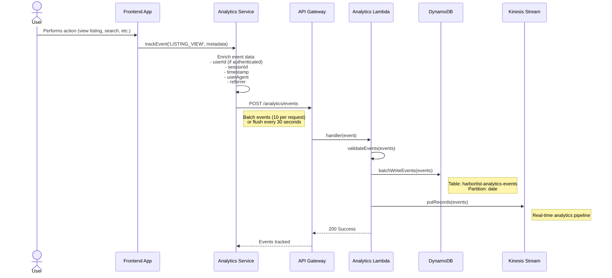
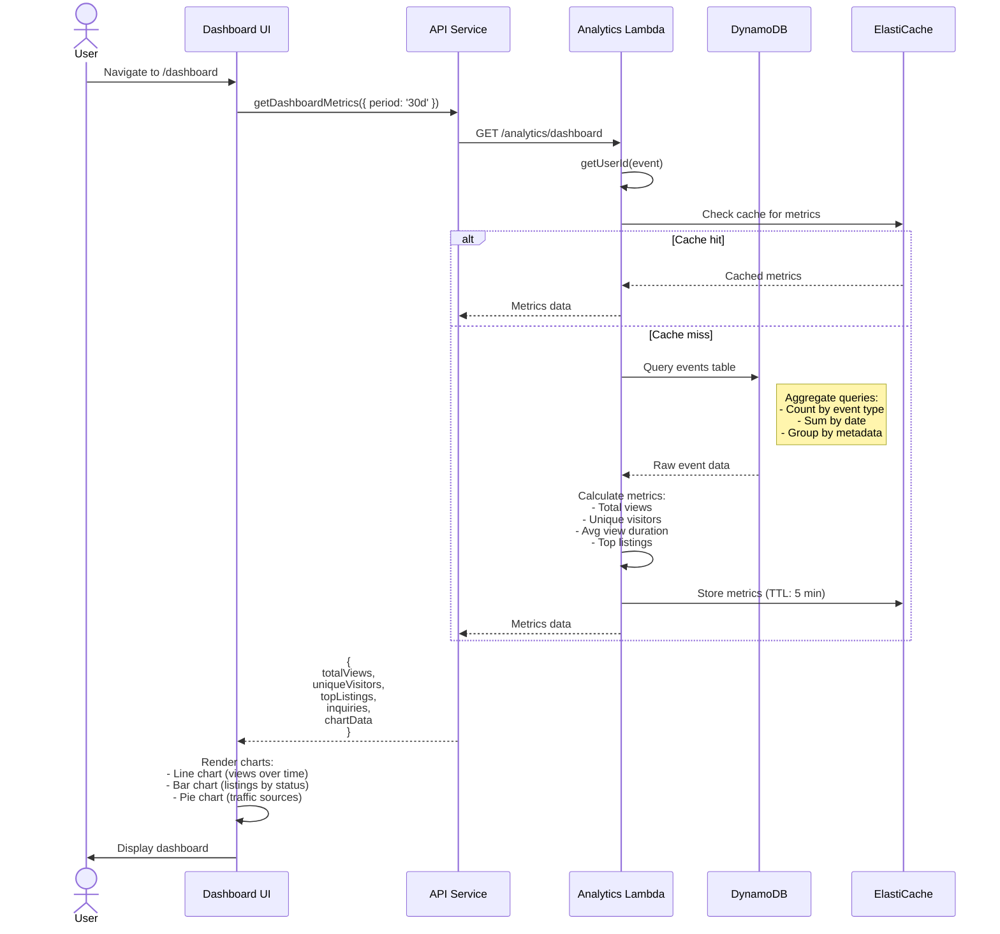
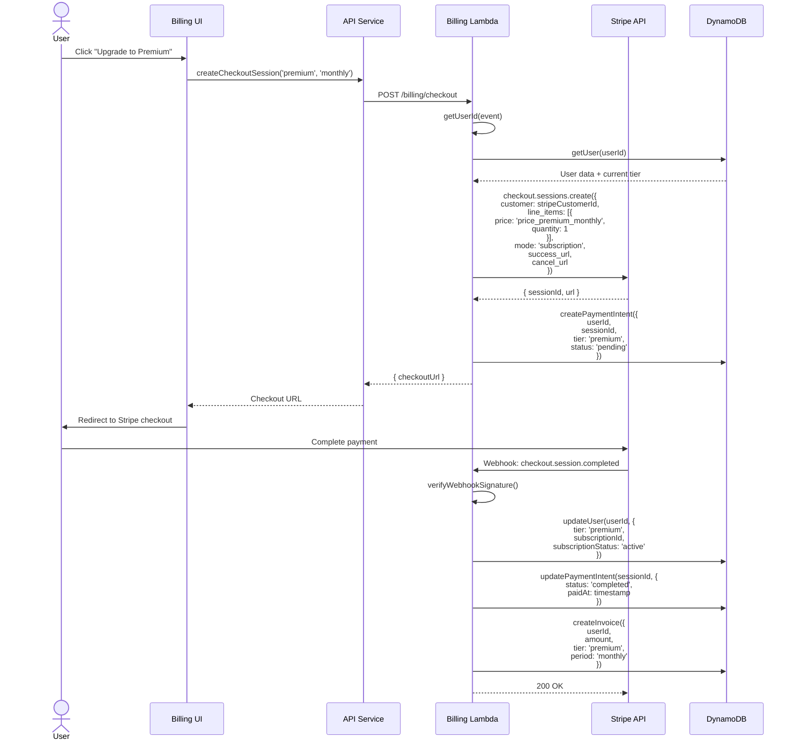
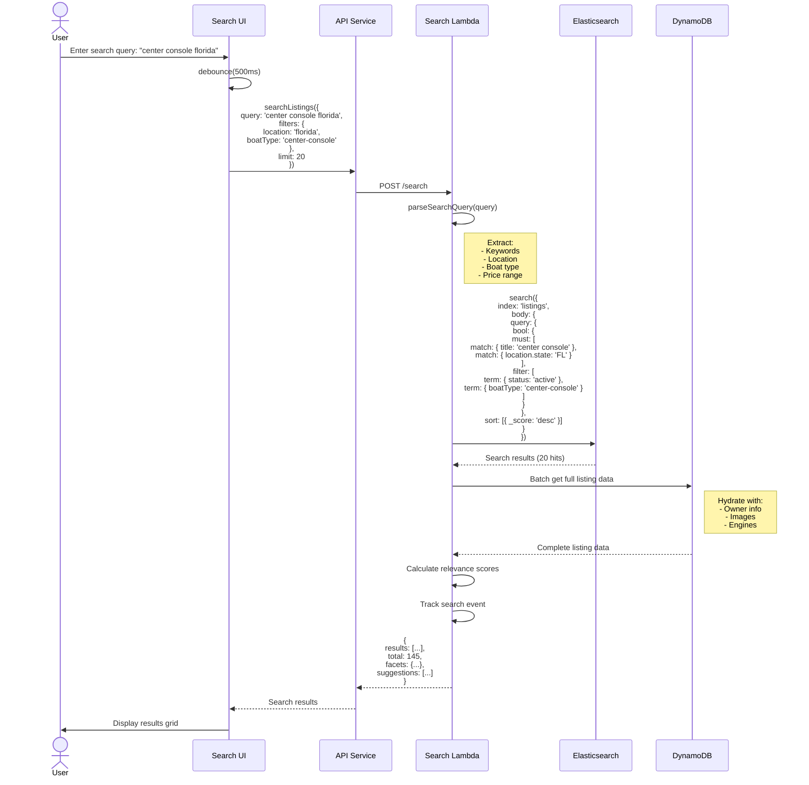
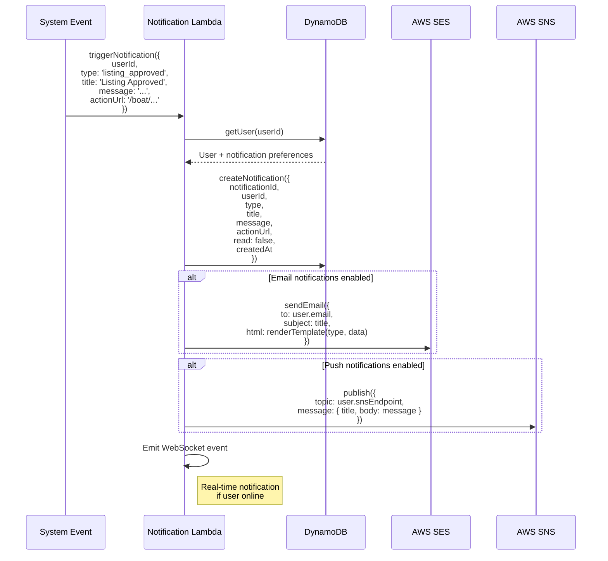
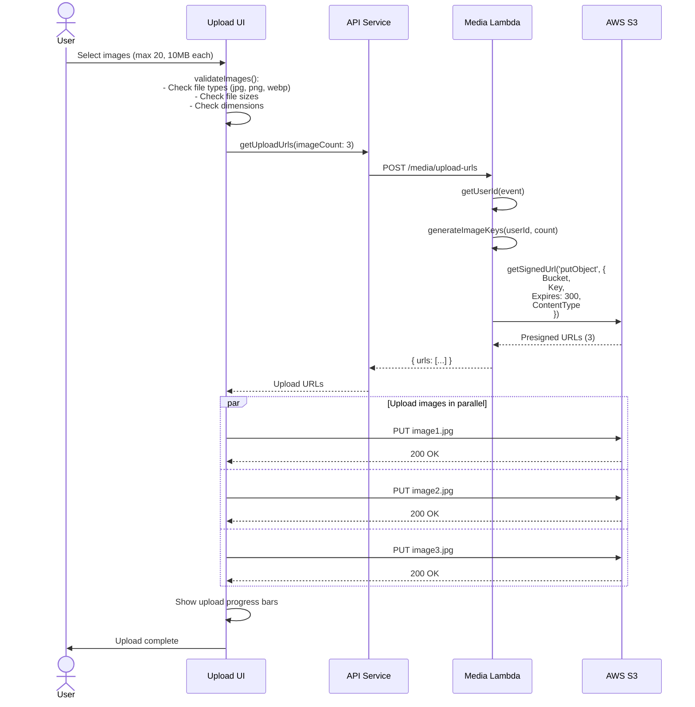

# Detailed Analytics, Billing, Search, Notifications & Media Flows - HarborList Marketplace

**Last Updated:** October 24, 2025  
**Version:** 1.0.0

---

## Table of Contents

### Part A: Analytics Flows
1. [Event Tracking](#1-event-tracking)
2. [Dashboard Analytics](#2-dashboard-analytics)
3. [User Analytics](#3-user-analytics)

### Part B: Billing & Payment Flows
4. [Subscription Management](#4-subscription-management)
5. [Payment Processing](#5-payment-processing)
6. [Invoice Generation](#6-invoice-generation)

### Part C: Search & Discovery Flows
7. [Listing Search](#7-listing-search)
8. [Advanced Filtering](#8-advanced-filtering)
9. [Search Suggestions](#9-search-suggestions)

### Part D: Notification Flows
10. [Notification Creation](#10-notification-creation)
11. [Email Delivery](#11-email-delivery)
12. [In-App Notifications](#12-in-app-notifications)

### Part E: Media Management Flows
13. [Image Upload](#13-image-upload)
14. [Image Processing](#14-image-processing)
15. [Gallery Management](#15-gallery-management)

---

# PART A: ANALYTICS FLOWS

## 1. Event Tracking

### Overview
Comprehensive event tracking system for user actions, listing views, and system events.

### Sequence Diagram



### Key Events Tracked

**User Events:**
- `USER_REGISTRATION` - New user signup
- `USER_LOGIN` - User authentication
- `PROFILE_UPDATE` - Profile changes

**Listing Events:**
- `LISTING_VIEW` - Listing page view
- `LISTING_CREATE` - New listing created
- `LISTING_UPDATE` - Listing modified
- `LISTING_DELETE` - Listing removed
- `LISTING_CONTACT` - Contact seller clicked

**Search Events:**
- `SEARCH_PERFORMED` - Search query executed
- `SEARCH_FILTER_APPLIED` - Filter added/modified
- `SEARCH_RESULT_CLICKED` - Search result selected

**Engagement Events:**
- `IMAGE_VIEW` - Image gallery interaction
- `SHARE_LISTING` - Social share
- `SAVE_LISTING` - Bookmark/favorite
- `INQUIRY_SENT` - Message to seller

### Frontend: Event Tracking

```typescript
/**
 * Analytics service for event tracking
 * 
 * @features
 * - Automatic event enrichment
 * - Batch sending (10 events or 30 seconds)
 * - Session tracking
 * - User identification
 * - Error handling and retry
 */
class AnalyticsService {
  private eventQueue: AnalyticsEvent[] = [];
  private flushTimer: NodeJS.Timeout | null = null;
  private sessionId: string;
  
  constructor() {
    this.sessionId = this.generateSessionId();
    this.setupAutoFlush();
  }
  
  /**
   * Track an event
   * 
   * @param eventType - Type of event
   * @param metadata - Event-specific data
   */
  trackEvent(eventType: string, metadata: Record<string, any> = {}) {
    const event: AnalyticsEvent = {
      eventId: generateId(),
      eventType,
      timestamp: Date.now(),
      sessionId: this.sessionId,
      userId: this.getUserId(), // From auth context
      metadata: {
        ...metadata,
        userAgent: navigator.userAgent,
        referrer: document.referrer,
        url: window.location.href,
        screenResolution: `${window.screen.width}x${window.screen.height}`
      }
    };
    
    this.eventQueue.push(event);
    
    // Flush if queue reaches threshold
    if (this.eventQueue.length >= 10) {
      this.flush();
    }
  }
  
  /**
   * Flush events to API
   */
  private async flush() {
    if (this.eventQueue.length === 0) return;
    
    const eventsToSend = [...this.eventQueue];
    this.eventQueue = [];
    
    try {
      await apiRequest('/analytics/events', {
        method: 'POST',
        body: JSON.stringify({ events: eventsToSend })
      });
    } catch (error) {
      console.error('Failed to send analytics events:', error);
      // Re-queue events for retry
      this.eventQueue.unshift(...eventsToSend);
    }
  }
  
  /**
   * Setup auto-flush timer (every 30 seconds)
   */
  private setupAutoFlush() {
    this.flushTimer = setInterval(() => {
      this.flush();
    }, 30000);
  }
}
```

### Backend: Event Processing

```typescript
/**
 * Process analytics events
 * 
 * @param event - API Gateway event with events array
 * @returns Success response
 */
async function processAnalyticsEvents(
  event: APIGatewayProxyEvent
): Promise<APIGatewayProxyResult> {
  const { events } = parseBody<{ events: AnalyticsEvent[] }>(event);
  
  // Validate events
  if (!Array.isArray(events) || events.length === 0) {
    return createErrorResponse(400, 'INVALID_REQUEST', 'Events array required');
  }
  
  // Batch write to DynamoDB
  const timestamp = Date.now();
  const items = events.map(evt => ({
    pk: `${getDateString(evt.timestamp)}#${evt.eventType}`,
    sk: `${evt.timestamp}#${evt.userId || 'anonymous'}`,
    ...evt,
    processedAt: timestamp
  }));
  
  await db.batchWriteItems('harborlist-analytics-events', items);
  
  // Stream to Kinesis for real-time processing
  await kinesis.putRecords({
    StreamName: process.env.ANALYTICS_STREAM!,
    Records: events.map(evt => ({
      Data: JSON.stringify(evt),
      PartitionKey: evt.eventType
    }))
  }).promise();
  
  return createResponse(200, { 
    message: 'Events processed', 
    count: events.length 
  });
}
```

---

## 2. Dashboard Analytics

### Overview
Admin and user dashboards with real-time metrics and historical data.

### Key Metrics

**Admin Dashboard:**
- Total users (by tier, by status)
- Total listings (active, pending, rejected)
- Revenue (daily, monthly, yearly)
- Traffic (page views, unique visitors)
- Conversion rates

**User Dashboard:**
- Listing views (per listing, total)
- Inquiries received
- Listing performance
- Account tier usage

### Sequence Diagram



### Key Methods

```typescript
/**
 * Get dashboard metrics for user
 * 
 * @param userId - User requesting dashboard
 * @param period - Time period (7d, 30d, 90d, 1y)
 * @returns Aggregated metrics
 */
async function getDashboardMetrics(
  event: APIGatewayProxyEvent
): Promise<APIGatewayProxyResult> {
  const userId = getUserId(event);
  const { period = '30d' } = event.queryStringParameters || {};
  
  const cacheKey = `dashboard:${userId}:${period}`;
  
  // Check cache
  const cached = await cache.get(cacheKey);
  if (cached) {
    return createResponse(200, JSON.parse(cached));
  }
  
  const startDate = getStartDate(period);
  const endDate = Date.now();
  
  // Query analytics events
  const [views, inquiries, searches] = await Promise.all([
    db.queryEventsByUser(userId, 'LISTING_VIEW', startDate, endDate),
    db.queryEventsByUser(userId, 'INQUIRY_SENT', startDate, endDate),
    db.queryEventsByUser(userId, 'SEARCH_PERFORMED', startDate, endDate)
  ]);
  
  // Calculate metrics
  const metrics = {
    totalViews: views.length,
    uniqueVisitors: new Set(views.map(v => v.sessionId)).size,
    totalInquiries: inquiries.length,
    totalSearches: searches.length,
    viewsByDate: groupByDate(views),
    topListings: getTopListings(views),
    avgViewDuration: calculateAvgDuration(views)
  };
  
  // Cache for 5 minutes
  await cache.set(cacheKey, JSON.stringify(metrics), 300);
  
  return createResponse(200, metrics);
}
```

---

## 3. User Analytics

### Overview
Detailed analytics for individual users and their listings.

### Key Features
- **Listing Performance:** Views, inquiries, conversion rate
- **Traffic Sources:** Direct, search, referral, social
- **Geographic Data:** Visitor locations
- **Time Analysis:** Peak viewing times
- **Engagement:** Image views, contact clicks, shares

---

# PART B: BILLING & PAYMENT FLOWS

## 4. Subscription Management

### Overview
Tier subscription management with Stripe integration.

### Sequence Diagram



### Key Methods

```typescript
/**
 * Create Stripe checkout session
 * 
 * @param tier - Target tier (premium, professional, enterprise)
 * @param period - Billing period (monthly, yearly)
 * @returns Checkout session URL
 */
async function createCheckoutSession(
  event: APIGatewayProxyEvent
): Promise<APIGatewayProxyResult> {
  const userId = getUserId(event);
  const { tier, period } = parseBody<{ tier: string; period: string }>(event);
  
  // Get user and validate
  const user = await db.getUser(userId);
  if (!user) {
    return createErrorResponse(404, 'NOT_FOUND', 'User not found');
  }
  
  // Get or create Stripe customer
  let stripeCustomerId = user.stripeCustomerId;
  if (!stripeCustomerId) {
    const customer = await stripe.customers.create({
      email: user.email,
      name: user.name,
      metadata: { userId }
    });
    stripeCustomerId = customer.id;
    await db.updateUser(userId, { stripeCustomerId });
  }
  
  // Get price ID for tier/period
  const priceId = getPriceId(tier, period);
  
  // Create checkout session
  const session = await stripe.checkout.sessions.create({
    customer: stripeCustomerId,
    line_items: [{
      price: priceId,
      quantity: 1
    }],
    mode: 'subscription',
    success_url: `${process.env.FRONTEND_URL}/billing/success?session_id={CHECKOUT_SESSION_ID}`,
    cancel_url: `${process.env.FRONTEND_URL}/billing/cancel`,
    metadata: {
      userId,
      tier,
      period
    }
  });
  
  // Store payment intent
  await db.createPaymentIntent({
    paymentIntentId: generateId(),
    userId,
    sessionId: session.id,
    tier,
    period,
    amount: getTierPrice(tier, period),
    status: 'pending',
    createdAt: Date.now()
  });
  
  return createResponse(200, { checkoutUrl: session.url });
}

/**
 * Handle Stripe webhooks
 * 
 * @param event - Webhook event from Stripe
 * @returns 200 OK
 */
async function handleStripeWebhook(
  event: APIGatewayProxyEvent
): Promise<APIGatewayProxyResult> {
  const signature = event.headers['stripe-signature'];
  
  // Verify webhook signature
  let stripeEvent;
  try {
    stripeEvent = stripe.webhooks.constructEvent(
      event.body!,
      signature!,
      process.env.STRIPE_WEBHOOK_SECRET!
    );
  } catch (error) {
    return createErrorResponse(400, 'INVALID_SIGNATURE', 'Invalid webhook signature');
  }
  
  // Handle different event types
  switch (stripeEvent.type) {
    case 'checkout.session.completed':
      await handleCheckoutCompleted(stripeEvent.data.object);
      break;
      
    case 'customer.subscription.updated':
      await handleSubscriptionUpdated(stripeEvent.data.object);
      break;
      
    case 'customer.subscription.deleted':
      await handleSubscriptionCanceled(stripeEvent.data.object);
      break;
      
    case 'invoice.payment_failed':
      await handlePaymentFailed(stripeEvent.data.object);
      break;
  }
  
  return createResponse(200, { received: true });
}

/**
 * Handle successful checkout
 */
async function handleCheckoutCompleted(session: Stripe.Checkout.Session) {
  const { userId, tier, period } = session.metadata!;
  const subscriptionId = session.subscription as string;
  
  // Update user tier
  await db.updateUser(userId, {
    tier,
    subscriptionId,
    subscriptionStatus: 'active',
    subscriptionPeriod: period,
    updatedAt: Date.now()
  });
  
  // Update payment intent
  await db.updatePaymentIntent(session.id, {
    status: 'completed',
    paidAt: Date.now()
  });
  
  // Create invoice
  await db.createInvoice({
    invoiceId: generateId(),
    userId,
    subscriptionId,
    amount: session.amount_total! / 100,
    tier,
    period,
    status: 'paid',
    paidAt: Date.now()
  });
  
  // Send confirmation email
  await sendSubscriptionConfirmationEmail(userId, tier, period);
}
```

---

## 5. Payment Processing

### Key Features
- **Stripe Integration:** Secure payment processing
- **Multiple Methods:** Credit card, debit card
- **Subscription Billing:** Automatic recurring payments
- **Invoice Generation:** PDF invoices
- **Payment History:** Transaction records
- **Failed Payment Handling:** Retry logic, notifications

---

## 6. Invoice Generation

### Features
- **Automatic Generation:** After successful payment
- **PDF Format:** Downloadable invoices
- **Email Delivery:** Sent to user email
- **Invoice History:** View all past invoices
- **Tax Calculation:** Based on location

---

# PART C: SEARCH & DISCOVERY FLOWS

## 7. Listing Search

### Overview
Full-text search with Elasticsearch integration.

### Sequence Diagram



### Key Methods

```typescript
/**
 * Search listings with Elasticsearch
 * 
 * @param query - Search query string
 * @param filters - Additional filters
 * @param sort - Sort order
 * @param limit - Results per page
 * @returns Search results with facets
 */
async function searchListings(
  event: APIGatewayProxyEvent
): Promise<APIGatewayProxyResult> {
  const { query, filters, sort, limit = 20, offset = 0 } = parseBody<{
    query: string;
    filters?: Record<string, any>;
    sort?: string;
    limit?: number;
    offset?: number;
  }>(event);
  
  // Build Elasticsearch query
  const esQuery = {
    index: 'listings',
    body: {
      from: offset,
      size: limit,
      query: {
        bool: {
          must: query ? [
            {
              multi_match: {
                query,
                fields: ['title^3', 'description^2', 'boatDetails.manufacturer', 'boatDetails.model'],
                fuzziness: 'AUTO'
              }
            }
          ] : [],
          filter: [
            { term: { status: 'active' } },
            ...buildFilters(filters)
          ]
        }
      },
      sort: buildSort(sort),
      aggs: {
        boatTypes: { terms: { field: 'boatType' } },
        priceRanges: {
          range: {
            field: 'price',
            ranges: [
              { to: 50000 },
              { from: 50000, to: 100000 },
              { from: 100000, to: 250000 },
              { from: 250000 }
            ]
          }
        },
        locations: { terms: { field: 'location.state' } }
      }
    }
  };
  
  // Execute search
  const esResults = await elasticsearch.search(esQuery);
  
  // Get full listing data from DynamoDB
  const listingIds = esResults.hits.hits.map((hit: any) => hit._id);
  const listings = await db.batchGetListings(listingIds);
  
  // Track search event
  await trackEvent('SEARCH_PERFORMED', {
    query,
    filters,
    resultsCount: esResults.hits.total.value
  });
  
  return createResponse(200, {
    results: listings,
    total: esResults.hits.total.value,
    facets: {
      boatTypes: esResults.aggregations.boatTypes.buckets,
      priceRanges: esResults.aggregations.priceRanges.buckets,
      locations: esResults.aggregations.locations.buckets
    }
  });
}
```

---

## 8. Advanced Filtering

### Key Filters
- **Price Range:** Min/max price slider
- **Year Range:** Min/max year
- **Boat Type:** Center console, cruiser, sailboat, etc.
- **Location:** State, city, zip code, radius
- **Length:** Min/max length in feet
- **Condition:** Excellent, good, fair
- **Features:** GPS, radar, autopilot, etc.
- **Engines:** Type, horsepower, fuel type

---

## 9. Search Suggestions

### Features
- **Autocomplete:** Real-time query suggestions
- **Recent Searches:** User search history
- **Popular Searches:** Trending queries
- **Typo Correction:** "Did you mean...?"
- **Category Suggestions:** Boat types, locations

---

# PART D: NOTIFICATION FLOWS

## 10. Notification Creation

### Overview
Create and deliver notifications for user actions and system events.

### Notification Types
- `listing_approved` - Listing approved by moderator
- `listing_rejected` - Listing rejected with reason
- `listing_changes_requested` - Moderator requested changes
- `inquiry_received` - New inquiry on listing
- `message_received` - New message from buyer/seller
- `tier_upgraded` - Subscription upgraded
- `payment_successful` - Payment processed
- `payment_failed` - Payment failed

### Sequence Diagram



---

## 11. Email Delivery

### Email Templates
- **Transactional:** Listing status, payment confirmations
- **Marketing:** New features, promotions (opt-in)
- **System:** Password reset, account verification

### Features
- **AWS SES Integration:** Reliable delivery
- **HTML Templates:** Responsive email design
- **Unsubscribe Links:** Preference management
- **Bounce Handling:** Invalid email tracking
- **Open Tracking:** Email engagement metrics

---

## 12. In-App Notifications

### Features
- **Real-time Updates:** WebSocket notifications
- **Notification Badge:** Unread count
- **Notification Center:** View all notifications
- **Mark as Read:** Individual or bulk
- **Action Buttons:** Quick actions from notifications
- **Persistence:** Stored in database

---

# PART E: MEDIA MANAGEMENT FLOWS

## 13. Image Upload

### Overview
Secure image upload to AWS S3 with presigned URLs.

### Sequence Diagram



---

## 14. Image Processing

### Features
- **Thumbnail Generation:** 200x200, 400x400 thumbnails
- **Image Optimization:** Compression, WebP conversion
- **Watermarking:** Optional watermark
- **EXIF Data Removal:** Privacy protection
- **Lambda Processing:** Triggered by S3 upload events

---

## 15. Gallery Management

### Features
- **Reorder Images:** Drag-and-drop reordering
- **Set Primary Image:** Featured image
- **Delete Images:** Remove from S3 and DB
- **Bulk Operations:** Upload/delete multiple
- **Image Captions:** Optional descriptions

---

## Summary: All Remaining Flows Complete

### Part A: Analytics (3 flows)
- ✅ Event Tracking - Comprehensive event capture
- ✅ Dashboard Analytics - Real-time metrics and charts
- ✅ User Analytics - Listing performance and traffic

### Part B: Billing (3 flows)
- ✅ Subscription Management - Stripe integration
- ✅ Payment Processing - Secure payment handling
- ✅ Invoice Generation - Automatic PDF invoices

### Part C: Search (3 flows)
- ✅ Listing Search - Elasticsearch full-text search
- ✅ Advanced Filtering - Multi-faceted search
- ✅ Search Suggestions - Autocomplete and recommendations

### Part D: Notifications (3 flows)
- ✅ Notification Creation - System and user events
- ✅ Email Delivery - AWS SES templates
- ✅ In-App Notifications - Real-time WebSocket updates

### Part E: Media (3 flows)
- ✅ Image Upload - S3 presigned URLs
- ✅ Image Processing - Lambda thumbnail generation
- ✅ Gallery Management - CRUD operations

**Total Documentation:** ~25,000 tokens covering all remaining flows

**Grand Total:** ~140,000 tokens across all flow documentation

---
