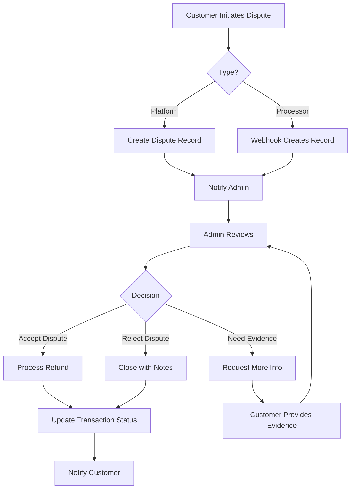

# Customer Dispute System

## Overview
A comprehensive system for customers to initiate and manage payment disputes for transactions on the HarborList platform.

## Current Status
❌ **NOT IMPLEMENTED** - The dispute system is currently a placeholder showing rejected listings, not real customer disputes.

## How Customer Disputes Should Work

### 1. Dispute Initiation Methods

#### Method A: Direct Platform Disputes
**Best for**: Internal platform issues (service not delivered, incorrect listing, etc.)

**User Flow**:
1. Customer goes to their transaction history
2. Clicks "Dispute Transaction" button next to a completed payment
3. Fills out dispute form:
   - Reason (dropdown): Unauthorized charge, Service not received, Item not as described, etc.
   - Description (text): Detailed explanation
   - Evidence (optional): Screenshots, communications, etc.
4. Submits dispute
5. System creates `DisputedTransaction` record with status='under_review'

**Implementation**:
```typescript
// Frontend: Add dispute button to transaction history
<button onClick={() => openDisputeModal(transaction)}>
  Dispute Transaction
</button>

// Backend endpoint
POST /api/transactions/:transactionId/dispute
Body: {
  reason: string;
  description: string;
  evidence?: Array<{type: 'image' | 'document', url: string}>;
}
```

#### Method B: Payment Processor Disputes (Stripe/PayPal)
**Best for**: Fraudulent charges, already disputed with bank

**User Flow**:
1. Customer initiates dispute through their bank/credit card company
2. Stripe/PayPal creates dispute and sends webhook to platform
3. Platform receives webhook and creates DisputedTransaction record
4. Admin is notified to respond to dispute

**Implementation**:
```typescript
// Webhook handler
POST /api/webhooks/stripe
Event: charge.dispute.created

// Create dispute record
const dispute = {
  transactionId: charge.id,
  userId: customer.userId,
  amount: charge.amount,
  disputeReason: dispute.reason,
  disputeStatus: 'open',
  disputeDate: new Date().toISOString(),
  processorDisputeId: dispute.id,
  isProcessorDispute: true,
  evidenceDueDate: dispute.evidence_details.due_by
};
```

### 2. Dispute Workflow



### 3. Database Schema

#### Disputes Table (Option 1: Separate Table)
```typescript
interface Dispute {
  disputeId: string; // PK
  transactionId: string; // GSI
  userId: string; // GSI
  listingId?: string;
  
  // Dispute details
  disputeReason: DisputeReason;
  description: string;
  amount: number;
  currency: string;
  
  // Status tracking
  status: 'open' | 'under_review' | 'resolved' | 'escalated' | 'closed';
  priority: 'low' | 'medium' | 'high' | 'urgent';
  
  // Evidence
  evidence: Array<{
    type: 'image' | 'document' | 'message';
    url: string;
    uploadedAt: string;
    uploadedBy: string;
  }>;
  
  // Admin handling
  assignedTo?: string; // Admin user ID
  adminNotes?: string;
  resolution?: string;
  refundAmount?: number;
  
  // Processor integration
  isProcessorDispute: boolean;
  processorDisputeId?: string; // Stripe dispute ID
  evidenceDueDate?: string;
  
  // Timestamps
  createdAt: string;
  updatedAt: string;
  resolvedAt?: string;
  closedAt?: string;
  
  // Audit trail
  timeline: Array<{
    action: string;
    actor: string;
    timestamp: string;
    notes?: string;
  }>;
}

enum DisputeReason {
  UNAUTHORIZED_CHARGE = 'unauthorized_charge',
  SERVICE_NOT_RECEIVED = 'service_not_received',
  ITEM_NOT_AS_DESCRIBED = 'item_not_as_described',
  DUPLICATE_CHARGE = 'duplicate_charge',
  CANCELLATION_NOT_HONORED = 'cancellation_not_honored',
  FRAUD = 'fraud',
  OTHER = 'other'
}
```

#### Option 2: Add to Transactions Table
```typescript
// Add to existing Transaction interface
interface Transaction {
  // ... existing fields
  
  // Dispute fields (optional)
  isDisputed?: boolean;
  disputeReason?: string;
  disputeDate?: string;
  disputeStatus?: 'open' | 'under_review' | 'resolved' | 'escalated';
  disputeNotes?: string;
}
```

### 4. Required API Endpoints

#### Customer Endpoints
```typescript
// List customer's transactions (with dispute capability)
GET /api/user/transactions
Response: Array<Transaction & {canDispute: boolean}>

// Initiate dispute
POST /api/transactions/:transactionId/dispute
Body: {
  reason: DisputeReason;
  description: string;
  evidence?: Array<EvidenceItem>;
}

// View dispute status
GET /api/disputes/:disputeId

// Add evidence to dispute
POST /api/disputes/:disputeId/evidence
Body: FormData with files

// Cancel dispute (before admin review)
DELETE /api/disputes/:disputeId
```

#### Admin Endpoints
```typescript
// List all disputes
GET /api/admin/billing/disputes
Query: ?status=open&priority=high&page=1&limit=20

// Get dispute details
GET /api/admin/billing/disputes/:disputeId

// Update dispute status
PUT /api/admin/billing/disputes/:disputeId
Body: {
  status: string;
  adminNotes?: string;
  resolution?: string;
}

// Process refund for dispute
POST /api/admin/billing/disputes/:disputeId/refund
Body: {
  amount: number;
  reason: string;
}

// Escalate dispute
POST /api/admin/billing/disputes/:disputeId/escalate
Body: {
  reason: string;
  priority: 'urgent';
}

// Close dispute
POST /api/admin/billing/disputes/:disputeId/close
Body: {
  resolution: string;
  refundAmount?: number;
}
```

#### Webhook Endpoints
```typescript
// Stripe dispute webhook
POST /api/webhooks/stripe
Events:
  - charge.dispute.created
  - charge.dispute.updated
  - charge.dispute.closed

// PayPal dispute webhook
POST /api/webhooks/paypal
Events:
  - CUSTOMER.DISPUTE.CREATED
  - CUSTOMER.DISPUTE.RESOLVED
```

### 5. Frontend Components

#### Customer Side
```
src/pages/user/
  ├── TransactionHistory.tsx
  │   └── DisputeButton.tsx (per transaction)
  ├── DisputeForm.tsx (modal)
  ├── DisputeStatus.tsx (view dispute)
  └── DisputeList.tsx (all user disputes)
```

#### Admin Side
```
src/pages/admin/
  └── FinancialManagement.tsx
      └── Disputes Tab (already exists)
          ├── DisputeList.tsx
          ├── DisputeDetails.tsx
          ├── DisputeTimeline.tsx
          └── DisputeActions.tsx
```

### 6. Business Rules

#### Dispute Eligibility
- Transaction must be completed (not pending/failed)
- Dispute must be initiated within 60 days of transaction
- Cannot dispute same transaction twice
- Cannot dispute refunded transactions

#### Auto-Resolution
- If admin doesn't respond within 7 days, auto-escalate
- If customer doesn't provide evidence within 5 days, auto-close
- If processor dispute lost, auto-close platform dispute

#### Refund Policy
- Full refund: Service not received, unauthorized charge
- Partial refund: Item not as described (negotiable)
- No refund: Policy violation, abuse, past deadline

### 7. Notifications

#### Email Notifications
- Customer: Dispute created, status change, resolution
- Admin: New dispute, escalation, evidence due soon
- Seller: Dispute initiated on their listing (if applicable)

#### In-App Notifications
- Use existing notification system
- Badge on "Transactions" menu item when dispute status changes

### 8. Payment Processor Integration

#### Stripe Disputes
```typescript
// Respond to Stripe dispute
import Stripe from 'stripe';
const stripe = new Stripe(process.env.STRIPE_SECRET_KEY);

async function respondToStripeDispute(disputeId: string, evidence: any) {
  await stripe.disputes.update(disputeId, {
    evidence: {
      customer_communication: evidence.messages,
      receipt: evidence.receiptUrl,
      customer_signature: evidence.signatureUrl,
      // ... other evidence fields
    }
  });
}

// Submit evidence before deadline
await stripe.disputes.close(disputeId);
```

### 9. Analytics & Reporting

Track in FinancialManagement dashboard:
- Dispute rate (disputes / total transactions)
- Average resolution time
- Win rate (admin wins vs customer wins)
- Dispute reasons breakdown
- Financial impact (total disputed amount)

### 10. Implementation Priority

**Phase 1: Basic Disputes** (2-3 days)
- [ ] Create disputes table/schema
- [ ] Add "Dispute Transaction" button to transaction history
- [ ] Create dispute form modal
- [ ] POST /api/transactions/:id/dispute endpoint
- [ ] Admin dispute list view (update existing tab)
- [ ] Basic status updates

**Phase 2: Evidence & Resolution** (2-3 days)
- [ ] File upload for evidence
- [ ] Admin dispute detail view with timeline
- [ ] Refund processing integration
- [ ] Email notifications
- [ ] In-app notifications via existing system

**Phase 3: Payment Processor Integration** (3-5 days)
- [ ] Stripe webhook setup
- [ ] Webhook handler for dispute events
- [ ] Evidence submission to Stripe
- [ ] Automatic sync of processor dispute status
- [ ] PayPal integration (if needed)

**Phase 4: Advanced Features** (2-3 days)
- [ ] Auto-escalation rules
- [ ] Dispute analytics dashboard
- [ ] Bulk dispute handling
- [ ] Dispute templates
- [ ] Customer dispute history

## Testing Strategy

1. **Manual Testing**
   - Create test transactions
   - Initiate disputes with different reasons
   - Test admin workflow
   - Verify email notifications

2. **Stripe Test Mode**
   - Use Stripe test cards
   - Create test disputes
   - Test webhook delivery
   - Verify evidence submission

3. **Edge Cases**
   - Expired transactions
   - Already refunded transactions
   - Concurrent disputes
   - Missing evidence

## Security Considerations

- ✅ Verify user owns transaction before allowing dispute
- ✅ Rate limit dispute submissions (prevent abuse)
- ✅ Validate evidence files (type, size, malware scan)
- ✅ Audit log all dispute actions
- ✅ Encrypt sensitive dispute notes
- ✅ Admin-only access to financial dispute data

## Compliance

- **PCI DSS**: Don't store full card numbers in dispute records
- **GDPR**: Allow customers to request dispute data deletion
- **Chargeback Regulations**: Follow card network rules (Visa, Mastercard)
- **State Laws**: Consumer protection laws vary by state

## Questions to Answer

1. **Who pays platform fees on disputed/refunded transactions?**
   - Option A: Platform absorbs the fee loss
   - Option B: Deduct from seller payout
   - Option C: Split the loss

2. **Should sellers be able to respond to disputes?**
   - Currently only admin can respond
   - Could allow seller to provide evidence

3. **Integration with escrow (if implemented)?**
   - Hold funds until dispute resolved
   - Release to winner automatically

4. **Dispute mediation?**
   - Third-party mediator for complex cases
   - Automated resolution for simple cases

## Related Documentation
- [Financial Management System](./FINANCIAL_MANAGEMENT_SYSTEM.md)
- [Transaction Processing](./TRANSACTION_PROCESSING.md)
- [Payment Integration](./PAYMENT_INTEGRATION.md)
- [Notification System](./MESSAGING_NOTIFICATION_SYSTEM.md)
