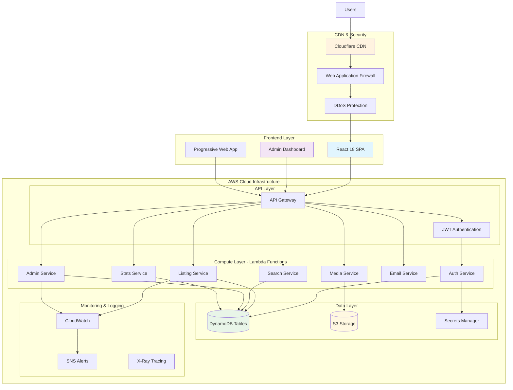
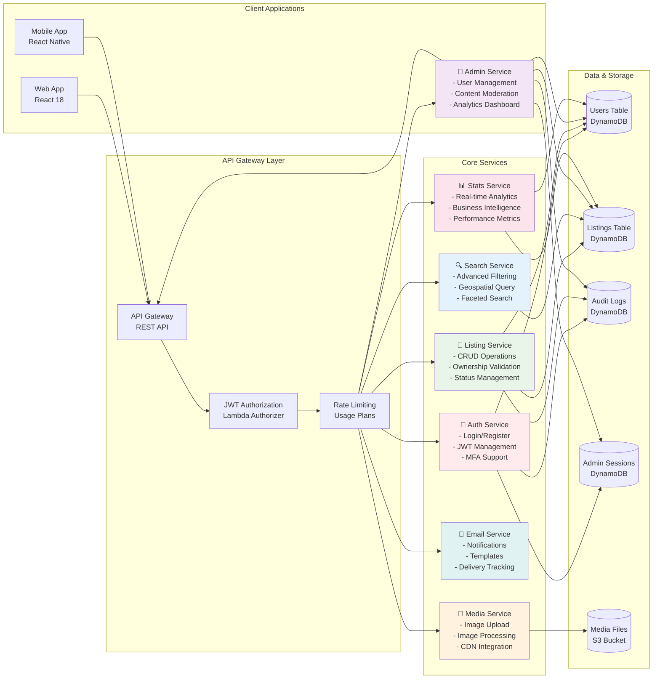
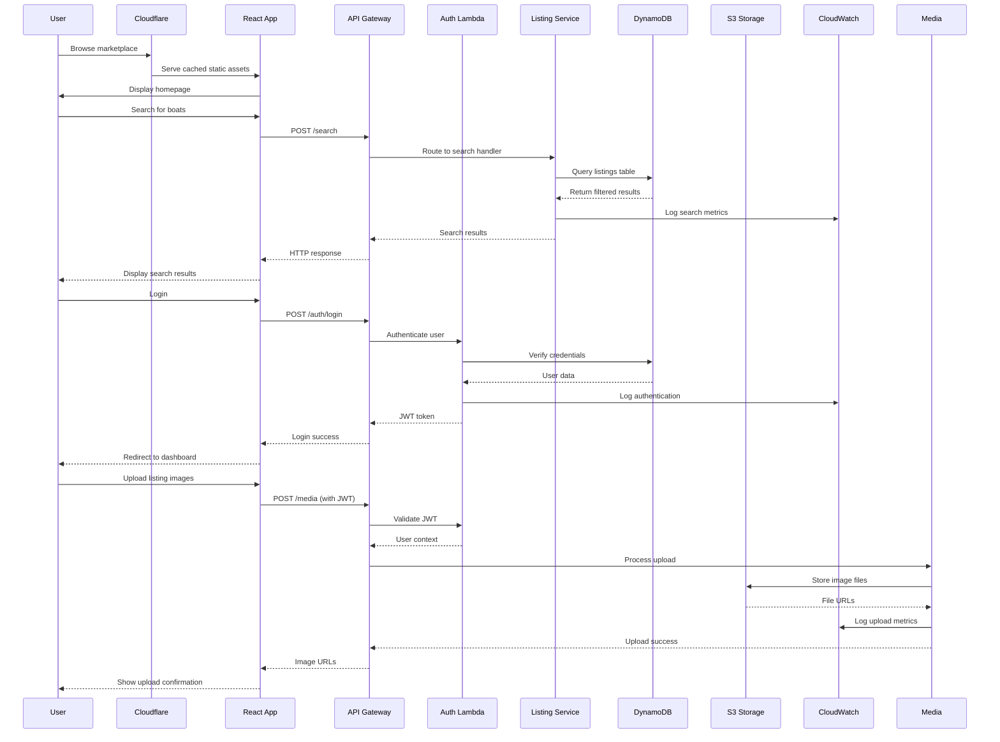
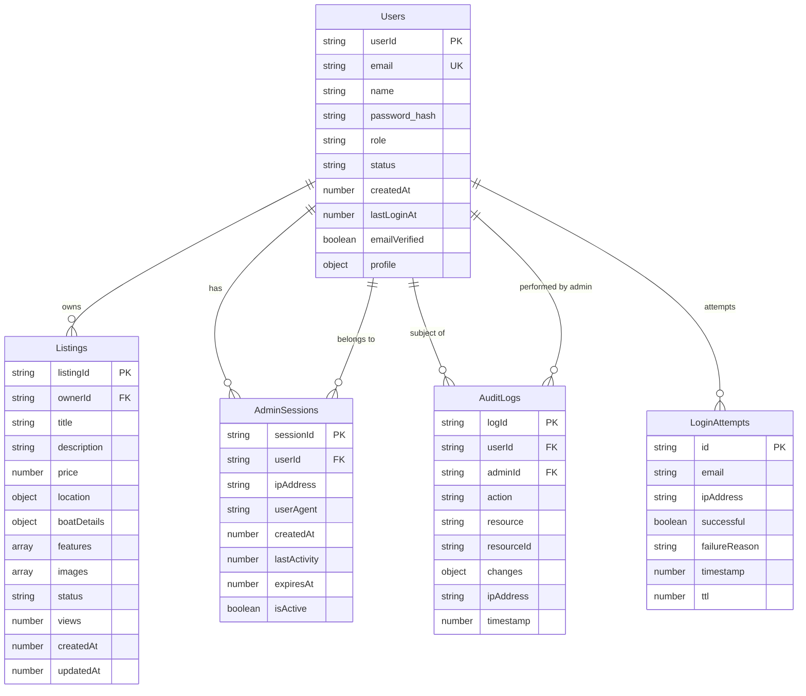
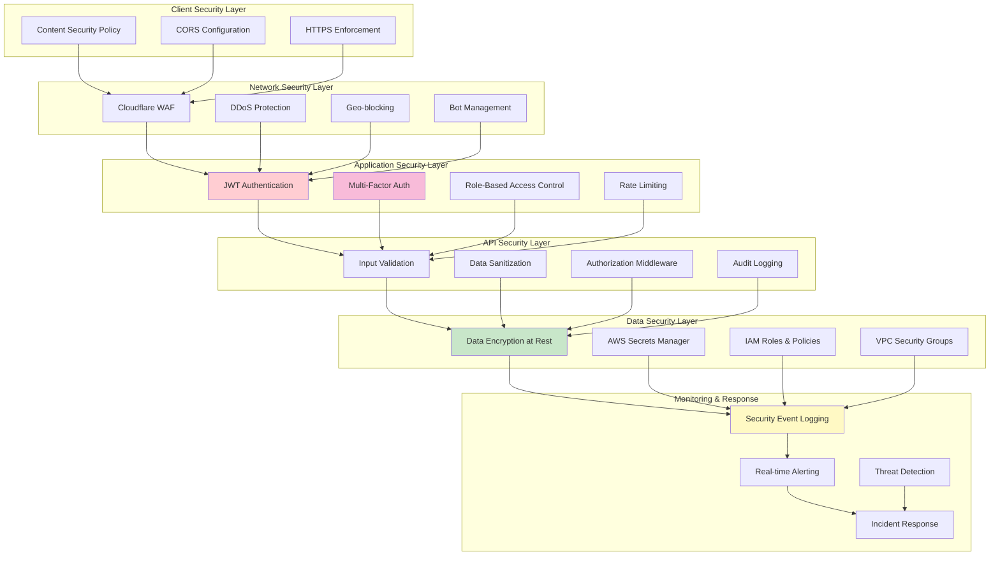
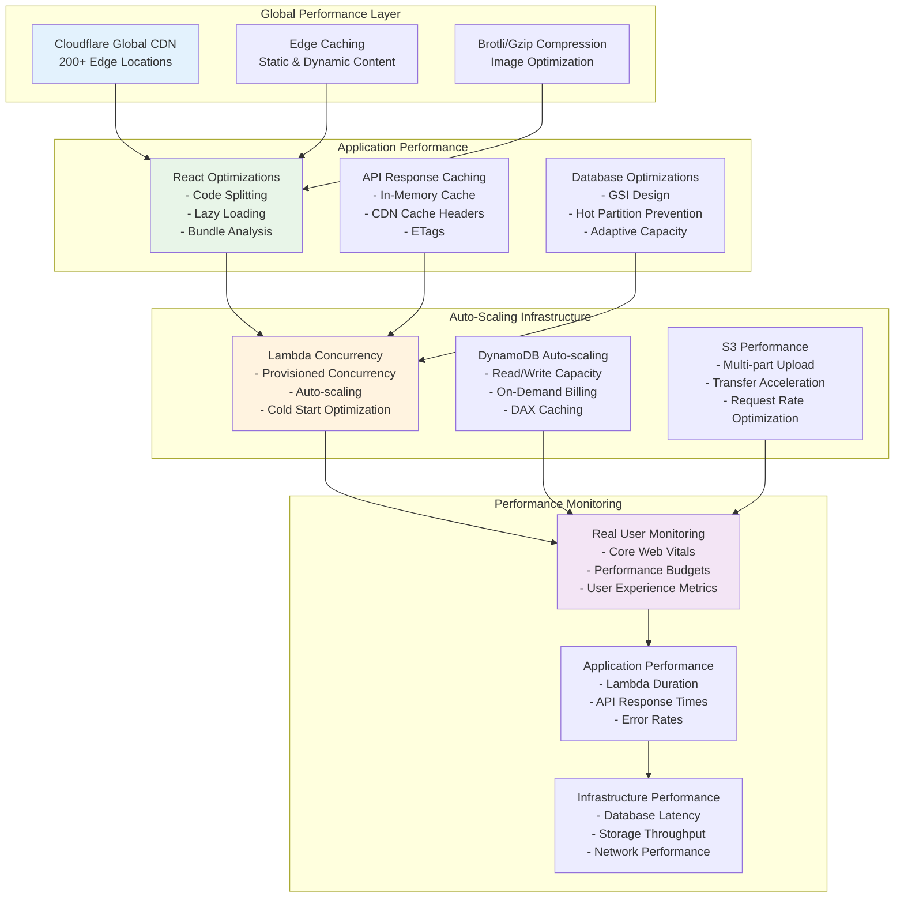
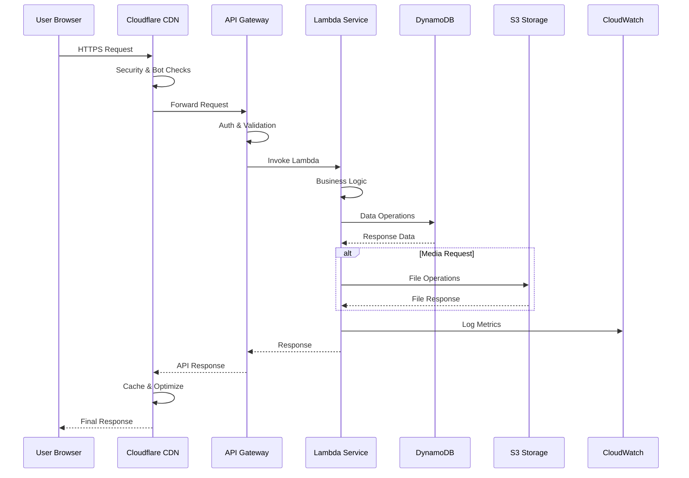
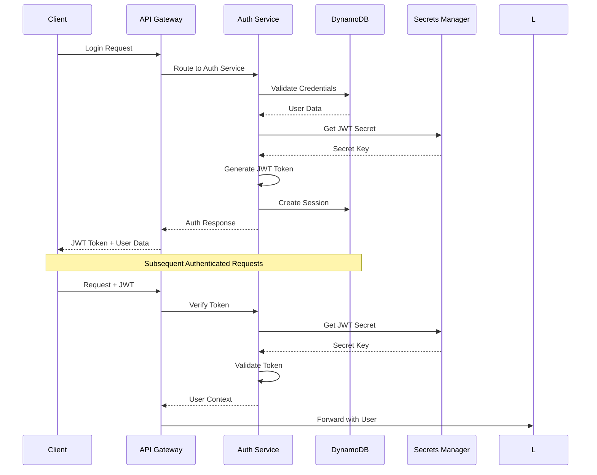

# 🏗️ **HarborList System Architecture**

## � **Complete Architecture Documentation Suite**

### **📖 Architecture Documentation Index**

Our HarborList architecture documentation is organized into specialized sections for comprehensive understanding:

#### **🏗️ Core Architecture**
- **[System Overview](#system-architecture-overview)** - High-level system design and component relationships
- **[Microservices Deep Dive](#microservices-architecture-deep-dive)** - Detailed service architecture and interactions
- **[Data Flow Patterns](#data-flow-architecture)** - End-to-end data movement and processing
- **[Database Design](#database-architecture--design)** - DynamoDB schema and relationships

#### **🔐 Security & Authentication**  
- **[Security Architecture](#security-architecture)** - Multi-layer security implementation
- **[Authentication Workflows](#authentication-state-management)** - JWT, MFA, and session management

#### **🚀 Infrastructure & Deployment**
- **[📄 Infrastructure Architecture](./infrastructure-deployment.md)** - AWS infrastructure, CDK deployment, CI/CD pipelines
- **[Deployment Strategies](./infrastructure-deployment.md#cicd-pipeline-architecture)** - Blue/green deployments, environment management
- **[Multi-Environment Strategy](#multi-environment-architecture)** - Development, staging, and production environments

#### **⚡ Performance & Monitoring**
- **[📄 Performance Architecture](./performance-monitoring.md)** - CDN strategies, database optimization, caching layers  
- **[Monitoring Systems](./performance-monitoring.md#comprehensive-monitoring-architecture)** - Real-time monitoring, alerting, business intelligence
- **[Scalability Patterns](#performance-architecture)** - Auto-scaling and performance targets

#### **🔗 API Architecture**
- **[📄 API Architecture](./api-architecture.md)** - API Gateway design, request flows, authentication patterns
- **[Integration Patterns](./api-architecture.md#api-gateway-structure--request-routing)** - Service communication, data flow orchestration

#### **💰 Cost & Optimization**
- **[Cost Architecture](#cost-optimization-architecture)** - Cost-efficient design patterns and monitoring
- **[Technology Stack](#technology-stack-rationale)** - Technology choices and rationale

#### **🌟 Future Roadmap**
- **[Future Considerations](#future-architecture-considerations)** - Scalability roadmap and technology evolution

---

## 📋 **Architecture Overview**

HarborList is built on a modern, serverless-first architecture leveraging AWS services for scalability, reliability, and cost efficiency. The system follows microservices patterns with clear separation of concerns and robust security implementations.

### **Architecture Principles**

- **🔄 Microservices Design**: Decoupled, single-responsibility services
- **☁️ Serverless-First**: Pay-per-use with automatic scaling
- **🔒 Security by Design**: Multi-layered security with least privilege
- **📊 Observability Built-In**: Comprehensive monitoring and logging
- **🌐 Global Performance**: CDN integration for worldwide users
- **💰 Cost Optimization**: Efficient resource utilization patterns

---

## 🏢 **System Architecture Overview**

### **High-Level System Architecture**



### **Microservices Architecture Deep Dive**



### **Data Flow Architecture**



### **Database Architecture & Relationships**



### **Security Architecture**



### **Deployment Architecture**

```mermaid
graph TB
    subgraph "Development Environment"
        Dev_Code[Local Development]
        Dev_DB[Local DynamoDB]
        Dev_S3[Local S3 (MinIO)]
    end
    
    subgraph "CI/CD Pipeline"
        GitHub[GitHub Repository]
        Actions[GitHub Actions]
        Tests[Automated Testing]
        Security[Security Scanning]
        Build[Build & Package]
    end
    
    subgraph "Staging Environment"
        Staging_CDK[CDK Deploy Staging]
        Staging_API[Staging API Gateway]
        Staging_Lambda[Staging Lambdas]
        Staging_DDB[Staging DynamoDB]
        Staging_S3[Staging S3]
    end
    
    subgraph "Production Environment"
        Prod_CDK[CDK Deploy Production]
        Prod_CF[Cloudflare Production]
        Prod_API[Production API Gateway]
        Prod_Lambda[Production Lambdas]
        Prod_DDB[Production DynamoDB]
        Prod_S3[Production S3]
        Prod_Monitoring[Production Monitoring]
    end
    
    subgraph "Monitoring & Alerting"
        CloudWatch[CloudWatch Dashboards]
        SNS_Alerts[SNS Alerting]
        PagerDuty[PagerDuty Integration]
        Slack[Slack Notifications]
    end
    
    Dev_Code --> GitHub
    GitHub --> Actions
    Actions --> Tests
    Tests --> Security
    Security --> Build
    
    Build --> Staging_CDK
    Staging_CDK --> Staging_API
    Staging_API --> Staging_Lambda
    Staging_Lambda --> Staging_DDB
    Staging_Lambda --> Staging_S3
    
    Staging_Lambda --> Prod_CDK
    Prod_CDK --> Prod_CF
    Prod_CF --> Prod_API
    Prod_API --> Prod_Lambda
    Prod_Lambda --> Prod_DDB
    Prod_Lambda --> Prod_S3
    
    Prod_Lambda --> Prod_Monitoring
    Prod_Monitoring --> CloudWatch
    CloudWatch --> SNS_Alerts
    SNS_Alerts --> PagerDuty
    SNS_Alerts --> Slack
    
    style Actions fill:#e1f5fe
    style Staging_CDK fill:#fff3e0
    style Prod_CDK fill:#e8f5e8
    style CloudWatch fill:#f3e5f5
```

### **Performance & Scalability Architecture**


│  │                                                                       │   │
│  └───────────────────────────────────────────────────────────────────────┘   │
└───────────────────────────────────────────────────────────────────────────────┘
                                      │
                                   HTTPS │
                                      ▼
┌─── API Gateway Layer ─────────────────────────────────────────────────────────┐
│                                                                               │
│  ┌─── AWS API Gateway ──────────────────────────────────────────────────┐    │
│  │                                                                       │    │
│  │  • Request Routing         • CORS Configuration                      │    │
│  │  • Request/Response        • Request Validation                      │    │
│  │    Transformation          • Throttling & Quotas                     │    │
│  │  • Authentication          • Request/Response Caching                │    │
│  │    Integration             • Monitoring & Logging                    │    │
│  │                                                                       │    │
│  └───────────────────────────────────────────────────────────────────────┘    │
└───────────────────────────────────────────────────────────────────────────────┘
                                      │
                            Lambda Invocation │
                                      ▼
┌─── Application Services Layer ────────────────────────────────────────────────┐
│                                                                               │
│  ┌─ Auth Service ──┐  ┌─ Listing Service ─┐  ┌─ Admin Service ──┐           │
│  │                 │  │                   │  │                  │           │
│  │ • User Login    │  │ • CRUD Operations │  │ • User Mgmt      │           │
│  │ • Registration  │  │ • Search & Filter │  │ • Content Review │           │
│  │ • JWT Tokens    │  │ • Media Upload    │  │ • Analytics      │           │
│  │ • MFA Support   │  │ • Validation      │  │ • Audit Logs     │           │
│  │ • Session Mgmt  │  │                   │  │ • System Config  │           │
│  │                 │  │                   │  │                  │           │
│  └─────────────────┘  └───────────────────┘  └──────────────────┘           │
│                                                                               │
│  ┌─ Media Service ──┐  ┌─ Email Service ──┐  ┌─ Stats Service ──┐           │
│  │                  │  │                  │  │                  │           │
│  │ • Image Upload   │  │ • Notifications  │  │ • Platform Stats │           │
│  │ • Processing     │  │ • Welcome Emails │  │ • User Analytics │           │
│  │ • Optimization   │  │ • System Alerts  │  │ • Performance    │           │
│  │ • CDN Integration│  │ • Templates      │  │   Metrics        │           │
│  │                  │  │                  │  │ • Reporting      │           │
│  │                  │  │                  │  │                  │           │
│  └──────────────────┘  └──────────────────┘  └──────────────────┘           │
│                                                                               │
│                     Node.js 18 + TypeScript Lambda Functions                 │
└───────────────────────────────────────────────────────────────────────────────┘
                                      │
                              DynamoDB API │
                                      ▼
┌─── Data Layer ────────────────────────────────────────────────────────────────┐
│                                                                               │
│  ┌─── Amazon DynamoDB ──────────────────────────────────────────────────┐    │
│  │                                                                       │    │
│  │  ┌─ Core Tables ──────────────────────────────────────────────────┐  │    │
│  │  │                                                                 │  │    │
│  │  │ • boat-listings      • boat-users        • boat-reviews       │  │    │
│  │  │ • boat-sessions      • boat-audit-logs   • boat-admin-users   │  │    │
│  │  │ • boat-login-attempts • boat-admin-sessions                    │  │    │
│  │  │                                                                 │  │    │
│  │  └─────────────────────────────────────────────────────────────────┘  │    │
│  │                                                                       │    │
│  │  ┌─ Global Secondary Indexes (GSI) ───────────────────────────────┐  │    │
│  │  │                                                                 │  │    │
│  │  │ • UserEmailIndex     • ListingStatusIndex                      │  │    │
│  │  │ • SessionDeviceIndex • AuditLogResourceIndex                   │  │    │
│  │  │ • AdminRoleIndex     • TimestampIndex                          │  │    │
│  │  │                                                                 │  │    │
│  │  └─────────────────────────────────────────────────────────────────┘  │    │
│  │                                                                       │    │
│  └───────────────────────────────────────────────────────────────────────┘    │
│                                                                               │
│  ┌─── Amazon S3 ─────────────────────────────────────────────────────────┐   │
│  │                                                                       │   │
│  │ • Media Storage          • Static Website Hosting                    │   │
│  │ • Image Processing       • Backup & Archive                          │   │
│  │ • CDN Integration        • Lifecycle Management                      │   │
│  │                                                                       │   │
│  └───────────────────────────────────────────────────────────────────────┘   │
└───────────────────────────────────────────────────────────────────────────────┘
                                      │
                           CloudWatch API │
                                      ▼
┌─── Monitoring & Observability Layer ──────────────────────────────────────────┐
│                                                                               │
│  ┌─── AWS CloudWatch ───────────────────────────────────────────────────┐    │
│  │                                                                       │    │
│  │ • Application Metrics    • Custom Dashboards                         │    │
│  │ • Infrastructure Logs    • Alarm Management                          │    │
│  │ • Performance Tracking   • SNS Notifications                         │    │
│  │ • Error Monitoring       • Cost Tracking                             │    │
│  │                                                                       │    │
│  └───────────────────────────────────────────────────────────────────────┘    │
│                                                                               │
│  ┌─── AWS Secrets Manager ──────────────────────────────────────────────┐    │
│  │                                                                       │    │
│  │ • JWT Secrets            • API Keys                                   │    │
│  │ • Database Credentials   • Third-party Tokens                        │    │
│  │ • Encryption Keys        • Configuration Secrets                     │    │
│  │                                                                       │    │
│  └───────────────────────────────────────────────────────────────────────┘    │
└───────────────────────────────────────────────────────────────────────────────┘
```

---

## 🔄 **Data Flow Architecture**

### **User Request Lifecycle**



### **Authentication Flow**



---

## 🏢 **Microservices Architecture**

### **Service Boundaries & Responsibilities**

| Service | Primary Responsibility | Key Functions | Data Access |
|---------|----------------------|---------------|-------------|
| **Auth Service** | Authentication & Authorization | • User login/logout<br>• JWT token management<br>• MFA verification<br>• Session management | • Users table<br>• Sessions table<br>• Login attempts<br>• Audit logs |
| **Listing Service** | Boat Listing Management | • CRUD operations<br>• Search & filtering<br>• Media integration<br>• Validation | • Listings table<br>• Reviews table<br>• Media references |
| **Admin Service** | Administrative Operations | • User management<br>• Content moderation<br>• Analytics dashboard<br>• System configuration | • All tables (read)<br>• Admin users<br>• Audit logs<br>• System config |
| **Media Service** | File & Media Management | • Image upload/processing<br>• CDN integration<br>• File optimization<br>• Storage management | • S3 buckets<br>• Media metadata<br>• Processing logs |
| **Email Service** | Communication & Notifications | • Welcome emails<br>• System notifications<br>• Alert management<br>• Template rendering | • Email templates<br>• Notification logs<br>• User preferences |
| **Stats Service** | Analytics & Reporting | • Platform metrics<br>• User analytics<br>• Performance tracking<br>• Business intelligence | • All tables (read)<br>• Aggregated data<br>• Metrics storage |

### **Inter-Service Communication**

- **Synchronous**: Direct Lambda invocation for real-time operations
- **Asynchronous**: SQS/SNS for decoupled event processing
- **Data Consistency**: DynamoDB transactions for multi-service operations
- **Error Handling**: Dead letter queues and retry mechanisms

---

## 🔒 **Security Architecture**

### **Multi-Layer Security Model**

```
┌─── External Threats ─────────────────────────────────────────────────┐
│                                                                      │
│ ┌─── Cloudflare Security Layer ─────────────────────────────────┐    │
│ │                                                               │    │
│ │ • DDoS Protection        • Bot Management                     │    │
│ │ • WAF Rules             • Geographic Blocking                 │    │
│ │ • Rate Limiting         • SSL/TLS Termination                 │    │
│ │                                                               │    │
│ └───────────────────────────────────────────────────────────────┘    │
│                                 │                                    │
│                            HTTPS │                                    │
│                                 ▼                                    │
│ ┌─── API Gateway Security ──────────────────────────────────────┐    │
│ │                                                               │    │
│ │ • Request Validation    • CORS Configuration                  │    │
│ │ • Input Sanitization    • Request Size Limits                │    │
│ │ • Authentication        • Response Headers                    │    │
│ │                                                               │    │
│ └───────────────────────────────────────────────────────────────┘    │
│                                 │                                    │
│                        Lambda │                                      │
│                                 ▼                                    │
│ ┌─── Application Security ──────────────────────────────────────┐    │
│ │                                                               │    │
│ │ • JWT Verification      • Role-Based Access Control (RBAC)    │    │
│ │ • Input Validation      • SQL Injection Prevention           │    │
│ │ • XSS Protection        • Business Logic Security            │    │
│ │                                                               │    │
│ └───────────────────────────────────────────────────────────────┘    │
│                                 │                                    │
│                          Data │                                      │
│                                 ▼                                    │
│ ┌─── Data Security ─────────────────────────────────────────────┐    │
│ │                                                               │    │
│ │ • Encryption at Rest    • IAM Policies                       │    │
│ │ • Encryption in Transit • Least Privilege Access             │    │
│ │ • Audit Logging         • Data Classification                │    │
│ │                                                               │    │
│ └───────────────────────────────────────────────────────────────┘    │
└──────────────────────────────────────────────────────────────────────┘
```

### **Authentication & Authorization Matrix**

| Resource | Public Access | User Access | Admin Access | Super Admin |
|----------|---------------|-------------|--------------|-------------|
| **Boat Listings** | Read Only | Read/Write Own | Read/Write All | Full Control |
| **User Profiles** | None | Own Profile | Read All | Full Control |
| **Admin Dashboard** | None | None | Limited Access | Full Access |
| **System Config** | None | None | Read Only | Full Control |
| **Audit Logs** | None | None | Read Own | Read All |
| **Analytics** | None | Basic Stats | Advanced | Full Analytics |

---

## 📊 **Performance Architecture**

### **Scalability Patterns**

- **Auto-Scaling**: Lambda concurrency and DynamoDB on-demand
- **Caching Strategy**: Multi-level caching (CDN, API Gateway, Application)
- **Database Optimization**: GSI design and query pattern optimization
- **CDN Integration**: Global content delivery and edge caching

### **Performance Targets**

| Metric | Target | Measurement |
|--------|--------|-------------|
| **API Response Time** | < 200ms (95th percentile) | CloudWatch metrics |
| **Frontend Load Time** | < 2s (First Contentful Paint) | Real User Monitoring |
| **Database Queries** | < 50ms (average) | DynamoDB metrics |
| **CDN Cache Hit Rate** | > 90% | Cloudflare analytics |
| **Availability** | 99.9% uptime | Multi-region monitoring |

---

## 💰 **Cost Optimization Architecture**

### **Cost-Efficient Design Patterns**

- **Serverless Computing**: Pay-per-execution Lambda functions
- **On-Demand Pricing**: DynamoDB and S3 usage-based billing
- **CDN Optimization**: Cloudflare for reduced bandwidth costs
- **Resource Right-Sizing**: Optimal Lambda memory and timeout configuration

### **Cost Monitoring & Alerts**

- **Budget Tracking**: Automated cost analysis and reporting
- **Usage Optimization**: Regular resource utilization review
- **Alert Thresholds**: Proactive cost overrun notifications
- **Efficiency Metrics**: Cost per transaction and user monitoring

---

## 🌍 **Multi-Environment Architecture**

### **Environment Strategy**

```
┌─── Development Environment ─────────────────────────────────┐
│                                                             │
│ • Minimal resources for cost efficiency                     │
│ • Debug logging and detailed monitoring                     │
│ • Relaxed security for development convenience              │
│ • Synthetic test data and mock integrations                 │
│                                                             │
└─────────────────────────────────────────────────────────────┘
                                │
                     Promotion │
                                ▼
┌─── Staging Environment ─────────────────────────────────────┐
│                                                             │
│ • Production-like configuration and data volume             │
│ • Full security implementation and testing                  │
│ • Performance testing and load simulation                   │
│ • Integration testing with external services                │
│                                                             │
└─────────────────────────────────────────────────────────────┘
                                │
                     Promotion │
                                ▼
┌─── Production Environment ──────────────────────────────────┐
│                                                             │
│ • High availability and disaster recovery                   │
│ • Production monitoring and alerting                        │
│ • Backup and compliance procedures                          │
│ • Performance optimization and auto-scaling                 │
│                                                             │
└─────────────────────────────────────────────────────────────┘
```

---

## 🔧 **Technology Stack Rationale**

### **Frontend Technology Choices**

| Technology | Rationale | Alternatives Considered |
|------------|-----------|------------------------|
| **React 18** | Mature ecosystem, concurrent features, strong TypeScript support | Vue.js, Angular, Svelte |
| **TypeScript** | Type safety, improved developer experience, better refactoring | JavaScript, Flow |
| **Vite** | Fast development builds, modern tooling, excellent HMR | Webpack, Create React App |
| **TanStack Query** | Powerful server state management, caching, background updates | SWR, Apollo Client |
| **Tailwind CSS** | Utility-first, consistent design system, rapid development | Styled Components, CSS Modules |

### **Backend Technology Choices**

| Technology | Rationale | Alternatives Considered |
|------------|-----------|------------------------|
| **AWS Lambda** | Serverless, auto-scaling, cost-effective for variable workloads | ECS, EC2, Google Cloud Functions |
| **Node.js 18** | JavaScript ecosystem, fast I/O, extensive library support | Python, Java, Go |
| **DynamoDB** | Serverless, predictable performance, seamless AWS integration | PostgreSQL, MongoDB, Aurora |
| **API Gateway** | Managed service, built-in throttling, AWS service integration | ALB, Custom Express server |

---

## 📈 **Future Architecture Considerations**

### **Scalability Roadmap**

- **Microservice Decomposition**: Further service splitting as complexity grows
- **Event-Driven Architecture**: Transition to more asynchronous patterns
- **Multi-Region Deployment**: Geographic distribution for global scale
- **Caching Layers**: Advanced caching strategies and cache warming

### **Technology Evolution Path**

- **Edge Computing**: Cloudflare Workers for localized processing
- **Real-Time Features**: WebSocket integration for live updates
- **AI/ML Integration**: Recommendation engines and automated moderation
- **Blockchain Integration**: Potential for ownership verification and transactions

---

**📅 Last Updated**: October 2025  
**📝 Document Version**: 1.0.0  
**👥 Architecture Review Board**: HarborList Technical Team  
**🔄 Next Review**: January 2026