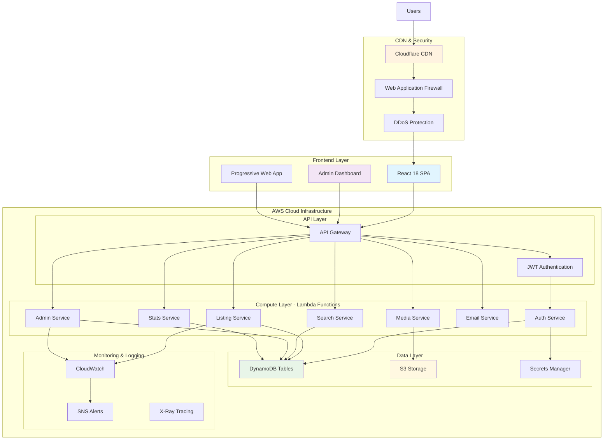
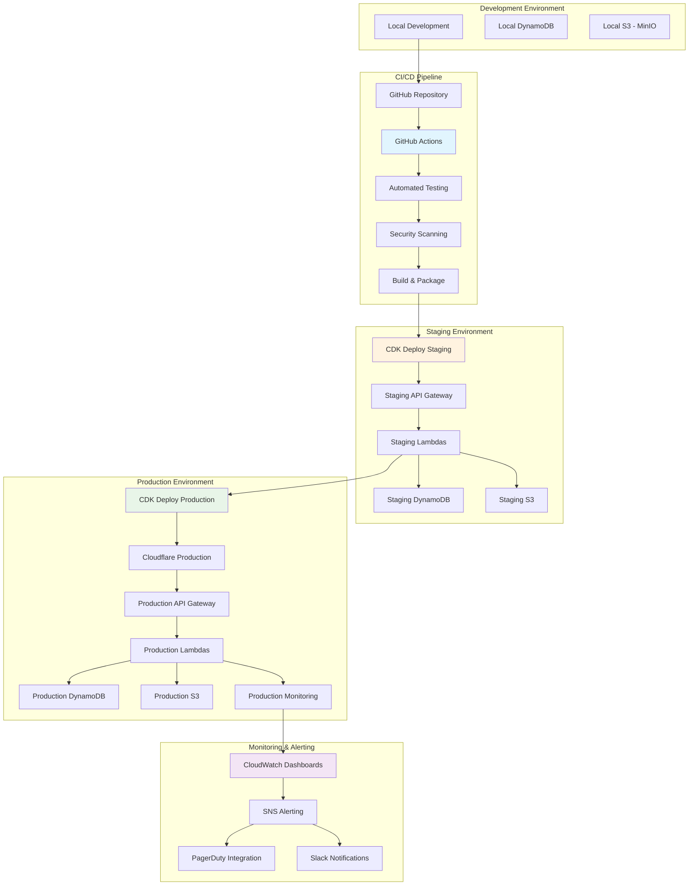

# 🏗️ **HarborList System Architecture**

## � **Complete Architecture Documentation Suite**

### **📖 Architecture Documentation Index**

Our HarborList architecture documentation is organized into specialized sections for comprehensive understanding:

#### **🏗️ Core Architecture**
- **[System Overview](#system-architecture-overview)** - High-level system design and component relationships
- **[Microservices Deep Dive](#microservices-architecture-deep-dive)** - Detailed service architecture and interactions
- **[Data Flow Patterns](#data-flow-architecture)** - End-to-end data movement and processing
- **[Database Design](#database-architecture--design)** - DynamoDB schema and relationships

#### **🔐 Security & Authentication**  
- **[Security Architecture](#security-architecture)** - Multi-layer security implementation
- **[Authentication Workflows](#authentication-state-management)** - JWT, MFA, and session management

#### **🚀 Infrastructure & Deployment**
- **[📄 Infrastructure Architecture](./infrastructure-deployment.md)** - AWS infrastructure, CDK deployment, CI/CD pipelines
- **[Deployment Strategies](./infrastructure-deployment.md#cicd-pipeline-architecture)** - Blue/green deployments, environment management
- **[Multi-Environment Strategy](#multi-environment-architecture)** - Development, staging, and production environments

#### **⚡ Performance & Monitoring**
- **[📄 Performance Architecture](./performance-monitoring.md)** - CDN strategies, database optimization, caching layers  
- **[Monitoring Systems](./performance-monitoring.md#comprehensive-monitoring-architecture)** - Real-time monitoring, alerting, business intelligence
- **[Scalability Patterns](#performance-architecture)** - Auto-scaling and performance targets

#### **🔗 API Architecture**
- **[📄 API Architecture](./api-architecture.md)** - API Gateway design, request flows, authentication patterns
- **[Integration Patterns](./api-architecture.md#api-gateway-structure--request-routing)** - Service communication, data flow orchestration

#### **💰 Cost & Optimization**
- **[Cost Architecture](#cost-optimization-architecture)** - Cost-efficient design patterns and monitoring
- **[Technology Stack](#technology-stack-rationale)** - Technology choices and rationale

#### **🌟 Future Roadmap**
- **[Future Considerations](#future-architecture-considerations)** - Scalability roadmap and technology evolution

---

## 📋 **Architecture Overview**

HarborList is built on a modern, serverless-first architecture leveraging AWS services for scalability, reliability, and cost efficiency. The system follows microservices patterns with clear separation of concerns and robust security implementations.

### **Architecture Principles**

- **🔄 Microservices Design**: Decoupled, single-responsibility services
- **☁️ Serverless-First**: Pay-per-use with automatic scaling
- **🔒 Security by Design**: Multi-layered security with least privilege
- **📊 Observability Built-In**: Comprehensive monitoring and logging
- **🌐 Global Performance**: CDN integration for worldwide users
- **💰 Cost Optimization**: Efficient resource utilization patterns

---

## 🏢 **System Architecture Overview**

### **High-Level System Architecture**



### **Microservices Architecture Deep Dive**

```mermaid
graph LR
    subgraph "Client Applications"
        Web[Web App<br/>React 18]
        Mobile[Mobile App<br/>React Native]
        Admin[Admin Portal<br/>React Dashboard]
    end
    
    subgraph "API Gateway Layer"
        Gateway[API Gateway<br/>REST API]
        AuthZ[JWT Authorization<br/>Lambda Authorizer]
        RateLimit[Rate Limiting<br/>Usage Plans]
    end
    
    subgraph "Core Services"
        Auth[🔐 Auth Service<br/>- Login/Register<br/>- JWT Management<br/>- MFA Support]
        
        Listing[🚢 Listing Service<br/>- CRUD Operations<br/>- Ownership Validation<br/>- Status Management]
        
        Search[🔍 Search Service<br/>- Advanced Filtering<br/>- Geospatial Query<br/>- Faceted Search]
        
        Admin[👤 Admin Service<br/>- User Management<br/>- Content Moderation<br/>- Analytics Dashboard]
        
        Media[📸 Media Service<br/>- Image Upload<br/>- Image Processing<br/>- CDN Integration]
        
        Email[📧 Email Service<br/>- Notifications<br/>- Templates<br/>- Delivery Tracking]
        
        Stats[📊 Stats Service<br/>- Real-time Analytics<br/>- Business Intelligence<br/>- Performance Metrics]
    end
    
    subgraph "Data & Storage"
        Users[Users Table<br/>DynamoDB]
        Listings[Listings Table<br/>DynamoDB]
        AuditLogs[Audit Logs<br/>DynamoDB]
        Sessions[Admin Sessions<br/>DynamoDB]
        MediaBucket[Media Files<br/>S3 Bucket]
    end
    
    Web --> Gateway
    Mobile --> Gateway
    Admin --> Gateway
    
    Gateway --> AuthZ
    AuthZ --> RateLimit
    
    RateLimit --> Auth
    RateLimit --> Listing
    RateLimit --> Search
    RateLimit --> Admin
    RateLimit --> Media
    RateLimit --> Email
    RateLimit --> Stats
    
    Auth --> Users
    Auth --> Sessions
    Auth --> AuditLogs
    
    Listing --> Listings
    Listing --> Users
    Listing --> AuditLogs
    
    Search --> Listings
    
    Admin --> Users
    Admin --> Listings
    Admin --> AuditLogs
    Admin --> Sessions
    
    Media --> MediaBucket
    
    Stats --> Users
    Stats --> Listings
    
    style Auth fill:#ffebee
    style Listing fill:#e8f5e8
    style Search fill:#e3f2fd
    style Admin fill:#f3e5f5
    style Media fill:#fff3e0
    style Email fill:#e0f2f1
    style Stats fill:#fce4ec
```



### **Data Flow Architecture**


### **Database Architecture & Relationships**


### **Security Architecture**


### **Deployment Architecture**



### **Performance & Scalability Architecture**

```mermaid
graph TB
    subgraph "Global Performance Layer"
        CloudFlare[Cloudflare Global CDN<br/>200+ Edge Locations]
        EdgeCache[Edge Caching<br/>Static & Dynamic Content]
        Compression[Brotli/Gzip Compression<br/>Image Optimization]
    end
    
    subgraph "Application Performance"
        ReactOpt[React Optimizations<br/>- Code Splitting<br/>- Lazy Loading<br/>- Bundle Analysis]
        APICache[API Response Caching<br/>- In-Memory Cache<br/>- CDN Cache Headers<br/>- ETags]
        DatabaseOpt[Database Optimizations<br/>- GSI Design<br/>- Hot Partition Prevention<br/>- Adaptive Capacity]
    end
    
    subgraph "Auto-Scaling Infrastructure"
        LambdaConcurrency[Lambda Concurrency<br/>- Provisioned Concurrency<br/>- Auto-scaling<br/>- Cold Start Optimization]
        DynamoScaling[DynamoDB Auto-scaling<br/>- Read/Write Capacity<br/>- On-Demand Billing<br/>- DAX Caching]
        S3Performance[S3 Performance<br/>- Multi-part Upload<br/>- Transfer Acceleration<br/>- Request Rate Optimization]
    end
    
    subgraph "Performance Monitoring"
        RealUserMonitoring[Real User Monitoring<br/>- Core Web Vitals<br/>- Performance Budgets<br/>- User Experience Metrics]
        ApplicationPerf[Application Performance<br/>- Lambda Duration<br/>- API Response Times<br/>- Error Rates]
        InfrastructurePerf[Infrastructure Performance<br/>- Database Latency<br/>- Storage Throughput<br/>- Network Performance]
    end
    
    CloudFlare --> ReactOpt
    EdgeCache --> ReactOpt
    Compression --> ReactOpt
    
    ReactOpt --> LambdaConcurrency
    APICache --> LambdaConcurrency
    DatabaseOpt --> LambdaConcurrency
    
    LambdaConcurrency --> RealUserMonitoring
    DynamoScaling --> RealUserMonitoring
    S3Performance --> RealUserMonitoring
    
    RealUserMonitoring --> ApplicationPerf
    ApplicationPerf --> InfrastructurePerf
    
    style CloudFlare fill:#e3f2fd
    style ReactOpt fill:#e8f5e8
    style LambdaConcurrency fill:#fff3e0
    style RealUserMonitoring fill:#f3e5f5
### **Complete System Architecture Overview**

```mermaid
graph TB
    subgraph "Frontend Layer"
        UI[React 18 SPA<br/>• Modern Hooks<br/>• TypeScript<br/>• PWA Support]
        Admin[Admin Dashboard<br/>• User Management<br/>• Analytics<br/>• Content Moderation]
    end
    
    subgraph "CDN & Security Layer"
        CF[Cloudflare CDN<br/>• 200+ Edge Locations<br/>• DDoS Protection<br/>• WAF & Bot Management]
        Security[Security Features<br/>• Rate Limiting<br/>• IP Filtering<br/>• Geographic Blocking]
    end
    
    subgraph "AWS Infrastructure"
        subgraph "API Layer"
            APIGW[API Gateway<br/>• Request Routing<br/>• Authentication<br/>• Rate Limiting<br/>• CORS & Validation]
        end
        
        subgraph "Application Services"
            Auth[🔐 Auth Service<br/>• Login/Register<br/>• JWT Management<br/>• MFA Support<br/>• Session Management]
            
            Listing[🚢 Listing Service<br/>• CRUD Operations<br/>• Search & Filter<br/>• Media Integration<br/>• Validation]
            
            Admin2[👤 Admin Service<br/>• User Management<br/>• Content Review<br/>• Analytics Dashboard<br/>• System Config]
            
            Media[📸 Media Service<br/>• Image Upload<br/>• Processing<br/>• CDN Integration<br/>• Optimization]
            
            Email[📧 Email Service<br/>• Notifications<br/>• Welcome Emails<br/>• System Alerts<br/>• Templates]
            
            Stats[📊 Stats Service<br/>• Platform Metrics<br/>• User Analytics<br/>• Performance Tracking<br/>• Business Intelligence]
        end
        
        subgraph "Data Layer"
            DDB[DynamoDB<br/>• Core Tables<br/>• Global Secondary Indexes<br/>• Auto-scaling<br/>• Point-in-time Recovery]
            
            S3[S3 Storage<br/>• Media Files<br/>• Static Hosting<br/>• Backup & Archive<br/>• Lifecycle Management]
        end
        
        subgraph "Monitoring & Security"
            CW[CloudWatch<br/>• Application Metrics<br/>• Infrastructure Logs<br/>• Custom Dashboards<br/>• Alarm Management]
            
            Secrets[Secrets Manager<br/>• JWT Secrets<br/>• API Keys<br/>• Database Credentials<br/>• Encryption Keys]
        end
    end
    
    %% User Flow
    Users[Users] --> CF
    CF --> Security
    Security --> UI
    Security --> Admin
    
    %% API Flow
    UI --> APIGW
    Admin --> APIGW
    
    %% Service Routing
    APIGW --> Auth
    APIGW --> Listing
    APIGW --> Admin2
    APIGW --> Media
    APIGW --> Email
    APIGW --> Stats
    
    %% Data Access
    Auth --> DDB
    Listing --> DDB
    Admin2 --> DDB
    Stats --> DDB
    
    Media --> S3
    
    %% Security & Monitoring
    Auth --> Secrets
    Auth --> CW
    Listing --> CW
    Admin2 --> CW
    Media --> CW
    Email --> CW
    Stats --> CW
    
    %% Styling
    style UI fill:#e1f5fe,stroke:#01579b,stroke-width:2px
    style Admin fill:#f3e5f5,stroke:#4a148c,stroke-width:2px
    style CF fill:#fff3e0,stroke:#e65100,stroke-width:2px
    style Auth fill:#ffebee,stroke:#c62828,stroke-width:2px
    style Listing fill:#e8f5e8,stroke:#2e7d32,stroke-width:2px
    style Admin2 fill:#f3e5f5,stroke:#6a1b9a,stroke-width:2px
    style Media fill:#fff8e1,stroke:#f57f17,stroke-width:2px
    style Email fill:#e0f2f1,stroke:#00695c,stroke-width:2px
    style Stats fill:#fce4ec,stroke:#ad1457,stroke-width:2px
    style DDB fill:#e8f5e8,stroke:#388e3c,stroke-width:2px
    style S3 fill:#fff8e1,stroke:#f9a825,stroke-width:2px
    style CW fill:#e3f2fd,stroke:#1565c0,stroke-width:2px
    style Secrets fill:#fce4ec,stroke:#c2185b,stroke-width:2px
```

### **Database Architecture & Table Relationships**

```mermaid
graph LR
    subgraph "Core Tables"
        Users[boat-users<br/>• User profiles<br/>• Authentication data<br/>• Preferences]
        Listings[boat-listings<br/>• Boat details<br/>• Pricing & availability<br/>• Media references]
        Reviews[boat-reviews<br/>• User feedback<br/>• Ratings<br/>• Comments]
        Sessions[boat-sessions<br/>• Active sessions<br/>• Device tracking<br/>• Expiration]
        AuditLogs[boat-audit-logs<br/>• System actions<br/>• User activities<br/>• Admin operations]
        AdminUsers[boat-admin-users<br/>• Admin accounts<br/>• Permissions<br/>• Role assignments]
        LoginAttempts[boat-login-attempts<br/>• Security tracking<br/>• Failed attempts<br/>• IP monitoring]
    end
    
    subgraph "Global Secondary Indexes"
        UserEmail[UserEmailIndex<br/>• Fast user lookup<br/>• Email verification]
        ListingStatus[ListingStatusIndex<br/>• Active listings<br/>• Status filtering]
        SessionDevice[SessionDeviceIndex<br/>• Device management<br/>• Multi-session tracking]
        AuditResource[AuditLogResourceIndex<br/>• Resource-based queries<br/>• Compliance reporting]
        AdminRole[AdminRoleIndex<br/>• Role-based access<br/>• Permission queries]
        Timestamp[TimestampIndex<br/>• Time-based queries<br/>• Analytics support]
    end
    
    %% Relationships
    Users -.-> UserEmail
    Listings -.-> ListingStatus
    Sessions -.-> SessionDevice
    AuditLogs -.-> AuditResource
    AdminUsers -.-> AdminRole
    AuditLogs -.-> Timestamp
    
    style Users fill:#e3f2fd,stroke:#1565c0,stroke-width:2px
    style Listings fill:#e8f5e8,stroke:#388e3c,stroke-width:2px
    style Reviews fill:#fff3e0,stroke:#f57c00,stroke-width:2px
    style Sessions fill:#fce4ec,stroke:#c2185b,stroke-width:2px
    style AuditLogs fill:#f3e5f5,stroke:#7b1fa2,stroke-width:2px
    style AdminUsers fill:#ffebee,stroke:#d32f2f,stroke-width:2px
    style LoginAttempts fill:#e0f2f1,stroke:#00796b,stroke-width:2px
```



---

## 🔄 **Data Flow Architecture**

### **User Request Lifecycle**


### **Authentication Flow**


---

## 🏢 **Microservices Architecture**

### **Service Boundaries & Responsibilities**

| Service | Primary Responsibility | Key Functions | Data Access |
|---------|----------------------|---------------|-------------|
| **Auth Service** | Authentication & Authorization | • User login/logout<br>• JWT token management<br>• MFA verification<br>• Session management | • Users table<br>• Sessions table<br>• Login attempts<br>• Audit logs |
| **Listing Service** | Boat Listing Management | • CRUD operations<br>• Search & filtering<br>• Media integration<br>• Validation | • Listings table<br>• Reviews table<br>• Media references |
| **Admin Service** | Administrative Operations | • User management<br>• Content moderation<br>• Analytics dashboard<br>• System configuration | • All tables (read)<br>• Admin users<br>• Audit logs<br>• System config |
| **Media Service** | File & Media Management | • Image upload/processing<br>• CDN integration<br>• File optimization<br>• Storage management | • S3 buckets<br>• Media metadata<br>• Processing logs |
| **Email Service** | Communication & Notifications | • Welcome emails<br>• System notifications<br>• Alert management<br>• Template rendering | • Email templates<br>• Notification logs<br>• User preferences |
| **Stats Service** | Analytics & Reporting | • Platform metrics<br>• User analytics<br>• Performance tracking<br>• Business intelligence | • All tables (read)<br>• Aggregated data<br>• Metrics storage |

### **Inter-Service Communication**

- **Synchronous**: Direct Lambda invocation for real-time operations
- **Asynchronous**: SQS/SNS for decoupled event processing
- **Data Consistency**: DynamoDB transactions for multi-service operations
- **Error Handling**: Dead letter queues and retry mechanisms

---

## 🔒 **Security Architecture**

### **Multi-Layer Security Model**

### **Multi-Layer Security Architecture**

```mermaid
graph TB
    subgraph "External Threats"
        Threats[🚨 Security Threats<br/>• DDoS Attacks<br/>• Bot Traffic<br/>• Malicious Requests<br/>• Geographic Attacks]
    end
    
    subgraph "Cloudflare Security Layer"
        CF_Security[🛡️ Cloudflare Protection<br/>• DDoS Protection<br/>• WAF Rules<br/>• Bot Management<br/>• Geographic Blocking<br/>• Rate Limiting<br/>• SSL/TLS Termination]
    end
    
    subgraph "API Gateway Security"
        API_Security[🔒 API Gateway<br/>• Request Validation<br/>• Input Sanitization<br/>• CORS Configuration<br/>• Request Size Limits<br/>• Authentication<br/>• Response Headers]
    end
    
    subgraph "Application Security"
        App_Security[⚡ Lambda Security<br/>• JWT Verification<br/>• Role-Based Access Control<br/>• Input Validation<br/>• SQL Injection Prevention<br/>• XSS Protection<br/>• Business Logic Security]
    end
    
    subgraph "Data Security"
        Data_Security[🗄️ Data Protection<br/>• Encryption at Rest<br/>• Encryption in Transit<br/>• IAM Policies<br/>• Least Privilege Access<br/>• Audit Logging<br/>• Data Classification]
    end
    
    subgraph "Monitoring & Response"
        Security_Monitoring[📊 Security Monitoring<br/>• Real-time Alerts<br/>• Threat Detection<br/>• Incident Response<br/>• Compliance Reporting<br/>• Security Metrics]
    end
    
    %% Flow
    Threats --> CF_Security
    CF_Security --> API_Security
    API_Security --> App_Security
    App_Security --> Data_Security
    Data_Security --> Security_Monitoring
    
    %% Feedback loops
    Security_Monitoring -.-> CF_Security
    Security_Monitoring -.-> API_Security
    Security_Monitoring -.-> App_Security
    
    %% Styling
    style Threats fill:#ffcdd2,stroke:#d32f2f,stroke-width:3px
    style CF_Security fill:#e8f5e8,stroke:#388e3c,stroke-width:2px
    style API_Security fill:#e3f2fd,stroke:#1565c0,stroke-width:2px
    style App_Security fill:#fff3e0,stroke:#f57c00,stroke-width:2px
    style Data_Security fill:#f3e5f5,stroke:#7b1fa2,stroke-width:2px
    style Security_Monitoring fill:#e0f2f1,stroke:#00796b,stroke-width:2px
```



### **Authentication & Authorization Matrix**

| Resource | Public Access | User Access | Admin Access | Super Admin |
|----------|---------------|-------------|--------------|-------------|
| **Boat Listings** | Read Only | Read/Write Own | Read/Write All | Full Control |
| **User Profiles** | None | Own Profile | Read All | Full Control |
| **Admin Dashboard** | None | None | Limited Access | Full Access |
| **System Config** | None | None | Read Only | Full Control |
| **Audit Logs** | None | None | Read Own | Read All |
| **Analytics** | None | Basic Stats | Advanced | Full Analytics |

---

## 📊 **Performance Architecture**

### **Scalability Patterns**

- **Auto-Scaling**: Lambda concurrency and DynamoDB on-demand
- **Caching Strategy**: Multi-level caching (CDN, API Gateway, Application)
- **Database Optimization**: GSI design and query pattern optimization
- **CDN Integration**: Global content delivery and edge caching

### **Performance Targets**

| Metric | Target | Measurement |
|--------|--------|-------------|
| **API Response Time** | < 200ms (95th percentile) | CloudWatch metrics |
| **Frontend Load Time** | < 2s (First Contentful Paint) | Real User Monitoring |
| **Database Queries** | < 50ms (average) | DynamoDB metrics |
| **CDN Cache Hit Rate** | > 90% | Cloudflare analytics |
| **Availability** | 99.9% uptime | Multi-region monitoring |

---

## 💰 **Cost Optimization Architecture**

### **Cost-Efficient Design Patterns**

- **Serverless Computing**: Pay-per-execution Lambda functions
- **On-Demand Pricing**: DynamoDB and S3 usage-based billing
- **CDN Optimization**: Cloudflare for reduced bandwidth costs
- **Resource Right-Sizing**: Optimal Lambda memory and timeout configuration

### **Cost Monitoring & Alerts**

- **Budget Tracking**: Automated cost analysis and reporting
- **Usage Optimization**: Regular resource utilization review
- **Alert Thresholds**: Proactive cost overrun notifications
- **Efficiency Metrics**: Cost per transaction and user monitoring

---

## 🌍 **Multi-Environment Architecture**

### **Environment Strategy**

### **Multi-Environment Strategy**

```mermaid
graph TD
    subgraph "Development Environment"
        Dev[🔧 Development<br/>• Minimal Resources<br/>• Debug Logging<br/>• Relaxed Security<br/>• Mock Integrations<br/>• Synthetic Data]
    end
    
    subgraph "Staging Environment"
        Staging[🧪 Staging<br/>• Production-like Config<br/>• Full Security Testing<br/>• Performance Testing<br/>• Integration Testing<br/>• Load Simulation]
    end
    
    subgraph "Production Environment"
        Prod[🚀 Production<br/>• High Availability<br/>• Disaster Recovery<br/>• Production Monitoring<br/>• Auto-scaling<br/>• Compliance Procedures]
    end
    
    subgraph "CI/CD Pipeline"
        Pipeline[⚙️ Automated Pipeline<br/>• Code Quality Checks<br/>• Security Scanning<br/>• Automated Testing<br/>• Deployment Automation<br/>• Rollback Capabilities]
    end
    
    Dev -->|"Promotion"| Staging
    Staging -->|"Promotion"| Prod
    Pipeline -.->|Manages| Dev
    Pipeline -.->|Manages| Staging
    Pipeline -.->|Manages| Prod
    
    style Dev fill:#e3f2fd,stroke:#1565c0,stroke-width:2px
    style Staging fill:#fff3e0,stroke:#f57c00,stroke-width:2px
    style Prod fill:#e8f5e8,stroke:#388e3c,stroke-width:2px
    style Pipeline fill:#f3e5f5,stroke:#7b1fa2,stroke-width:2px
```



---

## 📋 **Architecture Summary**

### **Key Architecture Benefits**

✅ **Scalability**: Serverless architecture with automatic scaling  
✅ **Security**: Multi-layer security with comprehensive protection  
✅ **Performance**: Global CDN with edge caching and optimization  
✅ **Reliability**: High availability with disaster recovery  
✅ **Cost Efficiency**: Pay-per-use model with resource optimization  
✅ **Maintainability**: Microservices with clear separation of concerns  
✅ **Observability**: Comprehensive monitoring and logging  
✅ **Compliance**: Built-in audit trails and security controls  

### **Technology Stack Summary**

| Layer | Technologies | Purpose |
|-------|-------------|---------|
| **Frontend** | React 18, TypeScript, PWA | Modern user interface |
| **CDN** | Cloudflare | Global content delivery & security |
| **API** | AWS API Gateway | Request routing & authentication |
| **Compute** | AWS Lambda (Node.js 18) | Serverless application logic |
| **Database** | DynamoDB | NoSQL data storage |
| **Storage** | S3 | Media files & static assets |
| **Security** | AWS Secrets Manager, IAM | Credential & access management |
| **Monitoring** | CloudWatch, X-Ray | Observability & performance |
| **Deployment** | AWS CDK, GitHub Actions | Infrastructure as code & CI/CD |

### **Next Steps**

1. **Review** the detailed architecture documents in each specialized section
2. **Implement** following the microservices patterns outlined
3. **Monitor** using the observability patterns described
4. **Scale** using the performance optimization strategies
5. **Secure** following the multi-layer security model

---

## 🔧 **Technology Stack Rationale**

### **Frontend Technology Choices**

| Technology | Rationale | Alternatives Considered |
|------------|-----------|------------------------|
| **React 18** | Mature ecosystem, concurrent features, strong TypeScript support | Vue.js, Angular, Svelte |
| **TypeScript** | Type safety, improved developer experience, better refactoring | JavaScript, Flow |
| **Vite** | Fast development builds, modern tooling, excellent HMR | Webpack, Create React App |
| **TanStack Query** | Powerful server state management, caching, background updates | SWR, Apollo Client |
| **Tailwind CSS** | Utility-first, consistent design system, rapid development | Styled Components, CSS Modules |

### **Backend Technology Choices**

| Technology | Rationale | Alternatives Considered |
|------------|-----------|------------------------|
| **AWS Lambda** | Serverless, auto-scaling, cost-effective for variable workloads | ECS, EC2, Google Cloud Functions |
| **Node.js 18** | JavaScript ecosystem, fast I/O, extensive library support | Python, Java, Go |
| **DynamoDB** | Serverless, predictable performance, seamless AWS integration | PostgreSQL, MongoDB, Aurora |
| **API Gateway** | Managed service, built-in throttling, AWS service integration | ALB, Custom Express server |

---

## 📈 **Future Architecture Considerations**

### **Scalability Roadmap**

- **Microservice Decomposition**: Further service splitting as complexity grows
- **Event-Driven Architecture**: Transition to more asynchronous patterns
- **Multi-Region Deployment**: Geographic distribution for global scale
- **Caching Layers**: Advanced caching strategies and cache warming

### **Technology Evolution Path**

- **Edge Computing**: Cloudflare Workers for localized processing
- **Real-Time Features**: WebSocket integration for live updates
- **AI/ML Integration**: Recommendation engines and automated moderation
- **Blockchain Integration**: Potential for ownership verification and transactions

---

**📅 Last Updated**: October 2025  
**📝 Document Version**: 1.0.0  
**👥 Architecture Review Board**: HarborList Technical Team  
**🔄 Next Review**: January 2026