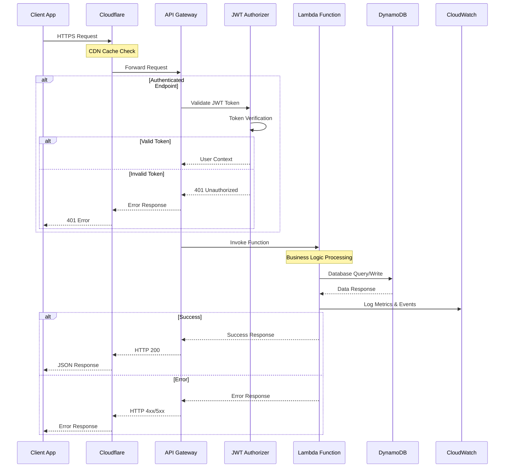
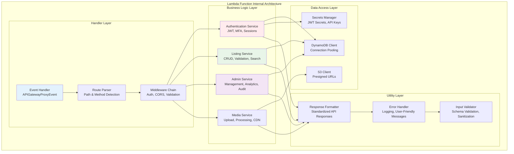
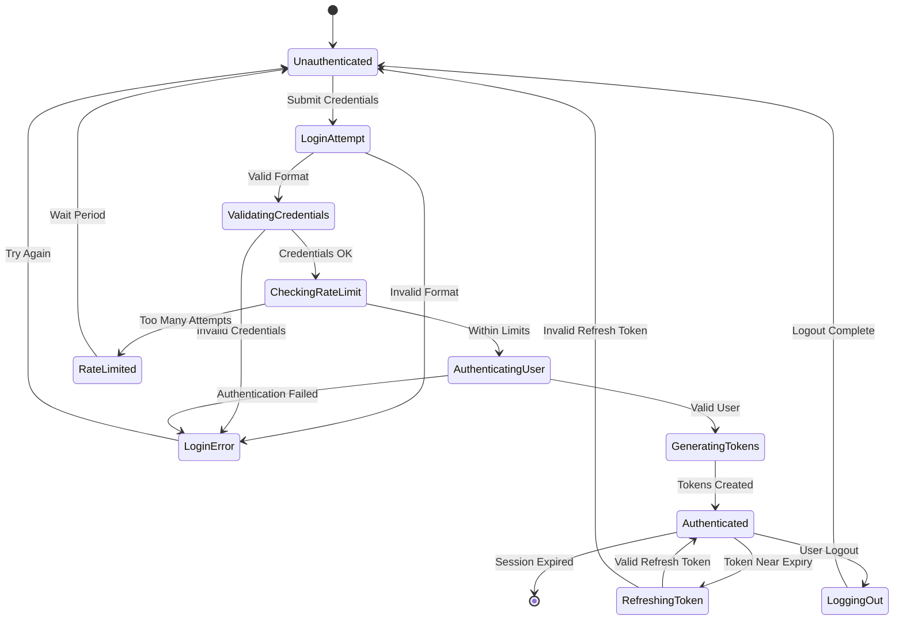
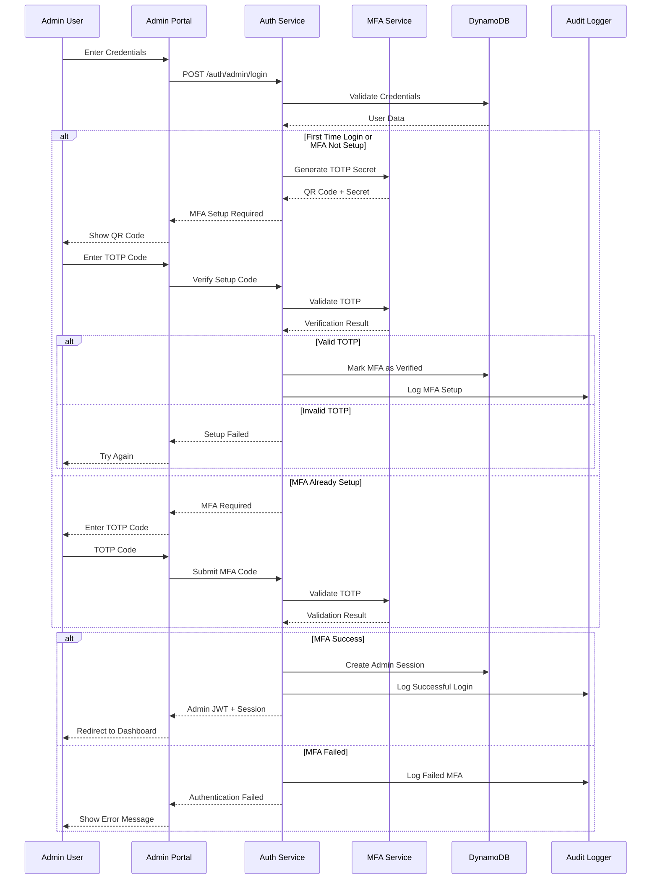
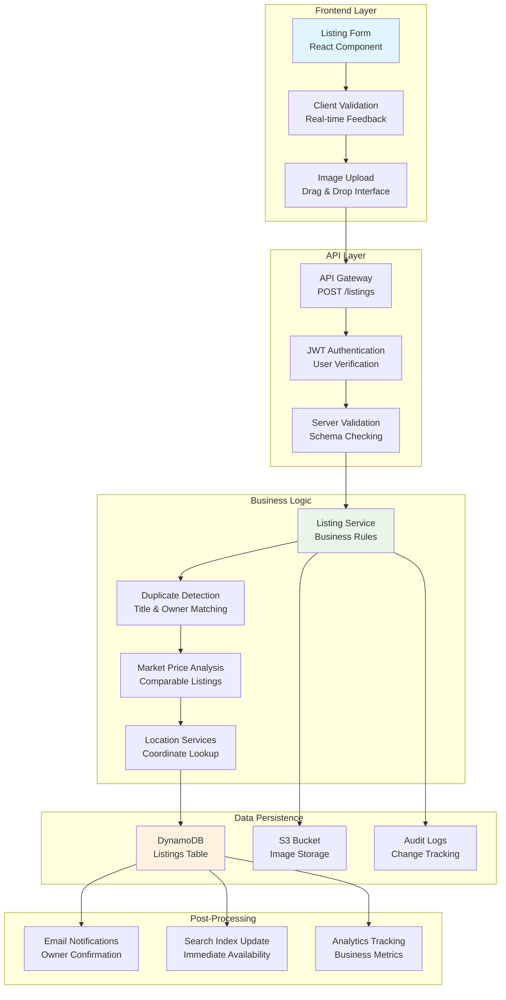
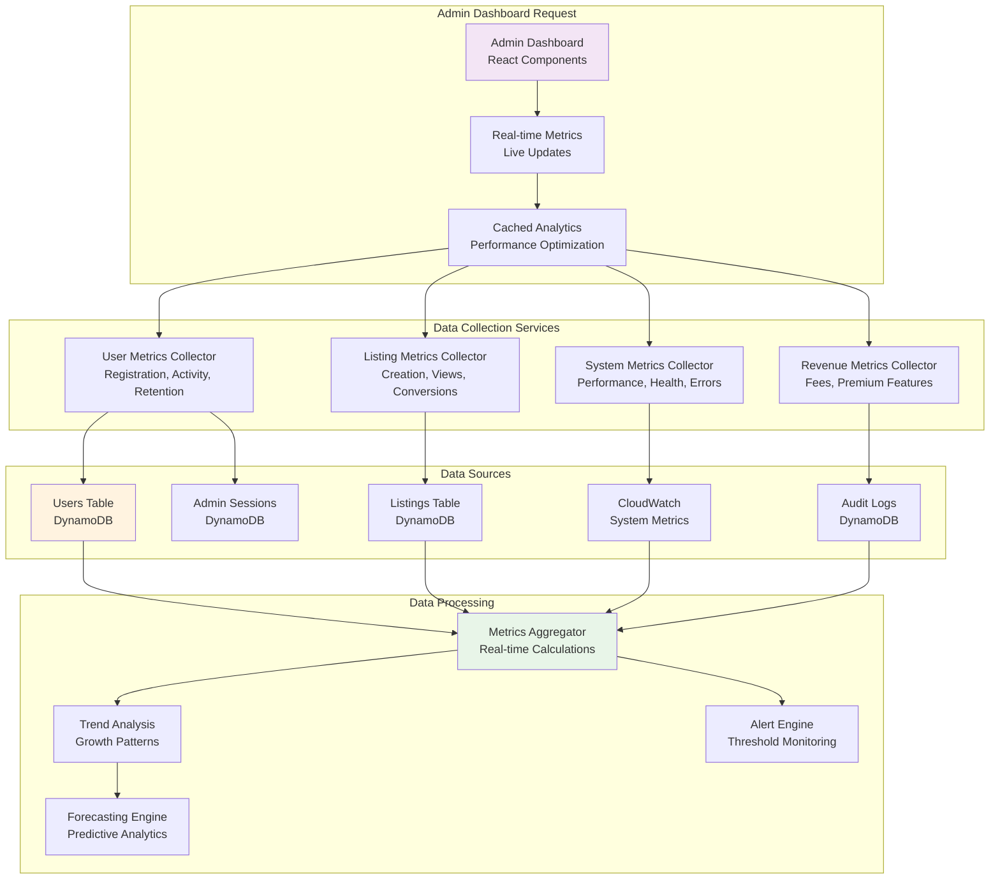

# 🔌 API Architecture Diagrams

## 📡 **API Gateway Architecture**

### **Current API Gateway Route Structure**

```mermaid
graph TB
    subgraph "API Gateway - REST API"
        Root[/ Root Resource]
        
        subgraph "Public Endpoints"
            Listings[/listings]
            ListingId[/listings/{id}]
            Search[/search]
            Stats[/stats]
            StatsPlatform[/stats/platform]
        end
        
        subgraph "Authentication Endpoints"
            Auth[/auth]
            Login[/auth/login]
            Register[/auth/register]
            AdminAuth[/auth/admin]
            AdminLogin[/auth/admin/login]
            Refresh[/auth/refresh]
            Logout[/auth/logout]
        end
        
        subgraph "Protected User Endpoints"
            Media[/media]
            Email[/email]
        end
        
        subgraph "Admin Endpoints"
            Admin[/admin]
            AdminProxy[/admin/{proxy+}]
        end
    end
    
    subgraph "Lambda Functions"
        ListingLambda[Listing Function<br/>listing/index.handler]
        SearchLambda[Search Function<br/>search/index.handler]
        StatsLambda[Stats Function<br/>stats-service/index.handler]
        AuthLambda[Auth Function<br/>auth-service/index.handler]
        MediaLambda[Media Function<br/>media/index.handler]
        EmailLambda[Email Function<br/>email/index.handler]
        AdminLambda[Admin Function<br/>admin-service/index.handler]
    end
    
    Root --> Listings
    Root --> Search
    Root --> Stats
    Root --> Auth
    Root --> Media
    Root --> Email
    Root --> Admin
    
    Listings --> ListingLambda
    ListingId --> ListingLambda
    Search --> SearchLambda
    Stats --> StatsLambda
    StatsPlatform --> StatsLambda
    
    Auth --> AuthLambda
    Login --> AuthLambda
    Register --> AuthLambda
    AdminAuth --> AuthLambda
    AdminLogin --> AuthLambda
    Refresh --> AuthLambda
    Logout --> AuthLambda
    
    Media --> MediaLambda
    Email --> EmailLambda
    
    Admin --> AdminLambda
    AdminProxy --> AdminLambda
    
    style Listings fill:#e8f5e8
    style Auth fill:#ffebee
    style Admin fill:#f3e5f5
    style Media fill:#fff3e0
```

### **API Request Lifecycle**



### **Lambda Function Architecture**



---

## 🔐 **Authentication Flow Architecture**

### **User Authentication Flow**



### **Admin Authentication with MFA**



---

## 📊 **Data Flow Patterns**

### **Listing Creation Data Flow**



### **Admin Dashboard Data Aggregation**

