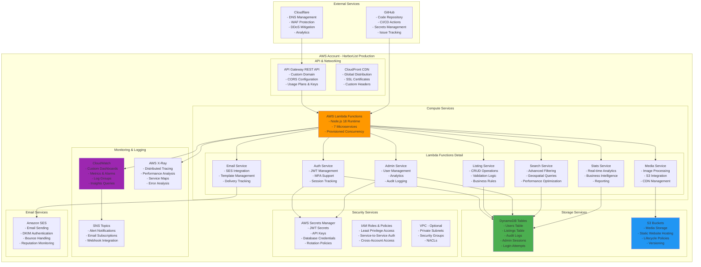
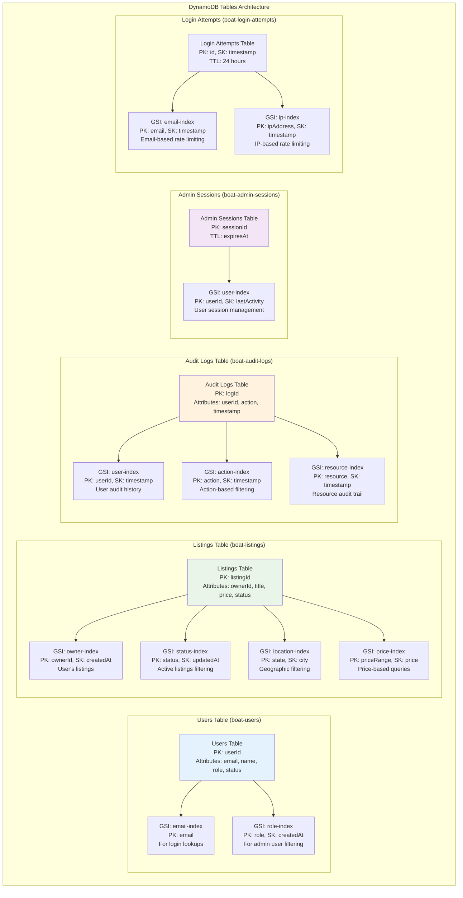
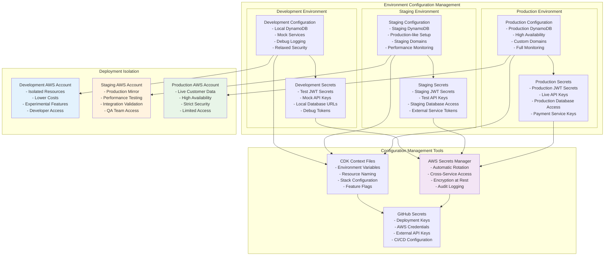

# 🚀 Infrastructure & Deployment Architecture

## ☁️ **AWS Infrastructure Architecture**

### **Complete AWS Infrastructure Stack**



### **DynamoDB Table Design & GSI Architecture**



### **S3 Bucket Architecture & CDN Integration**

```mermaid
graph TB
    subgraph "S3 Storage Architecture"
        subgraph "Media Bucket (boat-listing-media-[account])"
            MediaBucket[Media Bucket<br/>- Original Images<br/>- Processed Images<br/>- Video Files<br/>- Thumbnails]
            
            subgraph "Folder Structure"
                ListingFolder[/listing-{id}/<br/>- image1.jpg<br/>- image2.jpg<br/>- thumb1.jpg<br/>- video1.mp4]
                
                ProcessedFolder[/processed/<br/>- Optimized Images<br/>- Multiple Sizes<br/>- WebP Format<br/>- Compressed Videos]
                
                TempFolder[/temp/<br/>- Upload Processing<br/>- Temporary Storage<br/>- TTL: 24 hours]
            end
        end
        
        subgraph "Frontend Bucket (boat-listing-frontend-[account])"
            FrontendBucket[Frontend Bucket<br/>- React Build Output<br/>- Static Assets<br/>- Index.html<br/>- Manifest Files]
            
            subgraph "Static Assets Structure"
                AssetsFolder[/assets/<br/>- CSS Files<br/>- JS Bundles<br/>- Fonts<br/>- Icons]
                
                ImagesFolder[/images/<br/>- UI Images<br/>- Logos<br/>- Backgrounds<br/>- Placeholders]
            end
        end
    end
    
    subgraph "CDN & Distribution"
        CloudFrontDist[CloudFront Distribution<br/>- Global Edge Locations<br/>- Custom Cache Behaviors<br/>- SSL Certificate<br/>- Origin Request Policies]
        
        CloudflareCDN[Cloudflare CDN<br/>- DNS Management<br/>- Additional Caching<br/>- Security Rules<br/>- Performance Optimization]
    end
    
    subgraph "Image Processing Pipeline"
        UploadTrigger[S3 Upload Event<br/>- Object Created<br/>- Lambda Trigger<br/>- Metadata Extraction]
        
        ProcessingLambda[Image Processing Lambda<br/>- Sharp Library<br/>- Multiple Formats<br/>- Size Optimization<br/>- Thumbnail Generation]
        
        QualityCheck[Quality Validation<br/>- Format Verification<br/>- Content Scanning<br/>- Virus Checking<br/>- Metadata Sanitization]
    end
    
    MediaBucket --> ListingFolder
    MediaBucket --> ProcessedFolder
    MediaBucket --> TempFolder
    
    FrontendBucket --> AssetsFolder
    FrontendBucket --> ImagesFolder
    
    MediaBucket --> CloudFrontDist
    FrontendBucket --> CloudFrontDist
    CloudFrontDist --> CloudflareCDN
    
    MediaBucket --> UploadTrigger
    UploadTrigger --> ProcessingLambda
    ProcessingLambda --> QualityCheck
    QualityCheck --> ProcessedFolder
    
    style MediaBucket fill:#2196f3
    style FrontendBucket fill:#4caf50
    style CloudFrontDist fill:#ff9800
    style ProcessingLambda fill:#9c27b0
```

---

## 🔄 **CI/CD Pipeline Architecture**

### **GitHub Actions Deployment Pipeline**

```mermaid
graph TD
    subgraph "Source Code Management"
        Developer[Developer<br/>Local Development]
        FeatureBranch[Feature Branch<br/>git checkout -b feature/new-listing]
        MainBranch[Main Branch<br/>Production Ready Code]
        PullRequest[Pull Request<br/>Code Review Process]
    end
    
    subgraph "CI/CD Pipeline (GitHub Actions)"
        subgraph "Code Quality Gates"
            LintCheck[ESLint & Prettier<br/>Code Style Validation]
            TypeCheck[TypeScript Compilation<br/>Type Safety Verification]
            UnitTests[Unit Tests<br/>Jest Test Suite]
            SecurityScan[Security Scanning<br/>npm audit & Snyk]
        end
        
        subgraph "Build Process"
            FrontendBuild[Frontend Build<br/>Vite Production Build]
            BackendBuild[Backend Build<br/>TypeScript Compilation]
            PackageLambdas[Package Lambda Functions<br/>ZIP Creation & Optimization]
        end
        
        subgraph "Infrastructure Deployment"
            CDKSynth[CDK Synth<br/>CloudFormation Template Generation]
            CDKDeploy[CDK Deploy<br/>Infrastructure Update]
            LambdaDeploy[Lambda Deployment<br/>Function Code Update]
        end
        
        subgraph "Post-Deployment"
            SmokeTests[Smoke Tests<br/>API Health Checks]
            IntegrationTests[Integration Tests<br/>End-to-End Validation]
            PerformanceTests[Performance Tests<br/>Load & Response Time]
        end
    end
    
    subgraph "Environment Stages"
        DevEnvironment[Development Environment<br/>- Feature Testing<br/>- Integration Testing<br/>- Developer Validation]
        
        StagingEnvironment[Staging Environment<br/>- Production-like Testing<br/>- User Acceptance Testing<br/>- Performance Validation]
        
        ProductionEnvironment[Production Environment<br/>- Blue/Green Deployment<br/>- Gradual Rollout<br/>- Monitoring & Alerting]
    end
    
    subgraph "Monitoring & Rollback"
        HealthMonitoring[Health Monitoring<br/>- API Response Times<br/>- Error Rates<br/>- User Experience Metrics]
        
        AlertSystem[Alert System<br/>- CloudWatch Alarms<br/>- SNS Notifications<br/>- PagerDuty Integration]
        
        RollbackMechanism[Automatic Rollback<br/>- Health Check Failures<br/>- Error Rate Thresholds<br/>- Manual Rollback Triggers]
    end
    
    Developer --> FeatureBranch
    FeatureBranch --> PullRequest
    PullRequest --> LintCheck
    
    LintCheck --> TypeCheck
    TypeCheck --> UnitTests
    UnitTests --> SecurityScan
    
    SecurityScan --> FrontendBuild
    FrontendBuild --> BackendBuild
    BackendBuild --> PackageLambdas
    
    PackageLambdas --> CDKSynth
    CDKSynth --> CDKDeploy
    CDKDeploy --> LambdaDeploy
    
    LambdaDeploy --> SmokeTests
    SmokeTests --> IntegrationTests
    IntegrationTests --> PerformanceTests
    
    PerformanceTests --> DevEnvironment
    DevEnvironment --> StagingEnvironment
    StagingEnvironment --> ProductionEnvironment
    
    ProductionEnvironment --> HealthMonitoring
    HealthMonitoring --> AlertSystem
    AlertSystem --> RollbackMechanism
    
    RollbackMechanism -.->|Rollback| StagingEnvironment
    
    PullRequest --> MainBranch
    
    style LintCheck fill:#e3f2fd
    style ProductionEnvironment fill:#4caf50
    style HealthMonitoring fill:#ff9800
    style RollbackMechanism fill:#f44336
```



### **Blue/Green Deployment Strategy**


### **Environment Management Architecture**

