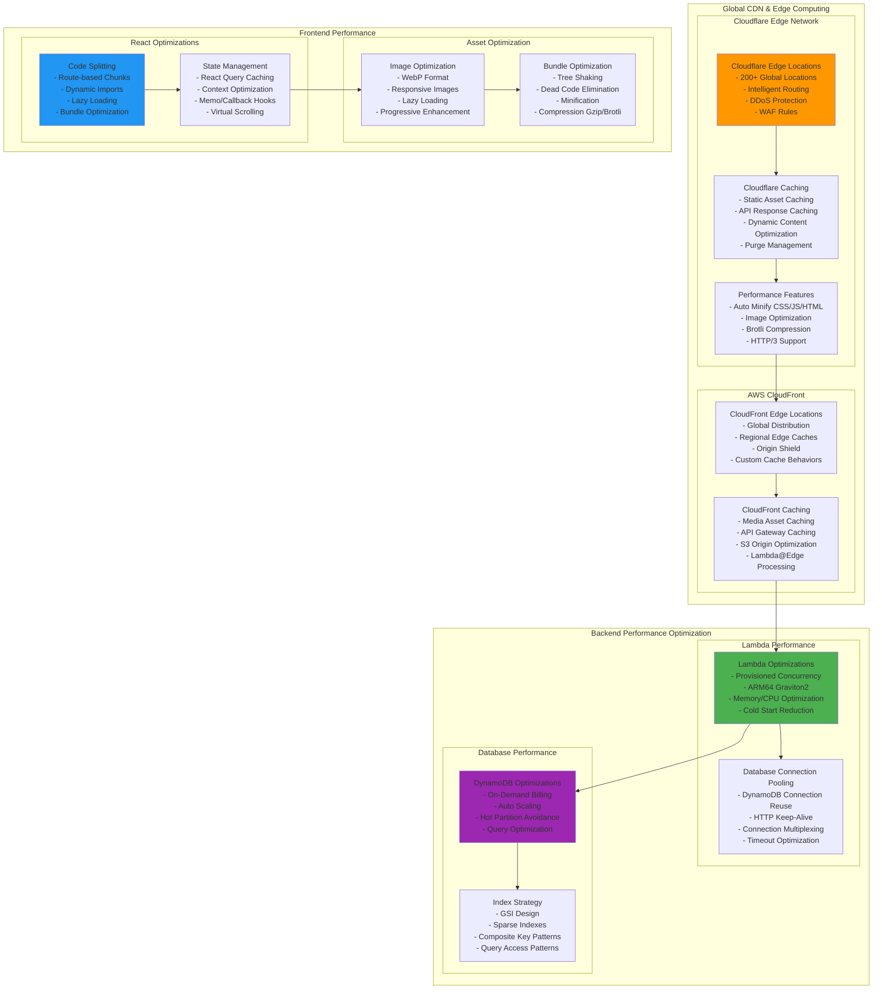
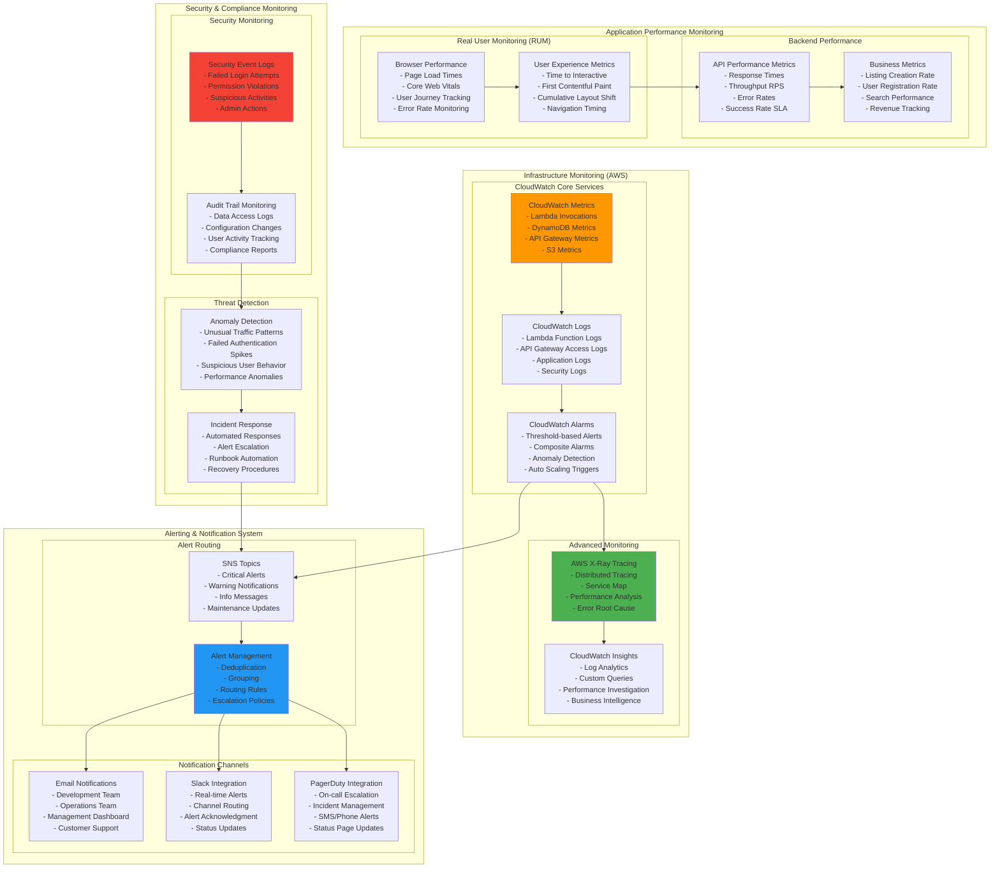

# 📊 Performance & Monitoring Architecture

## ⚡ **Performance Optimization Architecture**

### **Global Performance Strategy**

### **Database Performance Optimization Patterns**

```mermaid
graph TB
    subgraph "DynamoDB Performance Patterns"
        subgraph "Access Pattern Optimization"
            SingleTable[Single Table Design<br/>- Entity Relationships<br/>- Composite Keys<br/>- Sparse Indexes<br/>- Query Efficiency]
            
            HotPartition[Hot Partition Mitigation<br/>- Key Distribution<br/>- Write Sharding<br/>- Time-based Partitioning<br/>- Random Suffix Strategy]
            
            BatchOperations[Batch Operations<br/>- BatchGetItem 25 items<br/>- BatchWriteItem 25 items<br/>- TransactWriteItems<br/>- Parallel Processing]
        end
        
        subgraph "Caching Strategy"
            AppCache[Application-Level Caching<br/>- Redis/ElastiCache<br/>- In-Memory Cache<br/>- Session Storage<br/>- Query Result Cache]
            
            DAXCache[DynamoDB Accelerator DAX<br/>- Microsecond Latency<br/>- Read-Through Cache<br/>- Write-Through Cache<br/>- Multi-AZ Support]
        end
        
        subgraph "Query Optimization"
            QueryPatterns[Query Access Patterns<br/>- Primary Key Queries<br/>- GSI Queries<br/>- Scan Avoidance<br/>- Filter Expression Optimization]
            
            IndexDesign[Index Design Strategy<br/>- GSI Key Selection<br/>- Projection Types<br/>- Sparse Index Benefits<br/>- Cost Optimization]
        end
    end
    
    subgraph "Performance Metrics & Monitoring"
        subgraph "DynamoDB CloudWatch Metrics"
            ReadMetrics[Read Capacity Metrics<br/>- ConsumedReadCapacityUnits<br/>- ProvisionedReadCapacityUnits<br/>- ReadThrottledRequests<br/>- SuccessfulRequestLatency]
            
            WriteMetrics[Write Capacity Metrics<br/>- ConsumedWriteCapacityUnits<br/>- ProvisionedWriteCapacityUnits<br/>- WriteThrottledRequests<br/>- UserErrors/SystemErrors]
        end
        
        subgraph "Custom Application Metrics"
            QueryLatency[Query Latency Tracking<br/>- P50/P95/P99 Percentiles<br/>- Query Type Breakdown<br/>- Hot Key Detection<br/>- Slow Query Alerts]
            
            ThroughputMonitoring[Throughput Monitoring<br/>- Requests per Second<br/>- Peak Load Patterns<br/>- Auto Scaling Triggers<br/>- Capacity Planning]
        end
    end
    
    SingleTable --> HotPartition
    HotPartition --> BatchOperations
    
    BatchOperations --> AppCache
    AppCache --> DAXCache
    
    DAXCache --> QueryPatterns
    QueryPatterns --> IndexDesign
    
    IndexDesign --> ReadMetrics
    ReadMetrics --> WriteMetrics
    
    WriteMetrics --> QueryLatency
    QueryLatency --> ThroughputMonitoring
    
    style SingleTable fill:#e3f2fd
    style DAXCache fill:#4caf50
    style QueryLatency fill:#ff9800
    style ThroughputMonitoring fill:#9c27b0
```

---

## 🔍 **Comprehensive Monitoring Architecture**

### **Multi-Layer Monitoring Stack**

### **Real-Time Analytics & Business Intelligence**

```mermaid
graph TB
    subgraph "Data Collection & Processing"
        subgraph "Real-Time Event Streaming"
            EventBridge[Amazon EventBridge<br/>- Custom Events<br/>- Event Routing<br/>- Schema Registry<br/>- Cross-Service Communication]
            
            KinesisStreams[Kinesis Data Streams<br/>- Real-time Data Ingestion<br/>- High Throughput<br/>- Multiple Consumers<br/>- Replay Capability]
            
            FirehoseDelivery[Kinesis Data Firehose<br/>- Data Delivery<br/>- Format Conversion<br/>- Compression<br/>- Error Record Handling]
        end
        
        subgraph "Data Processing"
            LambdaProcessors[Lambda Event Processors<br/>- Real-time Processing<br/>- Data Enrichment<br/>- Filtering & Routing<br/>- Format Transformation]
            
            StreamAnalytics[Kinesis Analytics<br/>- SQL Queries on Streams<br/>- Windowed Aggregations<br/>- Anomaly Detection<br/>- Real-time Dashboards]
        end
    end
    
    subgraph "Data Storage & Analytics"
        subgraph "Analytics Storage"
            S3DataLake[S3 Data Lake<br/>- Raw Event Data<br/>- Processed Analytics<br/>- Partitioned Storage<br/>- Lifecycle Management]
            
            TimeStreamDB[Amazon TimeStream<br/>- Time-series Data<br/>- Automatic Scaling<br/>- Built-in Analytics<br/>- Cost Optimization]
        end
        
        subgraph "Business Intelligence"
            QuickSight[Amazon QuickSight<br/>- Interactive Dashboards<br/>- Ad-hoc Analysis<br/>- Embedded Analytics<br/>- Mobile Access]
            
            AthenaQueries[Amazon Athena<br/>- Serverless SQL Queries<br/>- S3 Data Analysis<br/>- Cost-effective Queries<br/>- Integration with BI Tools]
        end
    end
    
    subgraph "Key Performance Indicators (KPIs)"
        subgraph "Business Metrics Dashboard"
            ListingMetrics[Listing Analytics<br/>- Total Listings<br/>- New Listings/Day<br/>- Listing Views<br/>- Conversion Rates]
            
            UserMetrics[User Analytics<br/>- Daily Active Users<br/>- User Registration Rate<br/>- Session Duration<br/>- User Retention]
            
            SearchMetrics[Search Analytics<br/>- Search Queries<br/>- Search Success Rate<br/>- Popular Search Terms<br/>- Search Performance]
        end
        
        subgraph "Technical Performance KPIs"
            PerformanceKPIs[Performance KPIs<br/>- API Response Times<br/>- Error Rates<br/>- Availability SLA<br/>- Throughput Metrics]
            
            CostMetrics[Cost Analytics<br/>- AWS Spend Tracking<br/>- Cost per User<br/>- Resource Utilization<br/>- Optimization Opportunities]
        end
    end
    
    subgraph "Real-Time Alerting"
        subgraph "Business Alerts"
            BusinessAlerts[Business Threshold Alerts<br/>- Listing Volume Drops<br/>- High Error Rates<br/>- User Experience Degradation<br/>- Revenue Impact Alerts]
            
            OperationalAlerts[Operational Alerts<br/>- System Health<br/>- Performance Degradation<br/>- Security Incidents<br/>- Infrastructure Issues]
        end
    end
    
    EventBridge --> KinesisStreams
    KinesisStreams --> FirehoseDelivery
    KinesisStreams --> LambdaProcessors
    
    LambdaProcessors --> StreamAnalytics
    StreamAnalytics --> S3DataLake
    FirehoseDelivery --> S3DataLake
    
    S3DataLake --> TimeStreamDB
    TimeStreamDB --> QuickSight
    S3DataLake --> AthenaQueries
    
    QuickSight --> ListingMetrics
    AthenaQueries --> UserMetrics
    StreamAnalytics --> SearchMetrics
    
    ListingMetrics --> PerformanceKPIs
    UserMetrics --> CostMetrics
    
    PerformanceKPIs --> BusinessAlerts
    CostMetrics --> OperationalAlerts
    
    style EventBridge fill:#ff9800
    style QuickSight fill:#4caf50
    style BusinessAlerts fill:#f44336
    style ListingMetrics fill:#2196f3
```

### **Custom Monitoring Dashboard Architecture**

```mermaid
graph TB
    subgraph "Executive Dashboard (Management View)"
        subgraph "High-Level Business Metrics"
            BusinessOverview[Business Overview<br/>- Total Revenue<br/>- Active Users<br/>- Listing Growth<br/>- Customer Satisfaction]
            
            KPIWidgets[Key Performance Indicators<br/>- Monthly Recurring Revenue<br/>- User Acquisition Cost<br/>- Conversion Funnel<br/>- Market Share]
        end
        
        subgraph "Operational Health"
            SystemHealth[System Health Summary<br/>- Overall Availability<br/>- Performance Score<br/>- Security Status<br/>- Infrastructure Costs]
            
            TrendAnalysis[Trend Analysis<br/>- Growth Trajectories<br/>- Seasonal Patterns<br/>- Predictive Analytics<br/>- Forecasting Models]
        end
    end
    
    subgraph "Operations Dashboard (DevOps View)"
        subgraph "Infrastructure Monitoring"
            InfraMetrics[Infrastructure Metrics<br/>- Lambda Invocations<br/>- DynamoDB Performance<br/>- S3 Usage<br/>- CDN Performance]
            
            AlertsPanel[Active Alerts Panel<br/>- Critical Issues<br/>- Warning Conditions<br/>- Maintenance Windows<br/>- Incident Status]
        end
        
        subgraph "Application Performance"
            APMDashboard[APM Dashboard<br/>- Response Times<br/>- Error Rates<br/>- Throughput<br/>- User Sessions]
            
            SecurityPanel[Security Monitoring<br/>- Failed Login Attempts<br/>- Suspicious Activities<br/>- Audit Log Summary<br/>- Compliance Status]
        end
    end
    
    subgraph "Developer Dashboard (Engineering View)"
        subgraph "Code Quality & Deployment"
            DeploymentMetrics[Deployment Metrics<br/>- Deployment Frequency<br/>- Lead Time<br/>- Mean Time to Recovery<br/>- Change Failure Rate]
            
            CodeQuality[Code Quality Metrics<br/>- Test Coverage<br/>- Code Complexity<br/>- Security Vulnerabilities<br/>- Technical Debt]
        end
        
        subgraph "Performance Deep Dive"
            DetailedPerf[Detailed Performance<br/>- Function-level Metrics<br/>- Database Query Performance<br/>- API Endpoint Analysis<br/>- User Journey Tracking]
            
            ErrorAnalysis[Error Analysis<br/>- Error Distribution<br/>- Root Cause Analysis<br/>- Resolution Tracking<br/>- Prevention Metrics]
        end
    end
    
    subgraph "Customer Success Dashboard"
        subgraph "User Experience Metrics"
            UserJourney[User Journey Analytics<br/>- Onboarding Completion<br/>- Feature Adoption<br/>- User Satisfaction<br/>- Support Tickets]
            
            EngagementMetrics[Engagement Metrics<br/>- Daily Active Users<br/>- Session Length<br/>- Feature Usage<br/>- Retention Rates]
        end
        
        subgraph "Product Analytics"
            FeatureUsage[Feature Usage Analytics<br/>- Listing Creation Flow<br/>- Search Functionality<br/>- Mobile vs Desktop<br/>- Geographic Usage]
            
            ConversionFunnel[Conversion Funnel<br/>- Registration to Listing<br/>- Search to Contact<br/>- Trial to Paid<br/>- Churn Analysis]
        end
    end
    
    BusinessOverview --> KPIWidgets
    KPIWidgets --> SystemHealth
    SystemHealth --> TrendAnalysis
    
    InfraMetrics --> AlertsPanel
    AlertsPanel --> APMDashboard
    APMDashboard --> SecurityPanel
    
    DeploymentMetrics --> CodeQuality
    CodeQuality --> DetailedPerf
    DetailedPerf --> ErrorAnalysis
    
    UserJourney --> EngagementMetrics
    EngagementMetrics --> FeatureUsage
    FeatureUsage --> ConversionFunnel
    
    TrendAnalysis --> InfraMetrics
    SecurityPanel --> DeploymentMetrics
    ErrorAnalysis --> UserJourney
    
    style BusinessOverview fill:#4caf50
    style InfraMetrics fill:#ff9800
    style DeploymentMetrics fill:#2196f3
    style UserJourney fill:#9c27b0
```

