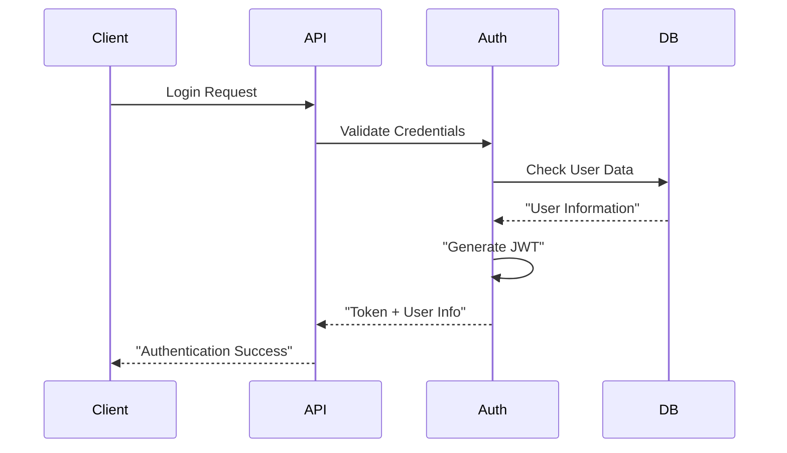

# 🔒 Security & Authentication

## 📋 **Overview**

HarborList implements comprehensive security measures including JWT authentication, role-based access control (RBAC), audit logging, and compliance tracking to protect user data and ensure platform integrity.

---

## 🔐 **JWT Authentication**

### **Token-Based Security Implementation**

#### **JWT Token Structure**
```typescript
interface JWTPayload {
  userId: string;
  email: string;
  role: 'user' | 'admin';
  iat: number;           // Issued at
  exp: number;           // Expiration
  sessionId?: string;    // For admin sessions
}
```

#### **Token Management**
- **Access Tokens**: Short-lived (15 minutes) for API access
- **Refresh Tokens**: Long-lived (7 days) for token renewal
- **Admin Tokens**: Enhanced security with MFA requirement
- **Token Rotation**: Automatic refresh before expiration

### **Authentication Flow**


---

## � **JWT Secret Management**

### **Environment-Conditional Secret Handling**

HarborList implements a flexible approach to JWT secret management that adapts based on the deployment environment:

#### **Local Development Environment**
```typescript
// For local development (environment: 'local')
const JWT_SECRET = 'local-dev-secret-harborlist-2025';
```

**Benefits:**
- ✅ Fast development iteration (no AWS API calls)
- ✅ No AWS costs for local development
- ✅ Offline development capability
- ✅ Simplified debugging and testing

#### **AWS Environments (dev/staging/prod)**
```typescript
// For AWS deployments
const jwtSecret = new secretsmanager.Secret(this, 'AdminJwtSecret', {
  secretName: `harborlist-admin-jwt-${environment}`,
  description: 'JWT secret for authentication services',
  generateSecretString: {
    passwordLength: 32,
    excludeCharacters: '"@/\\',
  },
});
```

**Benefits:**
- ✅ Enhanced security with AWS Secrets Manager
- ✅ Automatic secret rotation capability
- ✅ Encrypted storage and transmission
- ✅ IAM-based access control
- ✅ Audit trail for secret access

### **Dynamic Secret Retrieval**

#### **Runtime Secret Resolution**
```typescript
/**
 * Dynamically retrieve JWT secret based on environment
 */
export async function getJwtSecret(): Promise<string> {
  const environment = process.env.ENVIRONMENT || 'local';
  
  if (environment === 'local') {
    return process.env.JWT_SECRET || 'local-dev-secret-harborlist-2025';
  }
  
  // For AWS environments, retrieve from Secrets Manager
  const secretArn = process.env.JWT_SECRET_ARN;
  const secretsClient = new SecretsManagerClient({ 
    region: process.env.AWS_REGION || 'us-east-1' 
  });
  
  const command = new GetSecretValueCommand({ SecretId: secretArn });
  const response = await secretsClient.send(command);
  const secret = JSON.parse(response.SecretString || '{}');
  
  return secret.password;
}
```

#### **Async Authentication Functions**
```typescript
// Updated JWT functions with dynamic secret retrieval
export async function verifyTokenAsync(token: string): Promise<JWTPayload> {
  const authConfig = await getAuthConfig();
  return verifyToken(token, authConfig.JWT_SECRET);
}

export async function createAccessTokenAsync(
  user: User, 
  sessionId: string, 
  deviceId: string
): Promise<string> {
  const authConfig = await getAuthConfig();
  
  const payload = {
    sub: user.id,
    email: user.email,
    role: user.role,
    permissions: user.permissions,
    sessionId,
    deviceId,
    type: 'access',
    exp: Math.floor(Date.now() / 1000) + (15 * 60), // 15 minutes
  };

  return jwt.sign(payload, authConfig.JWT_SECRET);
}
```

### **Environment Configuration**

#### **Infrastructure Deployment**
```typescript
// CDK Stack configuration
const jwtSecret = environment === 'local' 
  ? undefined // Skip Secrets Manager for local
  : new secretsmanager.Secret(this, 'AdminJwtSecret', {
      secretName: `harborlist-admin-jwt-${environment}`,
    });

const jwtConfig = {
  JWT_SECRET: environment === 'local' 
    ? 'local-dev-secret-harborlist-2025'
    : '',
  JWT_SECRET_ARN: environment === 'local' 
    ? '' 
    : jwtSecret?.secretArn || '',
};
```

#### **Lambda Environment Variables**
```typescript
environment: {
  JWT_SECRET: jwtConfig.JWT_SECRET,           // Hardcoded for local
  JWT_SECRET_ARN: jwtConfig.JWT_SECRET_ARN,   // ARN for AWS environments
  ENVIRONMENT: environment,                    // 'local' | 'dev' | 'staging' | 'prod'
  // ... other variables
}
```

---

## �🛡️ **Authorization Middleware**

### **Role-Based Access Control (RBAC)**

#### **Permission Levels**
```typescript
enum UserRole {
  USER = 'user',         // Standard user permissions
  ADMIN = 'admin'        // Full administrative access
}

interface Permission {
  resource: string;      // e.g., 'listings', 'users', 'admin'
  actions: string[];     // e.g., ['read', 'write', 'delete']
}
```

#### **Access Control Matrix**
| Resource | User | Admin |
|----------|------|-------|
| Own Listings | CRUD | CRUD |
| All Listings | Read | CRUD |
| User Profiles | Own Profile | All Profiles |
| Admin Dashboard | None | Full Access |
| System Settings | None | Full Access |
| Audit Logs | None | Read Only |

### **Middleware Implementation**
```typescript
// Authentication Middleware
export const authenticateToken = (requiredRole?: UserRole) => {
  return async (event: APIGatewayProxyEvent): Promise<AuthContext> => {
    const token = extractTokenFromHeader(event.headers);
    const payload = await verifyJWT(token);
    
    if (requiredRole && payload.role !== requiredRole) {
      throw new ForbiddenError('Insufficient permissions');
    }
    
    return {
      userId: payload.userId,
      email: payload.email,
      role: payload.role,
      sessionId: payload.sessionId
    };
  };
};
```

---

## 📋 **Audit Logging**

### **Comprehensive Event Tracking**

#### **Audited Actions**
- **Authentication Events**: Login, logout, failed attempts
- **Data Operations**: Create, update, delete operations  
- **Admin Actions**: User management, system configuration
- **Security Events**: Permission changes, suspicious activity

#### **Audit Log Structure**
```typescript
interface AuditLog {
  logId: string;
  userId: string;
  action: string;          // 'CREATE_LISTING', 'LOGIN', 'DELETE_USER'
  resource: string;        // 'listings', 'users', 'admin'
  resourceId?: string;     // Specific resource identifier
  details: {
    before?: any;          // State before change
    after?: any;           // State after change
    metadata?: any;        // Additional context
  };
  timestamp: string;
  ipAddress: string;
  userAgent: string;
  success: boolean;
  errorMessage?: string;
}
```

### **Compliance Tracking**
- **Data Access Logs**: Track all PII access
- **Change History**: Maintain audit trail for all modifications
- **Retention Policy**: 7-year retention for compliance requirements
- **Export Capabilities**: Generate compliance reports

---

## 🔍 **Input Validation & Sanitization**

### **Data Sanitization Strategies**

#### **Input Validation Pipeline**
```typescript
interface ValidationRule {
  field: string;
  type: 'string' | 'number' | 'email' | 'url';
  required?: boolean;
  minLength?: number;
  maxLength?: number;
  pattern?: RegExp;
  sanitize?: boolean;
}

// Example validation schema
const listingValidation: ValidationRule[] = [
  { field: 'title', type: 'string', required: true, maxLength: 100, sanitize: true },
  { field: 'price', type: 'number', required: true, min: 0 },
  { field: 'email', type: 'email', required: true },
];
```

#### **Injection Prevention**
- **SQL Injection**: Parameterized queries (DynamoDB safe by design)
- **NoSQL Injection**: Input type validation and sanitization
- **XSS Prevention**: HTML entity encoding for user content
- **Path Traversal**: File path validation and sandboxing

### **Security Headers**
```typescript
const securityHeaders = {
  'Content-Security-Policy': "default-src 'self'",
  'X-Frame-Options': 'DENY',
  'X-Content-Type-Options': 'nosniff',
  'Strict-Transport-Security': 'max-age=31536000; includeSubDomains',
  'Referrer-Policy': 'strict-origin-when-cross-origin'
};
```

---

## 🚨 **Security Monitoring**

### **Threat Detection**

#### **Rate Limiting**
- **Login Attempts**: 5 attempts per email per 15 minutes
- **API Requests**: 1000 requests per user per hour
- **Admin Actions**: 100 admin operations per hour
- **IP-based Limits**: Global rate limiting by IP address

#### **Suspicious Activity Detection**
```typescript
interface SecurityAlert {
  type: 'BRUTE_FORCE' | 'UNUSUAL_ACCESS' | 'PRIVILEGE_ESCALATION';
  userId?: string;
  ipAddress: string;
  timestamp: string;
  details: Record<string, any>;
  severity: 'LOW' | 'MEDIUM' | 'HIGH' | 'CRITICAL';
}
```

### **Incident Response**
1. **Automated Response**: Block suspicious IPs, disable compromised accounts
2. **Alert Generation**: Real-time notifications to security team
3. **Investigation Tools**: Detailed audit logs and access patterns
4. **Recovery Procedures**: Account restoration and security hardening

---

## 🔐 **Multi-Factor Authentication (MFA)**

### **Admin MFA Implementation**

#### **TOTP (Time-based One-Time Password)**
```typescript
interface MFASetup {
  userId: string;
  secret: string;        // TOTP secret
  qrCode: string;        // Base64 QR code for setup
  backupCodes: string[]; // Recovery codes
  verified: boolean;
  createdAt: string;
}
```

#### **MFA Flow**
1. **Setup**: Generate TOTP secret and QR code
2. **Verification**: Validate initial TOTP code
3. **Login**: Require TOTP code for admin access
4. **Recovery**: Backup codes for device loss scenarios

### **Session Management**
- **Secure Sessions**: Encrypted session tokens
- **Session Timeout**: Automatic logout after inactivity
- **Concurrent Sessions**: Limit multiple admin sessions
- **Session Invalidation**: Force logout on security events

---

## 🛡️ **Data Protection**

### **Encryption Strategy**

#### **Data at Rest**
- **DynamoDB Encryption**: AWS KMS encryption for all tables
- **S3 Encryption**: Server-side encryption for media files
- **Secrets Encryption**: AWS Secrets Manager for sensitive data
- **Field-level Encryption**: Additional encryption for PII fields

#### **Data in Transit**
- **TLS 1.2+**: All API communications encrypted
- **Certificate Pinning**: Mobile app certificate validation
- **HSTS Headers**: Force HTTPS connections
- **Perfect Forward Secrecy**: Ephemeral key exchange

### **Privacy Controls**
- **Data Minimization**: Collect only necessary information
- **Consent Management**: User consent tracking and management
- **Right to Deletion**: GDPR-compliant data deletion
- **Data Portability**: User data export capabilities

---

## 📊 **Security Metrics & Reporting**

### **Key Security Indicators**
- **Authentication Success Rate**: Track login success/failure ratios
- **MFA Adoption Rate**: Monitor MFA enrollment and usage
- **Security Incident Count**: Track and categorize security events
- **Compliance Score**: Measure adherence to security policies

### **Regular Security Assessments**
- **Vulnerability Scanning**: Automated dependency scanning
- **Penetration Testing**: Quarterly third-party security assessments
- **Code Security Review**: Static analysis and security code review
- **Compliance Audits**: Regular SOC 2 and security compliance checks

---

**📅 Last Updated**: October 2025  
**📝 Version**: 1.0.0  
**👥 Maintained By**: HarborList Development Team