# 🚢 HarborList Local Development Environment

This guide will help you set up and run the complete HarborList marketplace platform on your local machine using Docker Compose.

## 🏗️ Architecture Overview

The local development environment mirrors our production AWS serverless architecture:

```mermaid
graph TB
    subgraph "Local Development Environment"
        subgraph "Application Layer"
            FE[Frontend - React + Vite<br/>local.harborlist.com:3000<br/>🔥 Hot Reload Enabled]
            BE[Backend - Express + Lambda<br/>local-api.harborlist.com:3001<br/>🔥 Hot Reload Enabled]
        end
        
        subgraph "Local AWS Services"
            DDB[DynamoDB Local<br/>localhost:8000<br/>📊 Full AWS API Compatible]
            S3[LocalStack S3<br/>localhost:4566<br/>📁 File Storage & CDN]
            SES[LocalStack SES<br/>localhost:4566<br/>📧 Email Service]
        end
        
        subgraph "Development Tools"
            ADMIN[DynamoDB Admin UI<br/>localhost:8001<br/>🛠️ Database Management]
            REDIS[Redis Cache<br/>localhost:6379<br/>⚡ Session & Cache Storage]
        end
    end
    
    FE -->|API Calls| BE
    BE -->|Database Queries| DDB
    BE -->|File Operations| S3
    BE -->|Email Sending| SES
    BE -->|Cache Operations| REDIS
    
    style FE fill:#61dafb,stroke:#333,stroke-width:2px
    style BE fill:#68a063,stroke:#333,stroke-width:2px
    style DDB fill:#ff9900,stroke:#333,stroke-width:2px
    style S3 fill:#ff9900,stroke:#333,stroke-width:2px
    style ADMIN fill:#f39c12,stroke:#333,stroke-width:2px
```



## 📋 Prerequisites

### Required Software
- **Docker Desktop** (4.0+) with Docker Compose
- **Node.js** (18+) and **npm** (9+)
- **Git** for version control
- **AWS CLI** (for local table setup)

### System Requirements
- **macOS/Linux/Windows** with WSL2
- **4GB RAM** minimum (8GB recommended)
- **10GB free disk space**

## 🚀 Quick Start (5 minutes)

### 1. Clone and Install
```bash
# Clone the repository
git clone https://github.com/felixep/harborlist-marketplace.git
cd harborlist-marketplace

# Install all dependencies
npm run install
```

### 2. Setup Local Domains
```bash
# Add local domains to your hosts file (requires sudo)
npm run hosts:setup

# Manual alternative: Add these lines to /etc/hosts
# 127.0.0.1 local.harborlist.com
# 127.0.0.1 local-api.harborlist.com
```

### 3. Setup Environment
```bash
# Copy environment variables
cp .env.example .env.local

# Setup local services and database
npm run dev:setup
```

### 4. Start Development Environment
```bash
# Start all services
npm run dev:start

# Or start in background
npm run dev:start:bg
```

### 5. Create Admin User
```bash
# In a new terminal, create your first admin user
npm run dev:admin
```

### 6. Access the Application
- **Frontend**: http://local.harborlist.com:3000
- **Backend API**: http://local-api.harborlist.com:3001
- **API Health**: http://local-api.harborlist.com:3001/health
- **DynamoDB Admin**: http://localhost:8001
- **LocalStack Dashboard**: http://localhost:4566

## 🛠️ Development Commands

### Environment Management
```bash
# Start development environment
npm run dev:start                 # Start all services (foreground)
npm run dev:start:bg              # Start all services (background)
npm run dev:stop                  # Stop all services
npm run dev:restart               # Restart all services
npm run dev:clean                 # Stop and remove all data volumes

# Status and monitoring
npm run dev:status                # Show service status
npm run dev:logs                  # Show all service logs
npm run dev:logs:backend          # Show backend logs only
npm run dev:logs:frontend         # Show frontend logs only
```

### Database Management
```bash
# Setup/reset local database
cd backend && npm run dev:setup-db

# Create admin user
npm run dev:admin

# Access DynamoDB Admin UI
open http://localhost:8001
```

### Service Access
```bash
# Open shell in containers
npm run dev:shell:backend         # Access backend container
npm run dev:shell:frontend        # Access frontend container
```

### Cleanup
```bash
# Remove local domains from hosts file
npm run hosts:remove

# Clean all Docker data
npm run dev:clean
```

## 🔧 Individual Service Development

### Frontend Development
```bash
cd frontend

# Start frontend dev server directly (without Docker)
npm run dev

# Run tests
npm run test

# Build for production
npm run build
```

### Backend Development
```bash
cd backend

# Start backend dev server directly (without Docker)
npm run dev:local

# Run tests
npm run test

# Build Lambda packages
npm run build
```

## 📊 Service Details

### Frontend (React + Vite)
- **URL**: http://local.harborlist.com:3000
- **Hot Reload**: Enabled with file watching
- **Environment**: `VITE_ENVIRONMENT=local`
- **API Endpoint**: http://local-api.harborlist.com:3001/api

### Backend (Express + Lambda Wrapper)
- **URL**: http://local-api.harborlist.com:3001
- **Architecture**: Express server wrapping Lambda functions
- **Hot Reload**: Enabled with nodemon and ts-node
- **Environment**: `NODE_ENV=development`

### DynamoDB Local
- **Endpoint**: http://localhost:8000
- **Admin UI**: http://localhost:8001
- **Region**: us-east-1
- **Tables**: Automatically created with GSI indexes

### LocalStack (AWS Services)
- **Endpoint**: http://localhost:4566
- **Services**: S3, SES, CloudWatch, IAM
- **Buckets**: harborlist-uploads-local, harborlist-frontend-local

### Redis Cache
- **Endpoint**: redis://localhost:6379
- **Usage**: Session storage, API caching (optional)

## 🔍 Troubleshooting

### Common Issues

#### 1. "Address already in use" Error
```bash
# Check what's using the ports
lsof -ti:3000,3001,8000,8001,4566,6379

# Stop conflicting services
npm run dev:stop
```

#### 2. Domain Resolution Issues
```bash
# Verify hosts file entries
cat /etc/hosts | grep harborlist

# Re-setup domains if needed
npm run hosts:remove
npm run hosts:setup
```

#### 3. Database Connection Issues
```bash
# Reset local database
npm run dev:clean
npm run dev:setup
```

#### 4. Docker Issues
```bash
# Reset Docker state
docker-compose -f docker-compose.local.yml down -v --remove-orphans
docker system prune -f
npm run dev:setup
```

#### 5. Dependencies Out of Sync
```bash
# Clean and reinstall all dependencies
rm -rf frontend/node_modules backend/node_modules infrastructure/node_modules
npm run install
```

### Health Checks

#### Backend Health Check
```bash
curl http://local-api.harborlist.com:3001/health
```

Expected response:
```json
{
  "status": "healthy",
  "timestamp": "2025-10-02T...",
  "environment": "local",
  "services": {
    "dynamodb": "http://dynamodb-local:8000",
    "s3": "http://localstack:4566",
    "ses": "http://localstack:4566"
  }
}
```

#### Database Health Check
```bash
aws dynamodb list-tables --endpoint-url http://localhost:8000 --region us-east-1
```

#### LocalStack Health Check
```bash
curl http://localhost:4566/_localstack/health
```

## 📈 Performance Tips

### 1. Optimize Docker Performance
- **macOS**: Increase Docker Desktop memory to 6-8GB
- **Windows**: Use WSL2 backend for better performance
- **Linux**: Native Docker performance is optimal

### 2. Enable File Watching
- Environment variable `CHOKIDAR_USEPOLLING=true` is set for container compatibility
- Use `.dockerignore` files to exclude node_modules from context

### 3. Database Performance
- DynamoDB Local stores data in Docker volumes for persistence
- Use DynamoDB Admin UI for efficient data management

## 🔒 Security Notes

### Local Development Security
- All services use test/development credentials
- JWT secret is hardcoded for local development
- CORS is configured for local domains only
- No HTTPS required for local development

### Production Differences
- Local environment uses HTTP (not HTTPS)
- Simplified authentication (no MFA required)
- Debug logging enabled
- Relaxed CORS policies

## 🎯 Next Steps

### Development Workflow
1. **Make Changes**: Edit code in your IDE
2. **See Changes**: Hot reload automatically updates
3. **Test**: Use DynamoDB Admin UI to verify database changes
4. **Debug**: Check logs with `npm run dev:logs`

### Deployment Preparation
1. **Test Locally**: Ensure everything works in local environment
2. **Run Tests**: `npm run test` in each service
3. **Build**: `npm run build` to verify production builds
4. **Deploy**: Use existing deployment scripts for AWS

### Additional Resources
- [Main Project README](../README.md)
- [Backend Documentation](../docs/backend/README.md)
- [Frontend Documentation](../docs/frontend/README.md)
- [Infrastructure Documentation](../docs/architecture/README.md)

## 💡 Pro Tips

### IDE Setup
- Use VS Code with Docker extension for container management
- Install Thunder Client or REST Client for API testing
- Use DynamoDB extension for database visualization

### Development Efficiency
- Keep DynamoDB Admin UI open for real-time data inspection
- Use `docker-compose logs -f [service]` for targeted debugging
- Bookmark all local URLs for quick access

### Data Management
- Use the admin user creation script for consistent test data
- DynamoDB Admin UI allows easy data export/import
- LocalStack provides S3 browser interface at http://localhost:4566

---

**🚢 Happy coding with HarborList!**

For questions or issues, check the troubleshooting section or refer to the main project documentation.