# 📸 Media Infrastructure Documentation Integration Summary

## ✅ **Integration Completed Successfully**

The comprehensive media infrastructure documentation has been successfully integrated into the HarborList project documentation structure, providing seamless cross-references and complete coverage of the S3/LocalStack implementation.

---

## 📋 **Files Updated**

### **1. Main Documentation Index** (`/docs/README.md`)
- ✅ Added media infrastructure reference to deployment section
- ✅ Updated Media Service description to highlight S3/LocalStack integration
- ✅ Added LocalStack S3 endpoint to local development URLs

### **2. Deployment Documentation** (`/docs/deployment/README.md`)
- ✅ Added direct link to media infrastructure integration guide
- ✅ Included LocalStack S3 endpoint in local URLs section
- ✅ Cross-referenced with comprehensive implementation guide

### **3. Backend Services Documentation** (`/docs/backend/services.md`)
- ✅ Updated Media Service responsibilities to emphasize environment-aware integration
- ✅ Added prominent reference to complete implementation guide
- ✅ Highlighted S3/LocalStack dual environment support

### **4. Architecture Documentation** (`/docs/architecture/README.md`)
- ✅ Updated Media Service description to focus on S3/LocalStack integration
- ✅ Modified S3 Media Bucket description to highlight environment-aware features
- ✅ Emphasized presigned URL upload flow and auto bucket creation

### **5. Operations Documentation** (`/docs/operations/README.md`)
- ✅ Updated S3 buckets description to mention environment-aware integration
- ✅ Highlighted integration with deployment and cleanup workflows

### **6. Tools Documentation** (`/tools/README.md`)
- ✅ Added development tools directory to main structure
- ✅ Included S3 bucket setup script in npm scripts
- ✅ Added development tools to category documentation list

### **7. Development Tools Documentation** (`/tools/development/README.md`)
- ✅ **NEW FILE**: Comprehensive documentation for LocalStack S3 setup
- ✅ Detailed usage instructions and troubleshooting guide
- ✅ Architecture integration diagrams and cross-references
- ✅ Complete feature documentation with examples

---

## 🔗 **Cross-Reference Network**

The media infrastructure documentation is now fully cross-referenced throughout the project:

```mermaid
graph TD
    Main[📚 Main Documentation] --> Deploy[🚀 Deployment Docs]
    Main --> Backend[⚡ Backend Services]
    Main --> Arch[🏗️ Architecture Docs]
    
    Deploy --> Media[📸 Media Infrastructure Integration]
    Backend --> Media
    Arch --> Media
    
    Tools[🛠️ Tools Documentation] --> DevTools[🔧 Development Tools]
    DevTools --> Media
    
    Media --> Examples[📝 Code Examples]
    Media --> Scripts[🔧 Setup Scripts]
    Media --> Troubleshoot[🔍 Troubleshooting]
```



### **Key Integration Points**
1. **Main Documentation** → References media infrastructure in deployment and backend sections
2. **Deployment Guide** → Direct link to complete implementation guide
3. **Backend Services** → Prominent callout with complete implementation reference
4. **Architecture** → Updated diagrams and service descriptions
5. **Tools Directory** → New development tools section with S3 setup automation
6. **Operations** → Environment-aware integration mentions

---

## 📖 **Documentation Hierarchy**

The media infrastructure documentation fits seamlessly into the existing structure:

```
docs/
├── README.md (✅ Updated)
├── deployment/
│   ├── README.md (✅ Updated)
│   └── media-infrastructure-integration.md (📸 Core Document)
├── backend/
│   └── services.md (✅ Updated)
├── architecture/
│   └── README.md (✅ Updated)
└── operations/
    └── README.md (✅ Updated)

tools/
├── README.md (✅ Updated)
└── development/
    ├── README.md (✅ New Document)
    └── setup-s3-buckets.sh (🔧 Implementation)
```

---

## 🎯 **Documentation Benefits**

### **For Developers**
- **Clear Setup Path**: Step-by-step LocalStack S3 configuration
- **Environment Parity**: Local development mirrors production behavior
- **Troubleshooting**: Comprehensive error resolution guide
- **Integration Examples**: Working code samples and usage patterns

### **For Operations Teams**
- **Deployment Integration**: Automated S3 bucket setup in deployment workflows
- **Environment Management**: Clear separation between local and AWS environments
- **Monitoring**: Health checks and validation procedures
- **Cleanup Procedures**: Proper resource cleanup and environment teardown

### **for Architecture Teams**
- **Design Patterns**: Environment-aware service implementation
- **Integration Flows**: Complete request/response lifecycle documentation
- **Scalability Considerations**: Production deployment patterns
- **Security Implementation**: Presigned URL security and access controls

---

## 🚀 **Next Steps**

The media infrastructure documentation is now fully integrated. Developers can:

1. **Follow Main Docs**: Start with `/docs/README.md` for overview
2. **Deployment Setup**: Use `/docs/deployment/README.md` for environment setup
3. **Deep Dive**: Reference `/docs/deployment/media-infrastructure-integration.md` for complete implementation
4. **Tool Usage**: Access `/tools/development/README.md` for LocalStack setup
5. **Troubleshooting**: Use integrated troubleshooting guides for issue resolution

The documentation provides complete coverage of the media infrastructure implementation while maintaining the project's professional documentation standards and cross-reference integrity.