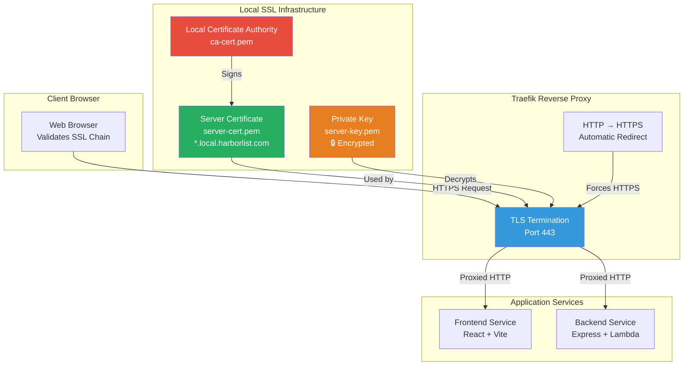

# 🔐 End-to-End Encryption in Local Development

## Overview

The enhanced profile implements **true end-to-end encryption** using self-signed SSL certificates and HTTPS termination at Traefik, mimicking production Cloudflare behavior.

## SSL Certificate Architecture



## Security Features Implemented

### 1. **Self-Signed Certificate Authority**
- Generated locally for development use
- Root CA that signs server certificates
- Can be trusted system-wide for seamless development

### 2. **Multi-Domain Server Certificate**
- Covers all local development domains:
  - `local.harborlist.com` (Frontend)
  - `local-api.harborlist.com` (Backend API)
  - `traefik.local.harborlist.com` (Traefik Dashboard)
  - `localhost` (Fallback)

### 3. **TLS 1.3 Termination at Traefik**
- Modern encryption protocols
- Automatic HTTP to HTTPS redirection
- Secure headers injection (HSTS, CSP, etc.)

### 4. **End-to-End HTTPS Flow**
```
Browser → HTTPS (443) → Traefik → HTTP (internal) → Services
```

## Certificate Management

### Automatic Generation
```bash
# Generate certificates (done automatically in enhanced setup)
npm run dev:setup:ssl

# Or generate manually
./tools/ssl/generate-ssl-certs.sh
```

### Trust Installation

#### macOS
```bash
sudo security add-trusted-cert -d -r trustRoot -k /Library/Keychains/System.keychain ./certs/local/ca-cert.pem
```

#### Linux
```bash
sudo cp ./certs/local/ca-cert.pem /usr/local/share/ca-certificates/harborlist-local-ca.crt
sudo update-ca-certificates
```

#### Windows
```powershell
certlm.msc  # Import ca-cert.pem to "Trusted Root Certification Authorities"
```

## Access URLs (Enhanced Profile)

| Service | URL | Encryption |
|---------|-----|------------|
| Frontend | `https://local.harborlist.com` | ✅ Full TLS |
| Backend API | `https://local-api.harborlist.com` | ✅ Full TLS |
| Traefik Dashboard | `https://traefik.local.harborlist.com` | ✅ Full TLS |
| DynamoDB Admin | `http://localhost:8001` | ❌ Direct Access |

## Production Parity

This setup provides **production-like encryption** that mirrors Cloudflare's SSL behavior:

| Feature | Production (Cloudflare) | Local (Traefik + SSL) |
|---------|------------------------|----------------------|
| TLS Termination | ✅ Edge Servers | ✅ Traefik |
| Certificate Management | ✅ Universal SSL | ✅ Self-Signed |
| HTTP → HTTPS Redirect | ✅ Automatic | ✅ Automatic |
| Modern TLS Protocols | ✅ TLS 1.3 | ✅ TLS 1.3 |
| SNI Support | ✅ Multi-domain | ✅ Multi-domain |
| Security Headers | ✅ Built-in | ✅ Middleware |

## Certificate Rotation

Certificates are valid for **365 days**. To regenerate:

```bash
# Remove existing certificates
rm -rf ./certs/local/

# Generate new certificates
npm run dev:setup:ssl

# Restart enhanced environment
npm run dev:stop
npm run dev:start:enhanced
```

## Troubleshooting SSL

### Browser Security Warnings
1. **Initial Setup**: Browser will show security warning for self-signed cert
2. **Solution**: Install CA certificate system-wide (see Trust Installation above)
3. **Alternative**: Click "Advanced" → "Proceed to site" for development

### Certificate Validation Errors
```bash
# Verify certificate details
openssl x509 -in ./certs/local/server-cert.pem -text -noout

# Check SAN (Subject Alternative Names)
openssl x509 -in ./certs/local/server-cert.pem -text -noout | grep -A 1 "Subject Alternative Name"
```

### Traefik TLS Issues
```bash
# Check Traefik logs for TLS errors
docker-compose -f docker-compose.local.yml logs traefik

# Verify certificate mounting
docker-compose -f docker-compose.local.yml exec traefik ls -la /etc/ssl/certs/
```

This implementation provides **true end-to-end encryption** for local development, ensuring your local environment behavior matches production security patterns.