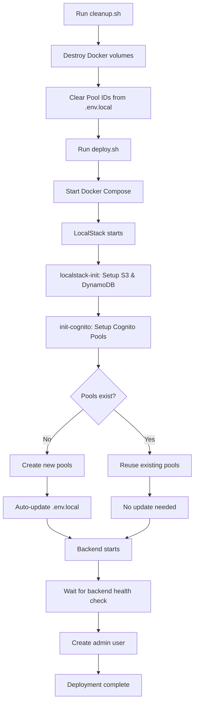

# Cognito Deployment Flow

## Overview

This document explains the complete deployment flow for Cognito User Pool management in the HarborList local development environment. The architecture ensures that Cognito Pool IDs are consistently managed across cleanup, initialization, and deployment phases.

## Architecture Pattern: Init Container with Auto-Configuration

The solution uses a **hybrid approach** combining:

1. **Cleanup clears configuration** - Removes stale Pool IDs from `.env.local`
2. **Init container creates pools** - Runs before backend starts
3. **Auto-update on creation** - Setup script updates `.env.local` when creating NEW pools
4. **Backend starts with correct IDs** - Environment variables loaded from updated `.env.local`

## Deployment Flow



## Component Responsibilities

### 1. cleanup.sh

**Location**: `tools/deployment/cleanup.sh`

**Responsibility**: 
- Destroy Docker containers and volumes
- Clear Cognito Pool IDs from `.env.local` to ensure clean state

**Key Function**:
```bash
clear_cognito_pool_ids() {
    # Clears Pool ID values from both .env and .env.local
    # but preserves variable declarations
    
    # Clear .env.local
    sed -i.bak \
        -e 's/^CUSTOMER_USER_POOL_ID=.*/CUSTOMER_USER_POOL_ID=/' \
        -e 's/^STAFF_USER_POOL_ID=.*/STAFF_USER_POOL_ID=/' \
        -e 's/^CUSTOMER_USER_POOL_CLIENT_ID=.*/CUSTOMER_USER_POOL_CLIENT_ID=/' \
        -e 's/^STAFF_USER_POOL_CLIENT_ID=.*/STAFF_USER_POOL_CLIENT_ID=/' \
        ".env.local"
    
    # Clear .env (if exists)
    sed -i.bak \
        -e 's/^CUSTOMER_USER_POOL_ID=.*/CUSTOMER_USER_POOL_ID=/' \
        -e 's/^STAFF_USER_POOL_ID=.*/STAFF_USER_POOL_ID=/' \
        -e 's/^CUSTOMER_USER_POOL_CLIENT_ID=.*/CUSTOMER_USER_POOL_CLIENT_ID=/' \
        -e 's/^STAFF_USER_POOL_CLIENT_ID=.*/STAFF_USER_POOL_CLIENT_ID=/' \
        ".env"
}
```

**When to use**: Before redeployment to ensure clean slate

### 2. init-cognito Container

**Location**: `docker-compose.local.yml`

**Responsibility**:
- Wait for LocalStack Cognito service to be available
- Run `setup-local-cognito.sh` to create/validate pools
- Ensure `.env.local` is updated before backend starts

**Container Definition**:
```yaml
init-cognito:
  image: alpine:latest
  depends_on:
    localstack-init:
      condition: service_completed_successfully
  volumes:
    - ./tools/development:/tools
    - ./.env.local:/workspace/.env.local
  environment:
    - AWS_ACCESS_KEY_ID=test
    - AWS_SECRET_ACCESS_KEY=test
    - AWS_DEFAULT_REGION=us-east-1
    - LOCALSTACK_ENDPOINT=http://localstack:4566
  networks:
    - harborlist-local
  working_dir: /workspace
  command: >
    sh -c "
      apk add --no-cache curl aws-cli bash sed grep &&
      echo 'Waiting for Cognito service...' &&
      until curl -s http://localstack:4566/_localstack/health | grep -q '\"cognito-idp\": \"available\"'; do
        sleep 2
      done &&
      echo 'Setting up Cognito User Pools and updating .env.local...' &&
      chmod +x /tools/setup-local-cognito.sh &&
      /tools/setup-local-cognito.sh &&
      echo 'Cognito initialization completed - .env.local updated with Pool IDs'
    "
```

**Dependency Chain**:
```
localstack → localstack-init → init-cognito → backend/billing/finance
```

### 3. setup-local-cognito.sh

**Location**: `tools/development/setup-local-cognito.sh`

**Responsibility**:
- Check if pools already exist in LocalStack
- Create new pools if needed
- **Auto-update both `.env` and `.env.local` ONLY when creating NEW pools**
- Display configuration status

**Key Logic**:
```bash
main() {
    check_localstack
    load_existing_pools
    
    POOLS_CREATED=false
    
    # Check/create Customer Pool
    if check_user_pool_exists "$EXISTING_CUSTOMER_POOL_ID" "Customer User Pool"; then
        CUSTOMER_POOL_ID=$EXISTING_CUSTOMER_POOL_ID
        echo "♻️  Reusing existing Customer User Pool"
    else
        create_customer_pool
        POOLS_CREATED=true
    fi
    
    # Check/create Staff Pool
    if check_user_pool_exists "$EXISTING_STAFF_POOL_ID" "Staff User Pool"; then
        STAFF_POOL_ID=$EXISTING_STAFF_POOL_ID
        echo "♻️  Reusing existing Staff User Pool"
    else
        create_staff_pool
        POOLS_CREATED=true
    fi
    
    # Auto-update .env.local ONLY if we created new pools
    if [[ "$POOLS_CREATED" == "true" ]]; then
        echo "📝 New Cognito Pools were created, updating .env.local..."
        update_env_local
    else
        echo "✅ Reusing existing Cognito Pools, no .env.local update needed"
    fi
}
```

**Auto-Update Function**:
```bash
update_env_local() {
    # Updates or appends Pool IDs in both .env and .env.local
    # .env.local
    update_or_append "CUSTOMER_USER_POOL_ID" "$CUSTOMER_POOL_ID" ".env.local"
    update_or_append "CUSTOMER_USER_POOL_CLIENT_ID" "$CUSTOMER_CLIENT_ID" ".env.local"
    update_or_append "STAFF_USER_POOL_ID" "$STAFF_POOL_ID" ".env.local"
    update_or_append "STAFF_USER_POOL_CLIENT_ID" "$STAFF_CLIENT_ID" ".env.local"
    
    # .env (if exists)
    update_or_append "CUSTOMER_USER_POOL_ID" "$CUSTOMER_POOL_ID" ".env"
    update_or_append "CUSTOMER_USER_POOL_CLIENT_ID" "$CUSTOMER_CLIENT_ID" ".env"
    update_or_append "STAFF_USER_POOL_ID" "$STAFF_POOL_ID" ".env"
    update_or_append "STAFF_USER_POOL_CLIENT_ID" "$STAFF_CLIENT_ID" ".env"
}
```

### 4. Backend Services

**Location**: `docker-compose.local.yml` (backend, billing-service, finance-service)

**Responsibility**:
- Wait for init-cognito to complete before starting
- Load Cognito Pool IDs from environment variables (populated from `.env.local`)
- Provide authentication services

**Dependency Configuration**:
```yaml
backend:
  # ... service configuration ...
  environment:
    - CUSTOMER_USER_POOL_ID=${CUSTOMER_USER_POOL_ID}
    - CUSTOMER_USER_POOL_CLIENT_ID=${CUSTOMER_USER_POOL_CLIENT_ID}
    - STAFF_USER_POOL_ID=${STAFF_USER_POOL_ID}
    - STAFF_USER_POOL_CLIENT_ID=${STAFF_USER_POOL_CLIENT_ID}
  depends_on:
    dynamodb-local:
      condition: service_started
    localstack:
      condition: service_started
    init-cognito:
      condition: service_completed_successfully
```

### 5. deploy.sh

**Location**: `tools/deployment/deploy.sh`

**Responsibility**:
- Orchestrate full deployment
- Wait for init-cognito to complete
- Wait for backend health check
- Create admin user AFTER backend is confirmed running

**Key Flow**:
```bash
deploy_local() {
    # Start services (init-cognito runs automatically)
    docker-compose up -d
    
    # Wait for init-cognito container to complete
    wait_for_init_cognito_completion
    
    # Wait for backend health check
    wait_for_backend_health
    
    # Create admin user (NOW safe because backend has correct Pool IDs)
    create_default_admin_user
}
```

## Usage Examples

### Full Clean Deployment

```bash
# 1. Clean up everything
./tools/deployment/cleanup.sh local --force

# 2. Deploy from scratch
./tools/deployment/deploy.sh local
```

**What happens**:
1. `cleanup.sh` destroys volumes and clears Pool IDs from `.env.local`
2. `deploy.sh` starts Docker Compose
3. `init-cognito` creates new pools and updates `.env.local`
4. Backend starts with correct Pool IDs
5. Admin user is created after backend health check passes

### Restart Without Cleanup

```bash
# Just restart services (preserves LocalStack data)
docker-compose -f docker-compose.local.yml down
docker-compose -f docker-compose.local.yml up -d
```

**What happens**:
1. Services stop but LocalStack volumes persist
2. Services restart
3. `init-cognito` checks for existing pools in LocalStack
4. Finds pools exist and match `.env.local` - no update needed
5. Backend starts with existing Pool IDs
6. No admin user creation (already exists)

### Manual Pool Creation

```bash
# Run setup script manually (from project root)
cd /Users/felixparedes/Documents/Projects/harborlist-marketplace
LOCALSTACK_ENDPOINT=http://localhost:4566 ./tools/development/setup-local-cognito.sh
```

**When to use**: 
- LocalStack is running but pools need to be recreated
- Testing pool creation logic
- Manual troubleshooting

## Troubleshooting

### Problem: Backend gets 401 Unauthorized

**Diagnosis**:
```bash
# Check if Pool IDs are set
grep "POOL_ID" .env.local

# Check backend environment
docker exec backend-1 env | grep POOL_ID

# Check if pools exist in LocalStack
aws cognito-idp list-user-pools --max-results 10 \
  --endpoint-url=http://localhost:4566 \
  --region us-east-1
```

**Solution**:
1. Run cleanup to clear stale IDs
2. Redeploy to create fresh pools

### Problem: init-cognito fails

**Diagnosis**:
```bash
# Check init-cognito logs
docker logs init-cognito-1

# Check LocalStack Cognito service
curl http://localhost:4566/_localstack/health | jq '.services["cognito-idp"]'
```

**Solution**:
- Ensure LocalStack Pro license is active
- Check `LOCALSTACK_AUTH_TOKEN` in environment
- Verify LocalStack Cognito service is available

### Problem: Pool IDs not updated in .env.local

**Diagnosis**:
```bash
# Check if .env.local is writable
ls -la .env.local

# Check init-cognito volume mount
docker inspect init-cognito-1 | jq '.[0].Mounts'
```

**Solution**:
- Ensure `.env.local` exists and is writable
- Check volume mount in docker-compose.local.yml
- Run setup script manually to verify it can write

## Best Practices

### 1. Always Use cleanup.sh Before Full Redeployment

```bash
./tools/deployment/cleanup.sh local --force
./tools/deployment/deploy.sh local
```

**Why**: Ensures no stale Pool IDs or orphaned resources

### 2. Check .env.local After Deployment

```bash
grep "POOL_ID" .env.local
```

**Why**: Verify Pool IDs were populated correctly

### 3. Monitor init-cognito Logs

```bash
docker logs -f init-cognito-1
```

**Why**: See real-time progress of Cognito setup

### 4. Verify Backend Health Before Creating Users

```bash
curl http://localhost:3001/health
```

**Why**: Ensures backend can connect to Cognito before user creation

## Configuration Files

### .env.local Structure

```bash
# Cognito Configuration
CUSTOMER_USER_POOL_ID=us-east-1_xxxxxxxxx
CUSTOMER_USER_POOL_CLIENT_ID=xxxxxxxxxxxxxxxxxxxxxxxxxx
STAFF_USER_POOL_ID=us-east-1_yyyyyyyyy
STAFF_USER_POOL_CLIENT_ID=yyyyyyyyyyyyyyyyyyyyyyyyyyyy

# LocalStack Configuration
AWS_REGION=us-east-1
COGNITO_ENDPOINT=http://localhost:4566
IS_LOCALSTACK=true
```

### Required Environment Variables

**Backend**:
- `CUSTOMER_USER_POOL_ID` - Customer pool for public users
- `CUSTOMER_USER_POOL_CLIENT_ID` - Customer pool client
- `STAFF_USER_POOL_ID` - Staff pool for admin users
- `STAFF_USER_POOL_CLIENT_ID` - Staff pool client
- `COGNITO_ENDPOINT` - LocalStack endpoint
- `IS_LOCALSTACK` - Flag for LocalStack-specific behavior

## Security Notes

### LocalStack Pro License

The Cognito setup requires LocalStack Pro with a valid auth token:

```yaml
environment:
  - LOCALSTACK_AUTH_TOKEN=${LOCALSTACK_AUTH_TOKEN:-}
```

### Default Admin Credentials

The deployment creates a super-admin user with:
- **Email**: `admin@harborlist.local`
- **Role**: `super-admin`
- **Password**: Generated and displayed during deployment

**IMPORTANT**: Change this password after first login in production!

## Related Documentation

- [COGNITO_CONFIGURATION.md](./COGNITO_CONFIGURATION.md) - Single source of truth architecture
- [ADMIN_ACCESS_FIX.md](../ADMIN_ACCESS_FIX.md) - Historical 401 Unauthorized fix
- [Backend Authentication Service](../backend/auth-service.md) - Backend auth implementation

## Version History

- **v1.0** (2025-01-XX) - Initial documentation with init container pattern
- **v0.9** (2025-01-XX) - Identified 401 Unauthorized issue with Pool ID mismatch
- **v0.8** (2025-01-XX) - Implemented dual User Pool architecture (Customer + Staff)
