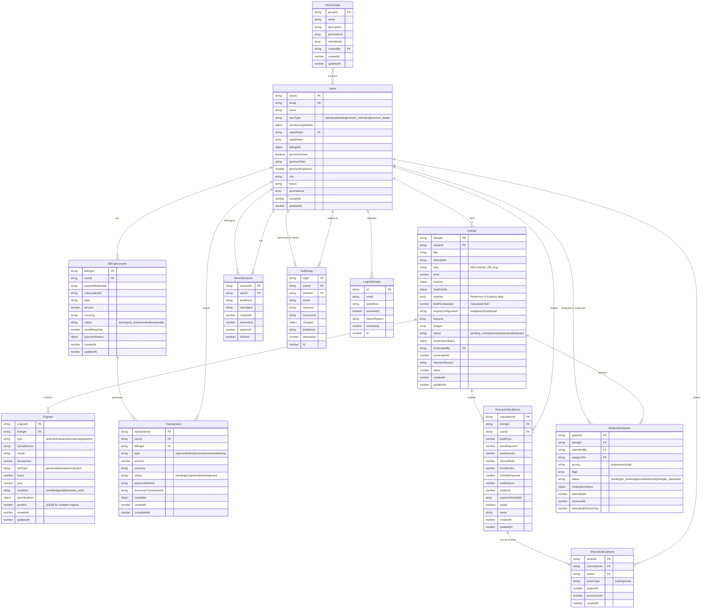

# Enhanced Database Schema Documentation

## Overview

This document describes the enhanced database schema for the HarborList boat marketplace, including new tables and modifications to support multi-engine boats, user tier management, billing, finance calculations, and content moderation.

## Database Architecture

### Enhanced DynamoDB Tables



## Table Definitions

### Enhanced Users Table

```typescript
interface EnhancedUser {
  userId: string; // Partition Key
  email: string; // Global Secondary Index
  name: string;
  userType: 'individual' | 'dealer' | 'premium_individual' | 'premium_dealer';
  membershipDetails: {
    plan?: string;
    features: string[];
    limits: UserLimits;
    expiresAt?: number;
    autoRenew: boolean;
  };
  salesRepId?: string; // Foreign key to sales representative
  capabilities: UserCapability[];
  billingInfo?: {
    customerId: string;
    paymentMethodId?: string;
    subscriptionId?: string;
  };
  premiumActive: boolean;
  premiumPlan?: string;
  premiumExpiresAt?: number;
  role: 'user' | 'admin' | 'moderator' | 'sales' | 'superadmin';
  status: 'active' | 'inactive' | 'suspended';
  permissions?: AdminPermission[];
  createdAt: number;
  updatedAt: number;
  lastLoginAt?: number;
  emailVerified: boolean;
  profile?: UserProfile;
}

interface UserLimits {
  maxListings: number;
  maxImages: number;
  priorityPlacement: boolean;
  featuredListings: number;
  analyticsAccess: boolean;
  bulkOperations: boolean;
}

interface UserCapability {
  feature: string;
  enabled: boolean;
  limits?: Record<string, number>;
  expiresAt?: number;
  grantedBy: string;
  grantedAt: number;
}
```

### Enhanced Listings Table

```typescript
interface EnhancedListing {
  listingId: string; // Partition Key
  ownerId: string; // Global Secondary Index
  title: string;
  description: string;
  slug: string; // Global Secondary Index for SEO-friendly URLs
  price: number;
  location: {
    city: string;
    state: string;
    zipCode: string;
    coordinates?: {
      lat: number;
      lng: number;
    };
  };
  boatDetails: {
    year: number;
    make: string;
    model: string;
    length: number;
    beam?: number;
    draft?: number;
    hullMaterial?: string;
    fuelCapacity?: number;
    waterCapacity?: number;
  };
  engines: string[]; // Array of engine IDs
  totalHorsepower: number; // Calculated from engines
  engineConfiguration: 'single' | 'twin' | 'triple' | 'quad';
  features: string[];
  images: string[];
  status: 'pending_review' | 'active' | 'inactive' | 'sold' | 'rejected';
  moderationStatus: {
    status: 'pending_review' | 'approved' | 'rejected' | 'changes_requested';
    reviewedBy?: string;
    reviewedAt?: number;
    rejectionReason?: string;
    moderatorNotes?: string;
    requiredChanges?: string[];
  };
  moderatedBy?: string;
  moderatedAt?: number;
  rejectionReason?: string;
  views: number;
  createdAt: number; // Global Secondary Index for date queries
  updatedAt: number;
}
```

### New Engines Table

```typescript
interface Engine {
  engineId: string; // Partition Key
  listingId: string; // Global Secondary Index
  type: 'outboard' | 'inboard' | 'sterndrive' | 'jet' | 'electric';
  manufacturer?: string;
  model?: string;
  horsepower: number;
  fuelType: 'gasoline' | 'diesel' | 'electric' | 'hybrid';
  hours?: number;
  year?: number;
  condition: 'excellent' | 'good' | 'fair' | 'needs_work';
  specifications?: {
    displacement?: number;
    cylinders?: number;
    cooling?: string;
    ignition?: string;
    [key: string]: any;
  };
  position: number; // 1, 2, 3, 4 for multiple engines
  createdAt: number;
  updatedAt: number;
}
```

### New BillingAccounts Table

```typescript
interface BillingAccount {
  billingId: string; // Partition Key
  userId: string; // Global Secondary Index
  paymentMethodId?: string;
  subscriptionId?: string;
  plan: string;
  amount: number; // Amount in cents
  currency: string;
  status: 'active' | 'past_due' | 'canceled' | 'suspended';
  nextBillingDate: number;
  paymentHistory: PaymentHistoryItem[];
  createdAt: number;
  updatedAt: number;
}

interface PaymentHistoryItem {
  transactionId: string;
  amount: number;
  status: string;
  date: number;
}
```

### New Transactions Table

```typescript
interface Transaction {
  transactionId: string; // Partition Key
  userId: string; // Global Secondary Index
  billingId: string;
  type: 'payment' | 'refund' | 'commission' | 'membership';
  amount: number; // Amount in cents
  currency: string;
  status: 'pending' | 'completed' | 'failed' | 'disputed';
  paymentMethod: string;
  processorTransactionId: string;
  metadata: {
    plan?: string;
    period?: string;
    description?: string;
    [key: string]: any;
  };
  createdAt: number; // Global Secondary Index for date queries
  completedAt?: number;
}
```

### New FinanceCalculations Table

```typescript
interface FinanceCalculation {
  calculationId: string; // Partition Key
  listingId?: string; // Global Secondary Index
  userId?: string; // Global Secondary Index
  boatPrice: number;
  downPayment: number;
  loanAmount: number;
  interestRate: number;
  termMonths: number;
  monthlyPayment: number;
  totalInterest: number;
  totalCost: number;
  paymentSchedule: PaymentScheduleItem[];
  saved: boolean;
  name?: string;
  createdAt: number; // Global Secondary Index for date queries
  updatedAt: number;
}

interface PaymentScheduleItem {
  month: number;
  payment: number;
  principal: number;
  interest: number;
  balance: number;
}
```

### New SharedCalculations Table

```typescript
interface SharedCalculation {
  shareId: string; // Partition Key
  calculationId: string; // Global Secondary Index
  userId: string;
  shareType: 'public' | 'private';
  expiresAt: number; // TTL field
  accessCount: number;
  createdAt: number;
}
```

### New ModerationQueue Table

```typescript
interface ModerationQueueItem {
  queueId: string; // Partition Key
  listingId: string; // Global Secondary Index
  submittedBy: string;
  assignedTo?: string; // Global Secondary Index
  priority: 'low' | 'medium' | 'high';
  flags: string[];
  status: 'pending' | 'in_review' | 'approved' | 'rejected' | 'changes_requested';
  moderationNotes?: {
    reviewerId: string;
    decision: string;
    reason: string;
    publicNotes?: string;
    internalNotes?: string;
    requiredChanges?: string[];
  };
  submittedAt: number; // Global Secondary Index for date queries
  reviewedAt?: number;
  estimatedReviewTime?: number;
}
```

### New UserGroups Table

```typescript
interface UserGroup {
  groupId: string; // Partition Key
  name: string;
  description: string;
  permissions: AdminPermission[];
  memberIds: string[];
  createdBy: string;
  createdAt: number;
  updatedAt: number;
}
```

## Global Secondary Indexes (GSI)

### Users Table GSIs
- **UserEmailIndex**: email (PK) → userId
- **UserTypeIndex**: userType (PK), createdAt (SK)
- **SalesRepIndex**: salesRepId (PK), userId (SK)
- **PremiumExpiryIndex**: premiumExpiresAt (PK), userId (SK)

### Listings Table GSIs
- **OwnerIndex**: ownerId (PK), createdAt (SK)
- **StatusIndex**: status (PK), createdAt (SK)
- **SlugIndex**: slug (PK) → listingId
- **PriceIndex**: price (PK), createdAt (SK)
- **LocationIndex**: location.state (PK), location.city (SK)
- **HorsepowerIndex**: totalHorsepower (PK), createdAt (SK)

### Engines Table GSIs
- **ListingEnginesIndex**: listingId (PK), position (SK)
- **EngineTypeIndex**: type (PK), horsepower (SK)
- **ManufacturerIndex**: manufacturer (PK), model (SK)

### BillingAccounts Table GSIs
- **UserBillingIndex**: userId (PK), createdAt (SK)
- **StatusIndex**: status (PK), nextBillingDate (SK)
- **SubscriptionIndex**: subscriptionId (PK) → billingId

### Transactions Table GSIs
- **UserTransactionsIndex**: userId (PK), createdAt (SK)
- **StatusIndex**: status (PK), createdAt (SK)
- **TypeIndex**: type (PK), createdAt (SK)
- **ProcessorIndex**: processorTransactionId (PK) → transactionId

### FinanceCalculations Table GSIs
- **UserCalculationsIndex**: userId (PK), createdAt (SK)
- **ListingCalculationsIndex**: listingId (PK), createdAt (SK)
- **SavedCalculationsIndex**: saved (PK), createdAt (SK)

### ModerationQueue Table GSIs
- **StatusIndex**: status (PK), submittedAt (SK)
- **AssignedIndex**: assignedTo (PK), submittedAt (SK)
- **PriorityIndex**: priority (PK), submittedAt (SK)
- **ListingModerationIndex**: listingId (PK), submittedAt (SK)

## Database Operations

### Multi-Engine Listing Operations

```typescript
// Create listing with engines
async createListingWithEngines(listing: EnhancedListing, engines: Engine[]): Promise<void> {
  const transactItems = [
    {
      Put: {
        TableName: 'boat-listings',
        Item: listing
      }
    },
    ...engines.map(engine => ({
      Put: {
        TableName: 'boat-engines',
        Item: engine
      }
    }))
  ];
  
  await this.dynamodb.transactWrite({ TransactItems: transactItems }).promise();
}

// Get listing with engines
async getListingWithEngines(listingId: string): Promise<EnhancedListing | null> {
  const [listing, engines] = await Promise.all([
    this.getListing(listingId),
    this.getEnginesByListing(listingId)
  ]);
  
  if (!listing) return null;
  
  return {
    ...listing,
    engines: engines.map(e => e.engineId),
    totalHorsepower: engines.reduce((sum, e) => sum + e.horsepower, 0),
    engineConfiguration: this.getEngineConfiguration(engines.length)
  };
}
```

### User Tier Management Operations

```typescript
// Update user tier with transaction
async updateUserTier(userId: string, newTier: UserType, capabilities: UserCapability[]): Promise<void> {
  const timestamp = Date.now();
  
  const transactItems = [
    {
      Update: {
        TableName: 'boat-users',
        Key: { userId },
        UpdateExpression: 'SET userType = :type, capabilities = :caps, updatedAt = :timestamp',
        ExpressionAttributeValues: {
          ':type': newTier,
          ':caps': capabilities,
          ':timestamp': timestamp
        }
      }
    },
    {
      Put: {
        TableName: 'boat-audit-logs',
        Item: {
          logId: generateId(),
          userId,
          action: 'USER_TIER_UPDATE',
          resource: 'user',
          resourceId: userId,
          changes: { userType: newTier },
          timestamp
        }
      }
    }
  ];
  
  await this.dynamodb.transactWrite({ TransactItems: transactItems }).promise();
}
```

### Billing Operations

```typescript
// Create subscription with billing account
async createSubscription(subscription: BillingAccount, initialTransaction: Transaction): Promise<void> {
  const transactItems = [
    {
      Put: {
        TableName: 'boat-billing-accounts',
        Item: subscription
      }
    },
    {
      Put: {
        TableName: 'boat-transactions',
        Item: initialTransaction
      }
    },
    {
      Update: {
        TableName: 'boat-users',
        Key: { userId: subscription.userId },
        UpdateExpression: 'SET premiumActive = :active, premiumPlan = :plan, premiumExpiresAt = :expires',
        ExpressionAttributeValues: {
          ':active': true,
          ':plan': subscription.plan,
          ':expires': subscription.nextBillingDate
        }
      }
    }
  ];
  
  await this.dynamodb.transactWrite({ TransactItems: transactItems }).promise();
}
```

## Performance Optimizations

### Query Patterns

```typescript
// Efficient multi-engine search
async searchListingsByEngineSpecs(filters: EngineSearchFilters): Promise<EnhancedListing[]> {
  // First, find engines matching criteria
  const engineQuery = {
    TableName: 'boat-engines',
    IndexName: 'EngineTypeIndex',
    KeyConditionExpression: '#type = :type',
    FilterExpression: 'horsepower BETWEEN :minHp AND :maxHp',
    ExpressionAttributeNames: {
      '#type': 'type'
    },
    ExpressionAttributeValues: {
      ':type': filters.engineType,
      ':minHp': filters.minHorsepower,
      ':maxHp': filters.maxHorsepower
    }
  };
  
  const engines = await this.dynamodb.query(engineQuery).promise();
  const listingIds = [...new Set(engines.Items?.map(e => e.listingId))];
  
  // Batch get listings
  const listings = await this.batchGetListings(listingIds);
  
  return listings.filter(listing => 
    listing.status === 'active' && 
    this.matchesAdditionalFilters(listing, filters)
  );
}
```

### Caching Strategy

```typescript
// Cache frequently accessed data
export class CachedDatabaseService extends DatabaseService {
  constructor(
    dynamodb: DynamoDB.DocumentClient,
    private cache: RedisClient
  ) {
    super(dynamodb);
  }

  async getListingWithEngines(listingId: string): Promise<EnhancedListing | null> {
    const cacheKey = `listing:${listingId}:with-engines`;
    
    // Try cache first
    const cached = await this.cache.get(cacheKey);
    if (cached) {
      return JSON.parse(cached);
    }
    
    // Get from database
    const listing = await super.getListingWithEngines(listingId);
    
    // Cache for 5 minutes
    if (listing) {
      await this.cache.setex(cacheKey, 300, JSON.stringify(listing));
    }
    
    return listing;
  }
}
```

## Migration Scripts

### Adding New Tables

```typescript
// Migration script for new tables
export async function migrateToEnhancedSchema(): Promise<void> {
  const newTables = [
    {
      TableName: 'boat-engines',
      KeySchema: [
        { AttributeName: 'engineId', KeyType: 'HASH' }
      ],
      AttributeDefinitions: [
        { AttributeName: 'engineId', AttributeType: 'S' },
        { AttributeName: 'listingId', AttributeType: 'S' },
        { AttributeName: 'position', AttributeType: 'N' }
      ],
      GlobalSecondaryIndexes: [
        {
          IndexName: 'ListingEnginesIndex',
          KeySchema: [
            { AttributeName: 'listingId', KeyType: 'HASH' },
            { AttributeName: 'position', KeyType: 'RANGE' }
          ],
          Projection: { ProjectionType: 'ALL' }
        }
      ]
    },
    // ... other new tables
  ];
  
  for (const table of newTables) {
    await createTableIfNotExists(table);
  }
}
```

### Data Migration

```typescript
// Migrate existing listings to include engine data
export async function migrateListingsToMultiEngine(): Promise<void> {
  const listings = await getAllListings();
  
  for (const listing of listings) {
    if (!listing.engines || listing.engines.length === 0) {
      // Create default engine from existing boat details
      const defaultEngine: Engine = {
        engineId: generateId(),
        listingId: listing.listingId,
        type: 'outboard', // Default assumption
        horsepower: listing.boatDetails.horsepower || 0,
        fuelType: 'gasoline',
        condition: 'good',
        position: 1,
        createdAt: Date.now(),
        updatedAt: Date.now()
      };
      
      // Update listing and create engine
      await Promise.all([
        this.updateListing(listing.listingId, {
          engines: [defaultEngine.engineId],
          totalHorsepower: defaultEngine.horsepower,
          engineConfiguration: 'single'
        }),
        this.createEngine(defaultEngine)
      ]);
    }
  }
}
```

This enhanced database schema supports all the new features while maintaining backward compatibility and optimizing for the most common query patterns.