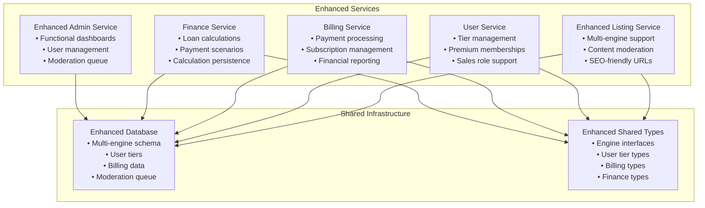

# Enhanced Services Integration Guide

## Overview

This guide covers integrating with the enhanced HarborList services including multi-engine listings, user tier management, billing, finance calculations, and content moderation. It provides practical examples and best practices for developers.

## Service Architecture

### Enhanced Microservices



## Multi-Engine Listing Integration

### TypeScript Interfaces

```typescript
// Enhanced listing types
interface Engine {
  engineId: string;
  type: 'outboard' | 'inboard' | 'sterndrive' | 'jet' | 'electric';
  manufacturer?: string;
  model?: string;
  horsepower: number;
  fuelType: 'gasoline' | 'diesel' | 'electric' | 'hybrid';
  hours?: number;
  year?: number;
  condition: 'excellent' | 'good' | 'fair' | 'needs_work';
  position: number;
}

interface EnhancedListing extends Listing {
  engines: Engine[];
  totalHorsepower: number;
  engineConfiguration: 'single' | 'twin' | 'triple' | 'quad';
  slug: string;
  moderationStatus: ModerationStatus;
}

interface ModerationStatus {
  status: 'pending_review' | 'approved' | 'rejected' | 'changes_requested';
  reviewedBy?: string;
  reviewedAt?: number;
  rejectionReason?: string;
  moderatorNotes?: string;
  requiredChanges?: string[];
}
```

### Creating Multi-Engine Listings

```typescript
// Frontend integration example
import { EnhancedListingService } from '@/services/enhanced-listing';

class MultiEngineListingForm {
  private listingService = new EnhancedListingService();

  async createListing(listingData: CreateListingRequest): Promise<EnhancedListing> {
    // Validate engine configuration
    this.validateEngineConfiguration(listingData.engines);
    
    // Calculate total horsepower
    const totalHorsepower = listingData.engines.reduce(
      (sum, engine) => sum + engine.horsepower, 0
    );
    
    // Determine engine configuration
    const engineConfiguration = this.getEngineConfiguration(listingData.engines.length);
    
    const enhancedListing = {
      ...listingData,
      totalHorsepower,
      engineConfiguration,
      status: 'pending_review' // All new listings go through moderation
    };
    
    try {
      const result = await this.listingService.create(enhancedListing);
      
      // Handle moderation queue notification
      this.showModerationNotification(result.moderationStatus);
      
      return result;
    } catch (error) {
      this.handleListingError(error);
      throw error;
    }
  }

  private validateEngineConfiguration(engines: Engine[]): void {
    if (engines.length === 0) {
      throw new Error('At least one engine is required');
    }
    
    if (engines.length > 4) {
      throw new Error('Maximum 4 engines supported');
    }
    
    // Validate each engine
    engines.forEach((engine, index) => {
      if (engine.horsepower <= 0) {
        throw new Error(`Engine ${index + 1}: Horsepower must be positive`);
      }
      
      if (!engine.type) {
        throw new Error(`Engine ${index + 1}: Engine type is required`);
      }
    });
  }

  private getEngineConfiguration(engineCount: number): string {
    const configurations = {
      1: 'single',
      2: 'twin', 
      3: 'triple',
      4: 'quad'
    };
    return configurations[engineCount] || 'multiple';
  }
}
```

### Backend Service Integration

```typescript
// Backend service implementation
import { DatabaseService } from '@/shared/database';
import { ModerationService } from '@/services/moderation';

export class EnhancedListingService {
  constructor(
    private db: DatabaseService,
    private moderation: ModerationService
  ) {}

  async createListing(listingData: CreateListingRequest): Promise<EnhancedListing> {
    // Generate SEO-friendly slug
    const slug = this.generateSlug(listingData.title);
    
    // Create listing with pending review status
    const listing: EnhancedListing = {
      ...listingData,
      listingId: generateId(),
      slug,
      status: 'pending_review',
      totalHorsepower: this.calculateTotalHorsepower(listingData.engines),
      engineConfiguration: this.getEngineConfiguration(listingData.engines.length),
      createdAt: Date.now(),
      updatedAt: Date.now()
    };

    // Save to database
    await this.db.createListing(listing);
    
    // Create engines records
    await Promise.all(
      listing.engines.map(engine => 
        this.db.createEngine({
          ...engine,
          listingId: listing.listingId,
          engineId: generateId()
        })
      )
    );
    
    // Add to moderation queue
    await this.moderation.addToQueue({
      listingId: listing.listingId,
      submittedBy: listing.ownerId,
      priority: this.getModerationPriority(listing),
      submittedAt: Date.now()
    });
    
    return listing;
  }

  private generateSlug(title: string): string {
    return title
      .toLowerCase()
      .replace(/[^a-z0-9\s-]/g, '')
      .replace(/\s+/g, '-')
      .replace(/-+/g, '-')
      .trim();
  }

  private getModerationPriority(listing: EnhancedListing): 'high' | 'medium' | 'low' {
    // Premium users get higher priority
    if (listing.ownerType?.includes('premium')) {
      return 'high';
    }
    
    // High-value listings get medium priority
    if (listing.price > 100000) {
      return 'medium';
    }
    
    return 'low';
  }
}
```

## User Tier Management Integration

### User Service Integration

```typescript
// User tier management service
export class UserTierService {
  constructor(private db: DatabaseService, private billing: BillingService) {}

  async upgradeUserTier(
    userId: string, 
    targetTier: UserType,
    paymentMethodId?: string
  ): Promise<UserUpgradeResult> {
    
    const user = await this.db.getUser(userId);
    if (!user) {
      throw new Error('User not found');
    }

    // Validate tier transition
    this.validateTierTransition(user.userType, targetTier);
    
    // Calculate pricing
    const pricing = this.getTierPricing(targetTier);
    
    // Process payment if premium tier
    if (this.isPremiumTier(targetTier)) {
      if (!paymentMethodId) {
        throw new Error('Payment method required for premium tier');
      }
      
      await this.billing.createSubscription({
        userId,
        plan: targetTier,
        paymentMethodId,
        amount: pricing.monthly
      });
    }
    
    // Update user tier
    const updatedUser = await this.db.updateUser(userId, {
      userType: targetTier,
      membershipDetails: this.getMembershipDetails(targetTier),
      capabilities: this.getTierCapabilities(targetTier),
      updatedAt: Date.now()
    });
    
    // Log tier change for audit
    await this.db.createAuditLog({
      userId,
      action: 'USER_TIER_UPGRADE',
      resource: 'user',
      resourceId: userId,
      changes: {
        from: user.userType,
        to: targetTier
      },
      timestamp: Date.now()
    });
    
    return {
      success: true,
      user: updatedUser,
      subscription: this.isPremiumTier(targetTier) ? 
        await this.billing.getSubscription(userId) : null
    };
  }

  private validateTierTransition(currentTier: UserType, targetTier: UserType): void {
    const validTransitions = {
      'individual': ['dealer', 'premium_individual'],
      'dealer': ['premium_dealer'],
      'premium_individual': ['premium_dealer'],
      'premium_dealer': [] // Cannot downgrade automatically
    };
    
    if (!validTransitions[currentTier]?.includes(targetTier)) {
      throw new Error(`Invalid tier transition from ${currentTier} to ${targetTier}`);
    }
  }

  private getTierCapabilities(tier: UserType): UserCapability[] {
    const capabilityMap = {
      'individual': [
        { feature: 'max_listings', limit: 3 },
        { feature: 'max_images', limit: 10 }
      ],
      'dealer': [
        { feature: 'max_listings', limit: 25 },
        { feature: 'max_images', limit: 15 },
        { feature: 'bulk_operations', enabled: true }
      ],
      'premium_individual': [
        { feature: 'max_listings', limit: 10 },
        { feature: 'max_images', limit: 20 },
        { feature: 'priority_placement', enabled: true },
        { feature: 'enhanced_analytics', enabled: true }
      ],
      'premium_dealer': [
        { feature: 'max_listings', limit: 100 },
        { feature: 'max_images', limit: 25 },
        { feature: 'bulk_operations', enabled: true },
        { feature: 'priority_placement', enabled: true },
        { feature: 'enhanced_analytics', enabled: true },
        { feature: 'dealer_branding', enabled: true }
      ]
    };
    
    return capabilityMap[tier] || [];
  }
}
```

## Finance Calculator Integration

### Frontend Calculator Component

```typescript
// React component for finance calculator
import React, { useState, useEffect } from 'react';
import { FinanceCalculatorService } from '@/services/finance';

interface FinanceCalculatorProps {
  boatPrice: number;
  listingId?: string;
  onCalculationComplete?: (calculation: FinanceCalculation) => void;
}

export const FinanceCalculator: React.FC<FinanceCalculatorProps> = ({
  boatPrice,
  listingId,
  onCalculationComplete
}) => {
  const [calculation, setCalculation] = useState<FinanceCalculation | null>(null);
  const [parameters, setParameters] = useState({
    downPayment: boatPrice * 0.2, // 20% default
    interestRate: 6.5,
    termMonths: 180 // 15 years
  });
  
  const financeService = new FinanceCalculatorService();

  useEffect(() => {
    calculatePayments();
  }, [parameters, boatPrice]);

  const calculatePayments = async () => {
    try {
      const result = await financeService.calculate({
        boatPrice,
        downPayment: parameters.downPayment,
        interestRate: parameters.interestRate,
        termMonths: parameters.termMonths
      });
      
      setCalculation(result);
      onCalculationComplete?.(result);
    } catch (error) {
      console.error('Calculation error:', error);
    }
  };

  const saveCalculation = async () => {
    if (!calculation) return;
    
    try {
      await financeService.save({
        calculationId: calculation.calculationId,
        name: `Boat Financing - ${new Date().toLocaleDateString()}`,
        listingId
      });
      
      // Show success notification
    } catch (error) {
      console.error('Save error:', error);
    }
  };

  const shareCalculation = async () => {
    if (!calculation) return;
    
    try {
      const shareResult = await financeService.share({
        calculationId: calculation.calculationId,
        shareType: 'public'
      });
      
      // Copy share URL to clipboard
      await navigator.clipboard.writeText(shareResult.shareUrl);
      
      // Show success notification
    } catch (error) {
      console.error('Share error:', error);
    }
  };

  return (
    <div className="finance-calculator">
      <h3>Finance Calculator</h3>
      
      <div className="calculator-inputs">
        <div className="input-group">
          <label>Boat Price</label>
          <input 
            type="number" 
            value={boatPrice} 
            disabled 
          />
        </div>
        
        <div className="input-group">
          <label>Down Payment</label>
          <input 
            type="number" 
            value={parameters.downPayment}
            onChange={(e) => setParameters({
              ...parameters,
              downPayment: Number(e.target.value)
            })}
          />
        </div>
        
        <div className="input-group">
          <label>Interest Rate (%)</label>
          <input 
            type="number" 
            step="0.1"
            value={parameters.interestRate}
            onChange={(e) => setParameters({
              ...parameters,
              interestRate: Number(e.target.value)
            })}
          />
        </div>
        
        <div className="input-group">
          <label>Loan Term (months)</label>
          <select 
            value={parameters.termMonths}
            onChange={(e) => setParameters({
              ...parameters,
              termMonths: Number(e.target.value)
            })}
          >
            <option value={120}>10 years</option>
            <option value={180}>15 years</option>
            <option value={240}>20 years</option>
          </select>
        </div>
      </div>
      
      {calculation && (
        <div className="calculation-results">
          <div className="result-item">
            <span>Monthly Payment:</span>
            <strong>${calculation.monthlyPayment.toFixed(2)}</strong>
          </div>
          
          <div className="result-item">
            <span>Total Interest:</span>
            <span>${calculation.totalInterest.toFixed(2)}</span>
          </div>
          
          <div className="result-item">
            <span>Total Cost:</span>
            <span>${calculation.totalCost.toFixed(2)}</span>
          </div>
          
          <div className="calculator-actions">
            <button onClick={saveCalculation}>Save Calculation</button>
            <button onClick={shareCalculation}>Share Calculation</button>
          </div>
        </div>
      )}
    </div>
  );
};
```

### Backend Finance Service

```typescript
// Finance calculation service
export class FinanceCalculatorService {
  constructor(private db: DatabaseService) {}

  async calculate(params: CalculationParams): Promise<FinanceCalculation> {
    const {
      boatPrice,
      downPayment,
      interestRate,
      termMonths
    } = params;

    // Validate inputs
    this.validateCalculationParams(params);
    
    const loanAmount = boatPrice - downPayment;
    const monthlyRate = interestRate / 100 / 12;
    
    // Calculate monthly payment using loan formula
    const monthlyPayment = this.calculateMonthlyPayment(
      loanAmount,
      monthlyRate,
      termMonths
    );
    
    const totalPayments = monthlyPayment * termMonths;
    const totalInterest = totalPayments - loanAmount;
    const totalCost = boatPrice + totalInterest;
    
    // Generate payment schedule
    const paymentSchedule = this.generatePaymentSchedule(
      loanAmount,
      monthlyPayment,
      monthlyRate,
      termMonths
    );
    
    const calculation: FinanceCalculation = {
      calculationId: generateId(),
      boatPrice,
      downPayment,
      loanAmount,
      interestRate,
      termMonths,
      monthlyPayment,
      totalInterest,
      totalCost,
      paymentSchedule,
      createdAt: Date.now()
    };
    
    return calculation;
  }

  private calculateMonthlyPayment(
    principal: number,
    monthlyRate: number,
    termMonths: number
  ): number {
    if (monthlyRate === 0) {
      return principal / termMonths;
    }
    
    const factor = Math.pow(1 + monthlyRate, termMonths);
    return principal * (monthlyRate * factor) / (factor - 1);
  }

  private generatePaymentSchedule(
    loanAmount: number,
    monthlyPayment: number,
    monthlyRate: number,
    termMonths: number
  ): PaymentScheduleItem[] {
    const schedule: PaymentScheduleItem[] = [];
    let remainingBalance = loanAmount;
    
    for (let month = 1; month <= termMonths; month++) {
      const interestPayment = remainingBalance * monthlyRate;
      const principalPayment = monthlyPayment - interestPayment;
      remainingBalance -= principalPayment;
      
      schedule.push({
        month,
        payment: monthlyPayment,
        principal: principalPayment,
        interest: interestPayment,
        balance: Math.max(0, remainingBalance)
      });
    }
    
    return schedule;
  }

  async saveCalculation(saveRequest: SaveCalculationRequest): Promise<SavedCalculation> {
    const savedCalculation = {
      ...saveRequest,
      savedCalculationId: generateId(),
      saved: true,
      savedAt: Date.now()
    };
    
    await this.db.saveFinanceCalculation(savedCalculation);
    
    return savedCalculation;
  }
}
```

## Content Moderation Integration

### Moderation Queue Management

```typescript
// Moderation service integration
export class ModerationService {
  constructor(private db: DatabaseService, private notifications: NotificationService) {}

  async addToQueue(queueItem: ModerationQueueItem): Promise<void> {
    const queueEntry = {
      ...queueItem,
      queueId: generateId(),
      status: 'pending' as const,
      flags: this.generateFlags(queueItem),
      submittedAt: Date.now()
    };
    
    await this.db.createModerationQueueItem(queueEntry);
    
    // Notify moderation team
    await this.notifications.notifyModerationTeam(queueEntry);
  }

  async processDecision(decision: ModerationDecision): Promise<void> {
    const queueItem = await this.db.getModerationQueueItem(decision.queueId);
    if (!queueItem) {
      throw new Error('Queue item not found');
    }
    
    // Update queue item
    await this.db.updateModerationQueueItem(decision.queueId, {
      status: decision.decision,
      moderatedBy: decision.moderatorId,
      moderatedAt: Date.now(),
      moderatorNotes: decision.notes
    });
    
    // Update listing status
    const newStatus = this.getListingStatus(decision.decision);
    await this.db.updateListing(queueItem.listingId, {
      status: newStatus,
      moderationStatus: {
        status: decision.decision,
        reviewedBy: decision.moderatorId,
        reviewedAt: Date.now(),
        moderatorNotes: decision.notes
      }
    });
    
    // Notify listing owner
    await this.notifications.notifyListingOwner(queueItem.submittedBy, {
      decision: decision.decision,
      listingId: queueItem.listingId,
      notes: decision.publicNotes
    });
  }

  private generateFlags(queueItem: ModerationQueueItem): string[] {
    const flags = ['new_listing'];
    
    // Add flags based on listing characteristics
    if (queueItem.priority === 'high') {
      flags.push('high_priority');
    }
    
    if (queueItem.listingPrice > 500000) {
      flags.push('high_value');
    }
    
    return flags;
  }
}
```

## Error Handling and Best Practices

### Enhanced Error Handling

```typescript
// Enhanced error types
export enum EnhancedErrorCodes {
  MULTI_ENGINE_VALIDATION_ERROR = 'MULTI_ENGINE_VALIDATION_ERROR',
  TIER_LIMIT_EXCEEDED = 'TIER_LIMIT_EXCEEDED',
  PREMIUM_MEMBERSHIP_REQUIRED = 'PREMIUM_MEMBERSHIP_REQUIRED',
  BILLING_ACCOUNT_SUSPENDED = 'BILLING_ACCOUNT_SUSPENDED',
  CALCULATION_SAVE_FAILED = 'CALCULATION_SAVE_FAILED',
  MODERATION_QUEUE_FULL = 'MODERATION_QUEUE_FULL'
}

export class EnhancedError extends Error {
  constructor(
    public code: EnhancedErrorCodes,
    message: string,
    public details?: any
  ) {
    super(message);
    this.name = 'EnhancedError';
  }
}

// Error handling middleware
export const handleEnhancedErrors = (error: any) => {
  if (error instanceof EnhancedError) {
    return {
      success: false,
      error: {
        code: error.code,
        message: error.message,
        details: error.details
      }
    };
  }
  
  // Handle other error types
  return {
    success: false,
    error: {
      code: 'INTERNAL_ERROR',
      message: 'An unexpected error occurred'
    }
  };
};
```

### Integration Testing

```typescript
// Integration test example
describe('Enhanced Services Integration', () => {
  let listingService: EnhancedListingService;
  let userService: UserTierService;
  let financeService: FinanceCalculatorService;
  
  beforeEach(() => {
    // Setup test services
  });
  
  it('should create multi-engine listing and add to moderation queue', async () => {
    const listingData = {
      title: 'Test Twin Engine Boat',
      engines: [
        { type: 'outboard', horsepower: 250, position: 1 },
        { type: 'outboard', horsepower: 250, position: 2 }
      ]
    };
    
    const result = await listingService.createListing(listingData);
    
    expect(result.totalHorsepower).toBe(500);
    expect(result.engineConfiguration).toBe('twin');
    expect(result.status).toBe('pending_review');
  });
  
  it('should upgrade user tier and enable premium features', async () => {
    const userId = 'test_user_123';
    
    const result = await userService.upgradeUserTier(
      userId,
      'premium_individual',
      'pm_test_payment_method'
    );
    
    expect(result.success).toBe(true);
    expect(result.user.userType).toBe('premium_individual');
    expect(result.subscription).toBeDefined();
  });
});
```

## Performance Considerations

### Caching Strategies

```typescript
// Redis caching for finance calculations
export class CachedFinanceService extends FinanceCalculatorService {
  constructor(
    db: DatabaseService,
    private cache: RedisClient
  ) {
    super(db);
  }

  async calculate(params: CalculationParams): Promise<FinanceCalculation> {
    const cacheKey = this.generateCacheKey(params);
    
    // Try to get from cache first
    const cached = await this.cache.get(cacheKey);
    if (cached) {
      return JSON.parse(cached);
    }
    
    // Calculate and cache result
    const result = await super.calculate(params);
    await this.cache.setex(cacheKey, 3600, JSON.stringify(result)); // 1 hour cache
    
    return result;
  }

  private generateCacheKey(params: CalculationParams): string {
    return `finance_calc:${params.boatPrice}:${params.downPayment}:${params.interestRate}:${params.termMonths}`;
  }
}
```

### Database Optimization

```typescript
// Optimized database queries for multi-engine listings
export class OptimizedListingService {
  async getListingsWithEngines(filters: ListingFilters): Promise<EnhancedListing[]> {
    // Use batch operations for better performance
    const listings = await this.db.queryListings(filters);
    
    // Batch fetch engines for all listings
    const listingIds = listings.map(l => l.listingId);
    const engines = await this.db.batchGetEngines(listingIds);
    
    // Group engines by listing
    const enginesByListing = engines.reduce((acc, engine) => {
      if (!acc[engine.listingId]) {
        acc[engine.listingId] = [];
      }
      acc[engine.listingId].push(engine);
      return acc;
    }, {} as Record<string, Engine[]>);
    
    // Combine listings with their engines
    return listings.map(listing => ({
      ...listing,
      engines: enginesByListing[listing.listingId] || [],
      totalHorsepower: this.calculateTotalHorsepower(enginesByListing[listing.listingId] || [])
    }));
  }
}
```

For more detailed integration examples and advanced patterns, refer to the service-specific documentation in each service directory.