# ⚛️ Frontend Application Documentation

## 📋 **Overview**

The HarborList frontend is a modern React 18 application built with TypeScript, providing both a public marketplace interface and a comprehensive admin portal. The application emphasizes performance, accessibility, and maintainable code architecture.

---

## 🏗️ **Frontend Architecture**

### **Application Structure**

### **Frontend Application Structure**

```mermaid
graph TB
    subgraph "Frontend Application"
        Root[frontend/]
        
        subgraph "Source Code - src/"
            Components[components/<br/>📦 Reusable UI Components]
            Pages[pages/<br/>📄 Route-level Components]
            Hooks[hooks/<br/>🎣 Custom React Hooks]
            Services[services/<br/>🔌 API Client Services]
            Contexts[contexts/<br/>🌐 React Context Providers]
            Types[types/<br/>📝 TypeScript Definitions]
            Utils[utils/<br/>🛠️ Utility Functions]
            Styles[styles/<br/>🎨 Global Styles & Themes]
            Test[test/<br/>🧪 Test Utilities & Setup]
        end
        
        subgraph "Component Categories"
            AdminComp[admin/<br/>👤 Admin Portal Components<br/>• User Management<br/>• Analytics Dashboards<br/>• Content Moderation]
            
            AuthComp[auth/<br/>🔐 Authentication Components<br/>• Login Forms<br/>• Registration<br/>• MFA Setup]
            
            CommonComp[common/<br/>🔄 Shared UI Components<br/>• Buttons, Inputs<br/>• Modals, Alerts<br/>• Loading States]
            
            LayoutComp[layout/<br/>🏗️ Layout & Navigation<br/>• Header, Footer<br/>• Sidebar Navigation<br/>• Responsive Layout]
            
            ListingComp[listing/<br/>🚢 Boat Listing Components<br/>• Listing Cards<br/>• Detail Views<br/>• Creation Forms]
            
            SearchComp[search/<br/>🔍 Search & Filter Components<br/>• Search Bar<br/>• Filter Panels<br/>• Results Display]
        end
        
        subgraph "Page Structure"
            AdminPages[admin/<br/>📊 Admin Dashboard Pages<br/>• Analytics Overview<br/>• User Management<br/>• System Configuration]
            
            PublicPages[*.tsx<br/>🌐 Public Marketplace Pages<br/>• Homepage<br/>• Listing Details<br/>• Search Results]
        end
        
        subgraph "Build & Testing"
            Cypress[cypress/<br/>🧪 End-to-End Testing<br/>• User Journey Tests<br/>• Integration Tests<br/>• Visual Regression]
            
            Public[public/<br/>📁 Static Assets<br/>• Images, Icons<br/>• Manifest Files<br/>• Favicon]
            
            Dist[dist/<br/>📦 Build Output<br/>• Optimized Bundles<br/>• Static Assets<br/>• Production Ready]
        end
    end
    
    Root --> Components
    Root --> Pages
    Root --> Hooks
    Root --> Services
    Root --> Contexts
    Root --> Types
    Root --> Utils
    Root --> Styles
    Root --> Test
    Root --> Cypress
    Root --> Public
    Root --> Dist
    
    Components --> AdminComp
    Components --> AuthComp
    Components --> CommonComp
    Components --> LayoutComp
    Components --> ListingComp
    Components --> SearchComp
    
    Pages --> AdminPages
    Pages --> PublicPages
    
    style Components fill:#e3f2fd,stroke:#1565c0,stroke-width:2px
    style Pages fill:#e8f5e8,stroke:#388e3c,stroke-width:2px
    style Services fill:#fff3e0,stroke:#f57c00,stroke-width:2px
    style AdminComp fill:#f3e5f5,stroke:#7b1fa2,stroke-width:2px
    style AuthComp fill:#ffebee,stroke:#d32f2f,stroke-width:2px
    style ListingComp fill:#e0f2f1,stroke:#00796b,stroke-width:2px
```



### **Technology Stack**

| Technology | Version | Purpose | Configuration |
|------------|---------|---------|---------------|
| **React** | 18.2+ | UI Framework | Concurrent features, Suspense |
| **TypeScript** | 5.0+ | Type Safety | Strict mode, comprehensive types |
| **Vite** | 4.4+ | Build Tool | Fast HMR, optimized builds |
| **TanStack Query** | Latest | Server State | Caching, background updates |
| **React Router** | 6+ | Navigation | Nested routes, lazy loading |
| **Tailwind CSS** | 3+ | Styling | Utility-first, responsive design |
| **Heroicons** | 2+ | Icons | Consistent icon system |

---

## 🔐 **Authentication Architecture**

### **Dual Authentication System**

The frontend implements separate authentication flows for users and administrators:

```typescript
// Authentication Context Structure
interface AuthContextType {
  // User Authentication
  user: User | null;
  login: (email: string, password: string) => Promise<void>;
  logout: () => void;
  register: (userData: RegisterData) => Promise<void>;
  loading: boolean;
  
  // Admin Authentication (Separate Context)
  adminUser: AdminUser | null;
  adminLogin: (credentials: AdminCredentials) => Promise<void>;
  adminLogout: () => void;
  adminLoading: boolean;
}
```

#### **User Authentication Flow**


#### **Admin Authentication Flow**


### **Protected Routes Implementation**

```typescript
// Protected Route Component
interface ProtectedRouteProps {
  children: React.ReactNode;
  requiredRole?: UserRole;
  requiredPermission?: AdminPermission;
}

export const ProtectedRoute: React.FC<ProtectedRouteProps> = ({
  children,
  requiredRole,
  requiredPermission
}) => {
  const { user, loading } = useAuth();
  const location = useLocation();

  if (loading) {
    return <LoadingSpinner />;
  }

  if (!user) {
    return <Navigate to="/login" state={{ from: location }} replace />;
  }

  if (requiredRole && user.role !== requiredRole) {
    return <Navigate to="/unauthorized" replace />;
  }

  if (requiredPermission && !user.permissions?.includes(requiredPermission)) {
    return <Navigate to="/unauthorized" replace />;
  }

  return <>{children}</>;
};

// Admin Protected Route Component  
export const AdminProtectedRoute: React.FC<AdminProtectedRouteProps> = ({
  children,
  requiredPermission
}) => {
  const { adminUser, loading } = useAdminAuth();
  
  if (loading) {
    return <AdminLoadingSpinner />;
  }

  if (!adminUser) {
    return <Navigate to="/admin/login" replace />;
  }

  if (requiredPermission && !adminUser.permissions?.includes(requiredPermission)) {
    return <AdminUnauthorized />;
  }

  return <>{children}</>;
};
```

---

## 🎨 **Component Architecture**

### **Component Design Principles**

1. **🔄 Reusability**: Components designed for multiple contexts
2. **📱 Responsiveness**: Mobile-first responsive design
3. **♿ Accessibility**: WCAG AA compliance standards
4. **🧪 Testability**: Isolated, testable component logic
5. **📦 Composability**: Components compose together naturally

### **Core Component Library**

#### **Layout Components**

```typescript
// Header Component
interface HeaderProps {
  user?: User;
  onMenuToggle?: () => void;
  showSearch?: boolean;
}

export const Header: React.FC<HeaderProps> = ({
  user,
  onMenuToggle,
  showSearch = true
}) => {
  return (
    <header className="bg-white shadow-sm border-b border-gray-200">
      <div className="max-w-7xl mx-auto px-4 sm:px-6 lg:px-8">
        <div className="flex justify-between items-center h-16">
          {/* Logo and Navigation */}
          <div className="flex items-center">
            <Link to="/" className="flex items-center space-x-2">
              <BoatIcon className="h-8 w-8 text-blue-600" />
              <span className="text-xl font-bold text-gray-900">
                HarborList
              </span>
            </Link>
          </div>
          
          {/* Search Bar */}
          {showSearch && (
            <div className="hidden md:block flex-1 max-w-lg mx-8">
              <SearchBar />
            </div>
          )}
          
          {/* User Menu */}
          <div className="flex items-center space-x-4">
            {user ? <UserMenu user={user} /> : <AuthButtons />}
          </div>
        </div>
      </div>
    </header>
  );
};

// Admin Layout Component
export const AdminLayout: React.FC<AdminLayoutProps> = ({ children }) => {
  const [isMobileMenuOpen, setIsMobileMenuOpen] = useState(false);
  const { loading } = useAdminAuth();

  if (loading) {
    return <AdminLoadingScreen />;
  }

  return (
    <div className="h-screen flex overflow-hidden bg-gray-100">
      {/* Sidebar */}
      <AdminSidebar 
        isOpen={isMobileMenuOpen}
        onClose={() => setIsMobileMenuOpen(false)}
      />
      
      {/* Main Content */}
      <div className="flex flex-col w-0 flex-1 overflow-hidden">
        <AdminHeader 
          onMenuToggle={() => setIsMobileMenuOpen(true)}
          isMobileMenuOpen={isMobileMenuOpen}
        />
        <main className="flex-1 relative overflow-y-auto focus:outline-none">
          <div className="py-6">
            <div className="max-w-7xl mx-auto px-4 sm:px-6 md:px-8">
              {children}
            </div>
          </div>
        </main>
      </div>
    </div>
  );
};
```

#### **Data Display Components**

```typescript
// Listing Card Component
interface ListingCardProps {
  listing: Listing;
  showActions?: boolean;
  onEdit?: (id: string) => void;
  onDelete?: (id: string) => void;
  onFeature?: (id: string) => void;
}

export const ListingCard: React.FC<ListingCardProps> = ({
  listing,
  showActions = false,
  onEdit,
  onDelete,
  onFeature
}) => {
  return (
    <div className="bg-white rounded-lg shadow-md overflow-hidden hover:shadow-lg transition-shadow">
      {/* Image Gallery */}
      <div className="relative h-48 bg-gray-200">
        {listing.images?.length > 0 ? (
          <ImageCarousel images={listing.images} />
        ) : (
          <div className="flex items-center justify-center h-full">
            <BoatIcon className="h-12 w-12 text-gray-400" />
          </div>
        )}
        
        {listing.featured && (
          <Badge variant="featured" className="absolute top-2 left-2">
            Featured
          </Badge>
        )}
      </div>

      {/* Content */}
      <div className="p-4">
        <div className="flex justify-between items-start mb-2">
          <h3 className="text-lg font-semibold text-gray-900 truncate">
            {listing.title}
          </h3>
          <span className="text-lg font-bold text-green-600">
            {formatCurrency(listing.price)}
          </span>
        </div>

        <p className="text-gray-600 text-sm mb-3 line-clamp-2">
          {listing.description}
        </p>

        <div className="flex justify-between items-center">
          <div className="flex items-center text-sm text-gray-500">
            <MapPinIcon className="h-4 w-4 mr-1" />
            {listing.location.city}, {listing.location.state}
          </div>
          
          {showActions && (
            <ActionMenu
              onEdit={() => onEdit?.(listing.id)}
              onDelete={() => onDelete?.(listing.id)}
              onFeature={() => onFeature?.(listing.id)}
            />
          )}
        </div>
      </div>
    </div>
  );
};

// Metrics Card Component (Admin Dashboard)
interface MetricCardProps {
  title: string;
  value: string | number;
  change?: {
    value: number;
    type: 'increase' | 'decrease';
    period: string;
  };
  icon: React.ElementType;
  loading?: boolean;
}

export const MetricCard: React.FC<MetricCardProps> = ({
  title,
  value,
  change,
  icon: Icon,
  loading = false
}) => {
  if (loading) {
    return <MetricCardSkeleton />;
  }

  return (
    <div className="bg-white overflow-hidden shadow rounded-lg">
      <div className="p-5">
        <div className="flex items-center">
          <div className="flex-shrink-0">
            <Icon className="h-6 w-6 text-gray-400" />
          </div>
          <div className="ml-5 w-0 flex-1">
            <dl>
              <dt className="text-sm font-medium text-gray-500 truncate">
                {title}
              </dt>
              <dd className="text-lg font-medium text-gray-900">
                {typeof value === 'number' ? formatNumber(value) : value}
              </dd>
            </dl>
          </div>
        </div>
        
        {change && (
          <div className="mt-2">
            <div className="flex items-center text-sm">
              {change.type === 'increase' ? (
                <ArrowUpIcon className="h-4 w-4 text-green-500 mr-1" />
              ) : (
                <ArrowDownIcon className="h-4 w-4 text-red-500 mr-1" />
              )}
              <span className={
                change.type === 'increase' ? 'text-green-600' : 'text-red-600'
              }>
                {Math.abs(change.value)}%
              </span>
              <span className="text-gray-500 ml-1">
                from {change.period}
              </span>
            </div>
          </div>
        )}
      </div>
    </div>
  );
};
```

---

## 🔄 **State Management**

### **Server State with TanStack Query**

```typescript
// Query Configuration
export const queryClient = new QueryClient({
  defaultOptions: {
    queries: {
      staleTime: 5 * 60 * 1000,      // 5 minutes
      cacheTime: 10 * 60 * 1000,     // 10 minutes
      retry: (failureCount, error) => {
        if (error?.status === 404) return false;
        return failureCount < 3;
      },
      retryDelay: attemptIndex => Math.min(1000 * 2 ** attemptIndex, 30000),
    },
    mutations: {
      retry: 1,
      onError: (error) => {
        console.error('Mutation error:', error);
        // Global error handling
        toast.error('An error occurred. Please try again.');
      },
    },
  },
});

// Custom Hooks for API Operations
export const useListings = (filters: SearchFilters = {}) => {
  return useQuery({
    queryKey: ['listings', filters],
    queryFn: () => searchListings(filters),
    keepPreviousData: true,
    staleTime: 2 * 60 * 1000, // 2 minutes for search results
  });
};

export const useListing = (id: string) => {
  return useQuery({
    queryKey: ['listing', id],
    queryFn: () => getListing(id),
    enabled: !!id,
  });
};

export const useCreateListing = () => {
  const queryClient = useQueryClient();
  
  return useMutation({
    mutationFn: createListing,
    onSuccess: (newListing) => {
      // Invalidate listings cache
      queryClient.invalidateQueries(['listings']);
      
      // Add to cache optimistically
      queryClient.setQueryData(['listing', newListing.id], newListing);
      
      toast.success('Listing created successfully!');
    },
    onError: (error) => {
      console.error('Create listing error:', error);
      toast.error('Failed to create listing. Please try again.');
    },
  });
};

// Admin-specific queries
export const useAdminStats = () => {
  return useQuery({
    queryKey: ['admin', 'stats'],
    queryFn: adminApi.getStats,
    staleTime: 5 * 60 * 1000, // 5 minutes
    refetchInterval: 5 * 60 * 1000, // Auto-refresh every 5 minutes
  });
};

export const useUsers = (filters: UserFilters = {}) => {
  return useQuery({
    queryKey: ['admin', 'users', filters],
    queryFn: () => adminApi.getUsers(filters),
    keepPreviousData: true,
  });
};
```

### **Client State with Context**

```typescript
// Toast Notification Context
interface Toast {
  id: string;
  type: 'success' | 'error' | 'warning' | 'info';
  title: string;
  message?: string;
  duration?: number;
}

interface ToastContextType {
  toasts: Toast[];
  addToast: (toast: Omit<Toast, 'id'>) => void;
  removeToast: (id: string) => void;
  clearAllToasts: () => void;
}

export const ToastProvider: React.FC<ToastProviderProps> = ({ 
  children,
  position = 'top-right',
  maxToasts = 5 
}) => {
  const [toasts, setToasts] = useState<Toast[]>([]);

  const addToast = useCallback((toast: Omit<Toast, 'id'>) => {
    const id = generateId();
    const newToast: Toast = { ...toast, id };
    
    setToasts(prev => {
      const updated = [newToast, ...prev];
      return updated.slice(0, maxToasts);
    });

    // Auto-remove after duration
    if (toast.duration !== 0) {
      setTimeout(() => {
        removeToast(id);
      }, toast.duration || 5000);
    }
  }, [maxToasts]);

  const removeToast = useCallback((id: string) => {
    setToasts(prev => prev.filter(toast => toast.id !== id));
  }, []);

  const clearAllToasts = useCallback(() => {
    setToasts([]);
  }, []);

  return (
    <ToastContext.Provider value={{ toasts, addToast, removeToast, clearAllToasts }}>
      {children}
      <ToastContainer toasts={toasts} position={position} />
    </ToastContext.Provider>
  );
};

// Search State Context
interface SearchContextType {
  filters: SearchFilters;
  updateFilters: (filters: Partial<SearchFilters>) => void;
  clearFilters: () => void;
  appliedFilters: SearchFilters;
  applyFilters: () => void;
}

export const SearchProvider: React.FC<SearchProviderProps> = ({ children }) => {
  const [filters, setFilters] = useState<SearchFilters>(defaultFilters);
  const [appliedFilters, setAppliedFilters] = useState<SearchFilters>(defaultFilters);

  const updateFilters = useCallback((newFilters: Partial<SearchFilters>) => {
    setFilters(prev => ({ ...prev, ...newFilters }));
  }, []);

  const clearFilters = useCallback(() => {
    setFilters(defaultFilters);
    setAppliedFilters(defaultFilters);
  }, []);

  const applyFilters = useCallback(() => {
    setAppliedFilters(filters);
  }, [filters]);

  return (
    <SearchContext.Provider value={{
      filters,
      updateFilters,
      clearFilters,
      appliedFilters,
      applyFilters
    }}>
      {children}
    </SearchContext.Provider>
  );
};
```

---

## 🎯 **Routing Architecture**

### **Route Structure**

```typescript
// Main Application Routes
function App() {
  return (
    <Router>
      <Routes>
        {/* Admin Routes */}
        <Route path="/admin/login" element={<AdminLogin />} />
        <Route path="/admin/*" element={
          <AdminProtectedRoute>
            <AdminLayout>
              <Routes>
                <Route index element={<AdminDashboard />} />
                
                {/* User Management */}
                <Route path="users" element={
                  <AdminProtectedRoute requiredPermission={AdminPermission.USER_MANAGEMENT}>
                    <UserManagement />
                  </AdminProtectedRoute>
                } />
                
                {/* Content Moderation */}
                <Route path="moderation" element={
                  <AdminProtectedRoute requiredPermission={AdminPermission.CONTENT_MODERATION}>
                    <ListingModeration />
                  </AdminProtectedRoute>
                } />
                
                {/* Analytics */}
                <Route path="analytics" element={
                  <AdminProtectedRoute requiredPermission={AdminPermission.ANALYTICS_VIEW}>
                    <Analytics />
                  </AdminProtectedRoute>
                } />
                
                {/* System Configuration */}
                <Route path="settings" element={
                  <AdminProtectedRoute requiredPermission={AdminPermission.SYSTEM_CONFIG}>
                    <PlatformSettings />
                  </AdminProtectedRoute>
                } />
              </Routes>
            </AdminLayout>
          </AdminProtectedRoute>
        } />

        {/* Public Routes */}
        <Route path="/*" element={
          <div className="min-h-screen flex flex-col">
            <Header />
            <main className="flex-1">
              <Routes>
                <Route path="/" element={<Home />} />
                <Route path="/search" element={<Search />} />
                <Route path="/listing/:id" element={<ListingDetail />} />
                
                {/* Authentication */}
                <Route path="/login" element={<Login />} />
                <Route path="/register" element={<Register />} />
                
                {/* Protected User Routes */}
                <Route path="/create" element={
                  <ProtectedRoute>
                    <CreateListing />
                  </ProtectedRoute>
                } />
                <Route path="/profile" element={
                  <ProtectedRoute>
                    <Profile />
                  </ProtectedRoute>
                } />
                <Route path="/my-listings" element={
                  <ProtectedRoute>
                    <MyListings />
                  </ProtectedRoute>
                } />
                
                {/* Static Pages */}
                <Route path="/about" element={<About />} />
                <Route path="/help" element={<Help />} />
                <Route path="/contact" element={<Contact />} />
                
                <Route path="*" element={<NotFound />} />
              </Routes>
            </main>
            <Footer />
          </div>
        } />
      </Routes>
    </Router>
  );
}

// Lazy Loading Implementation
const AdminDashboard = lazy(() => import('../pages/admin/AdminDashboard'));
const UserManagement = lazy(() => import('../pages/admin/UserManagement'));
const ListingModeration = lazy(() => import('../pages/admin/ListingModeration'));
const Analytics = lazy(() => import('../pages/admin/Analytics'));

// Route Loading Wrapper
const LazyRoute: React.FC<{ component: React.ComponentType }> = ({ 
  component: Component 
}) => (
  <Suspense fallback={<PageLoadingSpinner />}>
    <Component />
  </Suspense>
);
```

---

## 📱 **Responsive Design**

### **Breakpoint System**

```typescript
// Tailwind Breakpoint Configuration
export const breakpoints = {
  sm: '640px',    // Mobile landscape
  md: '768px',    // Tablet portrait
  lg: '1024px',   // Tablet landscape / Small desktop
  xl: '1280px',   // Desktop
  '2xl': '1536px' // Large desktop
};

// Responsive Component Example
export const ResponsiveGrid: React.FC<ResponsiveGridProps> = ({ 
  children,
  cols = { sm: 1, md: 2, lg: 3, xl: 4 }
}) => {
  const gridClasses = cn(
    'grid gap-6',
    `grid-cols-${cols.sm}`,
    `md:grid-cols-${cols.md}`,
    `lg:grid-cols-${cols.lg}`,
    `xl:grid-cols-${cols.xl}`
  );

  return <div className={gridClasses}>{children}</div>;
};

// Mobile Navigation
export const MobileNavigation: React.FC = () => {
  const [isOpen, setIsOpen] = useState(false);

  return (
    <>
      {/* Mobile menu button */}
      <button
        className="md:hidden p-2"
        onClick={() => setIsOpen(true)}
        aria-label="Open navigation menu"
      >
        <MenuIcon className="h-6 w-6" />
      </button>

      {/* Mobile menu overlay */}
      <Transition show={isOpen} as={Fragment}>
        <Dialog onClose={setIsOpen} className="relative z-50 md:hidden">
          <Transition.Child
            as={Fragment}
            enter="ease-out duration-300"
            enterFrom="opacity-0"
            enterTo="opacity-100"
            leave="ease-in duration-200"
            leaveFrom="opacity-100"
            leaveTo="opacity-0"
          >
            <div className="fixed inset-0 bg-black/30" />
          </Transition.Child>

          <div className="fixed inset-0 flex">
            <Transition.Child
              as={Fragment}
              enter="ease-out duration-300"
              enterFrom="-translate-x-full"
              enterTo="translate-x-0"
              leave="ease-in duration-200"
              leaveFrom="translate-x-0"
              leaveTo="-translate-x-full"
            >
              <Dialog.Panel className="relative mr-16 flex w-full max-w-xs flex-1">
                <MobileMenuContent onClose={() => setIsOpen(false)} />
              </Dialog.Panel>
            </Transition.Child>
          </div>
        </Dialog>
      </Transition>
    </>
  );
};
```

---

## ♿ **Accessibility Implementation**

### **WCAG Compliance Standards**

```typescript
// Accessible Form Component
interface AccessibleFormProps {
  children: React.ReactNode;
  onSubmit: (data: FormData) => void;
  title: string;
  description?: string;
}

export const AccessibleForm: React.FC<AccessibleFormProps> = ({
  children,
  onSubmit,
  title,
  description
}) => {
  const formId = useId();
  const titleId = `${formId}-title`;
  const descId = `${formId}-description`;

  return (
    <form
      onSubmit={onSubmit}
      role="form"
      aria-labelledby={titleId}
      aria-describedby={description ? descId : undefined}
      className="space-y-6"
    >
      <div>
        <h2 id={titleId} className="text-lg font-medium text-gray-900">
          {title}
        </h2>
        {description && (
          <p id={descId} className="mt-1 text-sm text-gray-600">
            {description}
          </p>
        )}
      </div>
      {children}
    </form>
  );
};

// Accessible Input Component
interface AccessibleInputProps extends InputHTMLAttributes<HTMLInputElement> {
  label: string;
  error?: string;
  helpText?: string;
  required?: boolean;
}

export const AccessibleInput: React.FC<AccessibleInputProps> = ({
  label,
  error,
  helpText,
  required,
  className,
  ...props
}) => {
  const inputId = useId();
  const errorId = `${inputId}-error`;
  const helpId = `${inputId}-help`;

  return (
    <div className="space-y-1">
      <label
        htmlFor={inputId}
        className="block text-sm font-medium text-gray-700"
      >
        {label}
        {required && (
          <span className="text-red-500 ml-1" aria-label="required">
            *
          </span>
        )}
      </label>
      
      <input
        id={inputId}
        aria-invalid={error ? 'true' : 'false'}
        aria-describedby={cn(
          helpText && helpId,
          error && errorId
        )}
        className={cn(
          'block w-full rounded-md border-gray-300 shadow-sm',
          'focus:border-blue-500 focus:ring-blue-500',
          error && 'border-red-300 focus:border-red-500 focus:ring-red-500',
          className
        )}
        {...props}
      />
      
      {helpText && !error && (
        <p id={helpId} className="text-sm text-gray-600">
          {helpText}
        </p>
      )}
      
      {error && (
        <p id={errorId} className="text-sm text-red-600" role="alert">
          {error}
        </p>
      )}
    </div>
  );
};

// Skip Navigation Link
export const SkipNavigation: React.FC = () => (
  <a
    href="#main-content"
    className="sr-only focus:not-sr-only focus:absolute focus:top-2 focus:left-2 z-50 bg-blue-600 text-white px-4 py-2 rounded-md"
  >
    Skip to main content
  </a>
);

// Screen Reader Announcements
export const useAnnouncements = () => {
  const [announcement, setAnnouncement] = useState('');

  const announce = useCallback((message: string, priority: 'polite' | 'assertive' = 'polite') => {
    setAnnouncement(message);
    
    // Clear announcement after it's been read
    setTimeout(() => setAnnouncement(''), 1000);
  }, []);

  return { announcement, announce };
};

export const LiveRegion: React.FC = () => {
  const { announcement } = useAnnouncements();
  
  return (
    <div
      aria-live="polite"
      aria-atomic="true"
      className="sr-only"
    >
      {announcement}
    </div>
  );
};
```

---

## 🎨 **Design System**

### **Color Palette**

```typescript
// Color System Configuration
export const colors = {
  // Primary - Ocean Theme
  primary: {
    50: '#f0f9ff',
    100: '#e0f2fe',
    200: '#bae6fd',
    300: '#7dd3fc',
    400: '#38bdf8',
    500: '#0ea5e9',  // Primary brand color
    600: '#0284c7',
    700: '#0369a1',
    800: '#075985',
    900: '#0c4a6e',
  },
  
  // Secondary - Navy
  secondary: {
    50: '#f8fafc',
    100: '#f1f5f9',
    200: '#e2e8f0',
    300: '#cbd5e1',
    400: '#94a3b8',
    500: '#64748b',
    600: '#475569',  // Secondary brand color
    700: '#334155',
    800: '#1e293b',
    900: '#0f172a',
  },
  
  // Success - Green
  success: {
    50: '#f0fdf4',
    500: '#22c55e',
    600: '#16a34a',
    700: '#15803d',
  },
  
  // Warning - Amber
  warning: {
    50: '#fffbeb',
    500: '#f59e0b',
    600: '#d97706',
    700: '#b45309',
  },
  
  // Error - Red
  error: {
    50: '#fef2f2',
    500: '#ef4444',
    600: '#dc2626',
    700: '#b91c1c',
  },
};

// Typography System
export const typography = {
  fontFamily: {
    sans: ['Inter', 'system-ui', 'sans-serif'],
    mono: ['Fira Code', 'Monaco', 'monospace'],
  },
  
  fontSize: {
    xs: ['0.75rem', { lineHeight: '1rem' }],
    sm: ['0.875rem', { lineHeight: '1.25rem' }],
    base: ['1rem', { lineHeight: '1.5rem' }],
    lg: ['1.125rem', { lineHeight: '1.75rem' }],
    xl: ['1.25rem', { lineHeight: '1.75rem' }],
    '2xl': ['1.5rem', { lineHeight: '2rem' }],
    '3xl': ['1.875rem', { lineHeight: '2.25rem' }],
    '4xl': ['2.25rem', { lineHeight: '2.5rem' }],
  },
};

// Component Variants
export const buttonVariants = {
  base: 'inline-flex items-center justify-center rounded-md font-medium transition-colors focus-visible:outline-none focus-visible:ring-2 focus-visible:ring-offset-2 disabled:opacity-50 disabled:pointer-events-none',
  
  variants: {
    primary: 'bg-blue-600 text-white hover:bg-blue-700 focus-visible:ring-blue-500',
    secondary: 'bg-gray-100 text-gray-900 hover:bg-gray-200 focus-visible:ring-gray-500',
    outline: 'border border-gray-300 bg-white text-gray-700 hover:bg-gray-50 focus-visible:ring-gray-500',
    ghost: 'text-gray-600 hover:bg-gray-100 hover:text-gray-900',
    link: 'text-blue-600 underline-offset-4 hover:underline',
    destructive: 'bg-red-600 text-white hover:bg-red-700 focus-visible:ring-red-500',
  },
  
  sizes: {
    sm: 'h-9 px-3 text-sm',
    md: 'h-10 py-2 px-4',
    lg: 'h-11 px-8',
    xl: 'h-12 px-10 text-lg',
  },
};
```

---

## 🔗 **API Integration**

### **API Client Configuration**

```typescript
// API Client Service
class ApiClient {
  private baseURL: string;
  private defaultHeaders: Record<string, string>;

  constructor(baseURL: string) {
    this.baseURL = baseURL;
    this.defaultHeaders = {
      'Content-Type': 'application/json',
    };
  }

  async request<T>(
    endpoint: string,
    options: RequestOptions = {}
  ): Promise<ApiResponse<T>> {
    const { method = 'GET', body, headers = {}, context = {} } = options;

    // Add authentication headers
    const token = getAuthToken();
    if (token) {
      headers.Authorization = `Bearer ${token}`;
    }

    const config: RequestInit = {
      method,
      headers: { ...this.defaultHeaders, ...headers },
      body: body ? JSON.stringify(body) : undefined,
    };

    try {
      const response = await fetch(`${this.baseURL}${endpoint}`, config);
      
      if (!response.ok) {
        throw new ApiError(response.status, await response.text(), context);
      }

      const data = await response.json();
      return { data, success: true };
    } catch (error) {
      console.error('API request failed:', error);
      throw error;
    }
  }

  // Convenience methods
  get<T>(endpoint: string, options?: RequestOptions): Promise<ApiResponse<T>> {
    return this.request<T>(endpoint, { ...options, method: 'GET' });
  }

  post<T>(endpoint: string, body: any, options?: RequestOptions): Promise<ApiResponse<T>> {
    return this.request<T>(endpoint, { ...options, method: 'POST', body });
  }

  put<T>(endpoint: string, body: any, options?: RequestOptions): Promise<ApiResponse<T>> {
    return this.request<T>(endpoint, { ...options, method: 'PUT', body });
  }

  delete<T>(endpoint: string, options?: RequestOptions): Promise<ApiResponse<T>> {
    return this.request<T>(endpoint, { ...options, method: 'DELETE' });
  }
}

// Service Implementations
export const listingService = {
  async getListings(filters: SearchFilters): Promise<ListingsResponse> {
    const params = new URLSearchParams();
    Object.entries(filters).forEach(([key, value]) => {
      if (value !== undefined && value !== '') {
        params.append(key, value.toString());
      }
    });

    const response = await apiClient.get<ListingsResponse>(
      `/listings?${params.toString()}`
    );
    return response.data;
  },

  async getListing(id: string): Promise<Listing> {
    const response = await apiClient.get<Listing>(`/listings/${id}`);
    return response.data;
  },

  async createListing(data: CreateListingRequest): Promise<Listing> {
    const response = await apiClient.post<Listing>('/listings', data);
    return response.data;
  },

  async updateListing(id: string, data: UpdateListingRequest): Promise<Listing> {
    const response = await apiClient.put<Listing>(`/listings/${id}`, data);
    return response.data;
  },

  async deleteListing(id: string): Promise<void> {
    await apiClient.delete(`/listings/${id}`);
  },
};

export const authService = {
  async login(credentials: LoginCredentials): Promise<AuthResponse> {
    const response = await apiClient.post<AuthResponse>('/auth/login', credentials);
    return response.data;
  },

  async register(userData: RegisterRequest): Promise<AuthResponse> {
    const response = await apiClient.post<AuthResponse>('/auth/register', userData);
    return response.data;
  },

  async refreshToken(refreshToken: string): Promise<AuthResponse> {
    const response = await apiClient.post<AuthResponse>('/auth/refresh', {
      refreshToken,
    });
    return response.data;
  },

  async logout(): Promise<void> {
    await apiClient.post('/auth/logout', {});
  },
};
```

---

## 🧪 **Testing Strategy**

### **Component Testing**

```typescript
// Component Test Example
describe('ListingCard', () => {
  const mockListing: Listing = {
    id: 'test-listing-1',
    title: 'Beautiful Sailboat',
    description: 'A stunning 35ft sailboat perfect for weekend adventures',
    price: 125000,
    location: { city: 'San Francisco', state: 'CA' },
    images: ['image1.jpg', 'image2.jpg'],
    featured: true,
    status: 'active',
    createdAt: '2024-01-01T00:00:00Z',
    updatedAt: '2024-01-01T00:00:00Z',
  };

  it('renders listing information correctly', () => {
    render(<ListingCard listing={mockListing} />);
    
    expect(screen.getByText('Beautiful Sailboat')).toBeInTheDocument();
    expect(screen.getByText(/A stunning 35ft sailboat/)).toBeInTheDocument();
    expect(screen.getByText('$125,000')).toBeInTheDocument();
    expect(screen.getByText('San Francisco, CA')).toBeInTheDocument();
    expect(screen.getByText('Featured')).toBeInTheDocument();
  });

  it('handles action callbacks correctly', async () => {
    const mockEdit = jest.fn();
    const mockDelete = jest.fn();
    
    render(
      <ListingCard 
        listing={mockListing} 
        showActions={true}
        onEdit={mockEdit}
        onDelete={mockDelete}
      />
    );
    
    const editButton = screen.getByLabelText('Edit listing');
    await user.click(editButton);
    
    expect(mockEdit).toHaveBeenCalledWith(mockListing.id);
  });

  it('meets accessibility standards', async () => {
    const { container } = render(<ListingCard listing={mockListing} />);
    const results = await axe(container);
    expect(results).toHaveNoViolations();
  });
});

// Hook Testing
describe('useListings', () => {
  it('fetches listings successfully', async () => {
    const mockListings = [mockListing];
    
    server.use(
      rest.get('/api/listings', (req, res, ctx) => {
        return res(ctx.json({ listings: mockListings, total: 1 }));
      })
    );

    const { result } = renderHook(() => useListings(), {
      wrapper: createQueryWrapper(),
    });

    await waitFor(() => {
      expect(result.current.isSuccess).toBe(true);
    });

    expect(result.current.data?.listings).toEqual(mockListings);
  });

  it('handles error states correctly', async () => {
    server.use(
      rest.get('/api/listings', (req, res, ctx) => {
        return res(ctx.status(500));
      })
    );

    const { result } = renderHook(() => useListings(), {
      wrapper: createQueryWrapper(),
    });

    await waitFor(() => {
      expect(result.current.isError).toBe(true);
    });
  });
});
```

### **End-to-End Testing**

```typescript
// Cypress E2E Tests
describe('Listing Management Flow', () => {
  beforeEach(() => {
    cy.login('user@example.com', 'password123');
  });

  it('creates a new listing successfully', () => {
    cy.visit('/create');
    
    // Fill out listing form
    cy.get('[data-testid="listing-title"]').type('Test Boat Listing');
    cy.get('[data-testid="listing-description"]').type('A beautiful test boat for sailing');
    cy.get('[data-testid="listing-price"]').type('50000');
    cy.get('[data-testid="listing-location-city"]').type('San Francisco');
    cy.get('[data-testid="listing-location-state"]').select('CA');
    
    // Upload images
    cy.get('[data-testid="image-upload"]').selectFile(['cypress/fixtures/boat1.jpg']);
    
    // Submit form
    cy.get('[data-testid="submit-listing"]').click();
    
    // Verify success
    cy.get('[data-testid="success-toast"]').should('contain', 'Listing created successfully');
    cy.url().should('include', '/listing/');
  });

  it('filters listings correctly', () => {
    cy.visit('/search');
    
    // Apply filters
    cy.get('[data-testid="price-min"]').type('25000');
    cy.get('[data-testid="price-max"]').type('75000');
    cy.get('[data-testid="location-filter"]').type('San Francisco');
    cy.get('[data-testid="apply-filters"]').click();
    
    // Verify results
    cy.get('[data-testid="listing-card"]').should('have.length.at.least', 1);
    cy.get('[data-testid="listing-price"]').each(($price) => {
      const price = parsePrice($price.text());
      expect(price).to.be.within(25000, 75000);
    });
  });
});

describe('Admin Dashboard Flow', () => {
  beforeEach(() => {
    cy.loginAsAdmin('admin@example.com', 'adminpass123');
  });

  it('manages users successfully', () => {
    cy.visit('/admin/users');
    
    // Search for user
    cy.get('[data-testid="user-search"]').type('john@example.com');
    cy.get('[data-testid="search-button"]').click();
    
    // Suspend user
    cy.get('[data-testid="user-actions"]').first().click();
    cy.get('[data-testid="suspend-user"]').click();
    cy.get('[data-testid="confirm-suspend"]').click();
    
    // Verify action
    cy.get('[data-testid="user-status"]').should('contain', 'Suspended');
  });
});
```

---

## 🔗 **Related Documentation**

- **🏗️ [System Architecture](../architecture/README.md)**: Overall system design and integration
- **🔧 [Backend Services](../backend/README.md)**: API services and data layer  
- **🎨 [Component Documentation](./components.md)**: Detailed component specifications
- **🔐 [Authentication Guide](./authentication.md)**: Authentication implementation details
- **🧪 [Testing Documentation](../testing/README.md)**: Comprehensive testing strategies

---

**📅 Last Updated**: October 2025  
**📝 Document Version**: 1.0.0  
**👥 Frontend Team**: HarborList UI/UX Team  
**🔄 Next Review**: January 2026