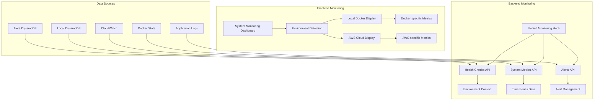

# 📊 Monitoring & Observability

## 📋 **Overview**

The HarborList monitoring and observability framework provides comprehensive visibility into system health, performance, and user experience across all platform components. Our monitoring strategy combines infrastructure metrics, application performance monitoring, business intelligence, and proactive alerting to ensure optimal platform reliability.

### 🎯 **Key Features**

- **Environment-Aware Monitoring**: Differentiated monitoring for Local (Docker Compose) and AWS Cloud environments
- **Unified System Monitoring**: Single source of truth for all monitoring data
- **Real-Time Health Checks**: Live system status with environment-specific thresholds
- **Performance Analytics**: Time-series metrics with historical data analysis
- **Proactive Alerting**: Multi-channel alerting with intelligent noise reduction
- **Business Intelligence**: Revenue, user engagement, and conversion tracking

### 🏗️ **Architecture Overview**



---

## �  **Environment-Aware Monitoring System**

### **Environment Detection & Differentiation**

The HarborList monitoring system automatically detects and adapts to different deployment environments, providing tailored monitoring experiences for each context.

#### **Supported Environments**

| Environment | Type | Description | Use Case |
|-------------|------|-------------|----------|
| **Local Docker** | `local` | Docker Compose development environment | Development, testing, debugging |
| **AWS Cloud** | `aws` | Production AWS infrastructure | Production, staging, scalable operations |

#### **Environment-Specific Configuration**

```typescript
// Environment Detection in Backend
export interface EnvironmentContext {
  type: 'local' | 'aws';
  region: string;
  deploymentTarget: 'docker' | 'lambda' | 'ec2' | 'ecs';
  isAWS: boolean;
  isDocker: boolean;
  runtime: string;
}

// Example Response for Local Environment
{
  "environment": "local",
  "region": "local", 
  "deploymentTarget": "docker",
  "isAWS": false,
  "isDocker": true,
  "healthChecks": [
    {
      "service": "database",
      "status": "healthy",
      "message": "Local DynamoDB healthy",
      "details": {
        "provider": "Local DynamoDB"
      }
    },
    {
      "service": "api", 
      "status": "healthy",
      "message": "Local API server operational",
      "details": {
        "provider": "Local Express"
      }
    }
  ]
}
```

### **🐳 Local Docker Environment**

#### **Characteristics**
- **Runtime**: Node.js with Express server
- **Database**: Local DynamoDB (docker container)
- **Storage**: Local filesystem and LocalStack S3
- **Networking**: Docker Compose internal networking
- **Monitoring**: Process-based metrics and container stats

#### **Environment-Specific Features**
```typescript
// Local Environment Thresholds (More Relaxed)
const LOCAL_THRESHOLDS = {
  cpu: { warning: 70, critical: 90 },      // More CPU available
  memory: { warning: 80, critical: 95 },   // More memory flexibility  
  responseTime: { warning: 500, critical: 1000 }, // Development latency
  errorRate: { warning: 1, critical: 5 }   // Same across environments
};

// Local Service Providers
const LOCAL_SERVICES = {
  database: "Local DynamoDB",
  api: "Local Express", 
  storage: "LocalStack S3",
  runtime: "Node.js (Docker)"
};
```

#### **Local Monitoring Dashboard**
- **Environment Badge**: 🐳 Docker Compose (Blue)
- **Service Health**: Shows local service providers
- **Performance Metrics**: Development-appropriate thresholds
- **Environment Info**: Docker container details and local networking

### **☁️ AWS Cloud Environment**

#### **Characteristics**
- **Runtime**: AWS Lambda functions
- **Database**: AWS DynamoDB with managed scaling
- **Storage**: AWS S3 with CloudFront CDN
- **Networking**: API Gateway with VPC integration
- **Monitoring**: CloudWatch metrics and X-Ray tracing

#### **Environment-Specific Features**
```typescript
// AWS Environment Thresholds (Stricter)
const AWS_THRESHOLDS = {
  cpu: { warning: 60, critical: 80 },      // Lambda CPU constraints
  memory: { warning: 70, critical: 85 },   // Lambda memory limits
  responseTime: { warning: 300, critical: 500 }, // API Gateway timeouts
  errorRate: { warning: 1, critical: 5 }   // Same across environments
};

// AWS Service Providers  
const AWS_SERVICES = {
  database: "AWS DynamoDB",
  api: "AWS API Gateway",
  compute: "AWS Lambda", 
  storage: "AWS S3",
  runtime: "Node.js (Lambda)"
};
```

#### **AWS Monitoring Dashboard**
- **Environment Badge**: ☁️ AWS Cloud (Orange)
- **Service Health**: Shows AWS managed services
- **Performance Metrics**: Production-grade thresholds
- **Environment Info**: AWS region, Lambda details, and managed services

### **Unified System Monitoring Hook**

The frontend uses a single, unified hook that consolidates all monitoring data:

```typescript
// frontend/src/hooks/useSystemMonitoring.ts
export const useSystemMonitoring = (refreshInterval: number = 30000) => {
  const [data, setData] = useState<SystemMonitoringData | null>(null);
  
  const fetchSystemData = useCallback(async () => {
    // Fetch all data in parallel for better performance
    const [healthResponse, metricsResponse, alertsResponse] = await Promise.all([
      adminApi.getSystemHealth(),      // Environment-aware health checks
      adminApi.getSystemMetricsDetailed(), // Time-series performance data
      adminApi.getSystemAlerts()       // Active system alerts
    ]);

    // Construct unified data structure with environment context
    const unifiedData: SystemMonitoringData = {
      healthChecks: healthResponse.healthChecks || [],
      overallStatus: healthResponse.overallStatus || 'unknown',
      metrics: {
        responseTime: metricsResponse.responseTime || [],
        memoryUsage: metricsResponse.memoryUsage || [],
        cpuUsage: metricsResponse.cpuUsage || [],
        errorRate: metricsResponse.errorRate || [],
        uptime: metricsResponse.uptime || 0,
        activeConnections: metricsResponse.activeConnections || 0,
        requestsPerMinute: metricsResponse.requestsPerMinute || 0
      },
      alerts: alertsResponse.alerts || [],
      environment: {
        type: healthResponse.environment === 'local' ? 'local' : 'aws',
        region: healthResponse.region || 'localhost',
        version: healthResponse.version,
        deploymentTarget: healthResponse.deploymentTarget || 'docker',
        isAWS: healthResponse.isAWS || false,
        isDocker: healthResponse.isDocker || false,
        runtime: healthResponse.isDocker ? 'Node.js (Docker)' : 
                healthResponse.isAWS ? 'Node.js (Lambda)' : 'Node.js (Local)'
      },
      lastUpdated: new Date().toISOString()
    };

    setData(unifiedData);
  }, []);

  return { data, loading, error, refetch, acknowledgeAlert, resolveAlert };
};
```

### **Environment-Specific API Endpoints**

#### **System Health Endpoint**
```bash
GET /api/admin/system/health

# Local Environment Response
{
  "healthChecks": [
    {
      "service": "database",
      "status": "healthy", 
      "responseTime": 2,
      "message": "Local DynamoDB healthy",
      "details": {
        "connections": 6,
        "provider": "Local DynamoDB"
      }
    }
  ],
  "overallStatus": "healthy",
  "environment": "local",
  "region": "local",
  "deploymentTarget": "docker", 
  "isAWS": false,
  "isDocker": true
}

# AWS Environment Response  
{
  "healthChecks": [
    {
      "service": "database",
      "status": "healthy",
      "responseTime": 15,
      "message": "AWS DynamoDB healthy", 
      "details": {
        "connections": 100,
        "provider": "AWS DynamoDB"
      }
    }
  ],
  "overallStatus": "healthy",
  "environment": "aws",
  "region": "us-east-1",
  "deploymentTarget": "lambda",
  "isAWS": true, 
  "isDocker": false
}
```

#### **System Metrics Endpoint**
```bash
GET /api/admin/system/metrics?timeRange=1h&granularity=minute

# Returns time-series data with environment context
{
  "responseTime": [
    {"timestamp": "2025-01-13T12:00:00Z", "value": 150},
    {"timestamp": "2025-01-13T12:05:00Z", "value": 145}
  ],
  "memoryUsage": [
    {"timestamp": "2025-01-13T12:00:00Z", "value": 45.2},
    {"timestamp": "2025-01-13T12:05:00Z", "value": 47.1}
  ],
  "uptime": 2182,
  "activeConnections": 6,
  "requestsPerMinute": 0,
  "_metadata": {
    "environment": {
      "type": "local",
      "region": "local", 
      "deployment": "docker"
    }
  }
}
```

---

## 📊 **System Monitoring Dashboard**

### **Dashboard Overview**

The System Monitoring Dashboard provides a comprehensive, environment-aware interface for monitoring system health, performance, and alerts across different deployment environments.

#### **Dashboard Tabs**

| Tab | Description | Environment-Specific Features |
|-----|-------------|-------------------------------|
| **Overview** | System status and performance summary | Environment badge, provider info, tailored metrics |
| **Real-time** | Live metrics with thresholds | Environment-specific warning/critical levels |
| **System Health** | Detailed service health checks | Provider-specific service information |
| **Performance** | Time-series performance analytics | Historical data with environment context |
| **Alerts** | Active system alerts and notifications | Environment-aware alert routing |
| **Error Tracking** | Error analysis and debugging tools | Environment-specific error categorization |

### **Environment-Specific Dashboard Features**

#### **🐳 Local Docker Environment Dashboard**

```typescript
// Local Environment Display
{
  environmentBadge: "🐳 Docker Compose",
  badgeColor: "blue",
  services: [
    {
      name: "Database",
      provider: "Local DynamoDB",
      status: "healthy",
      responseTime: "2ms"
    },
    {
      name: "API", 
      provider: "Local Express",
      status: "healthy",
      responseTime: "150ms"
    }
  ],
  thresholds: {
    cpu: { warning: 70, critical: 90 },
    memory: { warning: 80, critical: 95 },
    responseTime: { warning: 500, critical: 1000 }
  },
  environmentInfo: {
    type: "Local Development",
    deployment: "Docker Compose",
    description: "Running in Docker Compose with local DynamoDB, Express server, and development tools. Perfect for development, testing, and local debugging."
  }
}
```

**Local Environment Features:**
- **Relaxed Thresholds**: Higher limits suitable for development
- **Development Context**: Clear indication this is for local development
- **Docker-Specific Info**: Container status and local networking details
- **Development Tools**: Access to local debugging and development utilities

#### **☁️ AWS Cloud Environment Dashboard**

```typescript
// AWS Environment Display
{
  environmentBadge: "☁️ AWS Cloud", 
  badgeColor: "orange",
  services: [
    {
      name: "Database",
      provider: "AWS DynamoDB", 
      status: "healthy",
      responseTime: "15ms"
    },
    {
      name: "API",
      provider: "AWS API Gateway",
      status: "healthy", 
      responseTime: "200ms"
    },
    {
      name: "Compute",
      provider: "AWS Lambda",
      status: "healthy",
      responseTime: "100ms"
    }
  ],
  thresholds: {
    cpu: { warning: 60, critical: 80 },
    memory: { warning: 70, critical: 85 },
    responseTime: { warning: 300, critical: 500 }
  },
  environmentInfo: {
    type: "AWS Cloud",
    deployment: "Lambda",
    description: "Running on AWS infrastructure with managed services including Lambda functions, DynamoDB, and API Gateway for scalable, serverless operations."
  }
}
```

**AWS Environment Features:**
- **Production Thresholds**: Stricter limits for production reliability
- **AWS Services**: Integration with CloudWatch, X-Ray, and AWS monitoring
- **Scalability Info**: Auto-scaling and managed service status
- **Cost Optimization**: Resource utilization and cost monitoring

### **Real-Time Metrics Display**

#### **Environment-Aware Metric Cards**

```typescript
// Metric Card with Environment Context
interface MetricCard {
  title: string;
  current: number;
  previous: number;
  unit: string;
  threshold: {
    warning: number;
    critical: number;
  };
  environmentContext: string;
}

// Example: CPU Usage Metric
{
  title: "CPU Usage",
  current: 45.2,
  previous: 42.1, 
  unit: "%",
  threshold: {
    warning: environment.isAWS ? 60 : 70,  // AWS: 60%, Local: 70%
    critical: environment.isAWS ? 80 : 90  // AWS: 80%, Local: 90%
  },
  environmentContext: environment.isAWS 
    ? "AWS Lambda CPU allocation" 
    : "Docker container CPU usage"
}
```

#### **Performance Metrics Grid**

| Metric | Local Docker | AWS Cloud | Description |
|--------|--------------|-----------|-------------|
| **CPU Usage** | 70%/90% warn/crit | 60%/80% warn/crit | Environment-specific CPU thresholds |
| **Memory Usage** | 80%/95% warn/crit | 70%/85% warn/crit | Memory allocation limits |
| **Response Time** | 500ms/1s warn/crit | 300ms/500ms warn/crit | API response time thresholds |
| **Error Rate** | 1%/5% warn/crit | 1%/5% warn/crit | Same across environments |
| **Throughput** | req/min | req/min | Request processing rate |
| **Active Connections** | Docker connections | Lambda concurrency | Environment-specific connection metrics |

### **Health Check Details**

#### **Service Health Cards**

```typescript
// Environment-Specific Service Health
interface ServiceHealthCard {
  service: string;
  status: 'healthy' | 'degraded' | 'unhealthy';
  provider: string;  // Environment-specific provider
  responseTime: number;
  lastCheck: string;
  details: {
    connections?: number;
    provider: string;
    throughput?: string;
    errorRate?: string;
    successRate?: string;
  };
}

// Local Environment Example
{
  service: "database",
  status: "healthy",
  provider: "Local DynamoDB",
  responseTime: 2,
  lastCheck: "2025-01-13T12:00:00Z",
  details: {
    connections: 6,
    provider: "Local DynamoDB",
    queryPerformance: "Excellent"
  }
}

// AWS Environment Example  
{
  service: "database",
  status: "healthy", 
  provider: "AWS DynamoDB",
  responseTime: 15,
  lastCheck: "2025-01-13T12:00:00Z",
  details: {
    connections: 100,
    provider: "AWS DynamoDB",
    consumedCapacity: "25%",
    throttledRequests: 0
  }
}
```

### **Alert Management**

#### **Environment-Aware Alerting**

```typescript
// Alert Configuration by Environment
const ALERT_CONFIG = {
  local: {
    channels: ['console', 'dashboard'],
    severity: {
      low: 'log',
      medium: 'dashboard', 
      high: 'dashboard + console',
      critical: 'dashboard + console + email'
    }
  },
  aws: {
    channels: ['cloudwatch', 'sns', 'slack', 'pagerduty'],
    severity: {
      low: 'cloudwatch',
      medium: 'cloudwatch + slack',
      high: 'cloudwatch + slack + sns', 
      critical: 'all channels + pagerduty'
    }
  }
};
```

### **Testing & Validation**

#### **System Health Test Suite**

```bash
# Run comprehensive system health tests
cd backend && node test-system-health.js

# Expected Output:
🚀 Starting System Health Test Suite
=====================================

🔐 Testing Admin Login...
✅ Admin login successful

🏥 Testing System Health Endpoint...
✅ System Health endpoint accessible
📊 Health Data:
   Overall Status: healthy
   Environment: local
   Services: 2
   ✅ database: healthy (2ms)
   ✅ api: healthy (150ms)

📈 Testing System Metrics Endpoint...
✅ System Metrics endpoint accessible
📊 Metrics Data:
   Uptime: 2182s (0h 36m)
   Active Connections: 6
   Time Series Points: 12

🎯 Overall: 7/7 tests passed
🎉 All system health tests PASSED!
```

#### **Frontend Integration Test**

```bash
# Test frontend API integration
cd backend && node test-frontend-api.js

# Validates:
# - Environment detection
# - Data structure consistency  
# - API endpoint functionality
# - Time-series data format
# - Environment-specific thresholds
```

---

## 🏗️ **Legacy Architecture Overview**

### **Monitoring Stack**

```typescript
// CloudWatch Enhanced Monitoring Configuration
export const MONITORING_CONFIG = {
  // Infrastructure Monitoring
  infrastructure: {
    ec2Instances: {
      metrics: ['CPUUtilization', 'NetworkIn', 'NetworkOut', 'DiskReadOps', 'DiskWriteOps'],
      alarms: {
        highCPU: { threshold: 80, evaluationPeriods: 2, period: 300 },
        highMemory: { threshold: 85, evaluationPeriods: 3, period: 300 },
        diskSpace: { threshold: 90, evaluationPeriods: 1, period: 600 },
      },
    },
    
    rds: {
      metrics: ['DatabaseConnections', 'CPUUtilization', 'FreeStorageSpace', 'ReadLatency', 'WriteLatency'],
      alarms: {
        connectionOverload: { threshold: 80, evaluationPeriods: 2, period: 300 },
        highLatency: { threshold: 0.2, evaluationPeriods: 3, period: 300 },
        lowStorage: { threshold: 2000000000, evaluationPeriods: 1, period: 600 }, // 2GB
      },
    },
    
    dynamodb: {
      metrics: ['ConsumedReadCapacityUnits', 'ConsumedWriteCapacityUnits', 'ThrottledRequests', 'SuccessfulRequestLatency'],
      alarms: {
        throttling: { threshold: 1, evaluationPeriods: 1, period: 300 },
        highLatency: { threshold: 100, evaluationPeriods: 3, period: 300 },
        capacity: { threshold: 80, evaluationPeriods: 2, period: 300 },
      },
    },
  },
  
  // Application Performance Monitoring
  application: {
    apiGateway: {
      metrics: ['Count', 'Latency', '4XXError', '5XXError'],
      alarms: {
        errorRate: { threshold: 5, evaluationPeriods: 2, period: 300 }, // 5% error rate
        latency: { threshold: 1000, evaluationPeriods: 3, period: 300 }, // 1s latency
      },
    },
    
    lambda: {
      metrics: ['Duration', 'Errors', 'Throttles', 'ConcurrentExecutions'],
      alarms: {
        duration: { threshold: 10000, evaluationPeriods: 2, period: 300 }, // 10s duration
        errorRate: { threshold: 1, evaluationPeriods: 1, period: 300 },
        throttling: { threshold: 1, evaluationPeriods: 1, period: 300 },
      },
    },
  },
  
  // Business Intelligence
  business: {
    userEngagement: {
      metrics: ['ActiveUsers', 'SessionDuration', 'PageViews', 'ConversionRate'],
      dashboards: ['UserEngagement', 'BusinessMetrics', 'RevenueTracking'],
    },
    
    platformHealth: {
      metrics: ['ListingCreations', 'SearchQueries', 'ContactRequests', 'UserRegistrations'],
      alerts: ['LowActivity', 'HighErrorRate', 'SystemDown'],
    },
  },
};

// Custom CloudWatch Metrics Client
export class CloudWatchMetricsService {
  private cloudWatch: CloudWatchClient;
  private namespace: string;

  constructor() {
    this.cloudWatch = new CloudWatchClient({ region: process.env.AWS_REGION });
    this.namespace = 'HarborList/Application';
  }

  async putMetric(metricName: string, value: number, unit: string = 'Count', dimensions: Dimension[] = []): Promise<void> {
    try {
      await this.cloudWatch.send(new PutMetricDataCommand({
        Namespace: this.namespace,
        MetricData: [{
          MetricName: metricName,
          Value: value,
          Unit: unit as StandardUnit,
          Dimensions: dimensions,
          Timestamp: new Date(),
        }],
      }));
    } catch (error) {
      console.error(`Failed to put CloudWatch metric ${metricName}:`, error);
    }
  }

  async putBusinessMetric(event: BusinessEvent): Promise<void> {
    const dimensions: Dimension[] = [
      { Name: 'EventType', Value: event.type },
      { Name: 'Source', Value: event.source || 'unknown' },
    ];

    if (event.userId) {
      dimensions.push({ Name: 'UserId', Value: event.userId });
    }

    await this.putMetric(
      'BusinessEvent',
      event.value || 1,
      event.unit || 'Count',
      dimensions
    );

    // Track revenue metrics separately
    if (event.revenue) {
      await this.putMetric(
        'Revenue',
        event.revenue,
        'None', // Currency amount
        dimensions
      );
    }
  }

  async createCustomDashboard(dashboardName: string, widgets: DashboardWidget[]): Promise<void> {
    const dashboard = {
      widgets: widgets.map(widget => ({
        type: 'metric',
        properties: {
          metrics: widget.metrics,
          view: widget.view || 'timeSeries',
          stacked: widget.stacked || false,
          region: process.env.AWS_REGION,
          title: widget.title,
          period: widget.period || 300,
        },
      })),
    };

    await this.cloudWatch.send(new PutDashboardCommand({
      DashboardName: dashboardName,
      DashboardBody: JSON.stringify(dashboard),
    }));
  }
}
```

---

## 📈 **Application Performance Monitoring**

### **Lambda Function Monitoring**

```typescript
// Enhanced Lambda Monitoring with X-Ray
export class LambdaMonitoringService {
  private xray: XRayClient;
  private metricsService: CloudWatchMetricsService;

  constructor() {
    this.xray = new XRayClient({ region: process.env.AWS_REGION });
    this.metricsService = new CloudWatchMetricsService();
  }

  // Performance Middleware for Lambda Functions
  createPerformanceMiddleware() {
    return {
      before: async (handler: any) => {
        // Start performance tracking
        handler.context.startTime = performance.now();
        handler.context.traceId = AWSXRay.getTraceId();
        
        // Custom segment for detailed tracing
        const segment = AWSXRay.getSegment();
        if (segment) {
          segment.addAnnotation('FunctionName', handler.context.functionName);
          segment.addAnnotation('RequestId', handler.context.awsRequestId);
        }
      },

      after: async (handler: any) => {
        const duration = performance.now() - handler.context.startTime;
        const functionName = handler.context.functionName;

        // Record performance metrics
        await this.metricsService.putMetric(
          'FunctionDuration',
          duration,
          'Milliseconds',
          [{ Name: 'FunctionName', Value: functionName }]
        );

        // Record memory usage
        const memoryUsed = process.memoryUsage();
        await this.metricsService.putMetric(
          'MemoryUtilization',
          (memoryUsed.heapUsed / memoryUsed.heapTotal) * 100,
          'Percent',
          [{ Name: 'FunctionName', Value: functionName }]
        );

        // Add custom annotations to X-Ray
        const segment = AWSXRay.getSegment();
        if (segment) {
          segment.addAnnotation('Duration', duration);
          segment.addAnnotation('MemoryUsed', memoryUsed.heapUsed);
        }
      },

      onError: async (handler: any) => {
        const functionName = handler.context.functionName;
        const error = handler.error;

        // Record error metrics
        await this.metricsService.putMetric(
          'FunctionErrors',
          1,
          'Count',
          [
            { Name: 'FunctionName', Value: functionName },
            { Name: 'ErrorType', Value: error.name || 'UnknownError' },
          ]
        );

        // Add error details to X-Ray
        const segment = AWSXRay.getSegment();
        if (segment) {
          segment.addError(error);
          segment.addAnnotation('ErrorType', error.name);
          segment.addAnnotation('ErrorMessage', error.message);
        }

        // Send to error tracking service
        await this.sendErrorAlert(functionName, error, handler.context);
      },
    };
  }

  async sendErrorAlert(functionName: string, error: Error, context: any): Promise<void> {
    const errorDetails = {
      functionName,
      errorType: error.name,
      errorMessage: error.message,
      stackTrace: error.stack,
      requestId: context.awsRequestId,
      timestamp: new Date().toISOString(),
      memoryUsage: process.memoryUsage(),
    };

    // Send to SNS for immediate alerting
    await this.publishToSNS('lambda-error-alerts', errorDetails);
    
    // Log structured error for analysis
    console.error('Lambda Error:', JSON.stringify(errorDetails, null, 2));
  }

  private async publishToSNS(topicArn: string, message: any): Promise<void> {
    const sns = new SNSClient({ region: process.env.AWS_REGION });
    
    try {
      await sns.send(new PublishCommand({
        TopicArn: process.env[topicArn.toUpperCase().replace('-', '_')],
        Message: JSON.stringify(message),
        Subject: `Lambda Error: ${message.functionName}`,
      }));
    } catch (error) {
      console.error('Failed to publish SNS message:', error);
    }
  }
}

// Usage in Lambda Functions
const monitoringService = new LambdaMonitoringService();
const performanceMiddleware = monitoringService.createPerformanceMiddleware();

export const listingSearchHandler = middy(async (event: APIGatewayProxyEvent) => {
  // Function implementation
  const startTime = performance.now();
  
  try {
    const searchParams = JSON.parse(event.body || '{}');
    const results = await searchService.searchListings(searchParams);
    
    // Track search performance
    const searchDuration = performance.now() - startTime;
    await metricsService.putMetric('SearchDuration', searchDuration, 'Milliseconds');
    
    // Track business metrics
    await metricsService.putBusinessMetric({
      type: 'SEARCH_PERFORMED',
      source: 'api',
      value: 1,
      metadata: {
        query: searchParams.query,
        resultsCount: results.data.length,
        filters: searchParams.filters,
      },
    });

    return {
      statusCode: 200,
      headers: corsHeaders,
      body: JSON.stringify({
        success: true,
        data: results,
        metadata: {
          searchDuration: searchDuration.toFixed(2),
          traceId: AWSXRay.getTraceId(),
        },
      }),
    };
  } catch (error) {
    // Error will be handled by middleware
    throw error;
  }
})
  .use(performanceMiddleware)
  .use(cors())
  .use(jsonBodyParser());
```

### **Database Performance Monitoring**

```typescript
// DynamoDB Enhanced Monitoring
export class DynamoDBMonitoringService {
  private dynamodb: DynamoDBClient;
  private metricsService: CloudWatchMetricsService;

  constructor() {
    this.dynamodb = new DynamoDBClient({ region: process.env.AWS_REGION });
    this.metricsService = new CloudWatchMetricsService();
  }

  // Instrumented DynamoDB Operations
  async instrumentedQuery(params: QueryCommandInput): Promise<QueryCommandOutput> {
    const startTime = performance.now();
    const tableName = params.TableName || 'unknown';
    
    try {
      const result = await this.dynamodb.send(new QueryCommand(params));
      const duration = performance.now() - startTime;

      // Record performance metrics
      await this.recordQueryMetrics(tableName, duration, result.Count || 0, 'SUCCESS');

      return result;
    } catch (error) {
      const duration = performance.now() - startTime;
      await this.recordQueryMetrics(tableName, duration, 0, 'ERROR');
      throw error;
    }
  }

  async instrumentedScan(params: ScanCommandInput): Promise<ScanCommandOutput> {
    const startTime = performance.now();
    const tableName = params.TableName || 'unknown';
    
    try {
      const result = await this.dynamodb.send(new ScanCommand(params));
      const duration = performance.now() - startTime;

      await this.recordScanMetrics(tableName, duration, result.Count || 0, 'SUCCESS');
      
      // Alert on expensive scan operations
      if (duration > 1000 || (result.Count || 0) > 1000) {
        await this.sendPerformanceAlert('EXPENSIVE_SCAN', {
          tableName,
          duration,
          itemsScanned: result.ScannedCount,
          itemsReturned: result.Count,
        });
      }

      return result;
    } catch (error) {
      const duration = performance.now() - startTime;
      await this.recordScanMetrics(tableName, duration, 0, 'ERROR');
      throw error;
    }
  }

  async instrumentedPutItem(params: PutItemCommandInput): Promise<PutItemCommandOutput> {
    const startTime = performance.now();
    const tableName = params.TableName || 'unknown';
    
    try {
      const result = await this.dynamodb.send(new PutItemCommand(params));
      const duration = performance.now() - startTime;

      await this.recordWriteMetrics(tableName, duration, 1, 'PUT', 'SUCCESS');

      return result;
    } catch (error) {
      const duration = performance.now() - startTime;
      await this.recordWriteMetrics(tableName, duration, 1, 'PUT', 'ERROR');
      throw error;
    }
  }

  private async recordQueryMetrics(
    tableName: string,
    duration: number,
    itemCount: number,
    status: string
  ): Promise<void> {
    const dimensions = [
      { Name: 'TableName', Value: tableName },
      { Name: 'Operation', Value: 'Query' },
      { Name: 'Status', Value: status },
    ];

    await Promise.all([
      this.metricsService.putMetric('OperationDuration', duration, 'Milliseconds', dimensions),
      this.metricsService.putMetric('ItemsReturned', itemCount, 'Count', dimensions),
      this.metricsService.putMetric('OperationCount', 1, 'Count', dimensions),
    ]);
  }

  private async recordScanMetrics(
    tableName: string,
    duration: number,
    itemCount: number,
    status: string
  ): Promise<void> {
    const dimensions = [
      { Name: 'TableName', Value: tableName },
      { Name: 'Operation', Value: 'Scan' },
      { Name: 'Status', Value: status },
    ];

    await Promise.all([
      this.metricsService.putMetric('OperationDuration', duration, 'Milliseconds', dimensions),
      this.metricsService.putMetric('ItemsReturned', itemCount, 'Count', dimensions),
      this.metricsService.putMetric('OperationCount', 1, 'Count', dimensions),
    ]);
  }

  private async recordWriteMetrics(
    tableName: string,
    duration: number,
    itemCount: number,
    operation: string,
    status: string
  ): Promise<void> {
    const dimensions = [
      { Name: 'TableName', Value: tableName },
      { Name: 'Operation', Value: operation },
      { Name: 'Status', Value: status },
    ];

    await Promise.all([
      this.metricsService.putMetric('OperationDuration', duration, 'Milliseconds', dimensions),
      this.metricsService.putMetric('ItemsWritten', itemCount, 'Count', dimensions),
      this.metricsService.putMetric('OperationCount', 1, 'Count', dimensions),
    ]);
  }

  async sendPerformanceAlert(alertType: string, details: any): Promise<void> {
    const alert = {
      alertType,
      timestamp: new Date().toISOString(),
      details,
      severity: this.calculateSeverity(alertType, details),
    };

    // Send to monitoring webhook
    await fetch(process.env.MONITORING_WEBHOOK_URL!, {
      method: 'POST',
      headers: { 'Content-Type': 'application/json' },
      body: JSON.stringify(alert),
    }).catch(console.error);
  }

  private calculateSeverity(alertType: string, details: any): string {
    switch (alertType) {
      case 'EXPENSIVE_SCAN':
        if (details.duration > 5000 || details.itemsScanned > 10000) return 'HIGH';
        if (details.duration > 2000 || details.itemsScanned > 5000) return 'MEDIUM';
        return 'LOW';
      default:
        return 'LOW';
    }
  }
}
```

---

## 🚨 **Alerting & Incident Response**

### **Multi-Channel Alerting System**

```typescript
// Comprehensive Alerting Service
export class AlertingService {
  private sns: SNSClient;
  private ses: SESClient;
  private slack: WebClient;

  constructor() {
    this.sns = new SNSClient({ region: process.env.AWS_REGION });
    this.ses = new SESClient({ region: process.env.AWS_REGION });
    this.slack = new WebClient(process.env.SLACK_BOT_TOKEN);
  }

  async processAlert(alert: SystemAlert): Promise<void> {
    const enrichedAlert = await this.enrichAlert(alert);
    const severity = this.calculateSeverity(enrichedAlert);
    
    // Route alerts based on severity
    switch (severity) {
      case 'CRITICAL':
        await this.sendCriticalAlert(enrichedAlert);
        break;
      case 'HIGH':
        await this.sendHighPriorityAlert(enrichedAlert);
        break;
      case 'MEDIUM':
        await this.sendMediumPriorityAlert(enrichedAlert);
        break;
      case 'LOW':
        await this.sendLowPriorityAlert(enrichedAlert);
        break;
    }

    // Record alert for analytics
    await this.recordAlert(enrichedAlert, severity);
  }

  private async enrichAlert(alert: SystemAlert): Promise<EnrichedAlert> {
    // Add context and correlation data
    const enriched: EnrichedAlert = {
      ...alert,
      timestamp: new Date().toISOString(),
      environment: process.env.NODE_ENV || 'development',
      region: process.env.AWS_REGION || 'us-east-1',
      correlationId: this.generateCorrelationId(),
      
      // Add system health context
      systemHealth: await this.getSystemHealthSnapshot(),
      
      // Add recent similar alerts
      recentSimilarAlerts: await this.getRecentSimilarAlerts(alert),
      
      // Add runbook links
      runbookUrl: this.getRunbookUrl(alert.type),
    };

    return enriched;
  }

  private async sendCriticalAlert(alert: EnrichedAlert): Promise<void> {
    // Page on-call engineer immediately
    await this.sendPagerDutyAlert(alert);
    
    // Send to critical Slack channel
    await this.sendSlackAlert('#incidents-critical', alert, {
      color: 'danger',
      priority: 'URGENT',
    });
    
    // Send SMS to on-call team
    await this.sendSMSAlert(process.env.ONCALL_PHONE!, alert);
    
    // Send email to engineering leads
    await this.sendEmailAlert(
      process.env.ENGINEERING_LEADS_EMAIL!.split(','),
      alert,
      'CRITICAL ALERT'
    );
  }

  private async sendSlackAlert(
    channel: string,
    alert: EnrichedAlert,
    options: SlackAlertOptions
  ): Promise<void> {
    const blocks = [
      {
        type: 'header',
        text: {
          type: 'plain_text',
          text: `🚨 ${options.priority} Alert: ${alert.title}`,
        },
      },
      {
        type: 'section',
        fields: [
          { type: 'mrkdwn', text: `*Type:*\n${alert.type}` },
          { type: 'mrkdwn', text: `*Severity:*\n${alert.severity}` },
          { type: 'mrkdwn', text: `*Environment:*\n${alert.environment}` },
          { type: 'mrkdwn', text: `*Time:*\n${alert.timestamp}` },
        ],
      },
      {
        type: 'section',
        text: {
          type: 'mrkdwn',
          text: `*Description:*\n${alert.description}`,
        },
      },
      {
        type: 'actions',
        elements: [
          {
            type: 'button',
            text: { type: 'plain_text', text: 'View Runbook' },
            url: alert.runbookUrl,
            style: 'primary',
          },
          {
            type: 'button',
            text: { type: 'plain_text', text: 'View Metrics' },
            url: this.getMetricsDashboardUrl(alert),
          },
          {
            type: 'button',
            text: { type: 'plain_text', text: 'Acknowledge' },
            action_id: `acknowledge_${alert.correlationId}`,
            style: 'danger',
          },
        ],
      },
    ];

    await this.slack.chat.postMessage({
      channel,
      blocks,
      text: `Alert: ${alert.title}`, // Fallback text
    });
  }

  private async sendPagerDutyAlert(alert: EnrichedAlert): Promise<void> {
    const payload = {
      routing_key: process.env.PAGERDUTY_INTEGRATION_KEY,
      event_action: 'trigger',
      dedup_key: alert.correlationId,
      payload: {
        summary: alert.title,
        severity: alert.severity.toLowerCase(),
        source: 'HarborList Monitoring',
        component: alert.component || 'unknown',
        group: alert.service || 'platform',
        class: alert.type,
        custom_details: {
          description: alert.description,
          environment: alert.environment,
          runbook_url: alert.runbookUrl,
          metrics_dashboard: this.getMetricsDashboardUrl(alert),
        },
      },
    };

    await fetch('https://events.pagerduty.com/v2/enqueue', {
      method: 'POST',
      headers: { 'Content-Type': 'application/json' },
      body: JSON.stringify(payload),
    });
  }

  // Alert Correlation and Noise Reduction
  private async getRecentSimilarAlerts(alert: SystemAlert): Promise<SystemAlert[]> {
    // Query recent alerts with similar characteristics
    const timeWindow = 30 * 60 * 1000; // 30 minutes
    const cutoffTime = new Date(Date.now() - timeWindow);

    // This would typically query a database or time-series store
    // For now, we'll return an empty array
    return [];
  }

  private async shouldSuppressAlert(alert: SystemAlert): Promise<boolean> {
    const recentSimilar = await this.getRecentSimilarAlerts(alert);
    
    // Suppress if we've seen 3+ similar alerts in the last 15 minutes
    const recentCount = recentSimilar.filter(
      a => Date.parse(a.timestamp) > Date.now() - (15 * 60 * 1000)
    ).length;

    return recentCount >= 3;
  }

  // System Health Dashboard Integration
  private async getSystemHealthSnapshot(): Promise<SystemHealthSnapshot> {
    const healthchecks = await Promise.allSettled([
      this.checkAPIHealth(),
      this.checkDatabaseHealth(),
      this.checkSearchHealth(),
      this.checkExternalServicesHealth(),
    ]);

    return {
      api: healthchecks[0].status === 'fulfilled' ? healthchecks[0].value : { status: 'error' },
      database: healthchecks[1].status === 'fulfilled' ? healthchecks[1].value : { status: 'error' },
      search: healthchecks[2].status === 'fulfilled' ? healthchecks[2].value : { status: 'error' },
      externalServices: healthchecks[3].status === 'fulfilled' ? healthchecks[3].value : { status: 'error' },
      overallStatus: this.calculateOverallHealth(healthchecks),
    };
  }

  private async checkAPIHealth(): Promise<HealthStatus> {
    try {
      const response = await fetch(`${process.env.API_BASE_URL}/health`);
      return {
        status: response.ok ? 'healthy' : 'degraded',
        responseTime: performance.now(), // This would be measured properly
        lastCheck: new Date().toISOString(),
      };
    } catch (error) {
      return {
        status: 'error',
        error: error.message,
        lastCheck: new Date().toISOString(),
      };
    }
  }
}

// Alert Configuration
export const ALERT_RULES = {
  // Infrastructure Alerts
  'high-cpu-usage': {
    threshold: 80,
    duration: '5m',
    severity: 'HIGH',
    channels: ['slack-ops', 'email-oncall'],
  },
  
  'disk-space-low': {
    threshold: 90,
    duration: '1m',
    severity: 'CRITICAL',
    channels: ['slack-critical', 'pagerduty', 'sms-oncall'],
  },
  
  // Application Alerts
  'api-error-rate-high': {
    threshold: 5, // 5% error rate
    duration: '2m',
    severity: 'HIGH',
    channels: ['slack-engineering', 'email-leads'],
  },
  
  'response-time-degraded': {
    threshold: 2000, // 2 seconds
    duration: '3m',
    severity: 'MEDIUM',
    channels: ['slack-performance'],
  },
  
  // Business Alerts
  'revenue-drop': {
    threshold: -20, // 20% drop
    duration: '1h',
    severity: 'HIGH',
    channels: ['slack-business', 'email-executives'],
  },
  
  'user-registration-stopped': {
    threshold: 0, // No registrations
    duration: '30m',
    severity: 'MEDIUM',
    channels: ['slack-product'],
  },
};
```

---

## 📊 **Business Intelligence Dashboards**

### **Executive Dashboard Configuration**

```typescript
// Business Intelligence Dashboard Service
export class BIDashboardService {
  private cloudWatch: CloudWatchClient;
  
  constructor() {
    this.cloudWatch = new CloudWatchClient({ region: process.env.AWS_REGION });
  }

  async createExecutiveDashboard(): Promise<void> {
    const widgets = [
      // Revenue Tracking
      {
        type: 'metric',
        properties: {
          metrics: [
            ['HarborList/Business', 'Revenue', 'Source', 'Platform'],
            ['...', 'Commission'],
            ['...', 'Subscription'],
          ],
          view: 'timeSeries',
          stacked: false,
          region: process.env.AWS_REGION,
          title: 'Revenue Streams',
          period: 3600, // 1 hour
          stat: 'Sum',
        },
      },
      
      // User Engagement
      {
        type: 'metric',
        properties: {
          metrics: [
            ['HarborList/Business', 'ActiveUsers', 'Period', 'Daily'],
            ['...', 'Weekly'],
            ['...', 'Monthly'],
          ],
          view: 'timeSeries',
          region: process.env.AWS_REGION,
          title: 'Active Users',
          period: 86400, // 1 day
        },
      },
      
      // Platform Health
      {
        type: 'metric',
        properties: {
          metrics: [
            ['AWS/ApiGateway', 'Count', 'ApiName', 'HarborListAPI'],
            ['AWS/Lambda', 'Invocations', 'FunctionName', 'listingSearch'],
            ['AWS/DynamoDB', 'ConsumedReadCapacityUnits', 'TableName', process.env.DYNAMODB_TABLE],
          ],
          view: 'timeSeries',
          region: process.env.AWS_REGION,
          title: 'Platform Usage',
          period: 300,
        },
      },
      
      // Conversion Metrics
      {
        type: 'metric',
        properties: {
          metrics: [
            ['HarborList/Business', 'ConversionRate', 'Funnel', 'Registration'],
            ['...', 'ListingCreation'],
            ['...', 'ContactRequest'],
          ],
          view: 'number',
          region: process.env.AWS_REGION,
          title: 'Conversion Rates',
          period: 3600,
        },
      },
    ];

    await this.cloudWatch.send(new PutDashboardCommand({
      DashboardName: 'HarborList-Executive-Dashboard',
      DashboardBody: JSON.stringify({
        widgets: widgets.map((widget, index) => ({
          ...widget,
          x: (index % 2) * 12,
          y: Math.floor(index / 2) * 6,
          width: 12,
          height: 6,
        })),
      }),
    }));
  }

  async createOperationalDashboard(): Promise<void> {
    const widgets = [
      // System Performance
      {
        type: 'metric',
        properties: {
          metrics: [
            ['AWS/ApiGateway', 'Latency', 'ApiName', 'HarborListAPI'],
            ['AWS/Lambda', 'Duration', 'FunctionName', 'listingSearch'],
            ['AWS/DynamoDB', 'SuccessfulRequestLatency', 'TableName', process.env.DYNAMODB_TABLE],
          ],
          view: 'timeSeries',
          region: process.env.AWS_REGION,
          title: 'Response Times',
          period: 300,
          yAxis: { left: { min: 0, max: 2000 } },
        },
      },
      
      // Error Rates
      {
        type: 'metric',
        properties: {
          metrics: [
            ['AWS/ApiGateway', '4XXError', 'ApiName', 'HarborListAPI'],
            ['AWS/ApiGateway', '5XXError', 'ApiName', 'HarborListAPI'],
            ['AWS/Lambda', 'Errors', 'FunctionName', 'listingSearch'],
          ],
          view: 'timeSeries',
          region: process.env.AWS_REGION,
          title: 'Error Rates',
          period: 300,
        },
      },
      
      // Infrastructure Health
      {
        type: 'metric',
        properties: {
          metrics: [
            ['AWS/EC2', 'CPUUtilization', 'InstanceId', 'i-1234567890abcdef0'],
            ['AWS/RDS', 'CPUUtilization', 'DBInstanceIdentifier', 'harborlist-db'],
            ['AWS/DynamoDB', 'ConsumedReadCapacityUnits', 'TableName', process.env.DYNAMODB_TABLE],
          ],
          view: 'timeSeries',
          region: process.env.AWS_REGION,
          title: 'Infrastructure Utilization',
          period: 300,
        },
      },
    ];

    await this.cloudWatch.send(new PutDashboardCommand({
      DashboardName: 'HarborList-Operations-Dashboard',
      DashboardBody: JSON.stringify({
        widgets: widgets.map((widget, index) => ({
          ...widget,
          x: (index % 2) * 12,
          y: Math.floor(index / 2) * 6,
          width: 12,
          height: 6,
        })),
      }),
    }));
  }

  // Real-time Business Metrics Tracking
  async trackBusinessMetric(event: BusinessMetricEvent): Promise<void> {
    const dimensions: Dimension[] = [
      { Name: 'EventType', Value: event.type },
      { Name: 'Source', Value: event.source || 'web' },
    ];

    if (event.userId) {
      dimensions.push({ Name: 'UserId', Value: event.userId });
    }

    if (event.sessionId) {
      dimensions.push({ Name: 'SessionId', Value: event.sessionId });
    }

    // Core business metrics
    await this.cloudWatch.send(new PutMetricDataCommand({
      Namespace: 'HarborList/Business',
      MetricData: [{
        MetricName: event.metricName,
        Value: event.value,
        Unit: event.unit as StandardUnit,
        Dimensions: dimensions,
        Timestamp: new Date(),
      }],
    }));

    // Calculate derived metrics
    await this.calculateDerivedMetrics(event);
  }

  private async calculateDerivedMetrics(event: BusinessMetricEvent): Promise<void> {
    switch (event.type) {
      case 'USER_REGISTRATION':
        await this.updateConversionFunnel('registration', event.userId);
        break;
      
      case 'LISTING_CREATED':
        await this.updateConversionFunnel('listing_creation', event.userId);
        await this.updateInventoryMetrics();
        break;
      
      case 'CONTACT_REQUEST':
        await this.updateEngagementMetrics(event.userId);
        break;
      
      case 'SEARCH_PERFORMED':
        await this.updateSearchMetrics(event.metadata);
        break;
    }
  }

  private async updateConversionFunnel(step: string, userId?: string): Promise<void> {
    // Track conversion funnel progression
    const funnelSteps = ['registration', 'profile_completion', 'listing_creation', 'first_contact'];
    const stepIndex = funnelSteps.indexOf(step);
    
    if (stepIndex >= 0) {
      // Calculate conversion rate
      const conversionRate = await this.calculateConversionRate(step);
      
      await this.cloudWatch.send(new PutMetricDataCommand({
        Namespace: 'HarborList/Business',
        MetricData: [{
          MetricName: 'ConversionRate',
          Value: conversionRate,
          Unit: 'Percent',
          Dimensions: [{ Name: 'Funnel', Value: step }],
          Timestamp: new Date(),
        }],
      }));
    }
  }

  private async calculateConversionRate(step: string): Promise<number> {
    // This would typically query a database to calculate actual conversion rates
    // For now, return a placeholder value
    return Math.random() * 100;
  }
}
```

---

## � ***Quick Reference Guide**

### **Environment Detection**

```bash
# Check current environment
curl -s http://local-api.harborlist.com:3001/api/admin/system/health | jq '{environment, deploymentTarget, isAWS, isDocker}'

# Local Environment Response
{
  "environment": "local",
  "deploymentTarget": "docker", 
  "isAWS": false,
  "isDocker": true
}

# AWS Environment Response
{
  "environment": "aws",
  "deploymentTarget": "lambda",
  "isAWS": true, 
  "isDocker": false
}
```

### **API Endpoints Summary**

| Endpoint | Method | Description | Environment-Aware |
|----------|--------|-------------|-------------------|
| `/api/admin/system/health` | GET | System health checks with environment context | ✅ |
| `/api/admin/system/metrics` | GET | Time-series performance metrics | ✅ |
| `/api/admin/system/alerts` | GET | Active system alerts | ✅ |
| `/api/admin/dashboard/metrics` | GET | Business and system dashboard data | ✅ |

### **Environment Comparison**

| Feature | Local Docker | AWS Cloud |
|---------|--------------|-----------|
| **Environment Badge** | 🐳 Docker Compose (Blue) | ☁️ AWS Cloud (Orange) |
| **Database Provider** | Local DynamoDB | AWS DynamoDB |
| **API Provider** | Local Express | AWS API Gateway |
| **Compute Provider** | Docker Container | AWS Lambda |
| **CPU Threshold** | 70%/90% (warn/crit) | 60%/80% (warn/crit) |
| **Memory Threshold** | 80%/95% (warn/crit) | 70%/85% (warn/crit) |
| **Response Time Threshold** | 500ms/1s (warn/crit) | 300ms/500ms (warn/crit) |
| **Monitoring Tools** | Docker stats, Process metrics | CloudWatch, X-Ray |
| **Alerting Channels** | Console, Dashboard | CloudWatch, SNS, Slack, PagerDuty |

### **Dashboard Navigation**

```typescript
// Access System Monitoring Dashboard
// URL: /admin/system-monitoring

// Available Tabs:
const DASHBOARD_TABS = [
  'overview',      // System status and environment info
  'realtime',      // Live metrics with environment-specific thresholds  
  'health',        // Detailed service health checks
  'performance',   // Time-series performance analytics
  'alerts',        // Active system alerts management
  'errors'         // Error tracking and analysis
];
```

### **Monitoring Hook Usage**

```typescript
// Frontend: Use unified monitoring hook
import { useSystemMonitoring } from '../hooks/useSystemMonitoring';

function SystemMonitoringPage() {
  const { 
    data: systemData,     // Unified monitoring data
    loading,              // Loading state
    error,                // Error state  
    refetch,              // Manual refresh
    acknowledgeAlert,     // Alert management
    resolveAlert          // Alert resolution
  } = useSystemMonitoring(30000); // 30-second refresh

  // Environment-aware display
  const environmentBadge = systemData?.environment.isAWS 
    ? "☁️ AWS Cloud" 
    : "🐳 Docker Compose";

  return (
    <div>
      <h1>System Monitoring - {environmentBadge}</h1>
      {/* Environment-specific dashboard content */}
    </div>
  );
}
```

### **Testing Commands**

```bash
# Backend Health Tests
cd backend
node test-system-health.js      # Comprehensive health test suite
node test-frontend-api.js       # Frontend API integration tests

# Manual API Testing
# Health Check
curl -s http://local-api.harborlist.com:3001/api/admin/system/health \
  -H "Authorization: Bearer YOUR_TOKEN" | jq

# System Metrics  
curl -s "http://local-api.harborlist.com:3001/api/admin/system/metrics?timeRange=1h" \
  -H "Authorization: Bearer YOUR_TOKEN" | jq

# System Alerts
curl -s "http://local-api.harborlist.com:3001/api/admin/system/alerts?status=active" \
  -H "Authorization: Bearer YOUR_TOKEN" | jq
```

### **Troubleshooting**

#### **Common Issues**

| Issue | Environment | Solution |
|-------|-------------|----------|
| **Health checks failing** | Local | Check Docker containers: `docker-compose ps` |
| **Metrics not loading** | Local | Verify DynamoDB local: `curl http://localhost:8000` |
| **Environment detection wrong** | Both | Check environment variables and deployment context |
| **Thresholds too strict** | Local | Verify environment-specific threshold configuration |
| **API endpoints 404** | Both | Confirm admin authentication and API routing |

#### **Debug Steps**

1. **Verify Environment Detection**:
   ```bash
   curl -s http://local-api.harborlist.com:3001/api/admin/system/health | jq .environment
   ```

2. **Check Service Health**:
   ```bash
   curl -s http://local-api.harborlist.com:3001/api/admin/system/health | jq .healthChecks
   ```

3. **Validate Metrics Data**:
   ```bash
   curl -s http://local-api.harborlist.com:3001/api/admin/system/metrics | jq 'keys'
   ```

4. **Test Authentication**:
   ```bash
   curl -s http://local-api.harborlist.com:3001/api/auth/admin/login \
     -H "Content-Type: application/json" \
     -d '{"email":"admin@harborlist.com","password":"YOUR_PASSWORD"}'
   ```

### **Performance Benchmarks**

#### **Expected Response Times**

| Environment | Health Check | Metrics API | Dashboard Load |
|-------------|--------------|-------------|----------------|
| **Local Docker** | < 50ms | < 200ms | < 500ms |
| **AWS Cloud** | < 100ms | < 300ms | < 800ms |

#### **Resource Usage**

| Environment | CPU Usage | Memory Usage | Network I/O |
|-------------|-----------|--------------|-------------|
| **Local Docker** | 5-15% | 200-500MB | Low |
| **AWS Cloud** | Variable | Lambda-managed | Optimized |

---

## 🔗 **Related Documentation**

- **📊 [Performance Testing](../performance/README.md)**: Load testing and optimization strategies
- **🔒 [Security Framework](../security/README.md)**: Security monitoring and incident response
- **🚀 [Deployment Guide](../deployment/README.md)**: CI/CD pipeline monitoring
- **🧪 [Testing Strategy](../testing/README.md)**: Automated testing and quality assurance
- **📱 [API Documentation](../api/README.md)**: API performance monitoring

---

**📅 Last Updated**: October 2025  
**📝 Document Version**: 1.0.0  
**👥 Monitoring Team**: HarborList DevOps Engineering Team  
**🔄 Next Review**: January 2026