# 🔧 Operations & Infrastructure Guide

## 📋 **Operations Overview**

This guide covers the operational aspects of managing the HarborList Marketplace infrastructure, including AWS resource management, deployment procedures, monitoring setup, and maintenance workflows.

---

## ☁️ **AWS Infrastructure Management**

### **Infrastructure as Code (IaC)**

The HarborList platform uses **AWS CDK** (Cloud Development Kit) with TypeScript for infrastructure management:

```typescript
// CDK Stack Overview
export class BoatListingStack extends cdk.Stack {
  constructor(scope: Construct, id: string, props: BoatListingStackProps) {
    // Core Infrastructure Components:
    // • DynamoDB Tables with GSI indexes
    // • Lambda Functions for microservices  
    // • API Gateway for REST endpoints
    // • S3 Buckets for storage and hosting
    // • CloudWatch for monitoring and alerting
    // • Secrets Manager for secure configuration
  }
}
```

### **Resource Architecture**

| Resource Type | Purpose | Configuration |
|---------------|---------|---------------|
| **DynamoDB Tables** | Data persistence | On-demand billing, GSI indexes, TTL policies |
| **Lambda Functions** | Serverless compute | Node.js 18, 512MB memory, 30s timeout |
| **API Gateway** | HTTP endpoints | REST API, CORS enabled, throttling configured |
| **S3 Buckets** | File storage | Static hosting, media storage, lifecycle policies |
| **CloudWatch** | Monitoring | Custom dashboards, alarms, log aggregation |
| **Secrets Manager** | Configuration | JWT secrets, API keys, encryption keys |

### **Environment Management**

The platform supports three environments with different resource configurations:

### **Environment Promotion Strategy**

```mermaid
graph TD
    subgraph "Development Environment"
        Dev[🔧 Development<br/>dev.harborlist.com<br/><br/>• Minimal resource allocation<br/>• Debug logging enabled<br/>• Relaxed security policies<br/>• Mock data & integrations<br/>• Cost-optimized configuration]
    end
    
    subgraph "Staging Environment"
        Staging[🧪 Staging<br/>staging.harborlist.com<br/><br/>• Production-like configuration<br/>• Full security implementation<br/>• Performance & load testing<br/>• External service integration<br/>• Validation & QA testing]
    end
    
    subgraph "Production Environment"
        Prod[🚀 Production<br/>harborlist.com<br/><br/>• High availability & DR<br/>• 24/7 monitoring & alerting<br/>• Automated backup procedures<br/>• Performance optimization<br/>• Auto-scaling enabled]
    end
    
    subgraph "Promotion Gates"
        DevGate[Development Gate<br/>✅ Unit Tests Pass<br/>✅ Code Quality Checks<br/>✅ Security Scan<br/>✅ Feature Complete]
        
        StagingGate[Staging Gate<br/>✅ Integration Tests Pass<br/>✅ Performance Benchmarks<br/>✅ Security Validation<br/>✅ UAT Approval]
    end
    
    Dev -->|Code Review & CI/CD| DevGate
    DevGate -->|Automated Promotion| Staging
    Staging -->|Manual Validation| StagingGate
    StagingGate -->|Approved Release| Prod
    
    %% Rollback paths
    Staging -.->|Rollback if Issues| Dev
    Prod -.->|Emergency Rollback| Staging
    
    style Dev fill:#e3f2fd,stroke:#1565c0,stroke-width:2px
    style Staging fill:#fff3e0,stroke:#f57c00,stroke-width:2px
    style Prod fill:#e8f5e8,stroke:#388e3c,stroke-width:2px
    style DevGate fill:#f3e5f5,stroke:#7b1fa2,stroke-width:2px
    style StagingGate fill:#f3e5f5,stroke:#7b1fa2,stroke-width:2px
```



---

## 🛠️ **DevOps Tools Integration**

### **Automated Operations Toolkit**

The platform includes comprehensive DevOps tools for operational management:

| Tool Category | Tools Location | Purpose |
|---------------|----------------|---------|
| **🚀 Deployment** | [`tools/deployment/`](../../tools/deployment/) | Infrastructure deployment and verification |
| **📊 Monitoring** | [`tools/monitoring/`](../../tools/monitoring/) | Health monitoring and performance tracking |
| **💰 Cost Management** | [`tools/cost-management/`](../../tools/cost-management/) | Cost analysis and optimization |
| **⚡ Performance** | [`tools/performance/`](../../tools/performance/) | Load testing and benchmarking |
| **🌐 CDN Management** | [`tools/cloudflare/`](../../tools/cloudflare/) | Cloudflare tunnel and cache management |
| **🔧 Utilities** | [`tools/utilities/`](../../tools/utilities/) | General maintenance and validation |

> **📖 Detailed Documentation**: See the [**DevOps Tools Guide**](../tools/README.md) for comprehensive tool documentation.

### **Operation Workflows**

#### **Daily Operations Checklist**

```bash
# 1. System Health Check
cd tools/monitoring
./dev-environment-status-report.js

# 2. Cost Monitoring  
cd ../cost-management
node aws-billing-monitor.js

# 3. Performance Check
cd ../performance
./run-performance-tests.sh api dev

# 4. Infrastructure Validation
cd ../utilities  
node validate-admin-infrastructure.js dev
```

#### **Weekly Operations Checklist**

```bash
# 1. Comprehensive Infrastructure Test
cd tools/performance
./comprehensive-dev-environment-test.js

# 2. Cost Analysis Report
cd ../cost-management
node cost-analysis.js

# 3. Security Validation
cd ../utilities
./validate-and-test-admin.sh

# 4. Backup Verification
cd ../cloudflare
./tunnel-backup.sh
```

---

## 📊 **Monitoring & Observability**

### **CloudWatch Integration**

The platform uses AWS CloudWatch for comprehensive monitoring:

#### **Custom Dashboards**

```typescript
// Dashboard Configuration
const dashboardConfig = {
  name: 'HarborList-Production-Dashboard',
  widgets: [
    // API Performance Metrics
    {
      type: 'metric',
      properties: {
        metrics: [
          ['AWS/ApiGateway', 'Count', 'ApiName', 'BoatListingApi'],
          ['AWS/ApiGateway', 'Latency', 'ApiName', 'BoatListingApi'],
          ['AWS/ApiGateway', '4XXError', 'ApiName', 'BoatListingApi'],
          ['AWS/ApiGateway', '5XXError', 'ApiName', 'BoatListingApi'],
        ],
      },
    },
    
    // Lambda Performance Metrics  
    {
      type: 'metric',
      properties: {
        metrics: [
          ['AWS/Lambda', 'Duration', 'FunctionName', 'admin-function'],
          ['AWS/Lambda', 'Errors', 'FunctionName', 'admin-function'],
          ['AWS/Lambda', 'Throttles', 'FunctionName', 'admin-function'],
        ],
      },
    },
    
    // DynamoDB Performance Metrics
    {
      type: 'metric', 
      properties: {
        metrics: [
          ['AWS/DynamoDB', 'ConsumedReadCapacityUnits', 'TableName', 'boat-listings'],
          ['AWS/DynamoDB', 'ConsumedWriteCapacityUnits', 'TableName', 'boat-listings'],
          ['AWS/DynamoDB', 'ThrottledRequests', 'TableName', 'boat-listings'],
        ],
      },
    },
  ],
};
```

#### **Alert Configuration**

```typescript
// Critical Alerts
const criticalAlerts = {
  highErrorRate: {
    threshold: 5,        // 5% error rate
    period: 300,         // 5 minutes
    evaluationPeriods: 2,
    treatMissingData: 'breaching',
  },
  
  highLatency: {
    threshold: 2000,     // 2 seconds
    period: 300,         // 5 minutes  
    evaluationPeriods: 2,
    treatMissingData: 'notBreaching',
  },
  
  lambdaThrottling: {
    threshold: 1,        // Any throttling
    period: 60,          // 1 minute
    evaluationPeriods: 1,
    treatMissingData: 'notBreaching',
  },
};
```

### **Monitoring Setup Automation**

```bash
# Automated Monitoring Setup
cd tools/monitoring

# Setup monitoring infrastructure
./setup-monitoring.sh production --alert-email admin@harborlist.com

# Test monitoring configuration
./test-monitoring.sh

# Generate status report
node dev-environment-status-report.js
```

---

## 💰 **Cost Management & Optimization**

### **Cost Monitoring Strategy**

#### **Budget Thresholds**

| Environment | Monthly Budget | Warning Threshold | Critical Threshold |
|-------------|----------------|-------------------|-------------------|
| **Development** | $50 | $40 (80%) | $45 (90%) |
| **Staging** | $100 | $80 (80%) | $90 (90%) |
| **Production** | $500 | $400 (80%) | $450 (90%) |

#### **Cost Optimization Tools**

```bash
# Daily Cost Monitoring
cd tools/cost-management
node aws-billing-monitor.js --threshold 100

# Weekly Cost Analysis
node cost-analysis.js --start-date 2024-10-01 --end-date 2024-10-07

# Cost Dashboard Creation
node cost-monitoring-dashboard.js create

# Budget Alert Setup
./cost-alert.sh 500 80  # $500 budget, 80% alert threshold
```

### **Resource Optimization**

#### **Lambda Function Optimization**

```typescript
// Optimized Lambda Configuration
export const optimizedLambdaConfig = {
  // Right-sized memory allocation
  memorySize: 512,              // Optimal for Node.js workloads
  
  // Efficient timeout settings
  timeout: 30,                  // Balanced performance/cost
  
  // Reserved concurrency for critical functions
  reservedConcurrency: {
    'auth-service': 100,        // High concurrency for auth
    'admin-service': 50,        // Moderate for admin operations
  },
  
  // Provisioned concurrency for performance-critical functions
  provisionedConcurrency: {
    'auth-service': 10,         // Warm instances for auth
  },
};
```

#### **DynamoDB Cost Optimization**

```typescript
// DynamoDB Optimization Settings
export const dynamoDbOptimization = {
  // On-demand billing for variable workloads
  billingMode: 'PAY_PER_REQUEST',
  
  // TTL for automatic data cleanup
  ttlSettings: {
    'audit-logs': '7 years',
    'sessions': '30 days',  
    'login-attempts': '90 days',
  },
  
  // Point-in-time recovery for critical tables
  pointInTimeRecovery: ['boat-listings', 'boat-users'],
};
```

---

## 🔒 **Security Operations**

### **Security Monitoring**

#### **Audit Log Analysis**

```bash
# Daily Security Check
cd tools/utilities
node validate-admin-infrastructure.js production

# Security Event Analysis
# Review CloudWatch logs for:
# • Failed authentication attempts
# • Unusual API access patterns  
# • Privilege escalation attempts
# • Data access anomalies
```

#### **Compliance Monitoring**

```typescript
// Security Compliance Checks
export const securityChecks = {
  // JWT Token Validation
  tokenSecurity: {
    algorithmValidation: 'HS256',
    expirationEnforcement: true,
    refreshTokenRotation: true,
  },
  
  // Access Control Validation
  rbacCompliance: {
    permissionValidation: true,
    roleSegregation: true,
    auditTrail: true,
  },
  
  // Data Protection
  dataProtection: {
    encryptionAtRest: true,
    encryptionInTransit: true,
    piiHandling: 'compliant',
  },
};
```

---

## 🚀 **Deployment Operations**

### **Deployment Process**

#### **Automated Deployment Workflow**

```bash
# Standard Deployment Process
cd tools/deployment

# 1. Pre-deployment validation
./deploy.sh dev --dry-run

# 2. Deploy to development
./deploy.sh dev

# 3. Post-deployment verification
./verify-deployment.sh dev

# 4. Promote to staging (after validation)
./deploy.sh staging

# 5. Production deployment (after staging validation)
./deploy.sh production --confirm
```

#### **Rollback Procedures**

```bash
# Emergency Rollback Process
cd tools/deployment

# 1. Immediate rollback to previous version
./rollback.sh production --previous-version

# 2. Cloudflare tunnel rollback (if needed)
cd ../cloudflare
./tunnel-rollback.sh backup-20241001 --confirm

# 3. Verify rollback success
cd ../deployment  
./verify-deployment.sh production --post-rollback
```

---

## 📈 **Performance Operations**

### **Performance Monitoring**

#### **Continuous Performance Testing**

```bash
# Daily Performance Validation
cd tools/performance
./run-performance-tests.sh api production

# Weekly Comprehensive Testing
./comprehensive-dev-environment-test.js

# DNS and Network Performance
node dns-performance-test.js harborlist.com 100
```

#### **Performance Optimization**

```typescript
// Performance Targets
export const performanceTargets = {
  api: {
    responseTime: '<200ms',      // 95th percentile
    throughput: '1000 rps',      // Requests per second
    errorRate: '<1%',            // Error threshold
  },
  
  frontend: {
    loadTime: '<2s',             // First contentful paint
    interactive: '<3s',          // Time to interactive
    cls: '<0.1',                 // Cumulative layout shift
  },
  
  database: {
    queryTime: '<10ms',          // Single item queries
    throughput: '4000 RCU/WCU',  // Read/write capacity
  },
};
```

---

## 🛟 **Incident Response**

### **On-Call Procedures**

#### **Alert Response Matrix**

| Alert Level | Response Time | Escalation | Actions |
|-------------|---------------|------------|---------|
| **Critical** | 5 minutes | Immediate | Page on-call engineer, start incident response |
| **High** | 15 minutes | 30 minutes | Alert primary engineer, investigate |
| **Medium** | 1 hour | 2 hours | Create ticket, schedule investigation |
| **Low** | Next business day | N/A | Log for trend analysis |

#### **Incident Response Toolkit**

```bash
# Rapid Incident Response
cd tools/monitoring

# 1. System health assessment
node dev-environment-status-report.js --critical

# 2. Performance diagnostics  
cd ../performance
./run-performance-tests.sh full production --emergency

# 3. Infrastructure validation
cd ../utilities
node validate-admin-infrastructure.js production --verbose

# 4. Cost impact assessment (for major incidents)
cd ../cost-management
node aws-billing-monitor.js --emergency-check
```

---

## 📋 **Maintenance Procedures**

### **Regular Maintenance Schedule**

#### **Daily Maintenance (Automated)**

- ✅ Health check execution
- ✅ Cost monitoring alerts  
- ✅ Performance baseline validation
- ✅ Security log analysis
- ✅ Backup verification

#### **Weekly Maintenance**

- 🔍 Comprehensive performance testing
- 📊 Cost analysis and optimization review
- 🔒 Security validation and compliance check
- 💾 Backup and disaster recovery testing
- 📈 Capacity planning review

#### **Monthly Maintenance**

- 🏗️ Infrastructure optimization review
- 💰 Budget and cost optimization analysis
- 🔐 Security audit and penetration testing
- 📚 Documentation updates and review
- 🎯 Performance target reassessment

### **Maintenance Automation**

```bash
# Automated Maintenance Scripts
cd tools/utilities

# Database maintenance
./database-maintenance.sh --optimize --cleanup

# Cache maintenance  
cd ../cloudflare
./cache-maintenance.sh --purge-expired --optimize

# Log rotation and cleanup
cd ../monitoring
./log-maintenance.sh --rotate --compress --cleanup
```

---

## 🔗 **Related Documentation**

- **🛠️ [DevOps Tools Guide](../tools/README.md)**: Comprehensive tool documentation
- **📊 [Monitoring Guide](../monitoring/README.md)**: Detailed monitoring setup
- **🚀 [Deployment Guide](../deployment/README.md)**: Deployment procedures
- **🔒 [Security Guide](../security/README.md)**: Security operations  
- **📈 [Performance Guide](../performance/README.md)**: Performance optimization

---

**📅 Last Updated**: October 2025  
**📝 Document Version**: 1.0.0  
**👥 Operations Team**: HarborList DevOps Team  
**🔄 Next Review**: January 2026