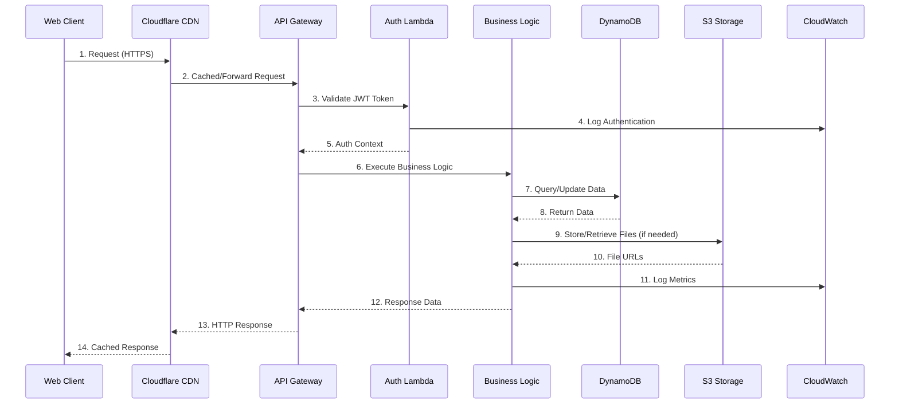
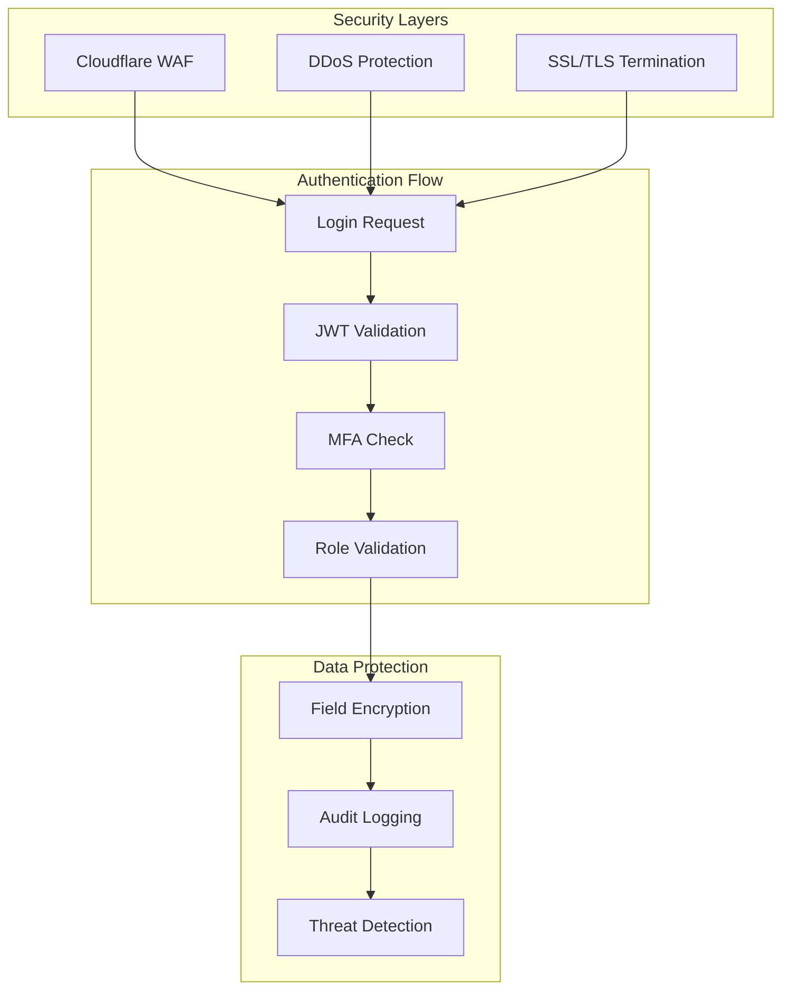
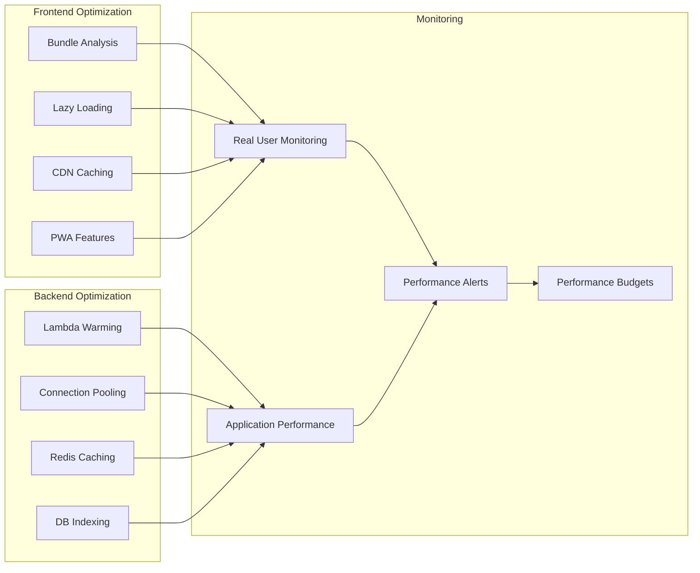

# 🔄 Practical Documentation Migration Guide

## 📋 **Overview**

This guide provides step-by-step instructions for migrating and enhancing the existing harborlist-docs repository with the comprehensive documentation created in harborlist-marketplace/docs. This ensures a seamless integration of enhanced content while preserving existing valuable documentation.

---

## 🎯 **Migration Strategy**

### **Phase 1: Content Analysis & Preparation**

#### **Step 1: Backup Existing Documentation**
```bash
cd /Users/felixparedes/Documents/Projects/harborlist-docs
git checkout -b backup-before-enhancement
git push origin backup-before-enhancement

# Create comprehensive backup
tar -czf harborlist-docs-backup-$(date +%Y%m%d).tar.gz .
```

#### **Step 2: Content Quality Assessment**
```bash
# Analyze existing documentation structure
find . -name "*.md" -exec wc -l {} + | sort -nr > content-analysis.txt

# Identify high-quality content to preserve
grep -l "mermaid\|```" **/*.md > files-with-technical-content.txt
```

### **Phase 2: Strategic File Enhancements**

#### **Enhancement 1: API Documentation Overhaul**

**Current File**: `development/api-reference.md` (47 lines, basic content)
**Target**: Transform into comprehensive API documentation

**Migration Commands**:
```bash
cd /Users/felixparedes/Documents/Projects/harborlist-docs

# Backup current API reference
cp development/api-reference.md development/api-reference-backup.md

# Create enhanced API structure
mkdir -p api/{endpoints,examples,schemas,tools}

# Copy enhanced API documentation from harborlist-marketplace
cp /Users/felixparedes/Documents/Projects/harborlist-marketplace/docs/api/README.md api/
cp /Users/felixparedes/Documents/Projects/harborlist-marketplace/docs/api/integration.md api/
```

**Enhanced API Reference Structure**:
```
api/
├── README.md                           # Main API overview (from new docs)
├── api-reference.md                    # Enhanced endpoint documentation  
├── openapi-specification.yaml          # Complete OpenAPI 3.1 spec
├── authentication.md                   # Enhanced auth guide
├── endpoints/
│   ├── listings.md                    # Listing endpoints detail
│   ├── users.md                       # User management endpoints
│   ├── admin.md                       # Admin endpoints  
│   └── media.md                       # Media upload endpoints
├── examples/
│   ├── typescript-sdk.md              # TypeScript examples
│   ├── python-sdk.md                  # Python examples
│   ├── curl-examples.md               # cURL examples
│   └── webhook-integration.md         # Webhook setup
├── schemas/
│   ├── request-schemas.json           # Request validation
│   ├── response-schemas.json          # Response formats
│   └── error-schemas.json             # Error responses
└── tools/
    ├── postman-collection.json        # Postman collection
    └── swagger-ui-config.json         # Swagger configuration
```

#### **Enhancement 2: Security Framework Deep Dive**

**Current Files**: 
- `security/security-overview.md` (good foundation)
- `security/authentication.md` (detailed)
- `security/authorization.md` (comprehensive)

**Enhancement Strategy**: Augment existing content with enterprise-grade practices

**Specific File Enhancements**:

**File**: `security/security-overview.md`
**Current**: Good principles, lacks implementation depth
**Enhancement**: Add comprehensive security implementation

```bash
# Enhance security overview
cp security/security-overview.md security/security-overview-backup.md

# Add enhanced security content
cat >> security/security-overview.md << 'EOF'

---

## 🔐 **Advanced Security Implementation**

### **Multi-Factor Authentication (MFA)**
```typescript
// TOTP Implementation for Admin Users
export class TOTPService {
  private generateSecret(): string {
    return authenticator.generateSecret();
  }

  async enableTOTP(userId: string): Promise<TOTPSetup> {
    const secret = this.generateSecret();
    const qrCode = await this.generateQRCode(userId, secret);
    
    await this.storeSecret(userId, secret, false); // Not verified yet
    
    return {
      secret,
      qrCodeUrl: qrCode,
      backupCodes: await this.generateBackupCodes(userId),
    };
  }

  async verifyTOTP(userId: string, token: string): Promise<boolean> {
    const secret = await this.getUserSecret(userId);
    const isValid = authenticator.verify({ token, secret });
    
    if (isValid) {
      await this.markSecretAsVerified(userId);
      await this.auditLog('TOTP_VERIFIED', userId);
    }
    
    return isValid;
  }
}
```

### **Advanced Role-Based Access Control (RBAC)**
```typescript
// Granular Permission System
export interface Permission {
  resource: string;          // 'listing', 'user', 'admin'
  action: string;           // 'create', 'read', 'update', 'delete'
  conditions?: {
    ownership?: boolean;     // Can only access own resources
    location?: string[];    // Geographic restrictions
    timeFrame?: {          // Time-based access
      start: string;
      end: string;
    };
  };
}

export interface Role {
  id: string;
  name: string;
  description: string;
  permissions: Permission[];
  inheritsFrom?: string[];   // Role hierarchy
}

// Implementation
export class RBACService {
  async checkPermission(
    userId: string,
    resource: string,
    action: string,
    context?: any
  ): Promise<boolean> {
    const userRoles = await this.getUserRoles(userId);
    const permissions = await this.resolvePermissions(userRoles);
    
    return permissions.some(permission => 
      this.matchesPermission(permission, resource, action, context)
    );
  }
  
  private matchesPermission(
    permission: Permission,
    resource: string,
    action: string,
    context?: any
  ): boolean {
    // Basic resource and action matching
    if (permission.resource !== resource || permission.action !== action) {
      return false;
    }
    
    // Check ownership conditions
    if (permission.conditions?.ownership && context?.ownerId !== context?.userId) {
      return false;
    }
    
    // Check location restrictions
    if (permission.conditions?.location && 
        !permission.conditions.location.includes(context?.userLocation)) {
      return false;
    }
    
    // Check time-based restrictions
    if (permission.conditions?.timeFrame) {
      const now = new Date();
      const start = new Date(permission.conditions.timeFrame.start);
      const end = new Date(permission.conditions.timeFrame.end);
      
      if (now < start || now > end) {
        return false;
      }
    }
    
    return true;
  }
}
```

### **Advanced Audit Logging**
```typescript
// Comprehensive Audit Trail
export interface AuditEvent {
  id: string;
  timestamp: string;
  userId?: string;
  sessionId?: string;
  ipAddress: string;
  userAgent: string;
  event: AuditEventType;
  resource?: {
    type: string;
    id: string;
  };
  changes?: {
    field: string;
    oldValue: any;
    newValue: any;
  }[];
  metadata: Record<string, any>;
  risk: 'LOW' | 'MEDIUM' | 'HIGH' | 'CRITICAL';
}

export class AuditLogger {
  async logEvent(event: Partial<AuditEvent>): Promise<void> {
    const auditEvent: AuditEvent = {
      id: generateUUID(),
      timestamp: new Date().toISOString(),
      ...event,
    } as AuditEvent;
    
    // Store in audit table
    await this.storeAuditEvent(auditEvent);
    
    // Send to SIEM if high risk
    if (auditEvent.risk === 'HIGH' || auditEvent.risk === 'CRITICAL') {
      await this.sendToSIEM(auditEvent);
    }
    
    // Real-time alerting for critical events
    if (auditEvent.risk === 'CRITICAL') {
      await this.sendRealTimeAlert(auditEvent);
    }
  }
  
  // Automated anomaly detection
  async detectAnomalies(userId: string): Promise<AnomalyReport> {
    const recentEvents = await this.getUserEvents(userId, 24); // Last 24 hours
    const baseline = await this.getUserBaseline(userId);
    
    return {
      unusualLocations: this.detectLocationAnomalies(recentEvents, baseline),
      suspiciousActivity: this.detectBehaviorAnomalies(recentEvents, baseline),
      riskScore: this.calculateRiskScore(recentEvents, baseline),
    };
  }
}
```

### **Input Validation & Sanitization**
```typescript
// Comprehensive Input Validation
import { z } from 'zod';
import DOMPurify from 'isomorphic-dompurify';

// Schema definitions for all API endpoints
export const ListingSchema = z.object({
  title: z.string()
    .min(10, 'Title must be at least 10 characters')
    .max(100, 'Title cannot exceed 100 characters')
    .regex(/^[a-zA-Z0-9\s\-\.\,\!\?]+$/, 'Title contains invalid characters'),
    
  description: z.string()
    .max(5000, 'Description cannot exceed 5000 characters')
    .optional()
    .transform(val => val ? DOMPurify.sanitize(val) : undefined),
    
  price: z.number()
    .min(0, 'Price must be non-negative')
    .max(10000000, 'Price exceeds maximum allowed value'),
    
  location: z.object({
    city: z.string().min(1).max(50),
    state: z.string().length(2),
    country: z.string().length(3),
    zipCode: z.string().regex(/^\d{5}(-\d{4})?$/).optional(),
  }),
  
  specifications: z.object({
    length: z.number().min(10).max(500).optional(),
    year: z.number().min(1900).max(2030).optional(),
    manufacturer: z.string().max(50).optional(),
  }).optional(),
});

// Middleware for automatic validation
export const validateInput = (schema: z.ZodSchema) => {
  return (req: Request, res: Response, next: NextFunction) => {
    try {
      const validated = schema.parse(req.body);
      req.body = validated; // Replace with sanitized data
      next();
    } catch (error) {
      if (error instanceof z.ZodError) {
        return res.status(400).json({
          success: false,
          error: {
            code: 'VALIDATION_ERROR',
            message: 'Invalid input parameters',
            details: error.errors.map(err => ({
              field: err.path.join('.'),
              message: err.message,
              value: err.received,
            })),
          },
        });
      }
      next(error);
    }
  };
};
```

### **Encryption Services**
```typescript
// Advanced Encryption Implementation
import { createCipher, createDecipher, randomBytes } from 'crypto';
import { KMSClient, DecryptCommand, EncryptCommand } from '@aws-sdk/client-kms';

export class EncryptionService {
  private kmsClient: KMSClient;
  private keyId: string;

  constructor() {
    this.kmsClient = new KMSClient({ region: process.env.AWS_REGION });
    this.keyId = process.env.KMS_KEY_ID!;
  }

  // Encrypt sensitive data using AWS KMS
  async encryptSensitiveData(data: string): Promise<string> {
    const command = new EncryptCommand({
      KeyId: this.keyId,
      Plaintext: Buffer.from(data),
    });

    const result = await this.kmsClient.send(command);
    return Buffer.from(result.CiphertextBlob!).toString('base64');
  }

  // Decrypt sensitive data
  async decryptSensitiveData(encryptedData: string): Promise<string> {
    const ciphertext = Buffer.from(encryptedData, 'base64');
    
    const command = new DecryptCommand({
      CiphertextBlob: ciphertext,
    });

    const result = await this.kmsClient.send(command);
    return Buffer.from(result.Plaintext!).toString();
  }

  // Generate secure tokens
  generateSecureToken(length: number = 32): string {
    return randomBytes(length).toString('hex');
  }

  // Hash passwords with salt
  async hashPassword(password: string): Promise<string> {
    const salt = randomBytes(16);
    const hash = crypto.pbkdf2Sync(password, salt, 100000, 64, 'sha512');
    
    return salt.toString('hex') + ':' + hash.toString('hex');
  }

  // Verify password
  async verifyPassword(password: string, hashedPassword: string): Promise<boolean> {
    const [salt, hash] = hashedPassword.split(':');
    const verifyHash = crypto.pbkdf2Sync(password, Buffer.from(salt, 'hex'), 100000, 64, 'sha512');
    
    return hash === verifyHash.toString('hex');
  }
}
```

EOF
```

#### **Enhancement 3: Performance Monitoring Framework**

**Current File**: `testing/performance-testing.md` (good foundation)
**Enhancement**: Add comprehensive performance monitoring

```bash
# Create enhanced performance documentation
mkdir -p performance/{monitoring,optimization,testing}

# Copy enhanced performance docs
cp /Users/felixparedes/Documents/Projects/harborlist-marketplace/docs/performance/README.md performance/
cp /Users/felixparedes/Documents/Projects/harborlist-marketplace/docs/monitoring/README.md monitoring/
```

#### **Enhancement 4: Deployment & CI/CD Framework**

**Current Files**: Basic deployment in `deployment/` directory  
**Enhancement**: Add comprehensive CI/CD and deployment strategies

```bash
# Enhance deployment documentation
mkdir -p deployment/{cicd,environments,strategies}

# Add enhanced deployment content
cp /Users/felixparedes/Documents/Projects/harborlist-marketplace/docs/deployment/README.md deployment/enhanced-deployment-guide.md
```

### **Phase 3: New Documentation Sections**

#### **Add Missing Critical Documentation**

```bash
# Create new documentation sections not covered in existing repo
mkdir -p {troubleshooting,roadmap,architecture/advanced}

# Copy comprehensive guides
cp /Users/felixparedes/Documents/Projects/harborlist-marketplace/docs/troubleshooting/README.md troubleshooting/
cp /Users/felixparedes/Documents/Projects/harborlist-marketplace/docs/roadmap/README.md roadmap/
```

---

## 🔄 **Specific File Migration Examples**

### **Migration Example 1: Enhancing architecture/overview.md**

**Current State**: Good Mermaid diagrams, basic architecture explanation
**Enhancement**: Add detailed system interactions and data flow

```bash
# Backup current architecture overview
cp architecture/overview.md architecture/overview-backup.md

# Enhance with detailed system architecture
cat >> architecture/overview.md << 'EOF'

---

## 🔄 **Detailed Data Flow Architecture**

### **Request Lifecycle Diagram**


### **Advanced Security Flow**


### **Performance Optimization Pipeline**


EOF
```

### **Migration Example 2: Enhancing development/local-setup.md**

**Current State**: Comprehensive setup guide (good content to preserve)
**Enhancement**: Add advanced development tools and debugging

```bash
# Enhance local setup with advanced tooling
cat >> development/local-setup.md << 'EOF'

---

## 🛠️ **Advanced Development Tools**

### **Enhanced Docker Development Environment**
```bash
# Create comprehensive docker-compose setup
cat > docker-compose.dev.yml << 'DOCKER'
version: '3.8'

services:
  # DynamoDB Local with Admin UI
  dynamodb:
    image: amazon/dynamodb-local:latest
    container_name: harborlist-dynamodb
    ports:
      - "8000:8000"
    command: ["-jar", "DynamoDBLocal.jar", "-sharedDb", "-inMemory"]
    
  dynamodb-admin:
    image: aaronshaf/dynamodb-admin
    container_name: harborlist-dynamodb-admin
    ports:
      - "8001:8001"
    environment:
      - DYNAMO_ENDPOINT=http://dynamodb:8000
    depends_on:
      - dynamodb

  # Redis for caching
  redis:
    image: redis:7-alpine
    container_name: harborlist-redis
    ports:
      - "6379:6379"
    command: redis-server --appendonly yes
    
  # Redis Commander (Redis Admin UI)
  redis-commander:
    image: rediscommander/redis-commander:latest
    container_name: harborlist-redis-admin
    ports:
      - "8002:8081"
    environment:
      - REDIS_HOSTS=local:redis:6379
    depends_on:
      - redis

  # LocalStack for AWS services
  localstack:
    image: localstack/localstack:latest
    container_name: harborlist-localstack
    ports:
      - "4566:4566"
    environment:
      - SERVICES=s3,sns,sqs,lambda,apigateway
      - DEBUG=1
      - DATA_DIR=/tmp/localstack/data
    volumes:
      - "./tmp/localstack:/tmp/localstack"
      - "/var/run/docker.sock:/var/run/docker.sock"

  # Mailhog for email testing
  mailhog:
    image: mailhog/mailhog:latest
    container_name: harborlist-mailhog
    ports:
      - "1025:1025"  # SMTP
      - "8025:8025"  # Web UI

networks:
  default:
    name: harborlist-dev
DOCKER

# Start all development services
docker-compose -f docker-compose.dev.yml up -d

# Setup DynamoDB tables in local environment
npm run setup:local-db
```

### **Enhanced Debugging Setup**

#### **VS Code Launch Configuration**
```json
// .vscode/launch.json
{
  "version": "0.2.0",
  "configurations": [
    {
      "name": "Debug Backend API",
      "type": "node",
      "request": "launch",
      "program": "${workspaceFolder}/backend/src/index.ts",
      "env": {
        "NODE_ENV": "development",
        "DYNAMODB_ENDPOINT": "http://localhost:8000",
        "REDIS_URL": "redis://localhost:6379",
        "LOG_LEVEL": "debug"
      },
      "console": "integratedTerminal",
      "sourceMaps": true,
      "outFiles": ["${workspaceFolder}/backend/dist/**/*.js"],
      "runtimeArgs": ["--nolazy", "-r", "ts-node/register"],
      "envFile": "${workspaceFolder}/.env.local"
    },
    {
      "name": "Debug Lambda Function",
      "type": "node",
      "request": "launch",
      "program": "${workspaceFolder}/backend/src/lambda-local.ts",
      "env": {
        "AWS_REGION": "us-east-1",
        "DYNAMODB_ENDPOINT": "http://localhost:8000"
      },
      "console": "integratedTerminal",
      "sourceMaps": true
    },
    {
      "name": "Debug Frontend",
      "type": "node",
      "request": "launch",
      "program": "${workspaceFolder}/frontend/node_modules/.bin/vite",
      "args": ["--debug", "--host"],
      "env": {
        "VITE_API_BASE_URL": "http://localhost:3000"
      },
      "console": "integratedTerminal",
      "cwd": "${workspaceFolder}/frontend"
    }
  ]
}
```

#### **Advanced Logging Setup**
```typescript
// Enhanced logging configuration
import winston from 'winston';
import { ElasticsearchTransport } from 'winston-elasticsearch';

const logger = winston.createLogger({
  level: process.env.LOG_LEVEL || 'info',
  format: winston.format.combine(
    winston.format.timestamp(),
    winston.format.errors({ stack: true }),
    winston.format.json(),
    winston.format.colorize({ all: true })
  ),
  defaultMeta: {
    service: 'harborlist-api',
    version: process.env.npm_package_version,
    environment: process.env.NODE_ENV,
  },
  transports: [
    // Console transport for development
    new winston.transports.Console({
      format: winston.format.combine(
        winston.format.colorize(),
        winston.format.simple()
      ),
    }),
    
    // File transport for persistent logging
    new winston.transports.File({
      filename: 'logs/error.log',
      level: 'error',
      maxsize: 5242880, // 5MB
      maxFiles: 5,
    }),
    
    new winston.transports.File({
      filename: 'logs/combined.log',
      maxsize: 5242880,
      maxFiles: 5,
    }),
  ],
});

// Add Elasticsearch transport for production-like logging in development
if (process.env.ELASTICSEARCH_ENDPOINT) {
  logger.add(new ElasticsearchTransport({
    level: 'info',
    clientOpts: { node: process.env.ELASTICSEARCH_ENDPOINT },
    index: 'harborlist-logs',
  }));
}

export default logger;
```

### **Performance Profiling Tools**

#### **API Performance Monitoring**
```bash
# Install clinic.js for advanced performance profiling
npm install -g clinic

# Profile API performance
clinic doctor -- node backend/dist/index.js

# Generate flame graphs
clinic flame -- node backend/dist/index.js

# Monitor bubbleprof (async operations)
clinic bubbleprof -- node backend/dist/index.js
```

#### **Memory Leak Detection**
```typescript
// Memory monitoring utility
export class MemoryMonitor {
  private interval: NodeJS.Timeout;

  start(intervalMs: number = 30000): void {
    this.interval = setInterval(() => {
      const memUsage = process.memoryUsage();
      const formatMB = (bytes: number) => Math.round(bytes / 1024 / 1024 * 100) / 100;

      logger.info('Memory Usage', {
        rss: `${formatMB(memUsage.rss)} MB`,
        heapTotal: `${formatMB(memUsage.heapTotal)} MB`,
        heapUsed: `${formatMB(memUsage.heapUsed)} MB`,
        external: `${formatMB(memUsage.external)} MB`,
        arrayBuffers: `${formatMB(memUsage.arrayBuffers)} MB`,
      });

      // Alert if memory usage is high
      const heapUsedMB = formatMB(memUsage.heapUsed);
      if (heapUsedMB > 500) { // Alert if heap usage > 500MB
        logger.warn('High memory usage detected', { heapUsed: heapUsedMB });
      }
    }, intervalMs);
  }

  stop(): void {
    if (this.interval) {
      clearInterval(this.interval);
    }
  }
}

// Usage in development
if (process.env.NODE_ENV === 'development') {
  const memoryMonitor = new MemoryMonitor();
  memoryMonitor.start();
}
```

EOF
```

---

## 📊 **Migration Validation & Testing**

### **Step 1: Content Validation Scripts**

```bash
# Create validation script for enhanced documentation
cat > scripts/validate-documentation.sh << 'EOF'
#!/bin/bash

echo "🔍 Validating enhanced documentation..."

# Check for broken internal links
find . -name "*.md" -exec grep -l "](\.\./" {} \; | while read file; do
  echo "Checking links in: $file"
  grep -o "](\.\.\/[^)]*)" "$file" | while read link; do
    target=$(echo "$link" | sed 's/](\.\.\///' | sed 's/)$//')
    if [[ ! -f "$target" && ! -d "$target" ]]; then
      echo "❌ Broken link in $file: $target"
    fi
  done
done

# Validate code blocks syntax
echo "🔍 Validating code blocks..."
find . -name "*.md" -exec grep -l '```' {} \; | while read file; do
  echo "Checking code blocks in: $file"
  # Add syntax validation logic here
done

# Check for required sections in enhanced files
echo "🔍 Checking required sections..."
required_sections=("Overview" "Implementation" "Examples" "Related Documentation")

for section in "${required_sections[@]}"; do
  if ! grep -r "## .*$section" . >/dev/null; then
    echo "⚠️  Missing section '$section' in documentation"
  fi
done

echo "✅ Documentation validation complete!"
EOF

chmod +x scripts/validate-documentation.sh
```

### **Step 2: Integration Testing**

```bash
# Test enhanced documentation integration
./scripts/validate-documentation.sh

# Generate documentation metrics
find . -name "*.md" -exec wc -l {} + | sort -nr > enhanced-content-metrics.txt

echo "📊 Enhanced Documentation Metrics:"
echo "Total markdown files: $(find . -name '*.md' | wc -l)"
echo "Total lines: $(find . -name '*.md' -exec cat {} \; | wc -l)"
echo "Average file size: $(($(find . -name '*.md' -exec cat {} \; | wc -l) / $(find . -name '*.md' | wc -l))) lines"
```

---

## 🚀 **Deployment & Publication**

### **Step 1: Documentation Website Enhancement**

```bash
# Enhanced MkDocs configuration
cat > mkdocs.yml << 'EOF'
site_name: HarborList Platform Documentation
site_url: https://docs.harborlist.com
site_description: Comprehensive technical documentation for HarborList boat marketplace platform

theme:
  name: material
  palette:
    - scheme: default
      primary: blue
      accent: blue
      toggle:
        icon: material/brightness-7
        name: Switch to dark mode
    - scheme: slate
      primary: blue
      accent: blue
      toggle:
        icon: material/brightness-4
        name: Switch to light mode
  features:
    - navigation.tabs
    - navigation.sections
    - navigation.expand
    - navigation.top
    - search.highlight
    - search.share
    - content.code.annotate
    - content.code.copy

plugins:
  - search
  - swagger-ui-tag:
      background: White
      docExpansion: none
      filter: true
      syntaxHighlightTheme: monokai
  - mermaid2:
      version: 8.6.4

markdown_extensions:
  - pymdownx.superfences:
      custom_fences:
        - name: mermaid
          class: mermaid
          format: !!python/name:pymdownx.superfences.fence_code_format
  - pymdownx.highlight:
      anchor_linenums: true
  - pymdownx.inlinehilite
  - pymdownx.snippets
  - admonition
  - pymdownx.details
  - attr_list
  - md_in_html

nav:
  - Home: index.md
  - Quick Start:
    - Getting Started: quick-start/README.md
    - Development Setup: development/local-setup.md
    - Deployment Guide: deployment/README.md
  - Architecture:
    - Overview: architecture/overview.md
    - Backend Architecture: architecture/backend-architecture.md
    - Frontend Architecture: architecture/frontend-architecture.md
    - Security: architecture/security.md
  - API Reference:
    - Overview: api/README.md
    - Authentication: api/authentication.md
    - Endpoints: api/api-reference.md
    - Integration Guide: api/integration.md
  - Security:
    - Security Overview: security/security-overview.md
    - Authentication: security/authentication.md
    - Authorization: security/authorization.md
  - Performance:
    - Performance Testing: performance/README.md
    - Monitoring: monitoring/README.md
    - Optimization: performance/optimization.md
  - Operations:
    - Deployment: deployment/README.md
    - Monitoring: operations/monitoring.md
    - Troubleshooting: troubleshooting/README.md
  - Development:
    - Local Setup: development/local-setup.md
    - Code Structure: development/code-structure.md
    - Testing Guide: development/testing-guide.md
    - Contributing: development/contributing.md

extra:
  social:
    - icon: fontawesome/brands/github
      link: https://github.com/felixep/harborlist-marketplace
  analytics:
    provider: google
    property: G-XXXXXXXXXX

extra_css:
  - stylesheets/extra.css

extra_javascript:
  - javascripts/extra.js
EOF
```

### **Step 2: Automated Documentation Deployment**

```bash
# GitHub Actions workflow for documentation
mkdir -p .github/workflows
cat > .github/workflows/docs-deployment.yml << 'EOF'
name: Deploy Documentation

on:
  push:
    branches: [ main ]
  pull_request:
    branches: [ main ]

jobs:
  deploy:
    runs-on: ubuntu-latest
    
    steps:
    - uses: actions/checkout@v3
      with:
        fetch-depth: 0
    
    - name: Setup Python
      uses: actions/setup-python@v4
      with:
        python-version: 3.9
    
    - name: Install dependencies
      run: |
        pip install mkdocs-material
        pip install mkdocs-mermaid2-plugin
        pip install mkdocs-swagger-ui-tag
    
    - name: Validate documentation
      run: |
        ./scripts/validate-documentation.sh
        mkdocs build --strict
    
    - name: Deploy to GitHub Pages
      if: github.ref == 'refs/heads/main'
      run: mkdocs gh-deploy --force
EOF
```

This comprehensive migration guide provides specific, actionable steps to enhance the existing harborlist-docs repository with enterprise-grade documentation while preserving valuable existing content. The approach ensures a smooth transition to industry-leading technical documentation.