# 🛡️ Security Framework Documentation

## 📋 **Overview**

The HarborList security framework implements a comprehensive, defense-in-depth strategy designed to protect user data, prevent unauthorized access, and maintain platform integrity. Our security architecture follows industry best practices and compliance standards including SOC 2, GDPR, and OWASP guidelines.

---

## 🏗️ **Security Architecture**

### **Defense in Depth Model**

### **Defense in Depth Security Model**

```mermaid
graph TB
    subgraph "🌐 Edge Layer - Cloudflare"
        EdgeDDoS[DDoS Protection<br/>• Volumetric Attack Mitigation<br/>• Rate-based Protection<br/>• Behavioral Analysis]
        EdgeWAF[Web Application Firewall<br/>• OWASP Rule Set<br/>• Custom Security Rules<br/>• Bot Management]
        EdgeRate[Rate Limiting<br/>• Per-IP Limits<br/>• API Endpoint Limits<br/>• Adaptive Thresholds]
        EdgeGeo[Geographic Blocking<br/>• Country-based Filtering<br/>• Threat Intelligence<br/>• Custom Allow/Block Lists]
    end
    
    subgraph "🚪 API Gateway Layer"
        APIAuth[Authentication Validation<br/>• JWT Token Verification<br/>• API Key Validation<br/>• Request Signing]
        APIRate[Request Rate Limiting<br/>• Usage Plans<br/>• Throttling Policies<br/>• Burst Capacity]
        APISanitize[Input Sanitization<br/>• Schema Validation<br/>• XSS Prevention<br/>• SQL Injection Protection]
        APIKey[API Key Management<br/>• Key Rotation<br/>• Usage Tracking<br/>• Access Control]
    end
    
    subgraph "⚡ Application Layer - Lambda"
        AppLogic[Business Logic Security<br/>• Input Validation<br/>• Business Rule Enforcement<br/>• Error Handling]
        AppAuth[Authorization Checks<br/>• RBAC Implementation<br/>• Permission Validation<br/>• Resource Access Control]
        AppValidation[Data Validation<br/>• Type Checking<br/>• Range Validation<br/>• Format Verification]
        AppAudit[Audit Logging<br/>• Action Tracking<br/>• User Activity Logs<br/>• Security Events]
    end
    
    subgraph "🗄️ Data Layer - DynamoDB"
        DataEncrypt[Encryption at Rest<br/>• AWS KMS Integration<br/>• Customer Managed Keys<br/>• Automatic Encryption]
        DataACL[Access Control Lists<br/>• IAM Policies<br/>• Resource-based Policies<br/>• Least Privilege Access]
        DataBackup[Backup Encryption<br/>• Point-in-time Recovery<br/>• Encrypted Backups<br/>• Cross-region Replication]
        DataNetwork[Network Isolation<br/>• VPC Endpoints<br/>• Private Subnets<br/>• Security Groups]
    end
    
    subgraph "🔐 Identity Layer"
        IdMFA[Multi-Factor Authentication<br/>• TOTP Support<br/>• SMS Backup<br/>• Recovery Codes]
        IdRBAC[Role-Based Access Control<br/>• Granular Permissions<br/>• Role Hierarchy<br/>• Dynamic Authorization]
        IdSession[Session Management<br/>• Secure Session Storage<br/>• Session Timeout<br/>• Concurrent Session Limits]
        IdToken[Token Security<br/>• JWT Best Practices<br/>• Token Rotation<br/>• Secure Storage]
    end
    
    %% Flow connections
    EdgeDDoS --> APIAuth
    EdgeWAF --> APIAuth
    EdgeRate --> APIRate
    EdgeGeo --> APIAuth
    
    APIAuth --> AppLogic
    APIRate --> AppAuth
    APISanitize --> AppValidation
    APIKey --> AppAuth
    
    AppLogic --> DataEncrypt
    AppAuth --> DataACL
    AppValidation --> DataEncrypt
    AppAudit --> DataBackup
    
    IdMFA --> APIAuth
    IdRBAC --> AppAuth
    IdSession --> AppAuth
    IdToken --> APIAuth
    
    style EdgeDDoS fill:#ff9800,stroke:#e65100,stroke-width:2px
    style APIAuth fill:#2196f3,stroke:#0d47a1,stroke-width:2px
    style AppLogic fill:#4caf50,stroke:#1b5e20,stroke-width:2px
    style DataEncrypt fill:#9c27b0,stroke:#4a148c,stroke-width:2px
    style IdMFA fill:#f44336,stroke:#b71c1c,stroke-width:2px
```



### **Threat Model**

#### **Identified Threats & Mitigations**

| Threat Category | Risk Level | Mitigation Strategy |
|----------------|------------|-------------------|
| **Data Breach** | High | Encryption, Access Controls, Monitoring |
| **Account Takeover** | High | MFA, Strong Authentication, Session Security |
| **Injection Attacks** | Medium | Input Validation, Parameterized Queries |
| **DDoS/DoS** | Medium | Cloudflare Protection, Rate Limiting |
| **Insider Threats** | Medium | Audit Logging, Least Privilege, Monitoring |
| **Social Engineering** | Low | User Education, Verification Processes |

---

## 🔐 **Authentication & Authorization**

### **Multi-Factor Authentication (MFA)**

#### **TOTP Implementation**
```typescript
// TOTP Service for Admin MFA
import * as speakeasy from 'speakeasy';
import * as QRCode from 'qrcode';

export class TOTPService {
  generateSecret(userEmail: string): TOTPSecret {
    const secret = speakeasy.generateSecret({
      name: `HarborList Admin (${userEmail})`,
      issuer: 'HarborList',
      length: 32,
    });

    return {
      secret: secret.base32,
      otpauthUrl: secret.otpauth_url!,
    };
  }

  async generateQRCode(secret: TOTPSecret): Promise<string> {
    return QRCode.toDataURL(secret.otpauthUrl);
  }

  verifyToken(token: string, secret: string): boolean {
    return speakeasy.totp.verify({
      secret,
      encoding: 'base32',
      token,
      window: 2, // Allow 2 time steps (±60 seconds)
    });
  }

  generateBackupCodes(): string[] {
    return Array.from({ length: 8 }, () => 
      crypto.randomBytes(4).toString('hex').toUpperCase()
    );
  }
}

// MFA Enforcement Middleware
export const requireMFA = async (
  event: APIGatewayProxyEvent,
  context: Context,
  next: Function
) => {
  const user = getUserFromToken(event);
  
  if (user.role === 'admin') {
    const mfaToken = event.headers['x-mfa-token'];
    
    if (!mfaToken) {
      return createErrorResponse(403, 'MFA token required for admin operations');
    }

    const mfaService = new MFAService();
    const isValid = await mfaService.verifyMFAToken(user.id, mfaToken);
    
    if (!isValid) {
      await auditLogger.log({
        userId: user.id,
        action: 'mfa_verification_failed',
        resource: 'admin_access',
        ip: event.requestContext.identity.sourceIp,
      });
      
      return createErrorResponse(403, 'Invalid MFA token');
    }
  }
  
  return next();
};
```

#### **SMS Backup Authentication**
```typescript
// SMS MFA Service using AWS SNS
export class SMSMFAService {
  private sns: SNSClient;

  constructor() {
    this.sns = new SNSClient({ region: process.env.AWS_REGION });
  }

  async sendSMSCode(phoneNumber: string, userId: string): Promise<void> {
    const code = this.generateSMSCode();
    const message = `Your HarborList security code is: ${code}. Valid for 5 minutes.`;

    // Store code with expiration
    await this.storeSMSCode(userId, code, 300); // 5 minutes

    await this.sns.send(new PublishCommand({
      PhoneNumber: phoneNumber,
      Message: message,
      MessageAttributes: {
        'AWS.SNS.SMS.SMSType': {
          DataType: 'String',
          StringValue: 'Transactional',
        },
      },
    }));

    await auditLogger.log({
      userId,
      action: 'sms_mfa_sent',
      resource: 'authentication',
      metadata: { phoneNumber: phoneNumber.replace(/\d(?=\d{4})/g, '*') },
    });
  }

  async verifySMSCode(userId: string, code: string): Promise<boolean> {
    const storedCode = await this.getSMSCode(userId);
    
    if (!storedCode || storedCode !== code) {
      await auditLogger.log({
        userId,
        action: 'sms_mfa_failed',
        resource: 'authentication',
      });
      return false;
    }

    await this.deleteSMSCode(userId);
    
    await auditLogger.log({
      userId,
      action: 'sms_mfa_verified',
      resource: 'authentication',
    });
    
    return true;
  }

  private generateSMSCode(): string {
    return Math.floor(100000 + Math.random() * 900000).toString();
  }
}
```

### **Role-Based Access Control (RBAC)**

```typescript
// Permission System
enum Permission {
  // User Permissions
  USER_READ_PROFILE = 'user:read:profile',
  USER_UPDATE_PROFILE = 'user:update:profile',
  
  // Listing Permissions
  LISTING_CREATE = 'listing:create',
  LISTING_READ = 'listing:read',
  LISTING_UPDATE_OWN = 'listing:update:own',
  LISTING_DELETE_OWN = 'listing:delete:own',
  
  // Admin Permissions
  ADMIN_USER_MANAGEMENT = 'admin:user:management',
  ADMIN_LISTING_MODERATION = 'admin:listing:moderation',
  ADMIN_ANALYTICS_VIEW = 'admin:analytics:view',
  ADMIN_SYSTEM_CONFIG = 'admin:system:config',
  ADMIN_AUDIT_LOGS = 'admin:audit:logs',
  
  // Super Admin Permissions
  SUPER_ADMIN_ALL = 'superadmin:*',
}

interface Role {
  id: string;
  name: string;
  description: string;
  permissions: Permission[];
  isSystemRole: boolean;
}

// Predefined Roles
export const SYSTEM_ROLES: Record<string, Role> = {
  USER: {
    id: 'user',
    name: 'User',
    description: 'Standard platform user',
    permissions: [
      Permission.USER_READ_PROFILE,
      Permission.USER_UPDATE_PROFILE,
      Permission.LISTING_CREATE,
      Permission.LISTING_READ,
      Permission.LISTING_UPDATE_OWN,
      Permission.LISTING_DELETE_OWN,
    ],
    isSystemRole: true,
  },
  
  MODERATOR: {
    id: 'moderator',
    name: 'Moderator',
    description: 'Content moderator with limited admin access',
    permissions: [
      ...SYSTEM_ROLES.USER.permissions,
      Permission.ADMIN_LISTING_MODERATION,
      Permission.ADMIN_ANALYTICS_VIEW,
    ],
    isSystemRole: true,
  },
  
  ADMIN: {
    id: 'admin',
    name: 'Administrator',
    description: 'Platform administrator',
    permissions: [
      ...SYSTEM_ROLES.MODERATOR.permissions,
      Permission.ADMIN_USER_MANAGEMENT,
      Permission.ADMIN_SYSTEM_CONFIG,
      Permission.ADMIN_AUDIT_LOGS,
    ],
    isSystemRole: true,
  },
  
  SUPER_ADMIN: {
    id: 'superadmin',
    name: 'Super Administrator',
    description: 'Full system access',
    permissions: [Permission.SUPER_ADMIN_ALL],
    isSystemRole: true,
  },
};

// Authorization Middleware
export const requirePermission = (requiredPermission: Permission) => {
  return async (event: APIGatewayProxyEvent, context: Context, next: Function) => {
    const user = getUserFromToken(event);
    
    if (!user) {
      return createErrorResponse(401, 'Authentication required');
    }

    const hasPermission = await checkUserPermission(user.id, requiredPermission);
    
    if (!hasPermission) {
      await auditLogger.log({
        userId: user.id,
        action: 'permission_denied',
        resource: event.path,
        metadata: { 
          requiredPermission,
          userRole: user.role,
          method: event.httpMethod,
        },
      });
      
      return createErrorResponse(403, 'Insufficient permissions');
    }
    
    return next();
  };
};

// Permission Checking Service
export class PermissionService {
  async checkUserPermission(userId: string, permission: Permission): Promise<boolean> {
    const user = await userRepository.findById(userId);
    if (!user) return false;

    // Super admin has all permissions
    if (user.role === 'superadmin') return true;

    // Check direct permissions
    const role = SYSTEM_ROLES[user.role.toUpperCase()];
    if (!role) return false;

    // Check if user has the specific permission
    return role.permissions.includes(permission) || 
           role.permissions.includes(Permission.SUPER_ADMIN_ALL);
  }

  async getUserPermissions(userId: string): Promise<Permission[]> {
    const user = await userRepository.findById(userId);
    if (!user) return [];

    const role = SYSTEM_ROLES[user.role.toUpperCase()];
    return role?.permissions || [];
  }

  async assignRole(userId: string, roleId: string, assignedBy: string): Promise<void> {
    const user = await userRepository.findById(userId);
    const assigner = await userRepository.findById(assignedBy);
    
    if (!user || !assigner) {
      throw new Error('User not found');
    }

    // Only super admins can assign admin roles
    if (roleId === 'admin' || roleId === 'superadmin') {
      const hasPermission = await this.checkUserPermission(assignedBy, Permission.SUPER_ADMIN_ALL);
      if (!hasPermission) {
        throw new Error('Insufficient permissions to assign admin roles');
      }
    }

    await userRepository.updateRole(userId, roleId);
    
    await auditLogger.log({
      userId: assignedBy,
      action: 'role_assigned',
      resource: `user:${userId}`,
      metadata: { 
        newRole: roleId,
        previousRole: user.role,
        targetUser: userId,
      },
    });
  }
}
```

---

## 🛡️ **Input Validation & Sanitization**

### **Comprehensive Input Validation**

```typescript
// Input Validation Service
import { z } from 'zod';
import DOMPurify from 'isomorphic-dompurify';
import validator from 'validator';

export class InputValidationService {
  // Schema definitions
  static readonly schemas = {
    email: z.string().email().max(254),
    password: z.string()
      .min(8, 'Password must be at least 8 characters')
      .regex(/^(?=.*[a-z])(?=.*[A-Z])(?=.*\d)(?=.*[@$!%*?&])[A-Za-z\d@$!%*?&]/, 
        'Password must contain uppercase, lowercase, number, and special character'),
    phone: z.string().regex(/^\+?[1-9]\d{1,14}$/, 'Invalid phone number format'),
    
    listingTitle: z.string()
      .min(5, 'Title must be at least 5 characters')
      .max(100, 'Title must not exceed 100 characters')
      .regex(/^[a-zA-Z0-9\s\-'.,()]+$/, 'Title contains invalid characters'),
    
    listingDescription: z.string()
      .min(20, 'Description must be at least 20 characters')
      .max(5000, 'Description must not exceed 5000 characters'),
    
    price: z.number()
      .positive('Price must be positive')
      .max(100000000, 'Price exceeds maximum allowed'),
    
    coordinates: z.object({
      latitude: z.number().min(-90).max(90),
      longitude: z.number().min(-180).max(180),
    }),
  };

  static validateAndSanitize<T>(schema: z.ZodSchema<T>, data: unknown): T {
    // First, sanitize string inputs
    const sanitized = this.sanitizeInput(data);
    
    // Then validate with schema
    const result = schema.safeParse(sanitized);
    
    if (!result.success) {
      throw new ValidationError('Input validation failed', result.error.errors);
    }
    
    return result.data;
  }

  private static sanitizeInput(data: unknown): unknown {
    if (typeof data === 'string') {
      // Remove potential XSS
      let sanitized = DOMPurify.sanitize(data);
      
      // Additional sanitization
      sanitized = validator.escape(sanitized);
      
      // Normalize whitespace
      sanitized = sanitized.replace(/\s+/g, ' ').trim();
      
      return sanitized;
    }
    
    if (Array.isArray(data)) {
      return data.map(item => this.sanitizeInput(item));
    }
    
    if (typeof data === 'object' && data !== null) {
      const sanitizedObj: Record<string, unknown> = {};
      for (const [key, value] of Object.entries(data)) {
        sanitizedObj[key] = this.sanitizeInput(value);
      }
      return sanitizedObj;
    }
    
    return data;
  }

  // SQL Injection Prevention (for raw queries)
  static sanitizeSQL(query: string): string {
    // Remove potentially dangerous SQL keywords and characters
    const dangerous = [
      /(\b(DROP|DELETE|UPDATE|INSERT|CREATE|ALTER|EXEC|UNION|SELECT)\b)/gi,
      /['"`;\\]/g,
      /--/g,
      /\/\*/g,
      /\*\//g,
    ];
    
    let sanitized = query;
    dangerous.forEach(pattern => {
      sanitized = sanitized.replace(pattern, '');
    });
    
    return sanitized.trim();
  }

  // File Upload Validation
  static validateFileUpload(file: {
    name: string;
    size: number;
    type: string;
    buffer?: Buffer;
  }): void {
    const allowedTypes = [
      'image/jpeg',
      'image/png', 
      'image/webp',
      'application/pdf', // For documents
    ];
    
    const maxSize = 10 * 1024 * 1024; // 10MB
    
    // Check file type
    if (!allowedTypes.includes(file.type)) {
      throw new ValidationError('Invalid file type', [{
        message: 'Only JPEG, PNG, WebP images and PDF documents are allowed',
        path: ['fileType'],
      }]);
    }
    
    // Check file size
    if (file.size > maxSize) {
      throw new ValidationError('File too large', [{
        message: 'File must be smaller than 10MB',
        path: ['fileSize'],
      }]);
    }
    
    // Check filename for malicious content
    const safeName = /^[a-zA-Z0-9._-]+$/;
    if (!safeName.test(file.name)) {
      throw new ValidationError('Invalid filename', [{
        message: 'Filename contains invalid characters',
        path: ['fileName'],
      }]);
    }
    
    // Additional checks for images
    if (file.type.startsWith('image/') && file.buffer) {
      this.validateImageContent(file.buffer);
    }
  }

  private static validateImageContent(buffer: Buffer): void {
    // Check for malicious content in image files
    const maliciousPatterns = [
      /<script/i,
      /javascript:/i,
      /vbscript:/i,
      /<iframe/i,
      /<object/i,
      /<embed/i,
    ];
    
    const content = buffer.toString('utf8');
    
    for (const pattern of maliciousPatterns) {
      if (pattern.test(content)) {
        throw new ValidationError('Malicious content detected in image', [{
          message: 'Image file contains potentially harmful content',
          path: ['imageContent'],
        }]);
      }
    }
  }
}

// Request Validation Middleware
export const validateRequest = (schema: z.ZodSchema) => {
  return async (event: APIGatewayProxyEvent, context: Context, next: Function) => {
    try {
      let requestData: unknown;
      
      if (event.body) {
        try {
          requestData = JSON.parse(event.body);
        } catch (error) {
          return createErrorResponse(400, 'Invalid JSON in request body');
        }
      } else {
        requestData = event.queryStringParameters || {};
      }
      
      // Validate and sanitize
      const validatedData = InputValidationService.validateAndSanitize(schema, requestData);
      
      // Add validated data to event for handlers
      (event as any).validatedData = validatedData;
      
      return next();
      
    } catch (error) {
      if (error instanceof ValidationError) {
        return createErrorResponse(400, 'Validation failed', error.details);
      }
      
      console.error('Validation middleware error:', error);
      return createErrorResponse(500, 'Internal validation error');
    }
  };
};
```

---

## 🔍 **Security Monitoring & Incident Response**

### **Comprehensive Audit Logging**

```typescript
// Enhanced Audit Logging Service
export class AuditLogger {
  private cloudWatch: CloudWatchLogsClient;
  private logGroupName: string;

  constructor() {
    this.cloudWatch = new CloudWatchLogsClient({ region: process.env.AWS_REGION });
    this.logGroupName = process.env.AUDIT_LOG_GROUP || '/aws/lambda/harborlist-audit';
  }

  async log(event: AuditEvent): Promise<void> {
    const auditRecord: AuditRecord = {
      timestamp: new Date().toISOString(),
      eventId: generateUUID(),
      userId: event.userId,
      action: event.action,
      resource: event.resource,
      result: event.result || 'success',
      ip: event.ip,
      userAgent: event.userAgent,
      metadata: event.metadata,
      riskScore: this.calculateRiskScore(event),
      geolocation: event.geolocation,
      sessionId: event.sessionId,
    };

    // Log to CloudWatch
    await this.sendToCloudWatch(auditRecord);
    
    // Store in DynamoDB for querying
    await this.storeToDynamoDB(auditRecord);
    
    // Check for security alerts
    await this.checkSecurityAlerts(auditRecord);
  }

  private calculateRiskScore(event: AuditEvent): number {
    let score = 0;
    
    // High-risk actions
    const highRiskActions = [
      'user_deleted',
      'admin_role_assigned',
      'system_config_changed',
      'bulk_data_export',
      'password_reset_admin',
    ];
    
    if (highRiskActions.includes(event.action)) {
      score += 70;
    }
    
    // Failed authentication attempts
    if (event.action.includes('failed') || event.result === 'failed') {
      score += 30;
    }
    
    // Multiple rapid actions (rate limiting)
    // This would require checking recent events for the user
    
    // Geographic anomaly
    if (event.geolocation && event.userId) {
      // Check if location is significantly different from usual
      // This would require historical geolocation data
    }
    
    // Time-based anomaly
    const hour = new Date().getHours();
    if (hour < 6 || hour > 23) {
      score += 10; // Off-hours activity
    }
    
    return Math.min(score, 100);
  }

  private async checkSecurityAlerts(record: AuditRecord): Promise<void> {
    // Immediate alerts for high-risk events
    if (record.riskScore >= 70) {
      await this.sendSecurityAlert({
        severity: 'HIGH',
        event: record,
        message: `High-risk security event detected: ${record.action}`,
      });
    }
    
    // Check for patterns (multiple failed logins, etc.)
    if (record.action === 'login_failed') {
      await this.checkFailedLoginPattern(record);
    }
    
    // Check for privilege escalation
    if (record.action === 'role_assigned' && record.metadata?.newRole === 'admin') {
      await this.sendSecurityAlert({
        severity: 'MEDIUM',
        event: record,
        message: 'Admin role assigned - requires review',
      });
    }
  }

  private async checkFailedLoginPattern(record: AuditRecord): Promise<void> {
    // Check for multiple failed login attempts
    const recentFailures = await this.getRecentEvents(
      record.userId || record.ip,
      'login_failed',
      300 // Last 5 minutes
    );
    
    if (recentFailures.length >= 5) {
      await this.sendSecurityAlert({
        severity: 'HIGH',
        event: record,
        message: `Multiple failed login attempts detected from ${record.ip}`,
      });
      
      // Auto-block IP temporarily
      await this.blockIP(record.ip, 3600); // 1 hour
    }
  }
}

// Security Metrics and Alerting
export class SecurityMetrics {
  private cloudWatch: CloudWatchClient;

  constructor() {
    this.cloudWatch = new CloudWatchClient({ region: process.env.AWS_REGION });
  }

  async recordSecurityMetric(metricName: string, value: number, dimensions?: any[]): Promise<void> {
    await this.cloudWatch.send(new PutMetricDataCommand({
      Namespace: 'HarborList/Security',
      MetricData: [{
        MetricName: metricName,
        Value: value,
        Unit: StandardUnit.Count,
        Dimensions: dimensions,
        Timestamp: new Date(),
      }],
    }));
  }

  async recordSecurityEvent(event: SecurityEvent): Promise<void> {
    const dimensions = [
      { Name: 'EventType', Value: event.type },
      { Name: 'Severity', Value: event.severity },
      { Name: 'Environment', Value: process.env.ENVIRONMENT || 'development' },
    ];

    await this.recordSecurityMetric('SecurityEvent', 1, dimensions);
    
    // Create CloudWatch alarm for critical events
    if (event.severity === 'CRITICAL') {
      await this.triggerCriticalAlert(event);
    }
  }
}

// Incident Response Automation
export class IncidentResponse {
  async handleSecurityIncident(incident: SecurityIncident): Promise<void> {
    const response = new IncidentResponsePlan();
    
    switch (incident.type) {
      case 'BRUTE_FORCE_ATTACK':
        await response.handleBruteForce(incident);
        break;
        
      case 'SUSPICIOUS_API_ACTIVITY':
        await response.handleSuspiciousAPI(incident);
        break;
        
      case 'DATA_BREACH_SUSPECTED':
        await response.handleDataBreach(incident);
        break;
        
      case 'PRIVILEGE_ESCALATION':
        await response.handlePrivilegeEscalation(incident);
        break;
    }
  }
}

class IncidentResponsePlan {
  async handleBruteForce(incident: SecurityIncident): Promise<void> {
    // 1. Block attacking IP
    await this.blockIP(incident.sourceIP, 7200); // 2 hours
    
    // 2. Notify security team
    await this.notifySecurityTeam(incident, 'IMMEDIATE');
    
    // 3. Force password reset for targeted accounts
    if (incident.targetUserId) {
      await this.forcePasswordReset(incident.targetUserId);
    }
    
    // 4. Enhance monitoring
    await this.enableEnhancedMonitoring(incident.sourceIP);
  }

  async handleDataBreach(incident: SecurityIncident): Promise<void> {
    // 1. Immediate containment
    await this.enableEmergencyMode();
    
    // 2. Notify leadership immediately
    await this.notifyLeadership(incident);
    
    // 3. Preserve evidence
    await this.preserveAuditLogs(incident.timeRange);
    
    // 4. Begin forensic analysis
    await this.startForensicInvestigation(incident);
    
    // 5. Prepare breach notifications (legal requirement)
    await this.prepareBreach Notifications(incident);
  }

  private async blockIP(ip: string, duration: number): Promise<void> {
    // Add IP to WAF block list
    await this.addToWAFBlockList(ip, duration);
    
    // Update rate limiting rules
    await this.updateRateLimiting(ip, 0); // Block completely
  }

  private async notifySecurityTeam(incident: SecurityIncident, priority: string): Promise<void> {
    const alertService = new AlertingService();
    
    await alertService.sendAlert({
      channel: 'security-incidents',
      priority,
      title: `Security Incident: ${incident.type}`,
      message: this.formatIncidentMessage(incident),
      recipients: ['security-team@harborlist.com'],
    });
  }
}
```

---

## 🔒 **Data Protection & Encryption**

### **Encryption at Rest and in Transit**

```typescript
// Encryption Service
export class EncryptionService {
  private kms: KMSClient;
  private keyId: string;

  constructor() {
    this.kms = new KMSClient({ region: process.env.AWS_REGION });
    this.keyId = process.env.KMS_KEY_ID!;
  }

  // Encrypt sensitive data before storage
  async encryptData(plaintext: string, context?: Record<string, string>): Promise<string> {
    try {
      const command = new EncryptCommand({
        KeyId: this.keyId,
        Plaintext: Buffer.from(plaintext),
        EncryptionContext: context,
      });

      const response = await this.kms.send(command);
      return Buffer.from(response.CiphertextBlob!).toString('base64');
    } catch (error) {
      console.error('Encryption failed:', error);
      throw new Error('Failed to encrypt data');
    }
  }

  // Decrypt sensitive data after retrieval
  async decryptData(ciphertext: string, context?: Record<string, string>): Promise<string> {
    try {
      const command = new DecryptCommand({
        CiphertextBlob: Buffer.from(ciphertext, 'base64'),
        EncryptionContext: context,
      });

      const response = await this.kms.send(command);
      return Buffer.from(response.Plaintext!).toString();
    } catch (error) {
      console.error('Decryption failed:', error);
      throw new Error('Failed to decrypt data');
    }
  }

  // Generate data encryption key for large data
  async generateDataKey(): Promise<{ plaintext: Buffer; encrypted: string }> {
    const command = new GenerateDataKeyCommand({
      KeyId: this.keyId,
      KeySpec: 'AES_256',
    });

    const response = await this.kms.send(command);
    
    return {
      plaintext: Buffer.from(response.Plaintext!),
      encrypted: Buffer.from(response.CiphertextBlob!).toString('base64'),
    };
  }

  // Hash passwords securely
  async hashPassword(password: string): Promise<string> {
    const saltRounds = 12;
    return bcrypt.hash(password, saltRounds);
  }

  async verifyPassword(password: string, hash: string): Promise<boolean> {
    return bcrypt.compare(password, hash);
  }

  // Encrypt PII data with additional context
  async encryptPII(data: Record<string, any>, userId: string): Promise<Record<string, any>> {
    const encrypted: Record<string, any> = {};
    const context = { userId, dataType: 'pii' };

    for (const [key, value] of Object.entries(data)) {
      if (this.isPIIField(key) && typeof value === 'string') {
        encrypted[key] = await this.encryptData(value, context);
      } else {
        encrypted[key] = value;
      }
    }

    return encrypted;
  }

  async decryptPII(data: Record<string, any>, userId: string): Promise<Record<string, any>> {
    const decrypted: Record<string, any> = {};
    const context = { userId, dataType: 'pii' };

    for (const [key, value] of Object.entries(data)) {
      if (this.isPIIField(key) && typeof value === 'string') {
        try {
          decrypted[key] = await this.decryptData(value, context);
        } catch (error) {
          console.error(`Failed to decrypt ${key}:`, error);
          decrypted[key] = '[DECRYPTION_FAILED]';
        }
      } else {
        decrypted[key] = value;
      }
    }

    return decrypted;
  }

  private isPIIField(fieldName: string): boolean {
    const piiFields = [
      'email',
      'phone',
      'firstName',
      'lastName',
      'address',
      'ssn',
      'taxId',
      'bankAccount',
    ];
    
    return piiFields.includes(fieldName);
  }
}

// Secure Session Management
export class SecureSessionService {
  private redis: Redis;
  private encryptionService: EncryptionService;

  constructor() {
    this.redis = new Redis(process.env.REDIS_URL!);
    this.encryptionService = new EncryptionService();
  }

  async createSession(userId: string, metadata: SessionMetadata): Promise<string> {
    const sessionId = this.generateSecureSessionId();
    
    const sessionData: SessionData = {
      userId,
      createdAt: new Date().toISOString(),
      lastActivity: new Date().toISOString(),
      ip: metadata.ip,
      userAgent: metadata.userAgent,
      mfaVerified: metadata.mfaVerified || false,
    };

    // Encrypt session data
    const encryptedData = await this.encryptionService.encryptData(
      JSON.stringify(sessionData),
      { sessionId, userId }
    );

    // Store with expiration
    await this.redis.setex(
      `session:${sessionId}`,
      3600, // 1 hour
      encryptedData
    );

    return sessionId;
  }

  async getSession(sessionId: string): Promise<SessionData | null> {
    const encryptedData = await this.redis.get(`session:${sessionId}`);
    
    if (!encryptedData) return null;

    try {
      const decryptedData = await this.encryptionService.decryptData(
        encryptedData,
        { sessionId }
      );
      
      const sessionData: SessionData = JSON.parse(decryptedData);
      
      // Update last activity
      await this.updateLastActivity(sessionId);
      
      return sessionData;
    } catch (error) {
      console.error('Failed to decrypt session:', error);
      await this.destroySession(sessionId);
      return null;
    }
  }

  async destroySession(sessionId: string): Promise<void> {
    await this.redis.del(`session:${sessionId}`);
  }

  private generateSecureSessionId(): string {
    return crypto.randomBytes(32).toString('hex');
  }

  private async updateLastActivity(sessionId: string): Promise<void> {
    const ttl = await this.redis.ttl(`session:${sessionId}`);
    if (ttl > 0) {
      await this.redis.expire(`session:${sessionId}`, Math.max(ttl, 3600));
    }
  }
}
```

---

## 🔗 **Related Documentation**

- **🔐 [Authentication Systems](./authentication.md)**: Detailed authentication implementation
- **🔌 [API Security](../api/README.md)**: API-specific security measures
- **🏗️ [Architecture Security](../architecture/README.md)**: Security architecture overview
- **🧪 [Security Testing](../testing/README.md)**: Security testing strategies
- **🚀 [Operations Security](../operations/README.md)**: Operational security procedures

---

**📅 Last Updated**: October 2025  
**📝 Document Version**: 1.0.0  
**👥 Security Team**: HarborList Security Team  
**🔄 Next Review**: January 2026