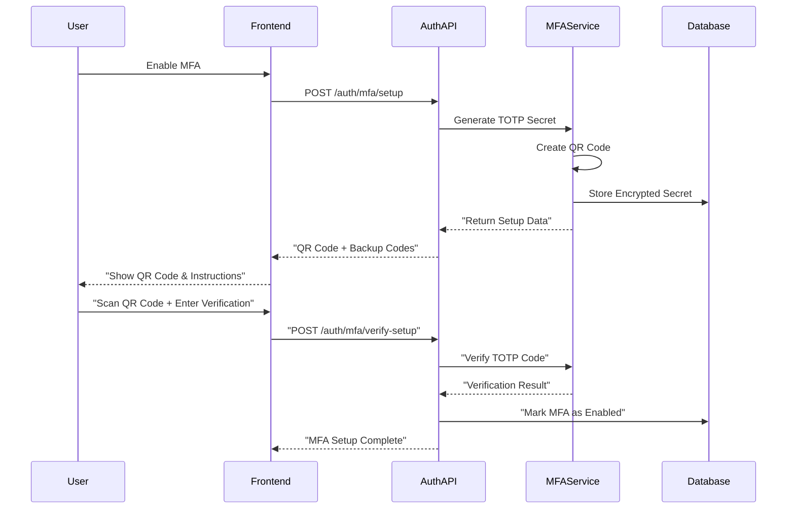

# 🔐 Authentication Systems

## 📋 **Overview**

HarborList implements enterprise-grade authentication systems with multi-factor authentication, secure session management, and comprehensive security controls to protect user accounts and administrative access.

---

## 🔐 **Multi-Factor Authentication (MFA)**

### **MFA Implementation & User Experience**

#### **TOTP (Time-based One-Time Password) System**
```typescript
interface MFAConfig {
  issuer: string;               // "HarborList"
  algorithm: 'SHA1' | 'SHA256'; // SHA1 for compatibility
  digits: 6 | 8;               // 6-digit codes
  period: 30;                  // 30-second intervals
  window: 1;                   // Allow 1 period drift
}

interface MFASetupResponse {
  secret: string;              // Base32 encoded secret
  qrCodeUrl: string;           // QR code data URL
  backupCodes: string[];       // Recovery codes
  manualEntryKey: string;      // For manual app setup
}

// MFA Setup Service
export class MFAService {
  static async setupMFA(userId: string): Promise<MFASetupResponse> {
    const secret = authenticator.generateSecret();
    const issuer = 'HarborList';
    const label = `${issuer}:${userId}`;
    
    const otpAuthUrl = authenticator.keyuri(userId, issuer, secret);
    const qrCode = await QRCode.toDataURL(otpAuthUrl);
    
    // Generate backup codes
    const backupCodes = Array.from({ length: 10 }, () =>
      Math.random().toString(36).substring(2, 8).toUpperCase()
    );
    
    // Store encrypted secret and backup codes
    await this.storeMFAData(userId, secret, backupCodes);
    
    return {
      secret,
      qrCodeUrl: qrCode,
      backupCodes,
      manualEntryKey: secret.match(/.{1,4}/g)?.join(' ') || secret
    };
  }

  static async verifyMFACode(userId: string, code: string): Promise<boolean> {
    const userData = await this.getMFAData(userId);
    if (!userData.secret) return false;

    // Verify TOTP code
    const isValid = authenticator.verify({
      token: code,
      secret: userData.secret,
      window: 1
    });

    // Check backup codes if TOTP fails
    if (!isValid) {
      return await this.verifyBackupCode(userId, code);
    }

    return isValid;
  }
}
```

#### **MFA Setup Flow**


#### **Admin MFA Enforcement**
```typescript
interface AdminMFAPolicy {
  required: boolean;           // MFA mandatory for all admins
  gracePeriod: number;         // Days to setup MFA (7 days)
  backupCodesRequired: number; // Minimum backup codes (5)
  sessionTimeout: number;      // MFA session timeout (4 hours)
  rememberDevice: boolean;     // Allow device trust (false for security)
}

// MFA middleware for admin routes
export const requireMFA = (req: Request, res: Response, next: NextFunction) => {
  const { user } = req.auth;
  
  if (user.role !== 'admin') {
    return next(); // MFA only required for admins
  }
  
  if (!user.mfaEnabled) {
    return res.status(403).json({
      error: 'MFA setup required',
      code: 'MFA_SETUP_REQUIRED',
      setupUrl: '/admin/mfa/setup'
    });
  }
  
  if (!req.session?.mfaVerified || req.session.mfaExpiry < Date.now()) {
    return res.status(403).json({
      error: 'MFA verification required',
      code: 'MFA_VERIFICATION_REQUIRED',
      verifyUrl: '/admin/mfa/verify'
    });
  }
  
  next();
};
```

---

## 🔒 **Session Management**

### **Secure Session Handling & Token Rotation**

#### **Session Architecture**
```typescript
interface UserSession {
  sessionId: string;
  userId: string;
  role: 'user' | 'admin';
  createdAt: Date;
  lastActivity: Date;
  expiresAt: Date;
  ipAddress: string;
  userAgent: string;
  mfaVerified?: boolean;      // For admin sessions
  mfaExpiry?: Date;
  deviceFingerprint: string;
  refreshCount: number;
  maxRefreshCount: number;    // Limit token refreshes
}

interface SessionConfig {
  accessTokenTTL: number;     // 15 minutes
  refreshTokenTTL: number;    // 7 days
  adminSessionTTL: number;    // 4 hours
  maxConcurrentSessions: number; // 3 sessions per user
  sessionIdleTimeout: number; // 30 minutes
  requireDeviceConsistency: boolean; // Validate device fingerprint
}
```

#### **Token Rotation Strategy**
```typescript
export class SessionService {
  static async refreshTokens(refreshToken: string, deviceFingerprint: string): Promise<TokenPair> {
    // Validate refresh token
    const session = await this.validateRefreshToken(refreshToken);
    if (!session) {
      throw new UnauthorizedError('Invalid refresh token');
    }

    // Check device consistency (optional security measure)
    if (this.config.requireDeviceConsistency && 
        session.deviceFingerprint !== deviceFingerprint) {
      await this.invalidateSession(session.sessionId);
      throw new SecurityError('Device fingerprint mismatch');
    }

    // Check refresh limits
    if (session.refreshCount >= session.maxRefreshCount) {
      await this.invalidateSession(session.sessionId);
      throw new SecurityError('Refresh limit exceeded');
    }

    // Generate new token pair
    const newAccessToken = await this.generateAccessToken(session);
    const newRefreshToken = await this.generateRefreshToken(session);

    // Update session
    await this.updateSession(session.sessionId, {
      lastActivity: new Date(),
      refreshCount: session.refreshCount + 1
    });

    // Audit log
    await this.auditLog({
      action: 'TOKEN_REFRESH',
      userId: session.userId,
      sessionId: session.sessionId,
      ipAddress: session.ipAddress
    });

    return {
      accessToken: newAccessToken,
      refreshToken: newRefreshToken,
      expiresIn: this.config.accessTokenTTL
    };
  }

  // Session cleanup job
  static async cleanupExpiredSessions(): Promise<void> {
    const expiredSessions = await this.getExpiredSessions();
    
    for (const session of expiredSessions) {
      await this.invalidateSession(session.sessionId);
      
      await this.auditLog({
        action: 'SESSION_EXPIRED',
        userId: session.userId,
        sessionId: session.sessionId,
        timestamp: new Date()
      });
    }
  }
}
```

#### **Concurrent Session Management**
```typescript
interface SessionLimitPolicy {
  maxSessions: number;
  strategy: 'reject_new' | 'invalidate_oldest' | 'allow_all';
  notifyOnNewSession: boolean;
}

export const handleNewSession = async (userId: string, sessionData: Partial<UserSession>) => {
  const existingSessions = await SessionService.getUserSessions(userId);
  const policy = await PolicyService.getSessionPolicy(userId);

  if (existingSessions.length >= policy.maxSessions) {
    switch (policy.strategy) {
      case 'reject_new':
        throw new SessionLimitError('Maximum sessions reached');
        
      case 'invalidate_oldest':
        const oldestSession = existingSessions.sort((a, b) => 
          a.lastActivity.getTime() - b.lastActivity.getTime()
        )[0];
        
        await SessionService.invalidateSession(oldestSession.sessionId);
        
        if (policy.notifyOnNewSession) {
          await NotificationService.sendSessionAlert(userId, {
            type: 'SESSION_REPLACED',
            deviceInfo: oldestSession.userAgent,
            timestamp: new Date()
          });
        }
        break;
        
      case 'allow_all':
        // Continue without restriction
        break;
    }
  }

  return await SessionService.createSession(userId, sessionData);
};
```

---

## 🔑 **Password Management**

### **Password Policies & Security Requirements**

#### **Password Strength Requirements**
```typescript
interface PasswordPolicy {
  minLength: number;          // Minimum 12 characters
  maxLength: number;          // Maximum 128 characters
  requireUppercase: boolean;  // At least 1 uppercase letter
  requireLowercase: boolean;  // At least 1 lowercase letter
  requireNumbers: boolean;    // At least 1 number
  requireSpecialChars: boolean; // At least 1 special character
  forbiddenPatterns: string[]; // Common patterns to reject
  historyCount: number;       // Remember last 12 passwords
  maxAge: number;            // Force change every 180 days (admin only)
  accountLockout: {
    attempts: number;         // Lock after 5 attempts
    duration: number;         // 30 minutes lockout
    escalation: number;       // Increase lockout duration
  };
}

export class PasswordService {
  static validatePassword(password: string, policy: PasswordPolicy): ValidationResult {
    const errors: string[] = [];
    
    // Length validation
    if (password.length < policy.minLength) {
      errors.push(`Password must be at least ${policy.minLength} characters`);
    }
    
    if (password.length > policy.maxLength) {
      errors.push(`Password must be no more than ${policy.maxLength} characters`);
    }
    
    // Character requirements
    if (policy.requireUppercase && !/[A-Z]/.test(password)) {
      errors.push('Password must contain at least one uppercase letter');
    }
    
    if (policy.requireLowercase && !/[a-z]/.test(password)) {
      errors.push('Password must contain at least one lowercase letter');
    }
    
    if (policy.requireNumbers && !/\d/.test(password)) {
      errors.push('Password must contain at least one number');
    }
    
    if (policy.requireSpecialChars && !/[!@#$%^&*(),.?":{}|<>]/.test(password)) {
      errors.push('Password must contain at least one special character');
    }
    
    // Common pattern detection
    for (const pattern of policy.forbiddenPatterns) {
      if (password.toLowerCase().includes(pattern.toLowerCase())) {
        errors.push('Password contains a common pattern');
        break;
      }
    }
    
    // Entropy check
    const entropy = this.calculateEntropy(password);
    if (entropy < 50) {
      errors.push('Password is not complex enough');
    }
    
    return {
      isValid: errors.length === 0,
      errors,
      strength: this.calculateStrength(password),
      entropy
    };
  }

  static async hashPassword(password: string): Promise<string> {
    const saltRounds = 12; // Increased for better security
    return await bcrypt.hash(password, saltRounds);
  }

  static async verifyPassword(password: string, hash: string): Promise<boolean> {
    return await bcrypt.compare(password, hash);
  }

  static generateSecurePassword(length: number = 16): string {
    const charset = 'ABCDEFGHIJKLMNOPQRSTUVWXYZabcdefghijklmnopqrstuvwxyz0123456789!@#$%^&*';
    let password = '';
    
    // Ensure at least one character from each required category
    password += this.getRandomChar('ABCDEFGHIJKLMNOPQRSTUVWXYZ');
    password += this.getRandomChar('abcdefghijklmnopqrstuvwxyz');
    password += this.getRandomChar('0123456789');
    password += this.getRandomChar('!@#$%^&*');
    
    // Fill remaining length
    for (let i = 4; i < length; i++) {
      password += charset[Math.floor(Math.random() * charset.length)];
    }
    
    // Shuffle the password
    return password.split('').sort(() => 0.5 - Math.random()).join('');
  }
}
```

#### **Password Reset Flow**
```typescript
interface PasswordResetRequest {
  email: string;
  token?: string;
  newPassword?: string;
  ipAddress: string;
  userAgent: string;
}

export class PasswordResetService {
  static async requestReset(email: string, ipAddress: string): Promise<void> {
    const user = await UserService.findByEmail(email);
    if (!user) {
      // Don't reveal whether email exists - always return success
      return;
    }

    // Rate limiting - max 3 requests per hour per email
    const recentRequests = await this.getRecentResetRequests(email);
    if (recentRequests.length >= 3) {
      throw new RateLimitError('Too many password reset requests');
    }

    // Generate secure reset token
    const resetToken = crypto.randomBytes(32).toString('hex');
    const hashedToken = crypto.createHash('sha256').update(resetToken).digest('hex');
    
    // Store reset request (expires in 1 hour)
    await this.storeResetRequest({
      userId: user.userId,
      tokenHash: hashedToken,
      expiresAt: new Date(Date.now() + 3600000), // 1 hour
      ipAddress,
      used: false
    });

    // Send reset email
    await EmailService.sendPasswordResetEmail(user.email, resetToken);

    // Audit log
    await AuditService.log({
      action: 'PASSWORD_RESET_REQUESTED',
      userId: user.userId,
      ipAddress,
      timestamp: new Date()
    });
  }

  static async resetPassword(token: string, newPassword: string, ipAddress: string): Promise<void> {
    const hashedToken = crypto.createHash('sha256').update(token).digest('hex');
    const resetRequest = await this.getResetRequest(hashedToken);

    if (!resetRequest || resetRequest.expiresAt < new Date() || resetRequest.used) {
      throw new InvalidTokenError('Invalid or expired reset token');
    }

    // Validate new password
    const user = await UserService.findById(resetRequest.userId);
    const validation = PasswordService.validatePassword(newPassword, await this.getPasswordPolicy(user));
    
    if (!validation.isValid) {
      throw new ValidationError('Password does not meet requirements', validation.errors);
    }

    // Check password history
    const isReused = await this.checkPasswordHistory(user.userId, newPassword);
    if (isReused) {
      throw new ValidationError('Cannot reuse a previous password');
    }

    // Update password
    const hashedPassword = await PasswordService.hashPassword(newPassword);
    await UserService.updatePassword(user.userId, hashedPassword);

    // Mark reset request as used
    await this.markResetRequestUsed(resetRequest.id);

    // Invalidate all user sessions
    await SessionService.invalidateAllUserSessions(user.userId);

    // Store password in history
    await this.addToPasswordHistory(user.userId, hashedPassword);

    // Audit log
    await AuditService.log({
      action: 'PASSWORD_RESET_COMPLETED',
      userId: user.userId,
      ipAddress,
      timestamp: new Date()
    });

    // Send confirmation email
    await EmailService.sendPasswordResetConfirmation(user.email);
  }
}
```

---

## 🌐 **Social Authentication**

### **Third-Party Login Integration**

#### **OAuth Provider Configuration**
```typescript
interface OAuthProvider {
  name: string;
  clientId: string;
  clientSecret: string;
  authorizationUrl: string;
  tokenUrl: string;
  userInfoUrl: string;
  scope: string[];
  redirectUri: string;
}

interface SocialAuthConfig {
  google: OAuthProvider;
  facebook: OAuthProvider;
  apple: OAuthProvider;
  linkedin: OAuthProvider;
}

// OAuth flow implementation
export class SocialAuthService {
  static async initiateAuth(provider: string, state?: string): Promise<string> {
    const config = this.getProviderConfig(provider);
    const authState = state || crypto.randomBytes(16).toString('hex');
    
    // Store state for validation
    await this.storeAuthState(authState, provider);
    
    const params = new URLSearchParams({
      client_id: config.clientId,
      redirect_uri: config.redirectUri,
      scope: config.scope.join(' '),
      response_type: 'code',
      state: authState,
      // Additional security parameters
      code_challenge: await this.generatePKCEChallenge(),
      code_challenge_method: 'S256'
    });
    
    return `${config.authorizationUrl}?${params.toString()}`;
  }

  static async handleCallback(provider: string, code: string, state: string): Promise<AuthResult> {
    // Validate state parameter
    const isValidState = await this.validateAuthState(state, provider);
    if (!isValidState) {
      throw new SecurityError('Invalid OAuth state parameter');
    }

    // Exchange code for tokens
    const tokens = await this.exchangeCodeForTokens(provider, code);
    
    // Get user info from provider
    const providerUser = await this.fetchUserInfo(provider, tokens.access_token);
    
    // Find or create local user
    let user = await UserService.findBySocialId(provider, providerUser.id);
    
    if (!user) {
      // Check if email already exists
      const existingUser = await UserService.findByEmail(providerUser.email);
      if (existingUser) {
        // Link social account to existing user
        await this.linkSocialAccount(existingUser.userId, provider, providerUser);
        user = existingUser;
      } else {
        // Create new user
        user = await this.createUserFromSocialProfile(provider, providerUser);
      }
    }

    // Generate our own tokens
    const session = await SessionService.createSession(user.userId, {
      authMethod: 'social',
      socialProvider: provider
    });

    return {
      user,
      tokens: session.tokens,
      isNewUser: !user.lastLogin
    };
  }

  static async linkAccount(userId: string, provider: string, authCode: string): Promise<void> {
    const tokens = await this.exchangeCodeForTokens(provider, authCode);
    const providerUser = await this.fetchUserInfo(provider, tokens.access_token);
    
    // Check if this social account is already linked to another user
    const existingLink = await this.findSocialAccountLink(provider, providerUser.id);
    if (existingLink && existingLink.userId !== userId) {
      throw new ConflictError('Social account already linked to another user');
    }
    
    await this.createSocialAccountLink(userId, provider, providerUser);
    
    await AuditService.log({
      action: 'SOCIAL_ACCOUNT_LINKED',
      userId,
      details: { provider, socialId: providerUser.id }
    });
  }

  static async unlinkAccount(userId: string, provider: string): Promise<void> {
    // Ensure user has other authentication methods
    const authMethods = await this.getUserAuthMethods(userId);
    if (authMethods.length <= 1) {
      throw new ValidationError('Cannot unlink last authentication method');
    }
    
    await this.removeSocialAccountLink(userId, provider);
    
    await AuditService.log({
      action: 'SOCIAL_ACCOUNT_UNLINKED',
      userId,
      details: { provider }
    });
  }
}
```

#### **Account Linking & Management**
```typescript
interface SocialAccountLink {
  userId: string;
  provider: string;
  socialId: string;
  socialEmail: string;
  socialName: string;
  profilePicture?: string;
  linkedAt: Date;
  lastUsed: Date;
  metadata: Record<string, any>;
}

// Account management component
const SocialAccountsManager: React.FC = () => {
  const { user } = useAuth();
  const [linkedAccounts, setLinkedAccounts] = useState<SocialAccountLink[]>([]);
  const [availableProviders] = useState(['google', 'facebook', 'apple', 'linkedin']);

  const linkAccount = async (provider: string) => {
    try {
      const authUrl = await socialAuthService.getAuthUrl(provider);
      window.location.href = authUrl;
    } catch (error) {
      toast.error(`Failed to link ${provider} account`);
    }
  };

  const unlinkAccount = async (provider: string) => {
    if (linkedAccounts.length <= 1) {
      toast.error('Cannot unlink your last authentication method');
      return;
    }

    try {
      await socialAuthService.unlinkAccount(provider);
      setLinkedAccounts(prev => prev.filter(acc => acc.provider !== provider));
      toast.success(`${provider} account unlinked successfully`);
    } catch (error) {
      toast.error(`Failed to unlink ${provider} account`);
    }
  };

  return (
    <div className="space-y-4">
      <h3 className="text-lg font-medium">Connected Accounts</h3>
      
      {availableProviders.map(provider => {
        const isLinked = linkedAccounts.some(acc => acc.provider === provider);
        
        return (
          <div key={provider} className="flex items-center justify-between p-4 border rounded-lg">
            <div className="flex items-center space-x-3">
              
              <span className="font-medium capitalize">{provider}</span>
            </div>
            
            {isLinked ? (
              <Button
                variant="outline"
                size="sm"
                onClick={() => unlinkAccount(provider)}
              >
                Unlink
              </Button>
            ) : (
              <Button
                variant="primary"
                size="sm"
                onClick={() => linkAccount(provider)}
              >
                Link Account
              </Button>
            )}
          </div>
        );
      })}
    </div>
  );
};
```

---

**📅 Last Updated**: October 2025  
**📝 Version**: 1.0.0  
**👥 Maintained By**: HarborList Development Team