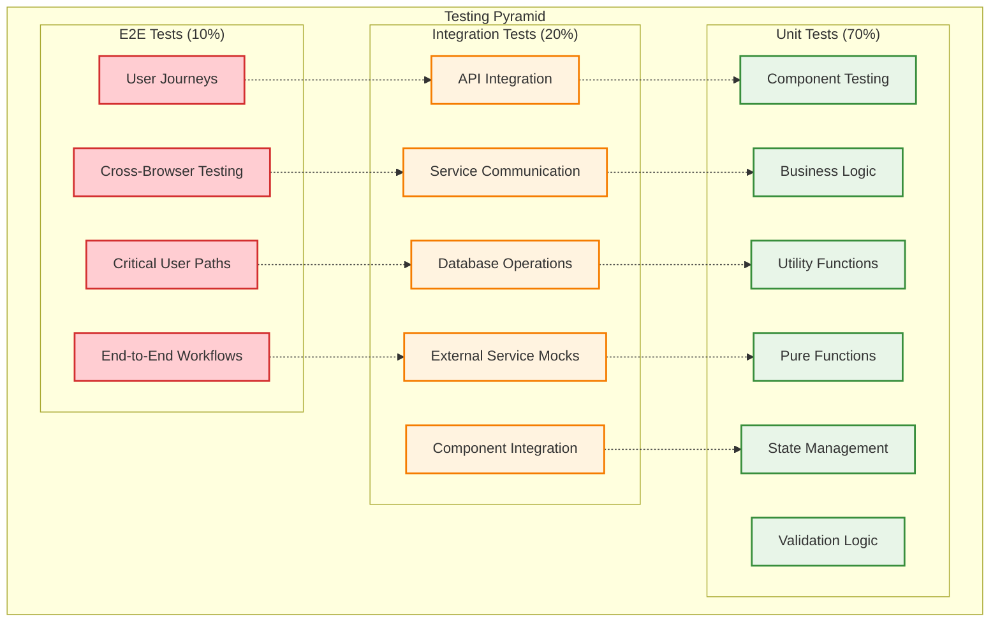

# 🧪 Testing Documentation

## 📋 **Overview**

The HarborList testing strategy implements comprehensive quality assurance across all application layers. Our testing approach ensures reliable functionality, performance, security, and user experience through automated testing pipelines, comprehensive coverage metrics, and continuous quality monitoring.

---

## 🎯 **Testing Strategy**

### **Testing Pyramid Implementation**



### **Testing Levels & Ownership**

| Level | Coverage | Ownership | Tools | Frequency |
|-------|----------|-----------|-------|-----------|
| **Unit** | 90%+ | Developers | Jest, RTL | Every commit |
| **Integration** | 80%+ | Developers + QA | Cypress, Supertest | Every PR |
| **E2E** | Critical paths | QA Team | Cypress, Playwright | Daily + Release |
| **Performance** | Key flows | DevOps + QA | K6, Lighthouse | Weekly |
| **Security** | Full app | Security Team | OWASP ZAP, Snyk | Weekly |

---

## ⚛️ **Frontend Testing**

### **Component Testing Strategy**

```typescript
// Component Test Structure
describe('ListingCard Component', () => {
  const mockListing: Listing = {
    id: 'test-listing-1',
    title: 'Beautiful Sailboat',
    description: 'A stunning 35ft sailboat perfect for weekend adventures',
    price: 125000,
    currency: 'USD',
    location: { city: 'San Francisco', state: 'CA' },
    images: ['image1.jpg', 'image2.jpg'],
    featured: true,
    status: 'active',
    boatType: 'sailboat',
    length: 35,
    year: 2020,
    manufacturer: 'Catalina',
    model: 'C350',
    createdAt: '2024-01-01T00:00:00Z',
    updatedAt: '2024-01-01T00:00:00Z',
  };

  // Rendering Tests
  describe('Rendering', () => {
    it('should render all listing information correctly', () => {
      render(<ListingCard listing={mockListing} />);
      
      expect(screen.getByText('Beautiful Sailboat')).toBeInTheDocument();
      expect(screen.getByText(/A stunning 35ft sailboat/)).toBeInTheDocument();
      expect(screen.getByText('$125,000')).toBeInTheDocument();
      expect(screen.getByText('San Francisco, CA')).toBeInTheDocument();
      expect(screen.getByText('Featured')).toBeInTheDocument();
      expect(screen.getByText('2020 Catalina C350')).toBeInTheDocument();
    });

    it('should handle missing optional data gracefully', () => {
      const minimalListing = {
        ...mockListing,
        manufacturer: undefined,
        model: undefined,
        year: undefined,
        images: [],
      };
      
      render(<ListingCard listing={minimalListing} />);
      
      expect(screen.getByText('Beautiful Sailboat')).toBeInTheDocument();
      expect(screen.getByText('$125,000')).toBeInTheDocument();
      expect(screen.getByRole('img', { name: /default boat/i })).toBeInTheDocument();
    });
  });

  // Interaction Tests
  describe('User Interactions', () => {
    it('should handle click events correctly', async () => {
      const user = userEvent.setup();
      const mockOnClick = jest.fn();
      
      render(<ListingCard listing={mockListing} onClick={mockOnClick} />);
      
      const card = screen.getByRole('article');
      await user.click(card);
      
      expect(mockOnClick).toHaveBeenCalledWith(mockListing.id);
    });

    it('should handle favorite toggle', async () => {
      const user = userEvent.setup();
      const mockOnFavorite = jest.fn();
      
      render(
        <ListingCard 
          listing={mockListing} 
          onFavoriteToggle={mockOnFavorite}
          showFavoriteButton={true}
        />
      );
      
      const favoriteButton = screen.getByRole('button', { name: /add to favorites/i });
      await user.click(favoriteButton);
      
      expect(mockOnFavorite).toHaveBeenCalledWith(mockListing.id, true);
    });

    it('should handle keyboard navigation', async () => {
      const user = userEvent.setup();
      const mockOnClick = jest.fn();
      
      render(<ListingCard listing={mockListing} onClick={mockOnClick} />);
      
      const card = screen.getByRole('article');
      card.focus();
      await user.keyboard('{Enter}');
      
      expect(mockOnClick).toHaveBeenCalledWith(mockListing.id);
    });
  });

  // Accessibility Tests
  describe('Accessibility', () => {
    it('should meet WCAG accessibility standards', async () => {
      const { container } = render(<ListingCard listing={mockListing} />);
      const results = await axe(container);
      expect(results).toHaveNoViolations();
    });

    it('should have proper ARIA labels', () => {
      render(<ListingCard listing={mockListing} />);
      
      const card = screen.getByRole('article');
      expect(card).toHaveAttribute('aria-label', expect.stringContaining('Beautiful Sailboat'));
      
      const priceElement = screen.getByText('$125,000');
      expect(priceElement.closest('[role="text"]')).toHaveAttribute(
        'aria-label', 
        'Price: $125,000'
      );
    });

    it('should support screen readers', () => {
      render(<ListingCard listing={mockListing} />);
      
      // Check for screen reader content
      expect(screen.getByText('Featured listing')).toBeInTheDocument();
      expect(screen.getByLabelText(/location/i)).toBeInTheDocument();
    });
  });

  // Responsive Design Tests
  describe('Responsive Design', () => {
    it('should adapt to mobile viewport', () => {
      // Mock mobile viewport
      Object.defineProperty(window, 'innerWidth', {
        writable: true,
        configurable: true,
        value: 375,
      });

      render(<ListingCard listing={mockListing} />);
      
      const card = screen.getByRole('article');
      expect(card).toHaveClass('mobile-layout');
    });

    it('should handle long text on mobile', () => {
      const longTitleListing = {
        ...mockListing,
        title: 'This is a very long listing title that should be truncated on mobile devices',
      };

      render(<ListingCard listing={longTitleListing} />);
      
      const title = screen.getByText(/This is a very long listing/);
      expect(title).toHaveClass('truncate');
    });
  });

  // Error State Tests
  describe('Error Handling', () => {
    it('should handle image loading errors', async () => {
      const consoleSpy = jest.spyOn(console, 'error').mockImplementation();
      
      render(<ListingCard listing={mockListing} />);
      
      const image = screen.getByRole('img');
      fireEvent.error(image);
      
      // Should show fallback image
      expect(screen.getByRole('img')).toHaveAttribute('src', expect.stringContaining('fallback'));
      
      consoleSpy.mockRestore();
    });
  });
});

// Custom Hook Testing
describe('useListings Hook', () => {
  const wrapper = ({ children }: { children: React.ReactNode }) => (
    <QueryClient client={testQueryClient}>
      <AuthProvider>
        {children}
      </AuthProvider>
    </QueryClient>
  );

  beforeEach(() => {
    testQueryClient.clear();
    jest.clearAllMocks();
  });

  it('should fetch listings successfully', async () => {
    const mockListings = [mockListing];
    
    // Mock API response
    server.use(
      rest.get('/api/listings', (req, res, ctx) => {
        return res(
          ctx.json({
            listings: mockListings,
            total: 1,
            page: 1,
            limit: 20,
          })
        );
      })
    );

    const { result } = renderHook(() => useListings(), { wrapper });

    // Initial loading state
    expect(result.current.isLoading).toBe(true);
    expect(result.current.data).toBeUndefined();

    // Wait for data
    await waitFor(() => {
      expect(result.current.isSuccess).toBe(true);
    });

    expect(result.current.data?.listings).toEqual(mockListings);
    expect(result.current.data?.total).toBe(1);
    expect(result.current.isLoading).toBe(false);
  });

  it('should handle error states correctly', async () => {
    // Mock API error
    server.use(
      rest.get('/api/listings', (req, res, ctx) => {
        return res(ctx.status(500), ctx.json({ error: 'Server error' }));
      })
    );

    const { result } = renderHook(() => useListings(), { wrapper });

    await waitFor(() => {
      expect(result.current.isError).toBe(true);
    });

    expect(result.current.error).toBeDefined();
    expect(result.current.data).toBeUndefined();
  });

  it('should refetch data on filter changes', async () => {
    const { result, rerender } = renderHook(
      (filters = {}) => useListings(filters),
      { wrapper }
    );

    // Initial fetch
    await waitFor(() => expect(result.current.isSuccess).toBe(true));

    // Change filters
    rerender({ location: 'San Francisco' });

    // Should trigger refetch
    expect(result.current.isLoading).toBe(true);
    await waitFor(() => expect(result.current.isSuccess).toBe(true));
  });
});
```

### **Form Testing Patterns**

```typescript
// Form Component Testing
describe('CreateListingForm', () => {
  const mockOnSubmit = jest.fn();
  const mockOnCancel = jest.fn();

  beforeEach(() => {
    jest.clearAllMocks();
  });

  it('should validate required fields', async () => {
    const user = userEvent.setup();
    
    render(<CreateListingForm onSubmit={mockOnSubmit} onCancel={mockOnCancel} />);
    
    // Try to submit without filling required fields
    const submitButton = screen.getByRole('button', { name: /create listing/i });
    await user.click(submitButton);
    
    // Should show validation errors
    expect(screen.getByText('Title is required')).toBeInTheDocument();
    expect(screen.getByText('Price is required')).toBeInTheDocument();
    expect(screen.getByText('Location is required')).toBeInTheDocument();
    
    // Should not call onSubmit
    expect(mockOnSubmit).not.toHaveBeenCalled();
  });

  it('should handle successful form submission', async () => {
    const user = userEvent.setup();
    
    render(<CreateListingForm onSubmit={mockOnSubmit} onCancel={mockOnCancel} />);
    
    // Fill out form
    await user.type(screen.getByLabelText(/title/i), 'Test Boat');
    await user.type(screen.getByLabelText(/description/i), 'A great test boat');
    await user.type(screen.getByLabelText(/price/i), '50000');
    await user.selectOptions(screen.getByLabelText(/boat type/i), 'sailboat');
    await user.type(screen.getByLabelText(/city/i), 'San Francisco');
    await user.selectOptions(screen.getByLabelText(/state/i), 'CA');
    
    // Submit form
    const submitButton = screen.getByRole('button', { name: /create listing/i });
    await user.click(submitButton);
    
    // Should call onSubmit with form data
    await waitFor(() => {
      expect(mockOnSubmit).toHaveBeenCalledWith(
        expect.objectContaining({
          title: 'Test Boat',
          description: 'A great test boat',
          price: 50000,
          boatType: 'sailboat',
          location: {
            city: 'San Francisco',
            state: 'CA',
          },
        })
      );
    });
  });

  it('should handle file uploads', async () => {
    const user = userEvent.setup();
    const file = new File(['boat image'], 'boat.jpg', { type: 'image/jpeg' });
    
    render(<CreateListingForm onSubmit={mockOnSubmit} />);
    
    const fileInput = screen.getByLabelText(/upload images/i);
    await user.upload(fileInput, file);
    
    // Should show uploaded file
    expect(screen.getByText('boat.jpg')).toBeInTheDocument();
    
    // Should show image preview
    const preview = screen.getByRole('img', { name: /boat.jpg preview/i });
    expect(preview).toBeInTheDocument();
  });

  it('should handle form field errors', async () => {
    const user = userEvent.setup();
    
    render(<CreateListingForm onSubmit={mockOnSubmit} />);
    
    // Enter invalid price
    const priceInput = screen.getByLabelText(/price/i);
    await user.type(priceInput, 'invalid');
    await user.tab(); // Trigger blur
    
    // Should show validation error
    expect(screen.getByText('Price must be a valid number')).toBeInTheDocument();
    expect(priceInput).toHaveAttribute('aria-invalid', 'true');
  });
});
```

---

## 🔧 **Backend Testing**

### **API Testing Strategy**

```typescript
// API Integration Tests
describe('Listing API', () => {
  let app: Express;
  let authToken: string;
  let testUser: User;

  beforeAll(async () => {
    app = await createTestApp();
    
    // Create test user and get auth token
    testUser = await createTestUser();
    authToken = await generateAuthToken(testUser.id);
  });

  afterAll(async () => {
    await cleanupTestData();
  });

  describe('POST /api/listings', () => {
    it('should create a new listing successfully', async () => {
      const listingData = {
        title: 'Test Boat',
        description: 'A great test boat for sale',
        price: 50000,
        currency: 'USD',
        boatType: 'sailboat',
        location: {
          city: 'San Francisco',
          state: 'CA',
          country: 'US',
        },
        length: 35,
        year: 2020,
        manufacturer: 'Catalina',
        model: 'C350',
      };

      const response = await request(app)
        .post('/api/listings')
        .set('Authorization', `Bearer ${authToken}`)
        .send(listingData)
        .expect(201);

      expect(response.body).toMatchObject({
        id: expect.any(String),
        ...listingData,
        userId: testUser.id,
        status: 'draft',
        createdAt: expect.any(String),
        updatedAt: expect.any(String),
      });

      // Verify listing was saved to database
      const savedListing = await listingRepository.findById(response.body.id);
      expect(savedListing).toBeTruthy();
      expect(savedListing!.title).toBe(listingData.title);
    });

    it('should validate required fields', async () => {
      const invalidData = {
        title: '', // Empty title
        price: -1000, // Negative price
        // Missing required fields
      };

      const response = await request(app)
        .post('/api/listings')
        .set('Authorization', `Bearer ${authToken}`)
        .send(invalidData)
        .expect(400);

      expect(response.body.error).toBe('Validation failed');
      expect(response.body.details).toEqual(
        expect.arrayContaining([
          expect.objectContaining({
            field: 'title',
            message: 'Title is required',
          }),
          expect.objectContaining({
            field: 'price',
            message: 'Price must be positive',
          }),
        ])
      );
    });

    it('should require authentication', async () => {
      await request(app)
        .post('/api/listings')
        .send({ title: 'Test' })
        .expect(401);
    });

    it('should handle database errors gracefully', async () => {
      // Mock database error
      jest.spyOn(listingRepository, 'create').mockRejectedValueOnce(
        new Error('Database connection failed')
      );

      await request(app)
        .post('/api/listings')
        .set('Authorization', `Bearer ${authToken}`)
        .send({
          title: 'Test Boat',
          price: 50000,
          boatType: 'sailboat',
          location: { city: 'Test', state: 'CA' },
        })
        .expect(500);
    });
  });

  describe('GET /api/listings', () => {
    beforeEach(async () => {
      // Create test listings
      await createTestListings();
    });

    it('should return paginated listings', async () => {
      const response = await request(app)
        .get('/api/listings?page=1&limit=10')
        .expect(200);

      expect(response.body).toMatchObject({
        listings: expect.any(Array),
        total: expect.any(Number),
        page: 1,
        limit: 10,
        hasMore: expect.any(Boolean),
      });

      expect(response.body.listings).toHaveLength(
        Math.min(10, response.body.total)
      );
    });

    it('should filter listings by price range', async () => {
      const response = await request(app)
        .get('/api/listings?minPrice=25000&maxPrice=75000')
        .expect(200);

      response.body.listings.forEach((listing: any) => {
        expect(listing.price).toBeGreaterThanOrEqual(25000);
        expect(listing.price).toBeLessThanOrEqual(75000);
      });
    });

    it('should search listings by text', async () => {
      const response = await request(app)
        .get('/api/listings?q=sailboat')
        .expect(200);

      response.body.listings.forEach((listing: any) => {
        const text = `${listing.title} ${listing.description} ${listing.boatType}`.toLowerCase();
        expect(text).toContain('sailboat');
      });
    });

    it('should handle invalid query parameters', async () => {
      const response = await request(app)
        .get('/api/listings?page=-1&limit=1000')
        .expect(400);

      expect(response.body.error).toBe('Invalid query parameters');
    });
  });

  describe('GET /api/listings/:id', () => {
    let testListing: Listing;

    beforeEach(async () => {
      testListing = await createTestListing(testUser.id);
    });

    it('should return listing by ID', async () => {
      const response = await request(app)
        .get(`/api/listings/${testListing.id}`)
        .expect(200);

      expect(response.body).toMatchObject({
        id: testListing.id,
        title: testListing.title,
        price: testListing.price,
        userId: testUser.id,
      });
    });

    it('should return 404 for non-existent listing', async () => {
      await request(app)
        .get('/api/listings/non-existent-id')
        .expect(404);
    });

    it('should increment view count', async () => {
      const initialViews = testListing.viewCount;

      await request(app)
        .get(`/api/listings/${testListing.id}`)
        .expect(200);

      // Check that view count increased
      const updatedListing = await listingRepository.findById(testListing.id);
      expect(updatedListing!.viewCount).toBe(initialViews + 1);
    });
  });
});

// Service Unit Tests
describe('AuthService', () => {
  let authService: AuthService;
  let mockUserRepository: jest.Mocked<UserRepository>;
  let mockTokenService: jest.Mocked<TokenService>;

  beforeEach(() => {
    mockUserRepository = createMockUserRepository();
    mockTokenService = createMockTokenService();
    authService = new AuthService(mockUserRepository, mockTokenService);
  });

  describe('login', () => {
    it('should authenticate user with valid credentials', async () => {
      const credentials = {
        email: 'test@example.com',
        password: 'password123',
      };

      const mockUser = {
        id: 'user-1',
        email: credentials.email,
        passwordHash: await bcrypt.hash(credentials.password, 10),
        status: UserStatus.ACTIVE,
        role: UserRole.USER,
      };

      mockUserRepository.findByEmail.mockResolvedValue(mockUser);
      mockTokenService.generateAccessToken.mockReturnValue('access-token');
      mockTokenService.generateRefreshToken.mockReturnValue('refresh-token');

      const result = await authService.login(credentials);

      expect(result).toEqual({
        user: expect.objectContaining({
          id: mockUser.id,
          email: mockUser.email,
        }),
        accessToken: 'access-token',
        refreshToken: 'refresh-token',
      });

      expect(mockUserRepository.findByEmail).toHaveBeenCalledWith(credentials.email);
      expect(mockTokenService.generateAccessToken).toHaveBeenCalledWith(
        expect.objectContaining({ userId: mockUser.id })
      );
    });

    it('should throw error for invalid credentials', async () => {
      const credentials = {
        email: 'test@example.com',
        password: 'wrongpassword',
      };

      mockUserRepository.findByEmail.mockResolvedValue(null);

      await expect(authService.login(credentials)).rejects.toThrow(
        'Invalid credentials'
      );
    });

    it('should throw error for inactive user', async () => {
      const credentials = {
        email: 'test@example.com',
        password: 'password123',
      };

      const mockUser = {
        id: 'user-1',
        email: credentials.email,
        passwordHash: await bcrypt.hash(credentials.password, 10),
        status: UserStatus.SUSPENDED,
        role: UserRole.USER,
      };

      mockUserRepository.findByEmail.mockResolvedValue(mockUser);

      await expect(authService.login(credentials)).rejects.toThrow(
        'Account is not active'
      );
    });
  });

  describe('verifyToken', () => {
    it('should verify valid token', async () => {
      const token = 'valid-token';
      const payload = {
        userId: 'user-1',
        email: 'test@example.com',
        role: UserRole.USER,
      };

      mockTokenService.verifyToken.mockResolvedValue(payload);

      const result = await authService.verifyToken(token);

      expect(result).toEqual(payload);
      expect(mockTokenService.verifyToken).toHaveBeenCalledWith(token, 'access');
    });

    it('should throw error for invalid token', async () => {
      const token = 'invalid-token';

      mockTokenService.verifyToken.mockRejectedValue(
        new AuthError('Invalid token', 'TOKEN_INVALID')
      );

      await expect(authService.verifyToken(token)).rejects.toThrow(
        'Invalid token'
      );
    });
  });
});
```

### **Database Testing**

```typescript
// Repository Tests with Test Database
describe('ListingRepository', () => {
  let repository: ListingRepository;
  let testDynamoClient: DynamoDBClient;

  beforeAll(async () => {
    // Use DynamoDB Local for testing
    testDynamoClient = new DynamoDBClient({
      region: 'us-east-1',
      endpoint: 'http://localhost:8000',
      credentials: {
        accessKeyId: 'test',
        secretAccessKey: 'test',
      },
    });

    repository = new ListingRepository(testDynamoClient);
    
    // Create test table
    await createTestTable(testDynamoClient);
  });

  afterAll(async () => {
    await deleteTestTable(testDynamoClient);
    testDynamoClient.destroy();
  });

  beforeEach(async () => {
    // Clean test data before each test
    await clearTestData(testDynamoClient);
  });

  describe('create', () => {
    it('should create listing with generated ID and timestamps', async () => {
      const listingData = {
        userId: 'user-1',
        title: 'Test Boat',
        description: 'A test boat',
        price: 50000,
        currency: 'USD' as const,
        boatType: 'sailboat' as const,
        location: {
          city: 'San Francisco',
          state: 'CA',
          country: 'US',
        },
        length: 35,
      };

      const result = await repository.create(listingData);

      expect(result).toMatchObject({
        ...listingData,
        id: expect.any(String),
        status: ListingStatus.DRAFT,
        createdAt: expect.any(String),
        updatedAt: expect.any(String),
        viewCount: 0,
        contactCount: 0,
        favoriteCount: 0,
      });

      // Verify it was saved
      const saved = await repository.findById(result.id);
      expect(saved).toEqual(result);
    });

    it('should handle duplicate ID generation gracefully', async () => {
      // Mock UUID generation to create collision
      const mockId = 'test-listing-id';
      jest.spyOn(crypto, 'randomUUID').mockReturnValueOnce(mockId);

      // Create first listing
      const listingData = {
        userId: 'user-1',
        title: 'First Boat',
        price: 50000,
        boatType: 'sailboat' as const,
        location: { city: 'Test', state: 'CA', country: 'US' },
        length: 35,
      };

      await repository.create(listingData);

      // Try to create second with same ID
      jest.spyOn(crypto, 'randomUUID').mockReturnValueOnce(mockId);

      await expect(repository.create({
        ...listingData,
        title: 'Second Boat',
      })).rejects.toThrow('Listing already exists');
    });
  });

  describe('search', () => {
    beforeEach(async () => {
      // Create test listings
      await createTestListings(repository);
    });

    it('should return listings matching filters', async () => {
      const filters: SearchFilters = {
        minPrice: 25000,
        maxPrice: 75000,
        boatType: 'sailboat',
        page: 1,
        limit: 10,
      };

      const result = await repository.search(filters);

      expect(result.listings).toHaveLength(
        expect.any(Number)
      );
      
      result.listings.forEach(listing => {
        expect(listing.price).toBeGreaterThanOrEqual(25000);
        expect(listing.price).toBeLessThanOrEqual(75000);
        expect(listing.boatType).toBe('sailboat');
      });
    });

    it('should handle pagination correctly', async () => {
      const page1 = await repository.search({ page: 1, limit: 2 });
      const page2 = await repository.search({ page: 2, limit: 2 });

      expect(page1.listings).toHaveLength(2);
      expect(page2.listings).toHaveLength(expect.any(Number));
      
      // Ensure different results
      const page1Ids = page1.listings.map(l => l.id);
      const page2Ids = page2.listings.map(l => l.id);
      
      expect(page1Ids).not.toEqual(page2Ids);
    });
  });

  describe('update', () => {
    let testListing: Listing;

    beforeEach(async () => {
      testListing = await repository.create({
        userId: 'user-1',
        title: 'Original Title',
        price: 50000,
        boatType: 'sailboat',
        location: { city: 'Test', state: 'CA', country: 'US' },
        length: 35,
      });
    });

    it('should update listing fields', async () => {
      const updates = {
        title: 'Updated Title',
        price: 60000,
        description: 'Updated description',
      };

      const result = await repository.update(
        testListing.id,
        testListing.userId,
        updates
      );

      expect(result).toMatchObject({
        ...testListing,
        ...updates,
        updatedAt: expect.any(String),
      });

      expect(new Date(result.updatedAt)).toBeAfter(
        new Date(testListing.updatedAt)
      );
    });

    it('should prevent unauthorized updates', async () => {
      await expect(
        repository.update(testListing.id, 'different-user', {
          title: 'Hacked Title',
        })
      ).rejects.toThrow('Not authorized to update this listing');
    });
  });
});
```

---

## 🌐 **End-to-End Testing**

### **Cypress E2E Test Suites**

```typescript
// User Journey Tests
describe('Boat Listing Management Flow', () => {
  beforeEach(() => {
    // Reset database state
    cy.task('resetDb');
    
    // Create test user and login
    cy.createUser({
      email: 'testuser@example.com',
      password: 'testpass123',
      firstName: 'Test',
      lastName: 'User',
    }).then((user) => {
      cy.login(user.email, 'testpass123');
    });
  });

  it('should complete full listing creation flow', () => {
    // Navigate to create listing page
    cy.visit('/');
    cy.findByRole('link', { name: /sell your boat/i }).click();
    
    // Verify redirect to login if not authenticated
    cy.url().should('include', '/create');

    // Fill out listing form
    cy.findByLabelText(/listing title/i).type('Beautiful 35ft Sailboat');
    cy.findByLabelText(/description/i).type(
      'A stunning sailboat perfect for weekend sailing adventures. ' +
      'Well maintained with recent upgrades.'
    );
    cy.findByLabelText(/price/i).type('125000');
    cy.findByLabelText(/boat type/i).select('Sailboat');
    cy.findByLabelText(/manufacturer/i).type('Catalina');
    cy.findByLabelText(/model/i).type('C350');
    cy.findByLabelText(/year/i).type('2020');
    cy.findByLabelText(/length/i).type('35');

    // Location information
    cy.findByLabelText(/city/i).type('San Francisco');
    cy.findByLabelText(/state/i).select('California');

    // Upload images
    cy.findByLabelText(/upload images/i).selectFile([
      'cypress/fixtures/boat1.jpg',
      'cypress/fixtures/boat2.jpg',
    ], { action: 'select' });

    // Verify image previews appear
    cy.findByAltText(/boat1.jpg preview/i).should('be.visible');
    cy.findByAltText(/boat2.jpg preview/i).should('be.visible');

    // Submit form
    cy.findByRole('button', { name: /create listing/i }).click();

    // Verify success message
    cy.findByText(/listing created successfully/i).should('be.visible');

    // Verify redirect to listing detail page
    cy.url().should('match', /\/listing\/[\w-]+$/);

    // Verify listing details are displayed
    cy.findByRole('heading', { name: /beautiful 35ft sailboat/i }).should('be.visible');
    cy.findByText('$125,000').should('be.visible');
    cy.findByText('2020 Catalina C350').should('be.visible');
    cy.findByText('San Francisco, CA').should('be.visible');

    // Verify listing status
    cy.findByText(/pending review/i).should('be.visible');

    // Navigate to my listings
    cy.findByRole('link', { name: /my listings/i }).click();
    
    // Verify listing appears in user's listings
    cy.findByText('Beautiful 35ft Sailboat').should('be.visible');
    cy.findByText('Draft').should('be.visible');
  });

  it('should handle form validation errors', () => {
    cy.visit('/create');

    // Try to submit empty form
    cy.findByRole('button', { name: /create listing/i }).click();

    // Verify validation errors
    cy.findByText('Title is required').should('be.visible');
    cy.findByText('Price is required').should('be.visible');
    cy.findByText('Boat type is required').should('be.visible');
    cy.findByText('Location is required').should('be.visible');

    // Fill some fields and verify partial validation
    cy.findByLabelText(/listing title/i).type('Test Boat');
    cy.findByRole('button', { name: /create listing/i }).click();

    // Title error should be gone
    cy.findByText('Title is required').should('not.exist');
    
    // Other errors should still be present
    cy.findByText('Price is required').should('be.visible');
  });

  it('should handle image upload errors gracefully', () => {
    cy.visit('/create');

    // Try to upload invalid file
    cy.findByLabelText(/upload images/i).selectFile(
      'cypress/fixtures/invalid.txt',
      { action: 'select' }
    );

    // Should show error message
    cy.findByText(/only image files are allowed/i).should('be.visible');

    // Try to upload too many files
    const manyFiles = Array.from({ length: 11 }, (_, i) => 
      `cypress/fixtures/boat${i}.jpg`
    );
    
    cy.findByLabelText(/upload images/i).selectFile(manyFiles, { 
      action: 'select' 
    });

    // Should show limit error
    cy.findByText(/maximum 10 images allowed/i).should('be.visible');
  });
});

// Search and Filter Tests
describe('Boat Search Functionality', () => {
  beforeEach(() => {
    cy.task('resetDb');
    cy.task('seedListings'); // Create test listings
  });

  it('should search and filter listings effectively', () => {
    cy.visit('/');

    // Test text search
    cy.findByPlaceholderText(/search boats/i).type('sailboat{enter}');
    
    // Verify search results
    cy.url().should('include', 'q=sailboat');
    cy.findByText(/search results for "sailboat"/i).should('be.visible');
    
    // All results should contain "sailboat" in title or type
    cy.get('[data-testid="listing-card"]').each(($card) => {
      cy.wrap($card).should('contain.text', /sailboat/i);
    });

    // Apply price filter
    cy.findByLabelText(/minimum price/i).type('25000');
    cy.findByLabelText(/maximum price/i).type('100000');
    cy.findByRole('button', { name: /apply filters/i }).click();

    // Verify price filter applied
    cy.get('[data-testid="listing-price"]').each(($price) => {
      const price = parsePrice($price.text());
      expect(price).to.be.within(25000, 100000);
    });

    // Apply location filter
    cy.findByLabelText(/location/i).type('California');
    cy.findByRole('button', { name: /apply filters/i }).click();

    // Verify location filter
    cy.get('[data-testid="listing-location"]').each(($location) => {
      cy.wrap($location).should('contain.text', 'CA');
    });

    // Test sorting
    cy.findByLabelText(/sort by/i).select('Price: Low to High');
    
    // Verify sorting applied
    cy.get('[data-testid="listing-price"]').then(($prices) => {
      const prices = Array.from($prices).map(el => 
        parsePrice(el.textContent || '0')
      );
      
      const sortedPrices = [...prices].sort((a, b) => a - b);
      expect(prices).to.deep.equal(sortedPrices);
    });

    // Clear filters
    cy.findByRole('button', { name: /clear filters/i }).click();
    
    // Verify filters cleared
    cy.findByLabelText(/minimum price/i).should('have.value', '');
    cy.findByLabelText(/maximum price/i).should('have.value', '');
    cy.findByLabelText(/location/i).should('have.value', '');
  });

  it('should handle no search results gracefully', () => {
    cy.visit('/');

    // Search for something that doesn't exist
    cy.findByPlaceholderText(/search boats/i).type('nonexistentboat{enter}');

    // Should show no results message
    cy.findByText(/no boats found matching your search/i).should('be.visible');
    cy.findByText(/try adjusting your filters/i).should('be.visible');

    // Should show suggestion to clear filters
    cy.findByRole('button', { name: /clear search/i }).should('be.visible');
  });

  it('should save and apply search filters', () => {
    cy.visit('/search');

    // Apply filters
    cy.findByLabelText(/boat type/i).select('Sailboat');
    cy.findByLabelText(/minimum price/i).type('50000');
    cy.findByRole('button', { name: /apply filters/i }).click();

    // Navigate away and back
    cy.visit('/');
    cy.findByRole('link', { name: /search/i }).click();

    // Filters should be preserved (if implemented)
    // cy.findByLabelText(/boat type/i).should('have.value', 'sailboat');
    // cy.findByLabelText(/minimum price/i).should('have.value', '50000');
  });
});

// Admin Dashboard Tests
describe('Admin Dashboard Functionality', () => {
  beforeEach(() => {
    cy.task('resetDb');
    cy.task('createAdmin').then((admin) => {
      cy.loginAsAdmin(admin.email, admin.password);
    });
  });

  it('should display platform statistics', () => {
    cy.visit('/admin');

    // Verify dashboard metrics
    cy.findByText(/total users/i).should('be.visible');
    cy.findByText(/active listings/i).should('be.visible');
    cy.findByText(/pending moderation/i).should('be.visible');
    cy.findByText(/monthly revenue/i).should('be.visible');

    // Verify charts are loaded
    cy.get('[data-testid="user-growth-chart"]').should('be.visible');
    cy.get('[data-testid="listing-stats-chart"]').should('be.visible');
  });

  it('should manage users effectively', () => {
    cy.visit('/admin/users');

    // Search for user
    cy.findByLabelText(/search users/i).type('test@example.com');
    cy.findByRole('button', { name: /search/i }).click();

    // Verify search results
    cy.findByText('test@example.com').should('be.visible');

    // Open user details
    cy.findByRole('button', { name: /view user/i }).first().click();

    // Verify user details modal
    cy.findByRole('dialog').within(() => {
      cy.findByText(/user details/i).should('be.visible');
      cy.findByText('test@example.com').should('be.visible');
    });

    // Suspend user
    cy.findByRole('button', { name: /suspend user/i }).click();
    cy.findByRole('button', { name: /confirm/i }).click();

    // Verify suspension
    cy.findByText(/user suspended successfully/i).should('be.visible');
    cy.findByText('Suspended').should('be.visible');
  });

  it('should moderate listings', () => {
    cy.task('createPendingListing').then((listing) => {
      cy.visit('/admin/moderation');

      // Verify pending listing appears
      cy.findByText(listing.title).should('be.visible');
      cy.findByText('Pending Review').should('be.visible');

      // Open listing for review
      cy.findByRole('button', { name: /review/i }).first().click();

      // Approve listing
      cy.findByRole('button', { name: /approve/i }).click();
      cy.findByLabelText(/approval notes/i).type('Listing meets all requirements');
      cy.findByRole('button', { name: /confirm approval/i }).click();

      // Verify approval
      cy.findByText(/listing approved successfully/i).should('be.visible');
    });
  });
});
```

### **Performance Testing**

```typescript
// Lighthouse Performance Tests
describe('Performance Tests', () => {
  it('should meet performance benchmarks on homepage', () => {
    cy.visit('/');
    
    cy.lighthouse({
      performance: 90,
      accessibility: 95,
      'best-practices': 90,
      seo: 90,
    });
  });

  it('should meet performance benchmarks on search page', () => {
    cy.visit('/search');
    
    cy.lighthouse({
      performance: 85, // Slightly lower due to dynamic content
      accessibility: 95,
      'best-practices': 90,
      seo: 85,
    });
  });

  it('should handle large result sets efficiently', () => {
    cy.task('createManyListings', 1000);
    
    cy.visit('/search');
    
    // Measure search response time
    cy.intercept('GET', '/api/listings*').as('searchRequest');
    cy.findByRole('button', { name: /search/i }).click();
    
    cy.wait('@searchRequest').then((interception) => {
      expect(interception.response?.statusCode).to.equal(200);
      // Response should be under 2 seconds
      expect(interception.response?.duration).to.be.lessThan(2000);
    });

    // Results should load without performance issues
    cy.get('[data-testid="listing-card"]').should('have.length', 20);
  });
});
```

---

## 🔒 **Security Testing**

### **Authentication & Authorization Tests**

```typescript
// Security Test Suite
describe('Authentication Security', () => {
  it('should prevent SQL injection in login', () => {
    const maliciousPayload = {
      email: "'; DROP TABLE users; --",
      password: "password",
    };

    cy.request({
      method: 'POST',
      url: '/api/auth/login',
      body: maliciousPayload,
      failOnStatusCode: false,
    }).then((response) => {
      expect(response.status).to.equal(400);
      expect(response.body.error).to.contain('Invalid input');
    });
  });

  it('should enforce rate limiting', () => {
    const requests = Array.from({ length: 6 }, () =>
      cy.request({
        method: 'POST',
        url: '/api/auth/login',
        body: { email: 'test@test.com', password: 'wrong' },
        failOnStatusCode: false,
      })
    );

    cy.wrap(Promise.all(requests)).then((responses) => {
      // Should rate limit after 5 failed attempts
      const lastResponse = responses[5];
      expect(lastResponse.status).to.equal(429);
      expect(lastResponse.body.error).to.contain('Too many requests');
    });
  });

  it('should validate JWT tokens properly', () => {
    // Test with invalid token
    cy.request({
      method: 'GET',
      url: '/api/user/profile',
      headers: {
        Authorization: 'Bearer invalid-token',
      },
      failOnStatusCode: false,
    }).then((response) => {
      expect(response.status).to.equal(401);
    });

    // Test with expired token
    const expiredToken = 'eyJhbGciOiJIUzI1NiIsInR5cCI6IkpXVCJ9.eyJzdWIiOiIxMjM0NTY3ODkwIiwibmFtZSI6IkpvaG4gRG9lIiwiaWF0IjoxNTE2MjM5MDIyLCJleHAiOjE1MTYyMzkwMjJ9.invalid';
    
    cy.request({
      method: 'GET',
      url: '/api/user/profile',
      headers: {
        Authorization: `Bearer ${expiredToken}`,
      },
      failOnStatusCode: false,
    }).then((response) => {
      expect(response.status).to.equal(401);
    });
  });
});

// XSS Protection Tests
describe('XSS Prevention', () => {
  it('should sanitize user input in listings', () => {
    cy.login('test@example.com', 'password123');
    
    const maliciousScript = '<script>alert("XSS")</script>';
    
    cy.visit('/create');
    cy.findByLabelText(/title/i).type(maliciousScript);
    cy.findByLabelText(/description/i).type(maliciousScript);
    
    // Fill other required fields
    cy.findByLabelText(/price/i).type('50000');
    cy.findByLabelText(/boat type/i).select('sailboat');
    cy.findByLabelText(/city/i).type('Test City');
    cy.findByLabelText(/state/i).select('CA');
    
    cy.findByRole('button', { name: /create listing/i }).click();
    
    // Verify script is not executed and is properly escaped
    cy.get('script').should('not.exist');
    cy.contains(maliciousScript).should('not.exist');
    cy.contains('&lt;script&gt;').should('exist');
  });
});

// CSRF Protection Tests
describe('CSRF Prevention', () => {
  it('should require CSRF token for state-changing operations', () => {
    cy.login('test@example.com', 'password123');
    
    // Try to make request without CSRF token
    cy.request({
      method: 'POST',
      url: '/api/listings',
      body: {
        title: 'Test Boat',
        price: 50000,
        boatType: 'sailboat',
        location: { city: 'Test', state: 'CA' },
      },
      failOnStatusCode: false,
    }).then((response) => {
      expect(response.status).to.equal(403);
      expect(response.body.error).to.contain('CSRF');
    });
  });
});
```

---

## 📊 **Test Coverage & Reporting**

### **Coverage Configuration**

```json
{
  "jest": {
    "collectCoverage": true,
    "coverageDirectory": "coverage",
    "coverageReporters": [
      "text",
      "lcov",
      "html",
      "json-summary"
    ],
    "collectCoverageFrom": [
      "src/**/*.{ts,tsx}",
      "!src/**/*.d.ts",
      "!src/**/*.stories.{ts,tsx}",
      "!src/test/**",
      "!src/**/__tests__/**"
    ],
    "coverageThreshold": {
      "global": {
        "branches": 80,
        "functions": 85,
        "lines": 85,
        "statements": 85
      },
      "./src/components/": {
        "branches": 90,
        "functions": 90,
        "lines": 90,
        "statements": 90
      },
      "./src/services/": {
        "branches": 85,
        "functions": 90,
        "lines": 90,
        "statements": 90
      }
    }
  }
}
```

### **Test Reports Generation**

```typescript
// Test Report Generator
export class TestReportGenerator {
  async generateComprehensiveReport(): Promise<TestReport> {
    const [
      unitResults,
      integrationResults,
      e2eResults,
      performanceResults,
      securityResults,
    ] = await Promise.all([
      this.runUnitTests(),
      this.runIntegrationTests(),
      this.runE2ETests(),
      this.runPerformanceTests(),
      this.runSecurityTests(),
    ]);

    return {
      summary: {
        total: this.getTotalTests(unitResults, integrationResults, e2eResults),
        passed: this.getPassedTests(unitResults, integrationResults, e2eResults),
        failed: this.getFailedTests(unitResults, integrationResults, e2eResults),
        coverage: await this.getCoverageReport(),
        duration: this.getTotalDuration(unitResults, integrationResults, e2eResults),
      },
      results: {
        unit: unitResults,
        integration: integrationResults,
        e2e: e2eResults,
        performance: performanceResults,
        security: securityResults,
      },
      recommendations: this.generateRecommendations(
        unitResults,
        integrationResults,
        e2eResults
      ),
      generatedAt: new Date().toISOString(),
    };
  }
}
```

---

## 🔗 **Related Documentation**

- **🏗️ [System Architecture](../architecture/README.md)**: System design and testing architecture
- **⚛️ [Frontend Documentation](../frontend/README.md)**: Frontend testing implementation
- **🔧 [Backend Documentation](../backend/README.md)**: Backend testing strategies  
- **🚀 [Operations Guide](../operations/README.md)**: Testing in CI/CD pipelines
- **📋 [API Documentation](../api/README.md)**: API testing specifications

---

**📅 Last Updated**: October 2025  
**📝 Document Version**: 1.0.0  
**👥 QA Team**: HarborList Quality Assurance Team  
**🔄 Next Review**: January 2026