# 🛠️ HarborList DevOps Tools Documentation

## 📋 **Overview**

This section provides comprehensive documentation for all DevOps automation tools used in the HarborList Marketplace platform. The tools are organized in the `tools/` directory and provide essential functionality for deployment, monitoring, cost management, performance testing, and operational maintenance.

## 🏗️ **Tools Architecture Integration**

The HarborList tools integrate seamlessly with the platform's architecture:

- **🔗 Platform Integration**: Direct integration with AWS services, CloudWatch, and Cloudflare
- **🔄 Automation Pipeline**: CI/CD integration and automated deployment workflows  
- **📊 Monitoring Stack**: Real-time metrics collection and alert management
- **💰 Cost Optimization**: Automated cost tracking and optimization recommendations
- **🔒 Security Compliance**: Infrastructure validation and security testing

## 📍 **Tools Location**

All tools are located in the project's `tools/` directory:
### **DevOps Tools Organization**

```mermaid
graph TB
    subgraph "HarborList DevOps Tools"
        ToolsRoot[tools/<br/>🛠️ DevOps Automation Suite<br/>25+ Specialized Scripts]
        
        subgraph "Core Tool Categories"
            Deployment[deployment/<br/>🚀 Deployment & Verification<br/>• Infrastructure Deployment<br/>• Environment Validation<br/>• Rollback Procedures<br/>• CDK Integration]
            
            Monitoring[monitoring/<br/>📊 Health & Performance Monitoring<br/>• System Health Checks<br/>• Performance Tracking<br/>• Alert Management<br/>• Status Reporting]
            
            CostMgmt[cost-management/<br/>💰 Cost Analysis & Billing<br/>• Billing Monitoring<br/>• Cost Analysis Reports<br/>• Budget Alerts<br/>• Resource Optimization]
            
            Performance[performance/<br/>⚡ Load Testing & Benchmarks<br/>• API Performance Tests<br/>• Load Testing Scripts<br/>• DNS Performance<br/>• Comprehensive Testing]
            
            Cloudflare[cloudflare/<br/>🌐 CDN & Tunnel Management<br/>• Tunnel Configuration<br/>• Cache Management<br/>• DNS Operations<br/>• Security Rules]
            
            Utilities[utilities/<br/>🔧 Maintenance & Validation<br/>• Infrastructure Validation<br/>• Database Maintenance<br/>• General Utilities<br/>• Admin Tools]
            
            Security[security/<br/>🔒 Security Testing & Compliance<br/>• Security Validation<br/>• Compliance Checks<br/>• Vulnerability Scanning<br/>• Audit Tools]
        end
        
        subgraph "Integration Points"
            AWS[AWS Services<br/>• CloudWatch<br/>• DynamoDB<br/>• Lambda<br/>• S3]
            
            CloudflareAPI[Cloudflare API<br/>• DNS Management<br/>• Cache Control<br/>• Security Rules<br/>• Analytics]
            
            CICD[CI/CD Pipeline<br/>• GitHub Actions<br/>• Automated Testing<br/>• Deployment Automation<br/>• Quality Gates]
        end
    end
    
    ToolsRoot --> Deployment
    ToolsRoot --> Monitoring
    ToolsRoot --> CostMgmt
    ToolsRoot --> Performance
    ToolsRoot --> Cloudflare
    ToolsRoot --> Utilities
    ToolsRoot --> Security
    
    Deployment --> AWS
    Monitoring --> AWS
    CostMgmt --> AWS
    Performance --> AWS
    Cloudflare --> CloudflareAPI
    Utilities --> AWS
    Security --> AWS
    
    Deployment --> CICD
    Monitoring --> CICD
    Performance --> CICD
    
    style ToolsRoot fill:#e3f2fd,stroke:#1565c0,stroke-width:3px
    style Deployment fill:#e8f5e8,stroke:#388e3c,stroke-width:2px
    style Monitoring fill:#fff3e0,stroke:#f57c00,stroke-width:2px
    style CostMgmt fill:#f3e5f5,stroke:#7b1fa2,stroke-width:2px
    style Performance fill:#ffebee,stroke:#d32f2f,stroke-width:2px
    style Cloudflare fill:#e0f2f1,stroke:#00796b,stroke-width:2px
    style Utilities fill:#fce4ec,stroke:#ad1457,stroke-width:2px
    style Security fill:#e8eaf6,stroke:#3f51b5,stroke-width:2px
```



The HarborList infrastructure includes **25+ specialized scripts** that automate various aspects of platform management, from deployment and monitoring to cost optimization and performance testing.

## 📁 **Tool Categories**

### 🚀 **[Deployment Tools](./deployment-scripts.md)**
- **Location**: [`tools/deployment/`](../../tools/deployment/)
- **Purpose**: Infrastructure deployment and verification automation
- **Key Scripts**: `deploy.sh`, `verify-deployment.sh`
- **Integration**: AWS CDK, CloudFormation, API Gateway validation

### 📊 **[Monitoring Tools](./monitoring-scripts.md)**  
- **Location**: [`tools/monitoring/`](../../tools/monitoring/)
- **Purpose**: System health monitoring, alerting, and performance tracking
- **Key Scripts**: `setup-monitoring.sh`, `test-monitoring.sh`, `dev-environment-status-report.js`
- **Integration**: CloudWatch, SNS, custom dashboards

### 💰 **[Cost Management Tools](./cost-management-scripts.md)**
- **Location**: [`tools/cost-management/`](../../tools/cost-management/)
- **Purpose**: Cost analysis, billing monitoring, and resource optimization
- **Key Scripts**: `aws-billing-monitor.js`, `cost-analysis.js`, `cost-monitoring-dashboard.js`
- **Integration**: AWS Cost Explorer, Billing API, CloudWatch

### ⚡ **[Performance Tools](./performance-scripts.md)**
- **Location**: [`tools/performance/`](../../tools/performance/)
- **Purpose**: Performance testing, optimization, and benchmarking
- **Key Scripts**: `run-performance-tests.sh`, `dns-performance-test.js`, `comprehensive-dev-environment-test.js`
- **Integration**: Load testing, DNS analysis, end-to-end validation

### 🌐 **[Cloudflare Management Tools](./cloudflare-scripts.md)**
- **Location**: [`tools/cloudflare/`](../../tools/cloudflare/)
- **Purpose**: CDN management, tunnel configuration, and security optimization
- **Key Scripts**: `cloudflare-tunnel-validation.js`, `purge-cloudflare-cache.js`, `tunnel-backup.sh`
- **Integration**: Cloudflare API, tunnel management, cache control

### 🔧 **[Utility Tools](./utility-scripts.md)**
- **Location**: [`tools/utilities/`](../../tools/utilities/)
- **Purpose**: General maintenance, validation, and administrative tasks
- **Key Scripts**: `validate-admin-infrastructure.js`, `caching-test.js`, `verify-api-configuration.js`
- **Integration**: Infrastructure validation, configuration checks

### � **[Security Tools](./security-validation-scripts.md)**
- **Location**: [`tools/security/`](../../tools/security/) **(Future)**
- **Purpose**: Security testing, infrastructure validation, and compliance checking
- **Key Scripts**: Security validation and compliance automation tools
- **Integration**: AWS security services, compliance monitoring

## 🎯 Quick Reference

| Script Category | Primary Use Case | Key Scripts |
|---|---|---|
| Deployment | Infrastructure deployment and updates | `deploy.sh`, `verify-deployment.sh` |
| Monitoring | System health and performance tracking | `setup-monitoring.sh`, `test-monitoring.sh` |
| Cost Management | Cost optimization and billing analysis | `aws-billing-monitor.js`, `cost-analysis.js` |
| Security | Security validation and compliance | `validate-admin-infrastructure.js` |
| Performance | Performance testing and optimization | `performance-testing.js`, `run-performance-tests.sh` |
| Cloudflare | CDN and tunnel management | `cloudflare-tunnel-validation.js`, `tunnel-backup.sh` |

## � **Integration with Documentation**

This tools documentation is part of the comprehensive HarborList documentation suite:

- **📐 [System Architecture](../architecture/README.md)**: Understanding the overall system design
- **🔧 [Operations Guide](../operations/README.md)**: Infrastructure management and operations
- **📊 [Monitoring Guide](../monitoring/README.md)**: Monitoring setup and observability
- **🚀 [Deployment Guide](../deployment/README.md)**: Deployment strategies and procedures
- **⚡ [Performance Guide](../performance/README.md)**: Performance testing and optimization

## �🛠️ **Prerequisites**

Before using these tools, ensure you have the required dependencies:

### **Core Requirements**
- **AWS CLI** (v2.x+) configured with appropriate credentials
- **Node.js** (v18+) for JavaScript-based tools  
- **Bash** shell environment (macOS/Linux)
- **AWS CDK CLI** (v2.x+) for infrastructure operations

### **Tool-Specific Requirements**
- **Cloudflare API credentials** for CDN management tools
- **Admin permissions** for infrastructure validation tools
- **Monitoring setup** for performance and health check tools
- **Cost management permissions** for billing analysis tools

## 📖 Usage Patterns

### Standard Deployment Workflow
```bash
# 1. Deploy infrastructure
./tools/deployment/deploy.sh dev

# 2. Verify deployment
./tools/deployment/verify-deployment.sh

# 3. Set up monitoring  
./tools/monitoring/setup-monitoring.sh

# 4. Run performance tests
./tools/performance/run-performance-tests.sh
```

### Monitoring Workflow
```bash
# 1. Check system health
./tools/monitoring/test-monitoring.sh

# 2. Analyze costs
node ./tools/cost-management/cost-analysis.js

# 3. Generate reports
node ./tools/monitoring/dev-environment-status-report.js
```

## 🚨 Important Notes

- **Environment Variables**: Many scripts require environment-specific configuration
- **Permissions**: Ensure proper AWS IAM permissions for script operations
- **Dependencies**: Some scripts have interdependencies and should be run in sequence
- **Logging**: All scripts generate detailed logs for troubleshooting

## 📞 Support

For issues with infrastructure scripts:
1. Check the individual script documentation
2. Review the generated logs in the `infrastructure/reports/` directory
3. Validate AWS credentials and permissions
4. Ensure all prerequisites are installed

---

**Next**: Choose a specific script category to explore detailed documentation and usage examples.