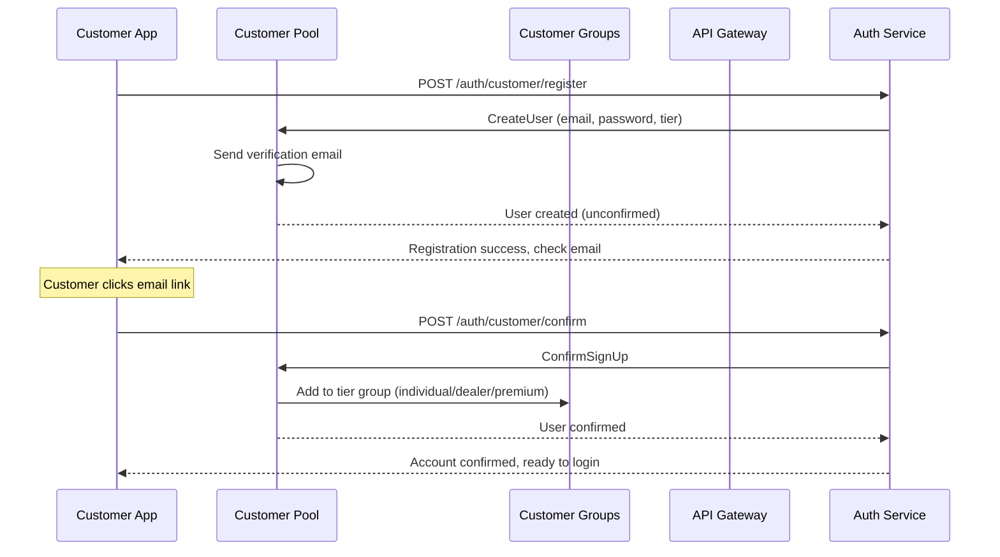
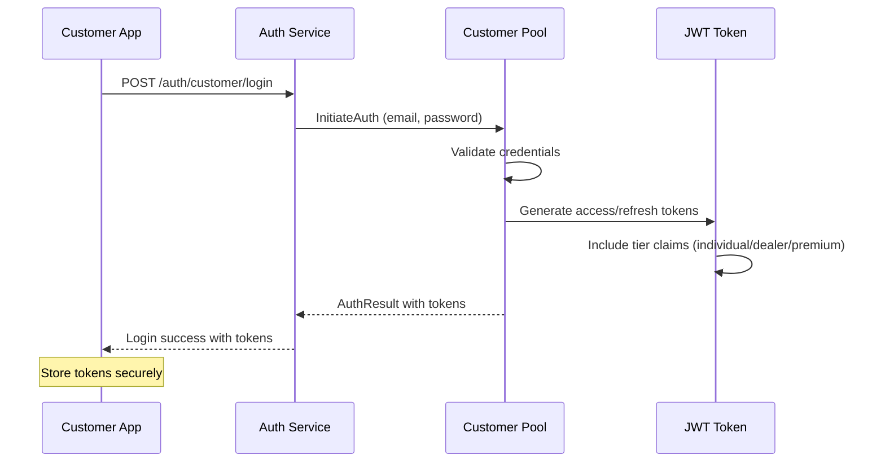
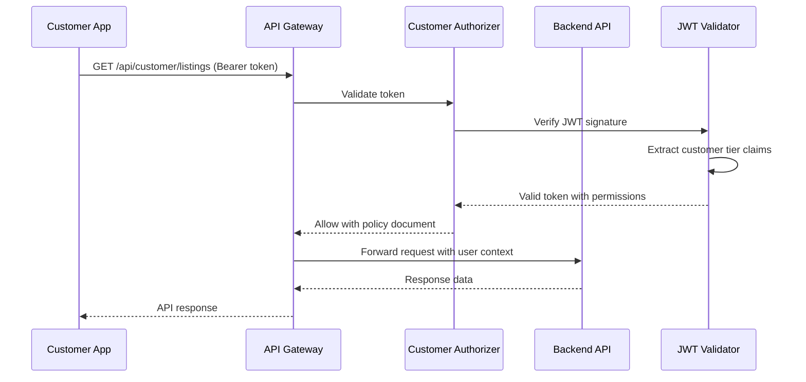
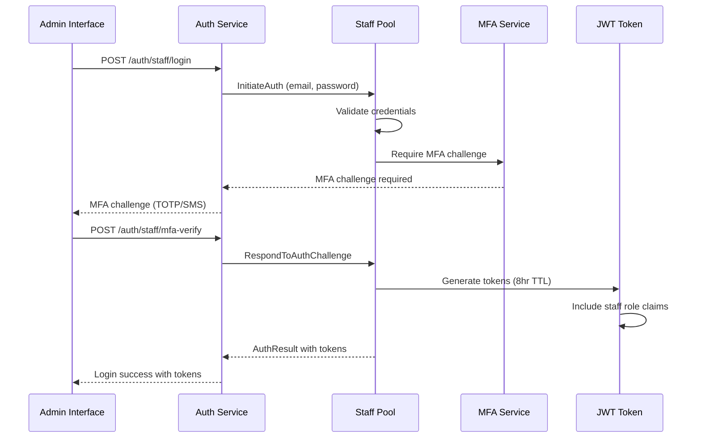
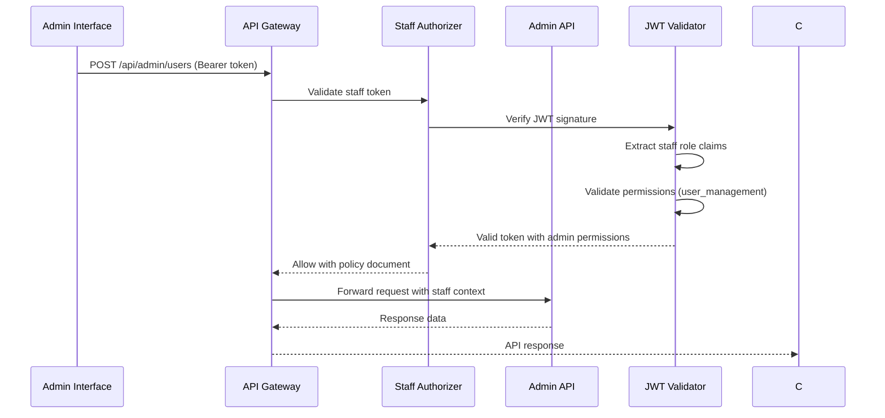
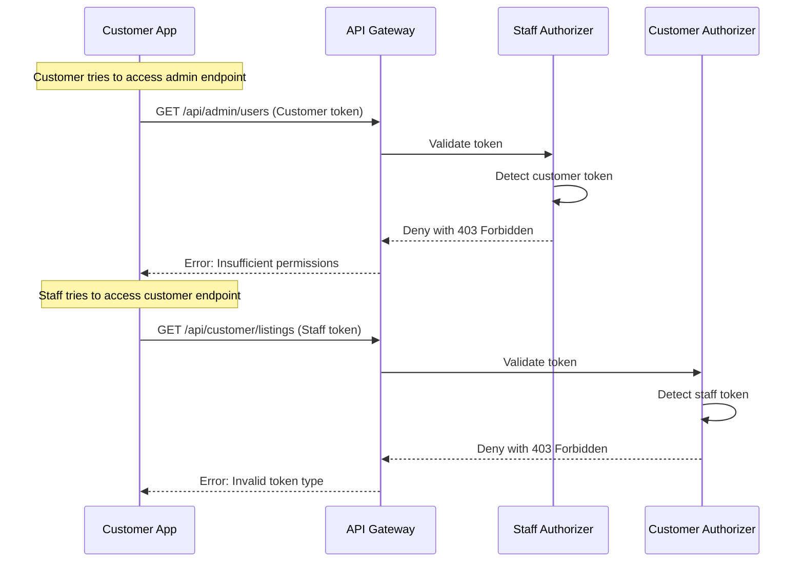
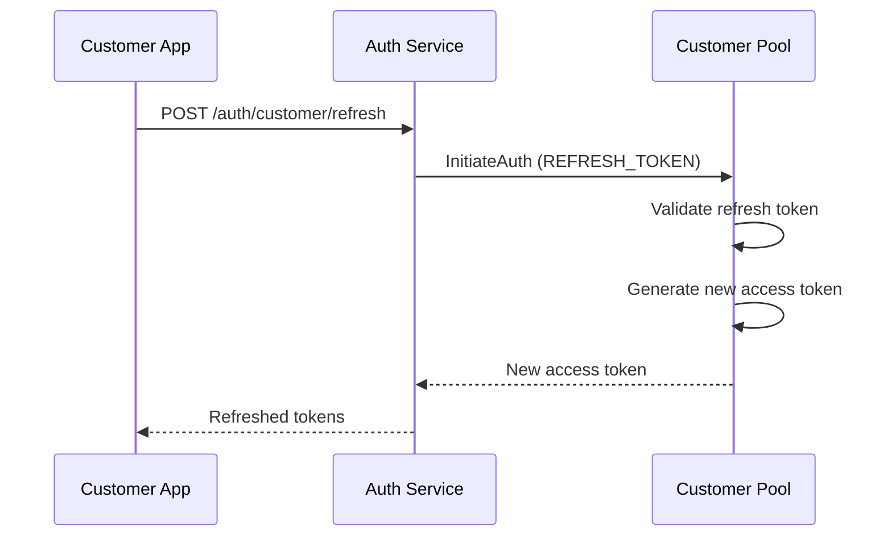
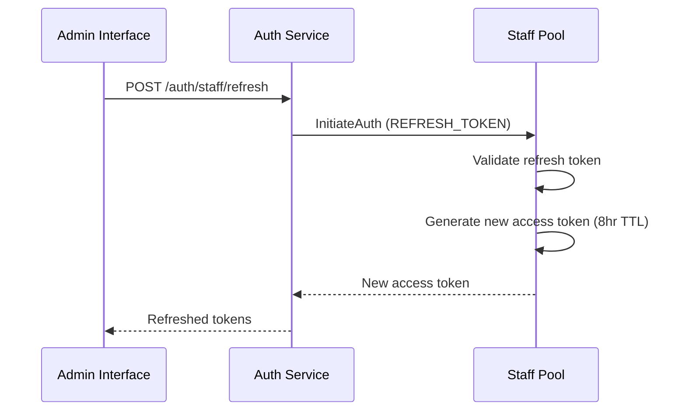

# Authentication Flow Documentation

## Overview

This document describes the authentication flows for the dual Cognito User Pool architecture, covering both customer and staff authentication patterns, API endpoint structures, and authorizer behavior.

## Customer Authentication Flow

### Registration Flow



### Login Flow



### API Access Flow



## Staff Authentication Flow

### Login Flow



### Admin API Access Flow



## Cross-Pool Security Flow

### Prevention of Cross-Pool Access



## Token Refresh Flow

### Customer Token Refresh



### Staff Token Refresh



## API Endpoint Structure

### Customer Endpoints

| Endpoint | Method | Description | Required Permissions |
|----------|--------|-------------|---------------------|
| `/auth/customer/register` | POST | Customer registration | None |
| `/auth/customer/login` | POST | Customer login | None |
| `/auth/customer/refresh` | POST | Token refresh | Valid refresh token |
| `/auth/customer/logout` | POST | Customer logout | Valid access token |
| `/auth/customer/confirm` | POST | Email confirmation | None |
| `/auth/customer/forgot-password` | POST | Password reset | None |
| `/api/customer/profile` | GET/PUT | Profile management | customer:profile |
| `/api/customer/listings` | GET | View listings | customer:view |
| `/api/customer/listings` | POST | Create listing (dealers) | customer:create |
| `/api/customer/inquiries` | GET/POST | Manage inquiries | customer:inquire |

### Staff Endpoints

| Endpoint | Method | Description | Required Permissions |
|----------|--------|-------------|---------------------|
| `/auth/staff/login` | POST | Staff login | None |
| `/auth/staff/refresh` | POST | Token refresh | Valid refresh token |
| `/auth/staff/logout` | POST | Staff logout | Valid access token |
| `/auth/staff/mfa-verify` | POST | MFA verification | None |
| `/api/admin/users` | GET/POST/PUT | User management | user_management |
| `/api/admin/listings` | GET/PUT/DELETE | Content moderation | content_moderation |
| `/api/admin/analytics` | GET | System analytics | analytics_view |
| `/api/admin/audit` | GET | Audit logs | audit_log_view |
| `/api/admin/billing` | GET/POST | Billing management | billing_management |
| `/api/admin/settings` | GET/PUT | System configuration | system_config |

## Authorizer Behavior

### Customer Authorizer Logic

```typescript
// Pseudo-code for customer authorizer
function customerAuthorizer(event) {
  const token = extractBearerToken(event.authorizationToken);
  
  try {
    const claims = verifyJWT(token, CUSTOMER_POOL_KEYS);
    
    // Validate token is from customer pool
    if (claims.token_use !== 'access' || claims.aud !== CUSTOMER_CLIENT_ID) {
      return denyPolicy();
    }
    
    // Extract customer permissions
    const permissions = extractCustomerPermissions(claims);
    const tier = claims['custom:tier'] || 'individual';
    
    return allowPolicy({
      userId: claims.sub,
      userType: 'customer',
      tier: tier,
      permissions: permissions
    });
    
  } catch (error) {
    return denyPolicy();
  }
}
```

### Staff Authorizer Logic

```typescript
// Pseudo-code for staff authorizer
function staffAuthorizer(event) {
  const token = extractBearerToken(event.authorizationToken);
  
  try {
    const claims = verifyJWT(token, STAFF_POOL_KEYS);
    
    // Validate token is from staff pool
    if (claims.token_use !== 'access' || claims.aud !== STAFF_CLIENT_ID) {
      return denyPolicy();
    }
    
    // Validate token TTL (8 hours max)
    if (isTokenExpiredForStaff(claims)) {
      return denyPolicy();
    }
    
    // Extract staff permissions
    const permissions = extractStaffPermissions(claims);
    const role = claims['cognito:groups'][0] || 'team-member';
    
    return allowPolicy({
      userId: claims.sub,
      userType: 'staff',
      role: role,
      permissions: permissions
    });
    
  } catch (error) {
    return denyPolicy();
  }
}
```

## Environment-Specific Configuration

### Local Development (LocalStack)

```yaml
# docker-compose.yml configuration
services:
  localstack:
    image: localstack/localstack
    environment:
      - SERVICES=cognito-idp
      - COGNITO_PROVIDER_DEVELOPER_USER_POOL=true
    ports:
      - "4566:4566"
      
  auth-service:
    environment:
      - NODE_ENV=local
      - COGNITO_ENDPOINT=http://localstack:4566
      - CUSTOMER_POOL_ID=local_customer_pool
      - STAFF_POOL_ID=local_staff_pool
```

### AWS Development/Staging

```typescript
// Environment configuration
const config = {
  environment: 'dev',
  cognito: {
    customerPool: {
      poolId: process.env.CUSTOMER_POOL_ID,
      clientId: process.env.CUSTOMER_CLIENT_ID,
      region: 'us-east-1'
    },
    staffPool: {
      poolId: process.env.STAFF_POOL_ID,
      clientId: process.env.STAFF_CLIENT_ID,
      region: 'us-east-1'
    }
  }
};
```

### AWS Production

```typescript
// Production configuration with enhanced security
const config = {
  environment: 'prod',
  cognito: {
    customerPool: {
      poolId: process.env.CUSTOMER_POOL_ID,
      clientId: process.env.CUSTOMER_CLIENT_ID,
      region: 'us-east-1'
    },
    staffPool: {
      poolId: process.env.STAFF_POOL_ID,
      clientId: process.env.STAFF_CLIENT_ID,
      region: 'us-east-1'
    }
  },
  security: {
    enforceHTTPS: true,
    tokenEncryption: true,
    auditLogging: true
  }
};
```

## Error Handling Patterns

### Authentication Errors

| Error Code | Description | User Type | Action |
|------------|-------------|-----------|---------|
| `INVALID_CREDENTIALS` | Wrong email/password | Both | Show login error |
| `USER_NOT_CONFIRMED` | Email not verified | Customer | Resend verification |
| `MFA_REQUIRED` | MFA challenge needed | Staff | Show MFA form |
| `TOKEN_EXPIRED` | Access token expired | Both | Attempt refresh |
| `REFRESH_TOKEN_EXPIRED` | Refresh token expired | Both | Force re-login |

### Authorization Errors

| Error Code | Description | User Type | Action |
|------------|-------------|-----------|---------|
| `INSUFFICIENT_PERMISSIONS` | Missing required permission | Both | Show access denied |
| `CROSS_POOL_ACCESS` | Wrong token type for endpoint | Both | Force re-login |
| `INVALID_TOKEN_FORMAT` | Malformed JWT token | Both | Clear tokens, redirect |
| `TOKEN_SIGNATURE_INVALID` | Token signature verification failed | Both | Security alert |

## Security Considerations

### Token Security
- Access tokens: 1 hour TTL
- Refresh tokens: 30 days TTL (customers), 7 days TTL (staff)
- Automatic token rotation on refresh
- Secure storage in httpOnly cookies (web) or secure storage (mobile)

### Session Management
- Customer sessions: 24 hour maximum
- Staff sessions: 8 hour maximum
- Concurrent session limits: 3 (customers), 2 (staff)
- Session invalidation on role/permission changes

### Audit Logging
- All authentication events logged to CloudWatch
- Failed login attempts tracked with rate limiting
- Cross-pool access attempts flagged as security events
- Permission changes logged with admin approval trail