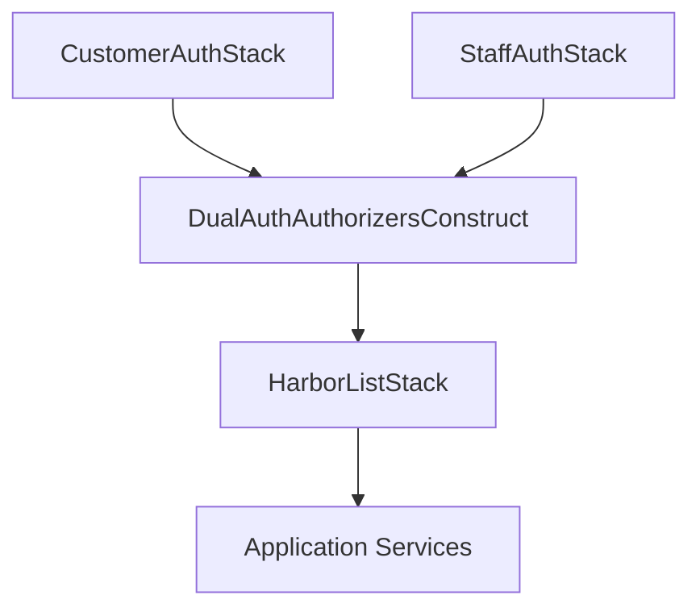

# Deployment and Configuration Guide

## Overview

This guide provides comprehensive instructions for deploying the dual Cognito authentication system using AWS CDK across different environments, along with Docker Compose setup for local development.

## CDK Deployment Process

### Prerequisites

- AWS CLI configured with appropriate permissions
- Node.js 18+ installed
- AWS CDK CLI installed (`npm install -g aws-cdk`)
- Docker installed (for local development)

### Required AWS Permissions

The deploying user/role needs the following permissions:

```json
{
  "Version": "2012-10-17",
  "Statement": [
    {
      "Effect": "Allow",
      "Action": [
        "cognito-idp:*",
        "iam:*",
        "lambda:*",
        "apigateway:*",
        "cloudformation:*",
        "s3:*",
        "logs:*",
        "sts:AssumeRole"
      ],
      "Resource": "*"
    }
  ]
}
```

### 1. Initial Setup

```bash
# Clone the repository
git clone <repository-url>
cd harborlist

# Install dependencies
npm install

# Install infrastructure dependencies
cd infrastructure
npm install

# Bootstrap CDK (first time only per account/region)
npx cdk bootstrap
```

### 2. Environment-Specific Deployment

#### Development Environment

```bash
# Set environment context
export CDK_ENVIRONMENT=dev

# Deploy Customer Auth Stack
npx cdk deploy CustomerAuthStack-dev \
  --context environment=dev \
  --parameters CustomerPoolName=HarborList-Customers-Dev \
  --parameters EnableMFA=false

# Deploy Staff Auth Stack
npx cdk deploy StaffAuthStack-dev \
  --context environment=dev \
  --parameters StaffPoolName=HarborList-Staff-Dev \
  --parameters EnforceMFA=true

# Deploy API Gateway and Authorizers
npx cdk deploy DualAuthAuthorizersConstruct-dev \
  --context environment=dev

# Deploy main application stack
npx cdk deploy HarborListStack-dev \
  --context environment=dev
```

#### Staging Environment

```bash
# Deploy to staging
export CDK_ENVIRONMENT=staging

npx cdk deploy --all \
  --context environment=staging \
  --parameters CustomerPoolName=HarborList-Customers-Staging \
  --parameters StaffPoolName=HarborList-Staff-Staging \
  --parameters EnableEnhancedSecurity=true
```

#### Production Environment

```bash
# Deploy to production with enhanced security
export CDK_ENVIRONMENT=prod

npx cdk deploy --all \
  --context environment=prod \
  --parameters CustomerPoolName=HarborList-Customers-Prod \
  --parameters StaffPoolName=HarborList-Staff-Prod \
  --parameters EnableEnhancedSecurity=true \
  --parameters EnableWAF=true \
  --parameters EnableCloudTrail=true \
  --require-approval never
```

### 3. CDK Stack Configuration

#### Customer Auth Stack Parameters

| Parameter | Description | Default | Required |
|-----------|-------------|---------|----------|
| `CustomerPoolName` | Name for customer user pool | `HarborList-Customers-{env}` | No |
| `EnableMFA` | Enable MFA for customers | `false` | No |
| `PasswordMinLength` | Minimum password length | `8` | No |
| `TokenValidityHours` | Access token validity | `1` | No |
| `RefreshTokenValidityDays` | Refresh token validity | `30` | No |

#### Staff Auth Stack Parameters

| Parameter | Description | Default | Required |
|-----------|-------------|---------|----------|
| `StaffPoolName` | Name for staff user pool | `HarborList-Staff-{env}` | No |
| `EnforceMFA` | Enforce MFA for staff | `true` | No |
| `PasswordMinLength` | Minimum password length | `12` | No |
| `TokenValidityHours` | Access token validity | `8` | No |
| `RefreshTokenValidityDays` | Refresh token validity | `7` | No |

### 4. Post-Deployment Configuration

#### Extract CDK Outputs

```bash
# Get stack outputs
aws cloudformation describe-stacks \
  --stack-name CustomerAuthStack-dev \
  --query 'Stacks[0].Outputs' \
  --output table

aws cloudformation describe-stacks \
  --stack-name StaffAuthStack-dev \
  --query 'Stacks[0].Outputs' \
  --output table
```

#### Update Environment Variables

Create environment-specific `.env` files:

```bash
# .env.dev
CUSTOMER_POOL_ID=us-east-1_XXXXXXXXX
CUSTOMER_CLIENT_ID=xxxxxxxxxxxxxxxxxxxxxxxxxx
STAFF_POOL_ID=us-east-1_YYYYYYYYY
STAFF_CLIENT_ID=yyyyyyyyyyyyyyyyyyyyyyyyyy
API_GATEWAY_URL=https://xxxxxxxxxx.execute-api.us-east-1.amazonaws.com/dev
```

### 5. CDK Stack Dependencies



## Docker Compose Setup Guide

### 1. LocalStack Integration

#### Docker Compose Configuration

Create `docker-compose.local.yml`:

```yaml
version: '3.8'

services:
  # LocalStack for AWS services
  localstack:
    image: localstack/localstack:latest
    container_name: harborlist-localstack
    ports:
      - "4566:4566"
      - "4510-4559:4510-4559"
    environment:
      - SERVICES=cognito-idp,apigateway,lambda,iam,sts,s3,dynamodb
      - DEBUG=1
      - COGNITO_PROVIDER_DEVELOPER_USER_POOL=true
      - LAMBDA_EXECUTOR=docker
      - DOCKER_HOST=unix:///var/run/docker.sock
      - PERSISTENCE=1
      - DATA_DIR=/tmp/localstack/data
    volumes:
      - "/var/run/docker.sock:/var/run/docker.sock"
      - "./localstack-data:/tmp/localstack"
      - "./infrastructure/lambda:/opt/code/localstack"
    networks:
      - harborlist-network
    healthcheck:
      test: ["CMD", "curl", "-f", "http://localhost:4566/health"]
      interval: 30s
      timeout: 10s
      retries: 5

  # Authentication Service
  auth-service:
    build:
      context: ./backend
      dockerfile: Dockerfile.dev
    container_name: harborlist-auth-service
    ports:
      - "3001:3001"
    environment:
      - NODE_ENV=local
      - COGNITO_ENDPOINT=http://localstack:4566
      - AWS_REGION=us-east-1
      - AWS_ACCESS_KEY_ID=test
      - AWS_SECRET_ACCESS_KEY=test
      - CUSTOMER_POOL_ID=${CUSTOMER_POOL_ID:-local_customer_pool}
      - CUSTOMER_CLIENT_ID=${CUSTOMER_CLIENT_ID:-local_customer_client}
      - STAFF_POOL_ID=${STAFF_POOL_ID:-local_staff_pool}
      - STAFF_CLIENT_ID=${STAFF_CLIENT_ID:-local_staff_client}
      - LOG_LEVEL=debug
    depends_on:
      localstack:
        condition: service_healthy
    networks:
      - harborlist-network
    volumes:
      - ./backend/src:/app/src
      - ./backend/node_modules:/app/node_modules
    restart: unless-stopped

  # Frontend Application
  frontend:
    build:
      context: ./frontend
      dockerfile: Dockerfile.dev
    container_name: harborlist-frontend
    ports:
      - "3000:3000"
    environment:
      - NODE_ENV=local
      - VITE_API_URL=http://localhost:3001
      - VITE_AUTH_SERVICE_URL=http://localhost:3001
    depends_on:
      - auth-service
    networks:
      - harborlist-network
    volumes:
      - ./frontend/src:/app/src
      - ./frontend/node_modules:/app/node_modules
    restart: unless-stopped

  # Database (PostgreSQL)
  database:
    image: postgres:15-alpine
    container_name: harborlist-database
    ports:
      - "5432:5432"
    environment:
      - POSTGRES_DB=harborlist
      - POSTGRES_USER=harborlist
      - POSTGRES_PASSWORD=harborlist123
    volumes:
      - postgres_data:/var/lib/postgresql/data
      - ./backend/scripts/init-db.sql:/docker-entrypoint-initdb.d/init-db.sql
    networks:
      - harborlist-network
    restart: unless-stopped

  # Redis for session management
  redis:
    image: redis:7-alpine
    container_name: harborlist-redis
    ports:
      - "6379:6379"
    networks:
      - harborlist-network
    restart: unless-stopped

volumes:
  postgres_data:
  localstack_data:

networks:
  harborlist-network:
    driver: bridge
```

### 2. Local Development Startup

#### Startup Script

Create `scripts/start-local-dev.sh`:

```bash
#!/bin/bash

set -e

echo "Starting HarborList Local Development Environment..."

# Check prerequisites
command -v docker >/dev/null 2>&1 || { echo "Docker is required but not installed. Aborting." >&2; exit 1; }
command -v docker-compose >/dev/null 2>&1 || { echo "Docker Compose is required but not installed. Aborting." >&2; exit 1; }

# Create necessary directories
mkdir -p localstack-data
mkdir -p logs

# Start services
echo "Starting Docker Compose services..."
docker-compose -f docker-compose.local.yml up -d

# Wait for LocalStack to be ready
echo "Waiting for LocalStack to be ready..."
timeout=60
counter=0
while ! curl -s http://localhost:4566/health > /dev/null; do
  if [ $counter -eq $timeout ]; then
    echo "LocalStack failed to start within $timeout seconds"
    exit 1
  fi
  echo "Waiting for LocalStack... ($counter/$timeout)"
  sleep 1
  counter=$((counter + 1))
done

echo "LocalStack is ready!"

# Setup Cognito User Pools
echo "Setting up Cognito User Pools..."
chmod +x infrastructure/scripts/setup-local-cognito.sh
./infrastructure/scripts/setup-local-cognito.sh

# Wait for auth service to be ready
echo "Waiting for auth service to be ready..."
timeout=30
counter=0
while ! curl -s http://localhost:3001/health > /dev/null; do
  if [ $counter -eq $timeout ]; then
    echo "Auth service failed to start within $timeout seconds"
    exit 1
  fi
  echo "Waiting for auth service... ($counter/$timeout)"
  sleep 1
  counter=$((counter + 1))
done

echo "Auth service is ready!"

# Run initial tests
echo "Running initial authentication tests..."
chmod +x infrastructure/scripts/test-local-auth.sh
./infrastructure/scripts/test-local-auth.sh

echo ""
echo "🎉 Local development environment is ready!"
echo ""
echo "Services available at:"
echo "  Frontend: http://localhost:3000"
echo "  Auth Service: http://localhost:3001"
echo "  LocalStack: http://localhost:4566"
echo "  Database: localhost:5432"
echo "  Redis: localhost:6379"
echo ""
echo "Test credentials:"
echo "  Customer: test.customer@example.com / CustomerPass123!"
echo "  Dealer: test.dealer@example.com / DealerPass123!"
echo "  Admin: test.admin@example.com / AdminPass123!@#"
echo ""
echo "To stop the environment: docker-compose -f docker-compose.local.yml down"
```

### 3. Environment Management

#### Environment Switching

Create `scripts/switch-environment.sh`:

```bash
#!/bin/bash

ENVIRONMENT=$1
SCRIPT_DIR="$(cd "$(dirname "${BASH_SOURCE[0]}")" && pwd)"
PROJECT_ROOT="$(dirname "$SCRIPT_DIR")"

if [ -z "$ENVIRONMENT" ]; then
  echo "Usage: $0 <local|dev|staging|prod>"
  echo ""
  echo "Available environments:"
  echo "  local   - LocalStack with Docker Compose"
  echo "  dev     - AWS Development environment"
  echo "  staging - AWS Staging environment"
  echo "  prod    - AWS Production environment"
  exit 1
fi

cd "$PROJECT_ROOT"

case $ENVIRONMENT in
  local)
    echo "🔄 Switching to local development environment..."
    
    # Copy local environment file
    if [ -f ".env.local" ]; then
      cp .env.local .env
      echo "✅ Environment variables updated"
    else
      echo "⚠️  .env.local not found, creating from template..."
      cp .env.example .env.local
      cp .env.local .env
    fi
    
    # Start local services
    echo "🚀 Starting local services..."
    ./scripts/start-local-dev.sh
    ;;
    
  dev)
    echo "🔄 Switching to AWS development environment..."
    
    # Copy dev environment file
    if [ -f ".env.dev" ]; then
      cp .env.dev .env
      echo "✅ Environment variables updated"
    else
      echo "❌ .env.dev not found. Please create it with AWS dev configuration."
      exit 1
    fi
    
    # Stop local services if running
    if docker-compose -f docker-compose.local.yml ps | grep -q "Up"; then
      echo "🛑 Stopping local services..."
      docker-compose -f docker-compose.local.yml down
    fi
    ;;
    
  staging)
    echo "🔄 Switching to AWS staging environment..."
    
    if [ -f ".env.staging" ]; then
      cp .env.staging .env
      echo "✅ Environment variables updated"
    else
      echo "❌ .env.staging not found. Please create it with AWS staging configuration."
      exit 1
    fi
    
    # Stop local services if running
    if docker-compose -f docker-compose.local.yml ps | grep -q "Up"; then
      echo "🛑 Stopping local services..."
      docker-compose -f docker-compose.local.yml down
    fi
    ;;
    
  prod)
    echo "🔄 Switching to AWS production environment..."
    
    if [ -f ".env.prod" ]; then
      cp .env.prod .env
      echo "✅ Environment variables updated"
    else
      echo "❌ .env.prod not found. Please create it with AWS production configuration."
      exit 1
    fi
    
    # Stop local services if running
    if docker-compose -f docker-compose.local.yml ps | grep -q "Up"; then
      echo "🛑 Stopping local services..."
      docker-compose -f docker-compose.local.yml down
    fi
    
    echo "⚠️  Production environment selected. Please ensure you have proper access and approval."
    ;;
    
  *)
    echo "❌ Invalid environment: $ENVIRONMENT"
    echo "Valid options: local, dev, staging, prod"
    exit 1
    ;;
esac

echo ""
echo "🎯 Environment switched to: $ENVIRONMENT"
echo "📁 Current .env file:"
head -5 .env
echo ""

if [ "$ENVIRONMENT" != "local" ]; then
  echo "💡 To deploy to AWS, run:"
  echo "   cd infrastructure && npx cdk deploy --all --context environment=$ENVIRONMENT"
fi
```

### 4. Health Checks and Monitoring

#### Health Check Script

Create `scripts/health-check.sh`:

```bash
#!/bin/bash

echo "🏥 HarborList Health Check"
echo "=========================="

# Check LocalStack (if running locally)
if curl -s http://localhost:4566/health > /dev/null; then
  echo "✅ LocalStack: Running"
  
  # Check Cognito service
  if aws cognito-idp list-user-pools --max-results 1 --endpoint-url http://localhost:4566 > /dev/null 2>&1; then
    echo "✅ LocalStack Cognito: Available"
  else
    echo "❌ LocalStack Cognito: Not available"
  fi
else
  echo "⚪ LocalStack: Not running (OK if using AWS)"
fi

# Check Auth Service
if curl -s http://localhost:3001/health > /dev/null; then
  echo "✅ Auth Service: Running"
else
  echo "❌ Auth Service: Not running"
fi

# Check Frontend
if curl -s http://localhost:3000 > /dev/null; then
  echo "✅ Frontend: Running"
else
  echo "❌ Frontend: Not running"
fi

# Check Database
if pg_isready -h localhost -p 5432 -U harborlist > /dev/null 2>&1; then
  echo "✅ Database: Running"
else
  echo "❌ Database: Not running"
fi

# Check Redis
if redis-cli -h localhost -p 6379 ping > /dev/null 2>&1; then
  echo "✅ Redis: Running"
else
  echo "❌ Redis: Not running"
fi

echo ""
echo "🔍 Environment Check"
echo "===================="
echo "NODE_ENV: ${NODE_ENV:-not set}"
echo "Current environment file:"
if [ -f ".env" ]; then
  echo "✅ .env file exists"
  echo "First few lines:"
  head -3 .env
else
  echo "❌ .env file not found"
fi

echo ""
echo "🔐 Authentication Test"
echo "====================="

# Test customer login (if local)
if [ "${NODE_ENV:-local}" = "local" ]; then
  if curl -s -X POST http://localhost:3001/auth/customer/login \
    -H "Content-Type: application/json" \
    -d '{"email":"test.customer@example.com","password":"CustomerPass123!"}' | grep -q "accessToken"; then
    echo "✅ Customer authentication: Working"
  else
    echo "❌ Customer authentication: Failed"
  fi
  
  if curl -s -X POST http://localhost:3001/auth/staff/login \
    -H "Content-Type: application/json" \
    -d '{"email":"test.admin@example.com","password":"AdminPass123!@#"}' | grep -q "accessToken"; then
    echo "✅ Staff authentication: Working"
  else
    echo "❌ Staff authentication: Failed"
  fi
else
  echo "⚪ Authentication test: Skipped (not local environment)"
fi

echo ""
echo "Health check complete!"
```

## Configuration Management

### 1. Environment Variables

#### Required Variables by Environment

**Local Development:**
```bash
NODE_ENV=local
COGNITO_ENDPOINT=http://localhost:4566
AWS_REGION=us-east-1
AWS_ACCESS_KEY_ID=test
AWS_SECRET_ACCESS_KEY=test
CUSTOMER_POOL_ID=local_customer_pool
CUSTOMER_CLIENT_ID=local_customer_client
STAFF_POOL_ID=local_staff_pool
STAFF_CLIENT_ID=local_staff_client
```

**AWS Development:**
```bash
NODE_ENV=development
AWS_REGION=us-east-1
CUSTOMER_POOL_ID=us-east-1_XXXXXXXXX
CUSTOMER_CLIENT_ID=xxxxxxxxxxxxxxxxxxxxxxxxxx
STAFF_POOL_ID=us-east-1_YYYYYYYYY
STAFF_CLIENT_ID=yyyyyyyyyyyyyyyyyyyyyyyyyy
API_GATEWAY_URL=https://xxxxxxxxxx.execute-api.us-east-1.amazonaws.com/dev
```

**AWS Production:**
```bash
NODE_ENV=production
AWS_REGION=us-east-1
CUSTOMER_POOL_ID=us-east-1_PRODCUST
CUSTOMER_CLIENT_ID=prod_customer_client_id
STAFF_POOL_ID=us-east-1_PRODSTAFF
STAFF_CLIENT_ID=prod_staff_client_id
API_GATEWAY_URL=https://api.harborlist.com
ENFORCE_HTTPS=true
TOKEN_ENCRYPTION_KEY=your-encryption-key-here
ENABLE_AUDIT_LOGGING=true
```

### 2. CDK Context Configuration

Create `infrastructure/cdk.context.json`:

```json
{
  "environments": {
    "dev": {
      "account": "123456789012",
      "region": "us-east-1",
      "customerPool": {
        "name": "HarborList-Customers-Dev",
        "mfaConfiguration": "OFF"
      },
      "staffPool": {
        "name": "HarborList-Staff-Dev",
        "mfaConfiguration": "OPTIONAL"
      }
    },
    "staging": {
      "account": "123456789012",
      "region": "us-east-1",
      "customerPool": {
        "name": "HarborList-Customers-Staging",
        "mfaConfiguration": "OPTIONAL"
      },
      "staffPool": {
        "name": "HarborList-Staff-Staging",
        "mfaConfiguration": "ON"
      }
    },
    "prod": {
      "account": "987654321098",
      "region": "us-east-1",
      "customerPool": {
        "name": "HarborList-Customers-Prod",
        "mfaConfiguration": "OPTIONAL"
      },
      "staffPool": {
        "name": "HarborList-Staff-Prod",
        "mfaConfiguration": "ON"
      },
      "security": {
        "enableWAF": true,
        "enableCloudTrail": true
      }
    }
  }
}
```

## Troubleshooting

### Common Deployment Issues

1. **CDK Bootstrap Issues**
   ```bash
   # Clear CDK context and re-bootstrap
   npx cdk context --clear
   npx cdk bootstrap --force
   ```

2. **Permission Errors**
   ```bash
   # Check current AWS identity
   aws sts get-caller-identity
   
   # Verify required permissions
   aws iam simulate-principal-policy \
     --policy-source-arn $(aws sts get-caller-identity --query Arn --output text) \
     --action-names cognito-idp:CreateUserPool \
     --resource-arns "*"
   ```

3. **LocalStack Connection Issues**
   ```bash
   # Check LocalStack logs
   docker logs harborlist-localstack
   
   # Restart LocalStack
   docker-compose -f docker-compose.local.yml restart localstack
   ```

4. **Environment Variable Issues**
   ```bash
   # Validate environment variables
   ./scripts/validate-env.sh
   
   # Check CDK outputs
   aws cloudformation describe-stacks --stack-name CustomerAuthStack-dev
   ```

### Rollback Procedures

1. **CDK Stack Rollback**
   ```bash
   # Rollback to previous version
   npx cdk deploy --rollback
   
   # Or destroy and redeploy
   npx cdk destroy CustomerAuthStack-dev
   npx cdk deploy CustomerAuthStack-dev
   ```

2. **Local Environment Reset**
   ```bash
   # Stop all services
   docker-compose -f docker-compose.local.yml down -v
   
   # Remove LocalStack data
   rm -rf localstack-data
   
   # Restart fresh
   ./scripts/start-local-dev.sh
   ```

## Maintenance

### Regular Tasks

1. **Update Dependencies**
   ```bash
   # Update CDK
   npm update -g aws-cdk
   
   # Update project dependencies
   npm update
   cd infrastructure && npm update
   ```

2. **Backup Configuration**
   ```bash
   # Export CDK templates
   npx cdk synth --all > backup/cdk-templates-$(date +%Y%m%d).yaml
   
   # Backup environment files
   tar -czf backup/env-files-$(date +%Y%m%d).tar.gz .env.*
   ```

3. **Security Updates**
   ```bash
   # Rotate secrets
   aws cognito-idp update-user-pool-client --user-pool-id $POOL_ID --client-id $CLIENT_ID --generate-secret
   
   # Update encryption keys
   aws ssm put-parameter --name "/harborlist/encryption-key" --value "new-key" --overwrite
   ```

This deployment guide provides comprehensive instructions for setting up and maintaining the dual Cognito authentication system across all environments.