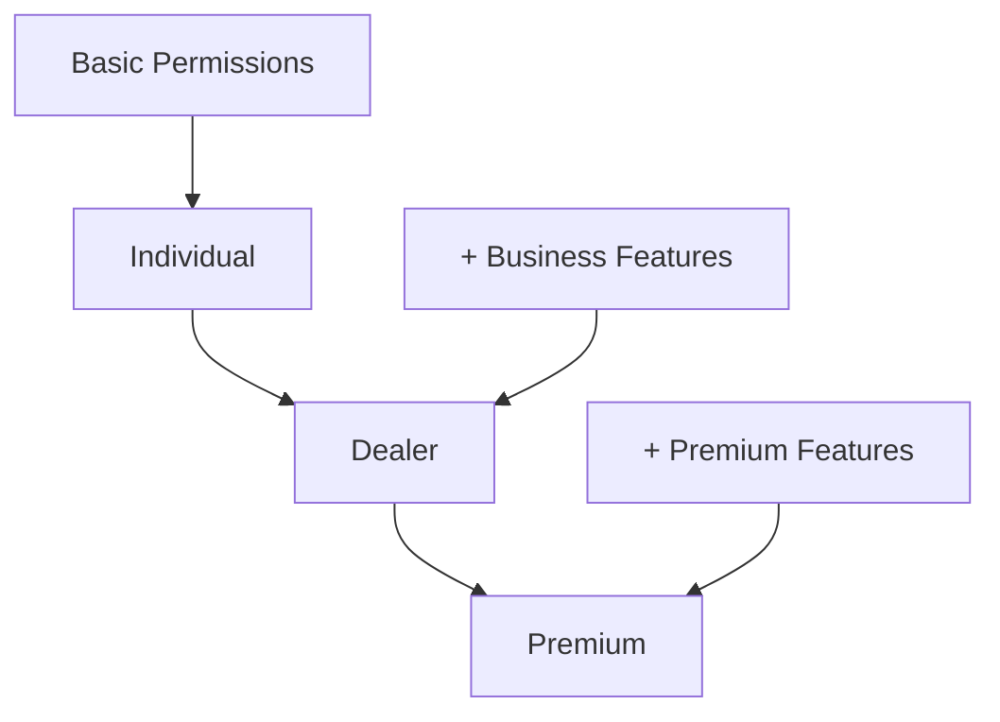
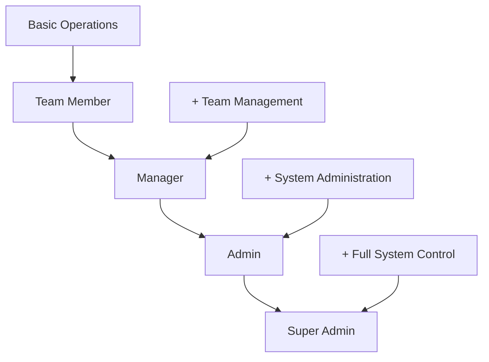

# Role and Permission Matrix Documentation

## Overview

This document defines the comprehensive role and permission matrix for the dual Cognito authentication system, covering both customer tiers and staff roles with their respective access levels and capabilities.

## Customer Tier Matrix

### Customer Tier Definitions

| Tier | Description | Precedence | Monthly Fee | Key Benefits |
|------|-------------|------------|-------------|--------------|
| **Individual** | Basic marketplace access for personal boat buyers/sellers | 3 | Free | Basic listing access, inquiries |
| **Dealer** | Enhanced features for boat dealers and businesses | 2 | $99/month | Multiple listings, dealer tools, analytics |
| **Premium** | All features plus premium benefits | 1 | $199/month | All dealer features + premium support, advanced search |

### Customer Permissions Matrix

| Permission | Individual | Dealer | Premium | Description |
|------------|------------|--------|---------|-------------|
| **Listing Management** |
| `listing:view` | ✅ | ✅ | ✅ | View boat listings |
| `listing:search` | ✅ | ✅ | ✅ | Search and filter listings |
| `listing:create` | ❌ | ✅ | ✅ | Create new boat listings |
| `listing:edit` | ❌ | ✅ | ✅ | Edit own listings |
| `listing:delete` | ❌ | ✅ | ✅ | Delete own listings |
| `listing:bulk_upload` | ❌ | ✅ | ✅ | Bulk upload multiple listings |
| `listing:featured` | ❌ | ❌ | ✅ | Create featured listings |
| `listing:priority` | ❌ | ❌ | ✅ | Priority listing placement |
| **Communication** |
| `inquiry:send` | ✅ | ✅ | ✅ | Send inquiries to sellers |
| `inquiry:receive` | ❌ | ✅ | ✅ | Receive inquiries on listings |
| `inquiry:manage` | ❌ | ✅ | ✅ | Manage inquiry responses |
| `message:direct` | ❌ | ✅ | ✅ | Direct messaging with users |
| `message:priority` | ❌ | ❌ | ✅ | Priority message handling |
| **Profile & Account** |
| `profile:basic` | ✅ | ✅ | ✅ | Basic profile management |
| `profile:business` | ❌ | ✅ | ✅ | Business profile features |
| `profile:verification` | ❌ | ✅ | ✅ | Identity verification badge |
| `profile:premium_badge` | ❌ | ❌ | ✅ | Premium member badge |
| **Analytics & Reporting** |
| `analytics:basic` | ❌ | ✅ | ✅ | Basic listing performance |
| `analytics:advanced` | ❌ | ❌ | ✅ | Advanced analytics dashboard |
| `analytics:export` | ❌ | ❌ | ✅ | Export analytics data |
| **Search & Discovery** |
| `search:basic` | ✅ | ✅ | ✅ | Basic search functionality |
| `search:advanced` | ❌ | ✅ | ✅ | Advanced search filters |
| `search:saved` | ✅ | ✅ | ✅ | Save search criteria |
| `search:alerts` | ❌ | ✅ | ✅ | Search result alerts |
| `search:premium` | ❌ | ❌ | ✅ | Premium search features |
| **Financial Tools** |
| `finance:calculator` | ✅ | ✅ | ✅ | Basic loan calculator |
| `finance:advanced` | ❌ | ❌ | ✅ | Advanced financial tools |
| `finance:consultation` | ❌ | ❌ | ✅ | Financial consultation access |
| **Support & Services** |
| `support:basic` | ✅ | ✅ | ✅ | Basic customer support |
| `support:priority` | ❌ | ❌ | ✅ | Priority support queue |
| `support:phone` | ❌ | ❌ | ✅ | Phone support access |
| `support:dedicated` | ❌ | ❌ | ✅ | Dedicated account manager |

### Customer Group Configuration

```json
{
  "individual-customers": {
    "groupName": "individual-customers",
    "description": "Individual customers with basic marketplace access",
    "precedence": 3,
    "permissions": [
      "listing:view",
      "listing:search",
      "inquiry:send",
      "profile:basic",
      "search:basic",
      "search:saved",
      "finance:calculator",
      "support:basic"
    ],
    "limits": {
      "savedSearches": 5,
      "inquiriesPerDay": 10,
      "watchlistItems": 20
    }
  },
  "dealer-customers": {
    "groupName": "dealer-customers",
    "description": "Dealer customers with enhanced business features",
    "precedence": 2,
    "permissions": [
      "listing:view",
      "listing:search",
      "listing:create",
      "listing:edit",
      "listing:delete",
      "listing:bulk_upload",
      "inquiry:send",
      "inquiry:receive",
      "inquiry:manage",
      "message:direct",
      "profile:basic",
      "profile:business",
      "profile:verification",
      "analytics:basic",
      "search:basic",
      "search:advanced",
      "search:saved",
      "search:alerts",
      "finance:calculator",
      "support:basic"
    ],
    "limits": {
      "activeListings": 50,
      "savedSearches": 20,
      "inquiriesPerDay": 100,
      "watchlistItems": 100,
      "bulkUploadPerMonth": 10
    }
  },
  "premium-customers": {
    "groupName": "premium-customers",
    "description": "Premium customers with all features and benefits",
    "precedence": 1,
    "permissions": [
      "listing:view",
      "listing:search",
      "listing:create",
      "listing:edit",
      "listing:delete",
      "listing:bulk_upload",
      "listing:featured",
      "listing:priority",
      "inquiry:send",
      "inquiry:receive",
      "inquiry:manage",
      "message:direct",
      "message:priority",
      "profile:basic",
      "profile:business",
      "profile:verification",
      "profile:premium_badge",
      "analytics:basic",
      "analytics:advanced",
      "analytics:export",
      "search:basic",
      "search:advanced",
      "search:saved",
      "search:alerts",
      "search:premium",
      "finance:calculator",
      "finance:advanced",
      "finance:consultation",
      "support:basic",
      "support:priority",
      "support:phone",
      "support:dedicated"
    ],
    "limits": {
      "activeListings": "unlimited",
      "savedSearches": "unlimited",
      "inquiriesPerDay": "unlimited",
      "watchlistItems": "unlimited",
      "bulkUploadPerMonth": "unlimited",
      "featuredListings": 10
    }
  }
}
```

## Staff Role Matrix

### Staff Role Definitions

| Role | Description | Precedence | Access Level | Typical Use Case |
|------|-------------|------------|--------------|------------------|
| **Super Admin** | Full system access and control | 1 | Complete | System administration, emergency access |
| **Admin** | Administrative functions and management | 2 | High | Day-to-day administration, user management |
| **Manager** | Team oversight and operational management | 3 | Medium | Team management, content oversight |
| **Team Member** | Basic staff operations and support | 4 | Limited | Customer support, content moderation |

### Staff Permissions Matrix

| Permission | Super Admin | Admin | Manager | Team Member | Description |
|------------|-------------|-------|---------|-------------|-------------|
| **User Management** |
| `user_management:view` | ✅ | ✅ | ✅ | ❌ | View user accounts and profiles |
| `user_management:create` | ✅ | ✅ | ❌ | ❌ | Create new user accounts |
| `user_management:edit` | ✅ | ✅ | ✅ | ❌ | Edit user account details |
| `user_management:delete` | ✅ | ✅ | ❌ | ❌ | Delete user accounts |
| `user_management:suspend` | ✅ | ✅ | ✅ | ❌ | Suspend user accounts |
| `user_management:tier_change` | ✅ | ✅ | ❌ | ❌ | Change customer tiers |
| **Content Moderation** |
| `content_moderation:view` | ✅ | ✅ | ✅ | ✅ | View content moderation queue |
| `content_moderation:approve` | ✅ | ✅ | ✅ | ✅ | Approve pending content |
| `content_moderation:reject` | ✅ | ✅ | ✅ | ✅ | Reject inappropriate content |
| `content_moderation:edit` | ✅ | ✅ | ✅ | ❌ | Edit content before approval |
| `content_moderation:delete` | ✅ | ✅ | ✅ | ❌ | Delete inappropriate content |
| `content_moderation:bulk` | ✅ | ✅ | ❌ | ❌ | Bulk moderation actions |
| **Financial Access** |
| `financial_access:view` | ✅ | ✅ | ❌ | ❌ | View financial reports |
| `financial_access:transactions` | ✅ | ✅ | ❌ | ❌ | Access transaction details |
| `financial_access:refunds` | ✅ | ✅ | ❌ | ❌ | Process refunds |
| `financial_access:billing` | ✅ | ✅ | ❌ | ❌ | Manage billing issues |
| **System Configuration** |
| `system_config:view` | ✅ | ✅ | ❌ | ❌ | View system configuration |
| `system_config:edit` | ✅ | ❌ | ❌ | ❌ | Edit system settings |
| `system_config:deploy` | ✅ | ❌ | ❌ | ❌ | Deploy configuration changes |
| `system_config:backup` | ✅ | ✅ | ❌ | ❌ | Create system backups |
| **Analytics & Reporting** |
| `analytics_view:basic` | ✅ | ✅ | ✅ | ✅ | View basic analytics |
| `analytics_view:advanced` | ✅ | ✅ | ✅ | ❌ | View advanced analytics |
| `analytics_view:financial` | ✅ | ✅ | ❌ | ❌ | View financial analytics |
| `analytics_view:export` | ✅ | ✅ | ✅ | ❌ | Export analytics data |
| **Audit & Logging** |
| `audit_log_view:basic` | ✅ | ✅ | ✅ | ❌ | View basic audit logs |
| `audit_log_view:security` | ✅ | ✅ | ❌ | ❌ | View security audit logs |
| `audit_log_view:financial` | ✅ | ✅ | ❌ | ❌ | View financial audit logs |
| `audit_log_view:export` | ✅ | ✅ | ❌ | ❌ | Export audit logs |
| **Tier Management** |
| `tier_management:view` | ✅ | ✅ | ❌ | ❌ | View tier configurations |
| `tier_management:edit` | ✅ | ❌ | ❌ | ❌ | Edit tier settings |
| `tier_management:pricing` | ✅ | ❌ | ❌ | ❌ | Modify tier pricing |
| `tier_management:features` | ✅ | ✅ | ❌ | ❌ | Manage tier features |
| **Billing Management** |
| `billing_management:view` | ✅ | ✅ | ❌ | ❌ | View billing information |
| `billing_management:process` | ✅ | ✅ | ❌ | ❌ | Process billing transactions |
| `billing_management:disputes` | ✅ | ✅ | ❌ | ❌ | Handle billing disputes |
| `billing_management:reports` | ✅ | ✅ | ❌ | ❌ | Generate billing reports |
| **Sales Management** |
| `sales_management:leads` | ✅ | ✅ | ✅ | ❌ | Manage sales leads |
| `sales_management:conversion` | ✅ | ✅ | ✅ | ❌ | Track conversion metrics |
| `sales_management:commission` | ✅ | ✅ | ❌ | ❌ | Manage commission structure |
| `sales_management:reports` | ✅ | ✅ | ✅ | ❌ | Generate sales reports |

### Staff Group Configuration

```json
{
  "super-admin": {
    "groupName": "super-admin",
    "description": "Super administrators with complete system access",
    "precedence": 1,
    "permissions": ["*"],
    "restrictions": {
      "requireMFA": true,
      "sessionTimeout": 4,
      "concurrentSessions": 1,
      "ipWhitelist": true
    },
    "capabilities": {
      "systemShutdown": true,
      "emergencyAccess": true,
      "auditLogAccess": "full",
      "configurationChanges": true
    }
  },
  "admin": {
    "groupName": "admin",
    "description": "Administrators with management access",
    "precedence": 2,
    "permissions": [
      "user_management:view",
      "user_management:create",
      "user_management:edit",
      "user_management:delete",
      "user_management:suspend",
      "user_management:tier_change",
      "content_moderation:view",
      "content_moderation:approve",
      "content_moderation:reject",
      "content_moderation:edit",
      "content_moderation:delete",
      "content_moderation:bulk",
      "financial_access:view",
      "financial_access:transactions",
      "financial_access:refunds",
      "financial_access:billing",
      "system_config:view",
      "system_config:backup",
      "analytics_view:basic",
      "analytics_view:advanced",
      "analytics_view:financial",
      "analytics_view:export",
      "audit_log_view:basic",
      "audit_log_view:security",
      "audit_log_view:financial",
      "audit_log_view:export",
      "tier_management:view",
      "tier_management:features",
      "billing_management:view",
      "billing_management:process",
      "billing_management:disputes",
      "billing_management:reports",
      "sales_management:leads",
      "sales_management:conversion",
      "sales_management:reports"
    ],
    "restrictions": {
      "requireMFA": true,
      "sessionTimeout": 8,
      "concurrentSessions": 2
    }
  },
  "manager": {
    "groupName": "manager",
    "description": "Managers with team oversight capabilities",
    "precedence": 3,
    "permissions": [
      "user_management:view",
      "user_management:edit",
      "user_management:suspend",
      "content_moderation:view",
      "content_moderation:approve",
      "content_moderation:reject",
      "content_moderation:edit",
      "content_moderation:delete",
      "analytics_view:basic",
      "analytics_view:advanced",
      "analytics_view:export",
      "audit_log_view:basic",
      "sales_management:leads",
      "sales_management:conversion",
      "sales_management:reports"
    ],
    "restrictions": {
      "requireMFA": true,
      "sessionTimeout": 8,
      "concurrentSessions": 2
    },
    "teamScope": true
  },
  "team-member": {
    "groupName": "team-member",
    "description": "Team members with basic staff operations",
    "precedence": 4,
    "permissions": [
      "content_moderation:view",
      "content_moderation:approve",
      "content_moderation:reject",
      "analytics_view:basic"
    ],
    "restrictions": {
      "requireMFA": false,
      "sessionTimeout": 8,
      "concurrentSessions": 1
    }
  }
}
```

## Permission Inheritance and Hierarchy

### Customer Tier Inheritance



**Inheritance Rules:**
- Dealer tier inherits all Individual permissions plus additional business features
- Premium tier inherits all Dealer permissions plus premium-exclusive features
- Tier upgrades are immediate, downgrades may have grace periods

### Staff Role Hierarchy



**Hierarchy Rules:**
- Higher precedence roles inherit permissions from lower precedence roles
- Role changes require approval from higher-level staff
- Emergency access can temporarily elevate permissions

## API Endpoint Access Matrix

### Customer API Endpoints

| Endpoint | Individual | Dealer | Premium | Method | Description |
|----------|------------|--------|---------|---------|-------------|
| `/api/customer/profile` | ✅ | ✅ | ✅ | GET/PUT | Profile management |
| `/api/customer/listings` | ✅ | ✅ | ✅ | GET | View listings |
| `/api/customer/listings` | ❌ | ✅ | ✅ | POST | Create listings |
| `/api/customer/listings/{id}` | ❌ | ✅ | ✅ | PUT/DELETE | Manage own listings |
| `/api/customer/inquiries` | ✅ | ✅ | ✅ | GET/POST | Manage inquiries |
| `/api/customer/analytics` | ❌ | ✅ | ✅ | GET | Basic analytics |
| `/api/customer/analytics/advanced` | ❌ | ❌ | ✅ | GET | Advanced analytics |
| `/api/customer/search/saved` | ✅ | ✅ | ✅ | GET/POST | Saved searches |
| `/api/customer/search/alerts` | ❌ | ✅ | ✅ | GET/POST | Search alerts |
| `/api/customer/finance/calculator` | ✅ | ✅ | ✅ | POST | Loan calculator |
| `/api/customer/finance/advanced` | ❌ | ❌ | ✅ | GET | Advanced tools |

### Staff API Endpoints

| Endpoint | Team Member | Manager | Admin | Super Admin | Method | Description |
|----------|-------------|---------|-------|-------------|---------|-------------|
| `/api/admin/users` | ❌ | ✅ | ✅ | ✅ | GET | List users |
| `/api/admin/users` | ❌ | ❌ | ✅ | ✅ | POST | Create users |
| `/api/admin/users/{id}` | ❌ | ✅ | ✅ | ✅ | PUT | Edit users |
| `/api/admin/users/{id}` | ❌ | ❌ | ✅ | ✅ | DELETE | Delete users |
| `/api/admin/moderation` | ✅ | ✅ | ✅ | ✅ | GET | Moderation queue |
| `/api/admin/moderation/{id}` | ✅ | ✅ | ✅ | ✅ | PUT | Moderate content |
| `/api/admin/analytics` | ✅ | ✅ | ✅ | ✅ | GET | Basic analytics |
| `/api/admin/analytics/advanced` | ❌ | ✅ | ✅ | ✅ | GET | Advanced analytics |
| `/api/admin/financial` | ❌ | ❌ | ✅ | ✅ | GET | Financial data |
| `/api/admin/system/config` | ❌ | ❌ | ❌ | ✅ | GET/PUT | System config |
| `/api/admin/audit` | ❌ | ✅ | ✅ | ✅ | GET | Audit logs |

## Security Policies

### Token Validation Rules

```typescript
interface TokenValidationRules {
  customer: {
    accessTokenTTL: 3600; // 1 hour
    refreshTokenTTL: 2592000; // 30 days
    maxConcurrentSessions: 3;
    requireMFA: false;
  };
  staff: {
    accessTokenTTL: 28800; // 8 hours
    refreshTokenTTL: 604800; // 7 days
    maxConcurrentSessions: 2;
    requireMFA: true;
    ipWhitelist?: string[];
  };
}
```

### Permission Validation Logic

```typescript
function validatePermission(userType: 'customer' | 'staff', userGroups: string[], requiredPermission: string): boolean {
  const userPermissions = getUserPermissions(userType, userGroups);
  
  // Check for wildcard permission (super-admin)
  if (userPermissions.includes('*')) {
    return true;
  }
  
  // Check for exact permission match
  if (userPermissions.includes(requiredPermission)) {
    return true;
  }
  
  // Check for parent permission (e.g., user_management:* covers user_management:view)
  const parentPermission = requiredPermission.split(':')[0] + ':*';
  if (userPermissions.includes(parentPermission)) {
    return true;
  }
  
  return false;
}
```

## Audit and Compliance

### Permission Change Logging

All permission and role changes are logged with:
- Timestamp
- Acting user (who made the change)
- Target user (who was affected)
- Old permissions/role
- New permissions/role
- Reason for change
- IP address and user agent

### Compliance Requirements

1. **Data Access Logging**: All access to sensitive data is logged
2. **Permission Reviews**: Quarterly review of all staff permissions
3. **Role Certification**: Annual certification of role assignments
4. **Emergency Access**: All emergency access is logged and reviewed
5. **Audit Trail**: Complete audit trail for all permission changes

This role and permission matrix ensures proper access control and security across the dual Cognito authentication system.