# 🛠️ Development Tools

## 📋 **Overview**

Development tools for local environment setup and configuration, supporting Docker-based development with LocalStack integration for AWS service emulation.

---

## 📸 **Media Infrastructure Setup**

### **`setup-s3-buckets.sh`** - LocalStack S3 Bucket Initialization

Configures S3 buckets in LocalStack for local media handling, providing environment parity with AWS production.

#### **Purpose**
- Creates required S3 buckets in LocalStack
- Configures bucket permissions and policies  
- Supports environment-aware media service integration
- Provides graceful degradation if LocalStack is unavailable

#### **Usage**
```bash
# Standalone execution
./tools/development/setup-s3-buckets.sh

# Integrated with deployment
npm run dev:setup  # Automatically calls setup-s3-buckets.sh
```

#### **Environment Variables**
- `MEDIA_BUCKET`: Primary media storage bucket (default: harborlist-media-local)
- `THUMBNAILS_BUCKET`: Thumbnail storage bucket (default: harborlist-thumbnails-local)
- `LOCALSTACK_ENDPOINT`: LocalStack S3 endpoint (default: http://localhost:4566)

#### **Features**
- **Auto-Detection**: Checks LocalStack availability before bucket creation
- **Idempotent**: Safe to run multiple times without errors
- **Error Handling**: Graceful failure with informative messages
- **Environment Parity**: Matches production S3 bucket structure

#### **Integration Points**
- **Deployment Scripts**: Automatically called by `tools/deployment/deploy.sh`
- **Media Service**: Used by backend media service for local development
- **Docker Compose**: Requires LocalStack service to be running
- **Frontend**: Enables media upload functionality in local environment

---

## 📚 **Related Documentation**

- **[📸 Media Infrastructure Integration](../../docs/deployment/media-infrastructure-integration.md)** - Complete S3/LocalStack integration guide
- **[🚀 Local Development Setup](../../docs/deployment/local-development.md)** - Full local environment setup
- **[🔧 Deployment Tools](../deployment/README.md)** - Deployment automation and scripts

---

## 🏗️ **Architecture Integration**

The development tools integrate with the broader HarborList architecture:

```mermaid
graph TD
    Dev[🛠️ Development Tools] --> Local[🐳 Local Environment]
    Local --> LS[LocalStack S3]
    Local --> Media[📸 Media Service]
    Media --> Upload[Frontend Upload]
    Media --> Storage[Local Storage]
```



**Benefits:**
- **Environment Parity**: Local development mirrors production S3 behavior
- **Offline Development**: No AWS dependencies for media functionality
- **Cost Efficiency**: Zero AWS costs during development
- **Fast Iteration**: Instant feedback without network latency

---

## 🔍 **Troubleshooting**

### **Common Issues**

1. **LocalStack Not Running**
   ```bash
   # Check LocalStack status
   docker-compose -f docker-compose.local.yml ps localstack
   
   # Start LocalStack if needed
   docker-compose -f docker-compose.local.yml up -d localstack
   ```

2. **Bucket Creation Failures**
   ```bash
   # Check LocalStack S3 service
   aws --endpoint-url=http://localhost:4566 s3 ls
   
   # Manual bucket creation
   aws --endpoint-url=http://localhost:4566 s3 mb s3://harborlist-media-local
   ```

3. **Permission Issues**
   ```bash
   # Verify bucket permissions
   aws --endpoint-url=http://localhost:4566 s3api get-bucket-location --bucket harborlist-media-local
   ```

### **Validation**
```bash
# Verify setup completion
./tools/development/setup-s3-buckets.sh --verify

# Test media upload
curl -X POST http://local-api.harborlist.com:3001/api/media/upload-url \
  -H "Authorization: Bearer YOUR_JWT_TOKEN" \
  -H "Content-Type: application/json" \
  -d '{"filename": "test.jpg", "contentType": "image/jpeg"}'
```